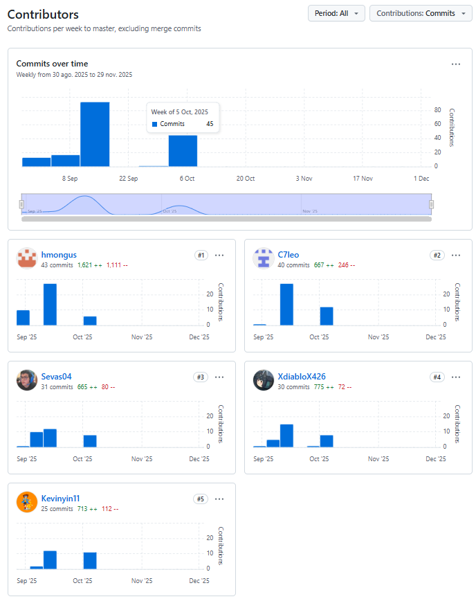

# Universidad Peruana de Ciencias Aplicadas

**Ciclo:** 2025 - 02  
**Curso:** Aplicaciones Web - 7432  
**Docente:** Villafuerte Bazán, Óscar Iván  

**Startup:** *SymmetriQ*  
**Producto:** *Harmonix*  

**Integrantes:**  
- Gonzales Castillo Angel Martin - U202319724 
- Martinez Valdivis Jose Luis - U202213989 
- Pardo Chumpitazi Kevin Patrick -U20221A525
- Camilla Leonor Espinoza Vivas - U202214572
- Córdova Valdivia Sebastián — U202111041  

**Fecha:** Septiembre, 2025  

---

# Registro de Versiones del Informe

| Versión | Fecha      | Autor           | Descripción de la modificación                                                                                            |
|---------|------------|-----------------|---------------------------------------------------------------------------------------------------------------------------|
| 1.0     | 12-09-2025 |Kevin Pardo| Se añadio la sección de Startup Profile para el capítulo 1.                                                               |
| 1.0     | 12-09-2025 |Kevin Pardo   | Se añadio la sección de Solution Profile para el capítulo 1.                                                              |
| 1.0     | 12-09-2025 |Kevin Pardo   | Se añadio la sección de Lean UX Problem Statements para el capítulo 1.                                                    |
| 1.0     | 13-09-2025 |Kevin Pardo   | Se añadio la sección de Lean UX Assumptions para el capítulo 1.                                                           |
| 1.0     | 13-09-2025 |Kevin Pardo   | Se añadio la sección de Lean UX Hypotheses para el capítulo 1.                                                            |
| 1.0     | 13-09-2025 |Kevin Pardo   | Se añadio la sección de Lean UX Canvas para el capítulo 1.                                                                |
| 1.0     | 13-09-2025 |Kevin Pardo   | Se añadio la sección de Target Segments para el capítulo 1.                                                               |
| 1.0     | 03-09-2025 | Martin Gonzales | Se añadio la sección de Competidores para el capítulo 2.                                                                  |
| 1.0     | 15-09-2025 | Martin Gonzales | Se añadio la sección de Diseño de Entrevistas para el capítulo 2.                                                         |
| 1.0     | 15-09-2025 | Martin Gonzales | Se añadio la sección de Registro de Entrevistas para el capítulo 2.                                                       |
| 1.0     | 15-09-2025 | Martin Gonzales | Se añadio la sección de Análisis de Entrevistas para el capítulo 2.                                                       |
| 1.0     | 03-09-2025 | Sebastián Córdova | Se añadio la sección de User Personas para el capítulo 2.                                                                 |
| 1.0     | 10-09-2025 | Sebastián Córdova  | Se añadio la sección de Needfinding para el capítulo 2.                                                                   |
| 1.0     | 04-09-2025 | Camilla Espinoza  | Se añadio la sección de To-Be Scenario Mapping para el capítulo 3.                                                        |
| 1.0     | 05-09-2025 | Jose Martinez  | Se añadio la sección de User Stories para el capítulo 3.                                                                  |
| 1.0     | 06-09-2025 | Camilla Espinoza  | Se añadio la sección de Impact Mapping para el capítulo 3.                                                                |
| 1.0     | 06-09-2025 | Jose Martinez  | Se añadio la sección de Product Backlog para el capítulo 3.                                                               |
| 1.0     | 14-09-2025 | Camilla Espinoza | Se añadio la sección de Style Guidelines para el capítulo 4.                                                              |
| 1.0     | 15-09-2025 | Camilla Espinoza | Se añadio la sección de Information Architecture para el capítulo 4.                                                      |
| 1.0     | 15-09-2025 | Camilla Espinoza | Se añadio la sección de Landing Page Wireframe y Mockup en el capítulo 4.                                                 |
| 1.0     | 15-09-2025 | Sebastián Córdova | Se añadio la sección de Web Applications Wireframes en el capítulo 4.                                                     |
| 1.0     | 15-09-2025 | Sebastián Córdova | Se añadio la sección de Wireflow Diagrams en el capítulo 4.                                                               |
| 1.0     | 15-09-2025 | Sebastián Córdova | Se añadio la sección de Web Applications Mockups en el capítulo 4.                                                        |
| 1.0     | 16-09-2025 | Sebastián Córdova | Se añadio la sección de Userflow Diagrams en el capítulo 4.                                                               |
| 1.0     | 16-09-2025 | Camilla Espinoza | Se añadio la sección de Strategic Domain-Driven Design en el capítulo 4.                                                  |
| 1.0     | 16-09-2025 | Sebastián Córdova | Se añadio la sección de Domain-Driven Software Architecture en el capítulo 4.                                             |
| 1.0     | 16-09-2025 | Sebastián Córdova | Se añadio la sección de Class Diagram en el capítulo 4.                                                                   |
| 1.0     | 16-09-2025 | Sebastián Córdova | Se añadio la sección de Database Diagram en el capítulo 4.                                                                |
| 1.0     | 13-09-2025 | Martin Gonzales | Se añadio la sección de Software Configuration Management en el capítulo 5.                                               |
| 1.0     | 14-09-2025 | Jose Martinez  | Se añadio la sección de Sprint 1 en el capítulo 5.                                                                        |
| 2.0     | 06-10-2025 | Camilla Espinoza  | Se añadio la sección de Sprint Planning 2 en el capítulo 5.                                                                        |
| 2.0     | 06-10-2025 | Martin Gonzales  | Se corrigio la seccion de Analisis de entrevistas en el capitulo 2.                                                                        |
| 2.0      | 07-10-2025 | Sebastián Córdova    | Se realizaron correcciones en el Capítulo 2 sobre las secciones de User Persona, Journey Map y Empathy Map según el feedback del profesor. |
| 2.0      | 07-10-2025 | Sebastián Córdova    | Se añadió la sección correspondiente al Sprint 2 en el Capítulo 5, incluyendo la documentación de servicios y evidencias del FrontEnd. |
| 2.0      | 07-10-2025 | Sebastián Córdova    | Se implementaron mejoras en el FrontEnd, desarrollando las secciones de búsqueda de hogar y estado de los miembros del hogar. |
| 2.0      | 07-10-2025 | Kevin Pardo| Se corrigió el capítulo 1 según las indicaciones recibidas, ajustando contenido para mejorar la coherencia con los objetivos del proyecto. |
| 2.0      | 08-10-2025 | Kevin Pardo | Se documentó la sección de Team Collaboration, herramientas utilizadas, prácticas de commits. |
| 2.0      | 08-10-2025 | Jose Martinez | Se realizó el desarrollo del aplicativo y el FakeAPI, incluyendo las vistas y la sección de miembros del aplicativo web. |
| 3.0      | 13-11-2025 | Camilla Espinoza | Se realizó el desarrollo del aplicativo, tanto en el Frontend y en el Backend. Se documento la seccion del sprint 3. |
| 3.0 | 14-11-2025 | Kevin Pardo | Se avanzó con el módulo de Contributions en el Backend, subiendo la rama inicial para revisión. Adicionalmente, se completó la Lección 5 del Frontend,  |

# Project Report Collaboration Insights

URL Project Report (Github): https://github.com/1ASI0730-2520-7432-G1-Harmonix/Report.git

A continuación, se detalla el desarrollo de las actividades relacionadas con la elaboración del informe, incluyendo capturas de los análisis de colaboración y los commits en GitHub. 

**TB1**

**TP**

**TB2**

# STUDENT OUTCOME

| Criterio especifico                                                                                                                      | Acciones realizadas                                                                                                                                                                                                                                                                                                                                                    | Conclusiones                                                                                                                                                                                                                                         |
| ---------------------------------------------------------------------------------------------------------------------------------------- | ---------------------------------------------------------------------------------------------------------------------------------------------------------------------------------------------------------------------------------------------------------------------------------------------------------------------------------------------------------------------- | ---------------------------------------------------------------------------------------------------------------------------------------------------------------------------------------------------------------------------------------------------- |
| Trabaja en equipo para proporcionar liderazgo en forma conjunta | *Camilla Leonor Espinoza Vivas*  **TB1** Asumí un liderazgo compartido al coordinar la división de tareas dentro del equipo, realicé las observaciones del informe para proponer mejoras y asegurar el cumplimiento de los lineamientos, y participé activamente en el desarrollo de las secciones To-Be Scenario Mapping, Impact Mapping, Style Guidelines, Information Architecture y Landing Page UI Design, fomentando la organización, la responsabilidad y el trabajo colaborativo en consenso con mis compañeros.  **TP** Apoyé a mis compañeros en la integración y adecuación del frontend, adaptando los componentes de login y signup a los requerimientos funcionales. Asimismo, estructuré las carpetas del proyecto siguiendo el enfoque Domain-Driven Design (DDD), diseñé los dashboards por rol con sus respectivos *sidebars* e implementé la interfaz correspondiente al *bounded context* HouseHold. Además, colaboré en el desarrollo del informe, participando activamente en el apartado de Sprint Planning 2.  **TB2**  Durante el Sprint 3 asumí un rol activo en la planificación, seguimiento y documentación de los avances del equipo. Realicé la actualización del tablero de tareas, asegurando la adecuada priorización de historias de usuario y la correcta asignación según la capacidad del equipo. Además, participé en la elaboración y desarrollo de las entrevistas para validación, preparando la guía de preguntas, recopilando feedback clave y sistematizando la información obtenida. Este insumo permitió refinar requisitos, identificar oportunidades de mejora y ajustar el diseño de las vistas. Finalmente, colaboré en la revisión del avance del backend y frontend para garantizar la coherencia con los lineamientos establecidos y apoyar el cumplimiento de los entregables del Sprint 3.                                                                                                                                              |  **TB1** La participación activa permitió mantener una organización clara dentro del equipo y cumplir con las entregas de manera eficiente. El liderazgo compartido facilitó que cada integrante asuma responsabilidad sobre su parte y que el informe avance con calidad y coherencia. **TP** El trabajo colaborativo y la correcta división de responsabilidades permitieron integrar el frontend con éxito, asegurando coherencia entre las vistas y los requerimientos técnicos. La aplicación del enfoque DDD fortaleció la estructura del proyecto y el avance en el Sprint Planning consolidó la coordinación del equipo hacia objetivos comunes.  **TB2**  El involucramiento directo en la planificación y ejecución del Sprint 3 permitió asegurar un avance ordenado y alineado a los objetivos del equipo. La conducción de entrevistas y la sistematización del feedback fortalecieron la validación funcional del proyecto, permitiendo ajustar las vistas y requisitos con mayor precisión. Asimismo, la supervisión constante del tablero y la coordinación con las áreas de frontend y backend contribuyeron a mantener la coherencia técnica y mejorar la eficiencia del flujo de trabajo, consolidando el progreso del equipo hacia un incremento de Sprint exitoso.                                                                                                            |
|                                                                                                                                          | *Angel Martin Gonzales Castillo*  **TB1** Trabajo en equipo asumiendo un liderazgo compartido en cada fase del proyecto. Participo activamente en la investigación de competidores, en el diseño, registro y análisis de entrevistas, y en el Software Configuration Management, fomentando la organización, la responsabilidad y la toma de decisiones en consenso con mis compañeros. **TP** Participo activamente en la corrección del análisis de entrevistas, coordinando con mis compañeros para mejorar la calidad de los resultados obtenidos. En la elaboración del Sprint Backlog 2, contribuyo en la organización de tareas y en la definición de prioridades, promoviendo la cooperación y el cumplimiento de los objetivos del sprint. Además, colaboro en la realización del Execution Evidence for Sprint Review, asegurando que las evidencias reflejen fielmente los avances del equipo. Finalmente, participo en el desarrollo de las secciones de members y bills en el frontend, manteniendo una comunicación constante con mis compañeros para integrar correctamente los componentes y garantizar la coherencia del sistema.  **TB2** Participé activamente en la backend para la elaboración del bounded context de Household-Members. Asumí un rol de liderazgo colaborativo al coordinar la organización del dominio, definir los límites de responsabilidad del contexto y asegurar que las entidades, agregados y reglas de negocio se alinearan con los objetivos generales del sistema. Además, facilité la comunicación entre los miembros del equipo para mantener una comprensión compartida del modelo, promoviendo decisiones técnicas consensuadas y una integración coherente con los demás contextos del proyecto.                |**TB1** Haber asumido un liderazgo compartido en las distintas etapas del proyecto me permitió no solo fortalecer mis habilidades de coordinación, sino también aprender a tomar decisiones en conjunto y valorar las aportaciones de mis compañeros. Esta experiencia reafirma la importancia de la colaboración y del liderazgo distribuido para alcanzar resultados más completos y equilibrados.  **TP**  Durante el desarrollo del proyecto, pude fortalecer mis habilidades de liderazgo compartido al coordinar tareas y colaborar activamente con mi equipo. La corrección del análisis de entrevistas, la elaboración del Sprint Backlog 2, el registro de evidencias en el Execution Evidence for Sprint Review y el desarrollo de las secciones members y bills en el frontend me permitieron comprender la importancia de la comunicación, la organización y la toma de decisiones en conjunto para alcanzar los objetivos propuestos con eficiencia.  **TB2** La elaboración del bounded context de Household-Members permitió consolidar un liderazgo compartido dentro del equipo, fortaleciendo la coordinación y la toma de decisiones en conjunto. Esta experiencia evidenció que la colaboración activa y el liderazgo distribuido generan mejores soluciones técnicas y una comprensión más sólida del dominio. |
|                                                                                                                                          | *Kevin Patrick Pardo Chumpitazi*  **TB1** Desarrollé la introducción del proyecto y la estructuración del informe en el Capítulo 1. Participé activamente en la elaboración de los apartados de Contexto, Lean UX Assumptions y Objetivos, así como en la redacción conjunta de conclusiones. Además, apoyé en la revisión de consistencia del documento, asegurando coherencia entre los apartados elaborados por el equipo. **TP** Durante esta entrega revisé y corregí el contenido del capítulo 1, asegurando su coherencia con los objetivos del proyecto. También trabajé en la sección de colaboración en equipo, documentando el uso de herramientas como GitHub Projects y Notion, así como las prácticas aplicadas para mantener la calidad del código y la organización del flujo de trabajo.  **TB2** Inicié el desarrollo del bounded context Contributions, creando la rama de trabajo feature/contributions. Durante la implementación, identifiqué y reporté un problema crítico de desincronización en el archivo de solución (.sln) que impedía la carga de las capas Application, Domain, e Infrastructure del módulo. Para facilitar el diagnóstico, subí un ContributionsController preliminar (en una ubicación temporal) y coordiné con el líder de equipo la revisión y restauración del módulo.                                                                                                                               |**TB1** Esta experiencia me permitió fortalecer mis habilidades de comunicación y organización, ya que asumí un rol de apoyo en la integración de contenidos y en la coordinación del avance grupal. Concluí que el liderazgo compartido es clave para mantener orden y claridad en los entregables. **TP** A lo largo del desarrollo del TP1 fortalecí mis habilidades de planificación, documentación y trabajo colaborativo. Aprendí a coordinar tareas técnicas y organizativas de forma equilibrada, y gané experiencia en el uso de herramientas como GitHub para la gestión de proyectos.  **TB2**  Este sprint reforzó mi habilidad para el diagnóstico de problemas de configuración del proyecto y la importancia de la comunicación proactiva. Aprendí a identificar conflictos en la estructura de la solución (.sln) que impiden la colaboración y a coordinarme con el equipo para desbloquear el desarrollo, asegurando la integridad del repositorio. Completar la Lección 5 también consolidó mis habilidades de frontend (HTML/CSS) y el flujo de trabajo de Git para la documentación y entrega de tareas.         |
|                                                                                                                                          | *Sebastián Córdova Valdivia*  **TB1**  Desarrollé las secciones de Needfinding, Ubiquitous Language y los apartados de diseño (UX/UI, Prototyping, DDD, OOD y Database), coordinando con mis compañeros la integración de los entregables para mantener coherencia en el documento. **TP**  En esta entrega participé en la documentación del Sprint 2, colaborando en la integración de los endpoints y la actualización de los capítulos del informe según el feedback del profesor. También apoyé en la revisión del documento para mantener coherencia entre la parte técnica y teórica.  **TB2** Durante el Sprint 3 asumí un rol proactivo en la implementación del módulo Bills dentro del backend, aplicando los principios de arquitectura DDD y asegurando la correcta integración con los demás contextos del sistema. Coordiné con mis compañeros para mantener la coherencia de nombres, rutas y convenciones de persistencia, además de validar la comunicación entre servicios mediante Swagger. También apoyé en la resolución de conflictos de ramas y documentación técnica en el repositorio, garantizando una estructura clara y estandarizada para futuras integraciones.                                                  | **TB1** Esto me permitió ejercer liderazgo compartido dentro del equipo y aportar a la organización del trabajo en conjunto, logrando un avance ordenado y alineado a los objetivos comunes. **TP**   Fortalecí mis habilidades de trabajo colaborativo al participar activamente en la mejora de los entregables y contribuir a la consistencia del documento final del sprint.  **TB2** El desarrollo del módulo Bills me permitió aplicar conceptos avanzados de arquitectura de software y fortalecer mis habilidades de colaboración técnica. Trabajar en conjunto con el equipo me ayudó a comprender la importancia de la coordinación entre contextos y de mantener un código escalable y bien documentado para el éxito del proyecto.                                                                   |
|                                                                                                                                          | *Jose Luis Martinez Valdivia*  **TB1**  Elaboré las user stories para definir claramente los requerimientos del sistema, estableciendo las prioridades para el desarrollo de la solución de software. **TP**  Elabore vistas pertenecientes al usuario Reprentante en el aplicativo web.   **TB2**   Descubri habilidades colaborativas y de liderazgo que me permitieron sobrellevar el desarrollo de este entegable                                                                                                                                                                  | **TB1** Las user stories nos permiten entender las expectativas de los usuarios, alineando el desarrollo de la solución con sus necesidades reales. **TP**  Fortalezi mis habiliadades CI y CD al realizar el deployment y integracion continua del aplicativo web. Asimismo aplique reglas DDD para el buen desarrollo.  **TB2**   Durante el desarrollo del Sprint 3 tome el rol de liderazgo en el desarrollo y deploy del backend, testeando y comprobando el funcionamiento de los endpoints                                                                                                         |
| Crea un entorno colaborativo e inclusivo, establece metas, planifica tareas y cumple objetivos.                    | *Camilla Leonor Espinoza Vivas*  **TB1** Promoví un entorno colaborativo e inclusivo coordinando la planificación de tareas y la asignación de responsabilidades de manera equitativa, establecí metas claras junto con mis compañeros para asegurar el avance del proyecto, y participé activamente en el cumplimiento de los objetivos a través de la elaboración de las secciones del informe y la revisión de observaciones, fomentando la comunicación y el compromiso dentro del equipo.  **TP**  Contribuí en la planificación técnica del equipo orientando la estructura del frontend según el enfoque DDD (Domain-Driven Design). Organicé las carpetas y flujos de trabajo para facilitar la colaboración, asegurando que cada integrante pueda avanzar en su parte sin conflictos. Además, apoyé en la creación de los dashboards por rol, el ajuste del login y signup a los requerimientos, y la implementación del bounded context HouseHold, cumpliendo los objetivos propuestos dentro del Sprint Planning 2.  **TB2**  Durante el Sprint 3 apoyé activamente en la coordinación y seguimiento del avance del equipo, asegurando que las tareas asignadas se gestionaran de acuerdo con las prioridades establecidas. Participé en la elaboración y ejecución de las entrevistas de validación, contribuyendo en la preparación de las preguntas, la recopilación del feedback de los usuarios consultados y el análisis de la información obtenida para fortalecer la definición de requisitos. Asimismo, colaboré en la revisión de los entregables del sprint, verificando la coherencia entre las vistas del frontend y el diseño funcional, y apoyé en la actualización del backlog para reflejar los ajustes necesarios identificados durante las entrevistas y el desarrollo del sprint.                                                                  | **TB1** La organización del trabajo y la definición de metas claras permitieron cumplir con los objetivos establecidos en los plazos acordados. El entorno colaborativo e inclusivo facilitó la comunicación constante y el compromiso de cada integrante, fortaleciendo la coordinación y asegurando la calidad de los entregables del proyecto.  **TP**  La adecuada planificación técnica y la aplicación de principios de diseño estructurado permitieron mantener un entorno de desarrollo colaborativo y ordenado. La coordinación entre roles favoreció el cumplimiento de los objetivos del sprint, consolidando la integración del frontend con los requerimientos funcionales del sistema.  **TB2**  La participación en las entrevistas de validación y el seguimiento continuo del Sprint 3 permitieron obtener información clave para la mejora del proyecto y fortalecieron la alineación entre los requisitos funcionales y el desarrollo técnico. El análisis del feedback recibido facilitó la identificación de ajustes necesarios en las vistas y funcionalidades, contribuyendo a un avance más preciso y significativo del sistema. Además, la organización y supervisión de tareas dentro del sprint promovieron un flujo de trabajo más ordenado y colaborativo, asegurando que el equipo mantenga el ritmo y cumpla con los objetivos planteados para este incremento del proyecto.  |
|                                                                                                                                          | *Angel Martin Gonzales Castillo*  **TB1** Creo un entorno colaborativo e inclusivo dentro del equipo, donde se valoran las ideas de todos los integrantes. Contribuyo al establecimiento de metas claras, a la planificación de tareas y al cumplimiento de los objetivos en la investigación de competidores, en el desarrollo de entrevistas y en la gestión de la configuración del software, asegurando un trabajo ordenado y eficiente.  **TP** Durante la corrección del análisis de entrevistas, propongo metas claras para mejorar los resultados y coordino la distribución de tareas de manera equitativa. En la realización del Sprint Backlog 2, participo en la planificación y definición de objetivos alcanzables, asegurando que cada integrante conozca sus responsabilidades. Además, colaboro en la elaboración del Execution Evidence for Sprint Review y en el desarrollo de las secciones de members y bills en el frontend, cumpliendo con los plazos establecidos y promoviendo una dinámica de trabajo eficiente y organizada.  **TB2** Durante el proceso de construcción del bounded context de Household-Members en el backend, contribuí a generar un entorno colaborativo donde todos los integrantes del equipo pudieron participar de manera activa y equitativa. En conjunto, establecimos metas claras relacionadas con la definición del dominio y la estructura del contexto, organizamos las tareas necesarias para completar el modelado y distribuimos responsabilidades de forma eficiente. Gracias a esta planificación y a la comunicación constante entre los miembros del equipo, logramos cumplir los objetivos propuestos dentro del tiempo establecido y con una comprensión compartida del diseño final.                                                                                          |**TB1** El fomentar un entorno colaborativo e inclusivo me permitió trabajar de manera organizada y orientada a objetivos claros. Gracias a la planificación conjunta y al cumplimiento de tareas, comprendí que el éxito del equipo depende tanto de la comunicación y el respeto mutuo como de la disciplina en la gestión de nuestras actividades.  **TP** Trabajar en un entorno colaborativo e inclusivo me permitió valorar las distintas perspectivas del equipo y mantener una planificación efectiva. Establecer metas claras y cumplir con los objetivos en el Sprint Backlog 2, el análisis de entrevistas, las evidencias de ejecución y las secciones del frontend me ayudó a desarrollar una mayor capacidad para coordinar, respetar los aportes de mis compañeros y mantener la cohesión necesaria para lograr resultados de calidad.  **TB2** El trabajo en el bounded context evidenció la importancia de fomentar un ambiente inclusivo donde cada integrante aporta al alcance de las metas planteadas. La planificación conjunta y la organización de tareas permitieron cumplir los objetivos de manera eficiente, demostrando que la colaboración estructurada mejora tanto el proceso como la calidad del producto final. |
|                                                                                                                                          | *Kevin Patrick Pardo Chumpitazi*  **TB1** Contribuí a crear un entorno colaborativo mediante la redacción conjunta de secciones y el apoyo a mis compañeros en la organización de tareas, validando avances y proponiendo ajustes para cumplir los plazos establecidos. Participé en la definición de metas iniciales y en la planificación de entregables, asegurando que el Capítulo 1 se completara de forma clara y coherente. **TP** Durante esta entrega revisé y corregí el contenido del capítulo 1, asegurando su coherencia con los objetivos del proyecto. También trabajé en la sección de colaboración en equipo, documentando el uso de herramientas como GitHub Projects y Notion, así como las prácticas aplicadas para mantener la calidad del código y la organización del flujo de trabajo.  **TB2** Participé en el desarrollo del Backend, iniciando la creación del bounded context Contributions y configurando la rama de trabajo feature/contributions. Al avanzar, identifiqué un problema de carga en la solución (.sln) que impedía el desarrollo del módulo. Colaboré con el líder de equipo para el diagnóstico, subiendo una rama con mis avances preliminares para facilitar la revisión del error.    |  **TB1** Concluí que fomentar la colaboración y el respeto dentro del equipo permite integrar mejor las ideas y cumplir los objetivos de manera más eficiente. La planificación compartida me ayudó a reforzar la importancia de la organización y la comunicación constante en proyectos grupales. **TP** A lo largo del desarrollo del TP1 fortalecí mi capacidad de organización y trabajo colaborativo, aprendiendo a coordinar tareas técnicas y documentales de forma equilibrada.  **TB2**  Este sprint reforzó mi habilidad para gestionar tareas en paralelo y adaptarme a imprevistos técnicos. El problema con el módulo Contributions me enseñó la importancia de la comunicación técnica proactiva para reportar y diagnosticar errores de configuración del proyecto. A su vez, completar la Lección 5 me permitió consolidar mi manejo del flujo de Git (commit, push, ramas) en un contexto de frontend y documentación, asegurando la entrega exitosa de mi parte del curso.                               |
|                                                                                                                                          | *Sebastián Córdova Valdivia*  **TB1**  Colaboré en la construcción de diagramas (Journey Mapping, Empathy Mapping, Wireframes, Database Diagram, Class Diagram), trabajando de forma inclusiva con mis compañeros para definir metas, dividir tareas y cumplir plazos establecidos. **TP**   Contribuí al desarrollo del FrontEnd en las secciones de búsqueda y estado de los hogares, coordinando con mis compañeros la validación de funcionalidades y el cumplimiento de las tareas planificadas para el Sprint 2. También participé en la mejora de capítulos anteriores aplicando el feedback del profesor.  **TB2**  Desarrollé el bounded context “Bills”, estructurando las capas Domain, Application, Infrastructure e Interface, e implementando las operaciones CRUD con Entity Framework y validaciones necesarias para su correcto funcionamiento. Asimismo, participé en las pruebas de endpoints y verificación de autenticación JWT, colaborando con el equipo de Households y Members para alinear dependencias y asegurar la interoperabilidad entre módulos. Con esto contribuí directamente al cumplimiento de los objetivos del Sprint y a la consolidación de la capa backend del proyecto.                                                 | **TB1** Concluí que fomentar un entorno colaborativo e inclusivo facilita alcanzar los objetivos, fortalece la comunicación del equipo y asegura que todos los aportes se integren en el proyecto final. **TP** Reforcé mi capacidad de organización y cooperación dentro del equipo, cumpliendo los objetivos establecidos y asegurando el avance equilibrado entre la parte técnica y documental del proyecto Harmonix.  **TB2**  El desarrollo del módulo Bills me permitió aplicar conceptos avanzados de arquitectura de software y fortalecer mis habilidades de colaboración técnica. Trabajar en conjunto con el equipo me ayudó a comprender la importancia de la coordinación entre contextos y de mantener un código escalable y bien documentado para el éxito del proyecto.                                                      |
|                                                                                                                                          | *Jose Luis Martinez Valdivia*  **TB1**  Apliqué las metodologías de validación de user stories y pruebas de usabilidad, lo que me permitió mejorar la calidad de las funcionalidades y detectar posibles errores en el desarrollo. **TP**  Colabore con el desarrollo del aplicativo web y la integracion continua a base de deployments.  **TB2**  Aporté en la planificación técnica del equipo definiendo la estructura del backedn bajo el enfoque Domain-Driven Design (DDD). Organicé las carpetas y flujos de trabajo para facilitar la colaboración y evitar conflictos entre desarrolladores. Asimismo, apoyé en la creación de los dashboards por rol, en la adecuación del login y el registro a los requerimientos del sistema, y en la implementación del bounded context HouseHold, cumpliendo con los objetivos establecidos en el Sprint Planning 3.                                                                                                                                          | **TB1** El aprendizaje continuo en la validación de user stories y usabilidad es esencial para entregar soluciones de software que realmente se ajusten a las expectativas de los usuarios finales. **TP**  Logre desarrollar habilidades de comunicacion y tecnicas gracias al desarrollo de esta entrega junto a las mejora continuas  **TB2**  Descubri habilidades colaborativas y de liderazgo que me permitieron sobrellevar el desarrollo de este entegable.                                                         |

---

# Tabla de Contenidos

- [Capítulo I: Introducción](#capítulo-i-introducción)  
  - [1.1. Startup Profile](#11-startup-profile)  
    - [1.1.1. Descripción de la Startup](#111-descripción-de-la-startup)  
    - [1.1.2. Perfiles de integrantes del equipo](#112-perfiles-de-integrantes-del-equipo)  
  - [1.2. Solution Profile](#12-solution-profile)  
    - [1.2.1 Antecedentes y problemática](#121-antecedentes-y-problematica)
    - [1.2.2 Lean UX Process](#122-lean-ux-process)
     - [1.2.2.1 Lean UX Problem Statements](#1221-lean-ux-problem-statements)
     - [1.2.2.2 Lean UX Assumptions](#1222-lean-ux-assumptions)
     - [1.2.2.3 Lean UX Hypothesis Statements](#1223-lean-ux-hypothesis-statements)
     - [1.2.2.4 Lean UX Canvas](#1224-lean-ux-canvas)
  - [1.3 Segmentos objetivo](#13-segmentos-objetivo)

- [Capítulo II: Requirements Elicitation & Analysis](#capítulo-ii-requirements-elicitation--analysis)  
  - [2.1. Competidores](#21-competidores)  
    - [2.1.1. Análisis competitivo](#211-análisis-competitivo)  
    - [2.1.2. Estrategias y tácticas frente a competidores](#212-estrategias-y-tácticas-frente-a-competidores)  
  - [2.2. Entrevistas](#22-entrevistas)  
    - [2.2.1. Diseño de entrevistas](#221-diseño-de-entrevistas)  
    - [2.2.2. Registro de entrevistas](#222-registro-de-entrevistas)  
    - [2.2.3. Análisis de entrevistas](#223-análisis-de-entrevistas)  
  - [2.3. Needfinding](#23-needfinding)  
    - [2.3.1. User Personas](#231-user-personas)  
    - [2.3.2. User Task Matrix](#232-user-task-matrix)  
    - [2.3.3. User Journey Mapping](#233-user-journey-mapping)  
    - [2.3.4. Empathy Mapping](#234-empathy-mapping)  
    - [2.3.5. As-is Scenario Mapping](#235-as-is-scenario-mapping)  
  - [2.4. Ubiquitous Language](#24-ubiquitous-language)  

- [Capítulo III: Requirements Specification](#capítulo-iii-requirements-specification)  
  - [3.1. To-Be Scenario Mapping](#31-to-be-scenario-mapping)  
  - [3.2. User Stories](#32-user-stories)  
  - [3.3. Impact Mapping](#33-impact-mapping)  
  - [3.4. Product Backlog](#34-product-backlog)  

- [Capítulo IV: Product Design](#capítulo-iv-product-design)  
  - [4.1. Style Guidelines](#41-style-guidelines)  
    - [4.1.1. General Style Guidelines](#411-general-style-guidelines)  
    - [4.1.2. Web Style Guidelines](#412-web-style-guidelines)  
  - [4.2. Information Architecture](#42-information-architecture)  
    - [4.2.1. Organization Systems](#421-organization-systems)  
    - [4.2.2. Labeling Systems](#422-labeling-systems)  
    - [4.2.3. SEO Tags and Meta Tags](#423-seo-tags-and-meta-tags)  
    - [4.2.4. Searching Systems](#424-searching-systems)  
    - [4.2.5. Navigation Systems](#425-navigation-systems)  
  - [4.3. Landing Page UI Design](#43-landing-page-ui-design)  
    - [4.3.1. Landing Page Wireframe](#431-landing-page-wireframe)  
    - [4.3.2. Landing Page Mock-up](#432-landing-page-mock-up)  
  - [4.4. Web Applications UX/UI Design](#44-web-applications-uxui-design)  
    - [4.4.1. Web Applications Wireframes](#441-web-applications-wireframes)  
    - [4.4.2. Web Applications Wireflow Diagrams](#442-web-applications-wireflow-diagrams)  
    - [4.4.3. Web Applications Mock-ups](#443-web-applications-mock-ups)  
    - [4.4.4. Web Applications User Flow Diagrams](#444-web-applications-user-flow-diagrams)  
  - [4.5. Web Applications Prototyping](#45-web-applications-prototyping)  
  - [4.6. Domain-Driven Software Architecture](#46-domain-driven-software-architecture)  
    - [4.6.1. Software Architecture Context Diagram](#461-software-architecture-context-diagram)  
    - [4.6.2. Software Architecture Container Diagrams](#462-software-architecture-container-diagrams)  
    - [4.6.3. Software Architecture Components Diagrams](#463-software-architecture-components-diagrams)  
  - [4.7. Software Object-Oriented Design](#47-software-object-oriented-design)  
    - [4.7.1. Class Diagrams](#471-class-diagrams)  
    - [4.7.2. Class Dictionary](#472-class-dictionary)  
  - [4.8. Database Design](#48-database-design)  
    - [4.8.1. Database Diagram](#481-database-diagram)  

- [Capítulo V: Product Implementation, Validation & Deployment](#capítulo-v-product-implementation-validation--deployment)  
  - [5.1. Software Configuration Management](#51-software-configuration-management)  
    - [5.1.1. Software Development Environment Configuration](#511-software-development-environment-configuration)  
    - [5.1.2. Source Code Management](#512-source-code-management)  
    - [5.1.3. Source Code Style Guide & Conventions](#513-source-code-style-guide--conventions)  
    - [5.1.4. Software Deployment Configuration](#514-software-deployment-configuration)  
  - [5.2. Landing Page, Services & Applications Implementation](#52-landing-page-services--applications-implementation)  
    - [5.2.1. Sprint 1](#52x-sprint-n)  
      - [5.2.1.1. Sprint Planning 1](#52x1-sprint-planning-n)  
      - [5.2.1.2. Aspect Leaders and Collaborators](#52x2-aspect-leaders-and-collaborators)  
      - [5.2.1.3. Sprint Backlog 1](#52x3-sprint-backlog-n)  
      - [5.2.1.4. Development Evidence for Sprint Review](#52x4-development-evidence-for-sprint-review)  
      - [5.2.1.5. Execution Evidence for Sprint Review](#52x5-execution-evidence-for-sprint-review)  
      - [5.2.1.6. Services Documentation Evidence for Sprint Review](#52x6-services-documentation-evidence-for-sprint-review)  
      - [5.2.1.7. Software Deployment Evidence for Sprint Review](#52x7-software-deployment-evidence-for-sprint-review)  
      - [5.2.1.8. Team Collaboration Insights during Sprint](#52x8-team-collaboration-insights-during-sprint)  
    - [5.2.2. Sprint 2](#52x-sprint-n)  
      - [5.2.2.1. Sprint Planning 2](#52x1-sprint-planning-n)  
      - [5.2.2.2. Aspect Leaders and Collaborators](#52x2-aspect-leaders-and-collaborators)  
      - [5.2.2.3. Sprint Backlog 2](#52x3-sprint-backlog-n)  
      - [5.2.2.4. Development Evidence for Sprint Review](#52x4-development-evidence-for-sprint-review)  
      - [5.2.2.5. Execution Evidence for Sprint Review](#52x5-execution-evidence-for-sprint-review)  
      - [5.2.2.6. Services Documentation Evidence for Sprint Review](#52x6-services-documentation-evidence-for-sprint-review)  
      - [5.2.2.7. Software Deployment Evidence for Sprint Review](#52x7-software-deployment-evidence-for-sprint-review)  
      - [5.2.2.8. Team Collaboration Insights during Sprint](#52x8-team-collaboration-insights-during-sprint)  

=======
# Conclusión

- Harmonix se consolida como una solución práctica para los hogares modernos, ofreciendo simplicidad y eficiencia en la gestión de gastos compartidos, lo que permite a los usuarios enfocarse en lo que realmente importa: disfrutar de la convivencia sin fricciones financieras.

- La plataforma destaca por integrar un enfoque innovador en el manejo de finanzas domésticas, fusionando seguridad, usabilidad y escalabilidad en una misma herramienta, lo que la convierte en un referente dentro del ámbito de las soluciones digitales para el hogar.

- Más allá de lo técnico, Harmonix contribuye al fortalecimiento de las relaciones dentro del hogar, ya que fomenta la confianza, la transparencia y la colaboración, ayudando a reducir tensiones habituales en torno a los gastos compartidos.

- Con una arquitectura pensada para escalar, Harmonix no solo resuelve los desafíos actuales de la organización financiera doméstica, sino que se prepara para incorporar nuevas funcionalidades que ampliarán su alcance y utilidad en el futuro.

- Al combinar un diseño centrado en el usuario con funcionalidades avanzadas y seguras, Harmonix logra diferenciarse de otras soluciones, posicionándose como una herramienta integral que responde de manera eficaz a las necesidades reales de los hogares.

- Durante el desarrollo del proyecto Harmonix aprendimos a trabajar con una estructura profesional aplicando el enfoque Domain-Driven Design (DDD), lo cual nos ayudó a mantener el orden del proyecto, dividir mejor las responsabilidades y entender cómo se conectan las distintas partes del sistema. Cada integrante cumplió un rol importante dentro del frontend, desarrollando las vistas según el tipo de usuario, ya sea Homeowner o Household Member, y asegurando que la interfaz mantenga coherencia visual y funcional.

- También logramos integrar correctamente los servicios con la lógica de la aplicación, lo que nos permitió manejar datos dinámicos y comprender cómo se comunican las capas en una aplicación web moderna. Durante todo el proceso, el trabajo en equipo fue clave: usamos herramientas como Trello, GitHub y Google Meet para organizarnos, distribuir tareas y apoyarnos mutuamente cuando surgían dificultades técnicas.

- La metodología ágil nos permitió planificar y cumplir los objetivos del Sprint Planning 2, entendiendo la importancia de la coordinación, la responsabilidad y la comunicación dentro del grupo. Finalmente, logramos desplegar la aplicación en Vercel, comprobando su funcionamiento real y el correcto desempeño de las vistas y servicios. Esta experiencia nos permitió fortalecer tanto nuestras habilidades técnicas en Vue 3, PrimeVue y DDD, como nuestras capacidades de trabajo colaborativo, dejándonos satisfechos con los resultados obtenidos y motivados para seguir mejorando en próximos proyectos.

## Recomendaciones:

- Recomendamos optimizar la experiencia en distintos navegadores y tamaños de pantalla para que la aplicación sea totalmente accesible, especialmente en laptops y tablets, que son los dispositivos más usados en entornos domésticos.

- Sugerimos ampliar las opciones de permisos dentro de los hogares, permitiendo que se creen roles personalizados según las dinámicas de cada familia, lo que aumentaría la adaptabilidad de la plataforma.

- Proponemos que los reportes financieros y gráficos puedan descargarse en formatos como PDF o Excel, para que los usuarios tengan la posibilidad de almacenar y compartir fácilmente la información fuera de la plataforma.

- Creemos que sería útil incluir simulaciones más completas de ahorro y proyecciones de gastos, con el fin de que los hogares puedan planificar no solo sus finanzas actuales, sino también sus metas a futuro.

- Consideramos importante seguir aplicando pruebas con usuarios de diferentes perfiles (visitantes, registrados, miembros y representantes), con el objetivo de identificar mejoras en la navegación, accesibilidad y rendimiento de la aplicación web.

## Video About-the-Team:

**TB1** (Sprint 1): bit.ly/4nEQiRO

**TP** (Sprint 2): bit.ly/4ohpyaB

**TB2** (Sprint 3): bit.ly/3K4DxBU

**TF**: 

# Bibliografía

Goodbudget. (s. f.). Best Home Budget App for Android, iPhone, & Web. https://goodbudget.com/

Sesterce. (s. f.). Track your expenses with your friends. https://sesterce.io/

Honeydue. (s. f.). Outsmart Money, Together. https://www.honeydue.com/

Atlassian. (2025). Trello. https://trello.com/

Figma, Inc. (2025). Figma: The collaborative interface design tool. https://www.figma.com/

GitHub, Inc. (2025). GitHub: Where the world builds software. https://github.com/

Evans, E. (2004). Domain-Driven Design: Tackling Complexity in the Heart of Software. Addison-Wesley.

Vernon, V. (2013). Implementing Domain-Driven Design. Addison-Wesley. 

Schwaber, K., & Sutherland, J. (2020). The Scrum Guide: The Definitive Guide to Scrum. Scrum.org. https://scrumguides.org

Project Management Institute. (2021). A guide to the project management body of knowledge (PMBOK® Guide) (7th ed.). Project Management Institute.

Nielsen, J., & Budiu, R. (2012). Mobile usability. New Riders.

Norman, D. A. (2013). The design of everyday things (Revised and expanded edition). Basic Books.

Palko, A., Molnár, V., & Bánhidi, A. (2015). The use of the 5W2H method for process improvement. International Journal of Engineering and Management Sciences, 3(1), 61–69.

Ohno, T. (1988). Toyota production system: Beyond large-scale production. Productivity Press.

Gothelf, J., & Seiden, J. (2013). Lean UX: Applying lean principles to improve user experience. O’Reilly Media.

Nielsen, J. (1994). Usability engineering. Morgan Kaufmann.

Lusardi, A., & Mitchell, O. S. (2014). The economic importance of financial literacy: Theory and evidence. Journal of Economic Literature, 52(1), 5–44.

Thaler, R. H., & Sunstein, C. R. (2009). Nudge: Improving decisions about health, wealth, and happiness. Penguin Books.

# Anexos

Anexo 1. Figma – Wireframes y mockups del proyecto Harmonix
Disponible en: https://www.figma.com/design/toqBUIAgoZAPRnVn9sTZuE/App-web?node-id=33-9&t=KTm2CTUABdJ4Uq9e-1

Anexo 2. Organización del proyecto en GitHub
Repositorio general: https://github.com/1ASI0730-2520-7432-G1-Harmonix

Anexo 3. Repositorio del informe
Disponible en: https://github.com/1ASI0730-2520-7432-G1-Harmonix/Report.git

Anexo 4. Repositorio de la Landing Page
Disponible en: https://github.com/1ASI0730-2520-7432-G1-Harmonix/LandingPage.git

Anexo 5. Landing Page desplegada
Disponible en: https://1asi0730-2520-7432-g1-harmonix.github.io/LandingPage/

Anexo 6. Tablero en Trello – Product Backlog 1
Disponible en: https://trello.com/invite/b/647377f527633648e32f8b34/ATTI1d069726cbda63319a0b3f8320f648a2CEFB28D7/product-backlog

Anexo 7. Video about the product
Disponible en: bit.ly/4nxTsa6

Anexo 8. Video de exposición TB1
Disponible en: https://acortar.link/e2zQ2S

Anexo 9. Repositorio del Frontend
Disponible en: https://github.com/1ASI0730-2520-7432-G1-Harmonix/FrontEnd

Anexo 10. Repositorio del FakeAPI
Disponible en: https://github.com/1ASI0730-2520-7432-G1-Harmonix/FakeApi

Anexo 11. Repositorio del Backend
Disponible en: https://github.com/1ASI0730-2520-7432-G1-Harmonix/BackEnd

Anexo 12. Frontend desplegado
Disponible en: https://front-end-5cbz.vercel.app/ 

Anexo 13. FakeApi desplegado
Disponible en: https://fake-json-api.onrender.com/users

Anexo 14. Tablero en Trello - Sprint Backlog 2
Disponible en: https://trello.com/invite/b/68e673a454041fb9f6aa1f29/ATTIb113180968d810d2941119d7342ca45b1214775F/sprint-backlog-2

Anexo 15. Video About the Product Sprint 2
Disponible en: https://url-shortener.me/6PAX

Anexo 16. Video de exposición TP1
Disponible en: bit.ly/3IVEcoO

Anexo 17. Video About the Product Sprint 3
Disponible en: https://shorturl.at/1Hyl0

Anexo 18. Tablero en Trello - Sprint Backlog 3
Disponible en: https://trello.com/invite/b/6917d7d6a76f5231c22a8949/ATTI7ad82ccdf5058e2e7714967dd98a8ab37AD38540/sprint-3

Anexo 19. Entrevistas
Disponible en: https://acortar.link/4R7QWT
 
Anexo 20. Backend desplegado
Disponible en: https://backend-harmonix.onrender.com/swagger

Anexo 21. Video de exposición TF
Disponible en: 

