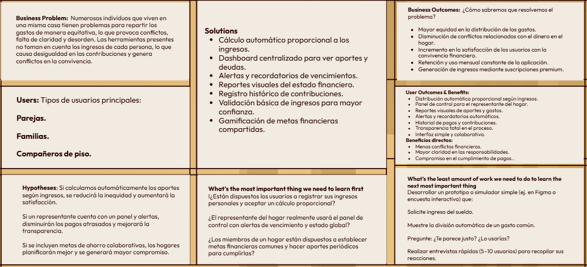

## 1.1 Startup Profile

### 1.1.1 Descripción de la Startup

**Harmonix** es una empresa emergente en el sector tecnológico que se enfoca en proporcionar soluciones financieras equitativas para el entorno familiar o de convivencia. Nuestra plataforma facilita la organización y distribución equitativa de los gastos compartidos del hogar, considerando los ingresos de cada miembro. A través de un sistema digital automatizado, claro y accesible, Harmonix promueve la responsabilidad económica, la comunicación eficaz y la adecuada gestión del presupuesto común, minimizando conflictos y reforzando una cultura de colaboración en el hogar.

- **Título:** Harmonix  
- **Misión:** Proveer un manejo eficiente de las finanzas en común mediante una aplicación digital que distribuye los gastos de manera proporcional a los ingresos de cada integrante, fomentando la equidad, la claridad y la convivencia armoniosa.  
- **Visión:** Convertirse en la plataforma top para la gestión financiera compartida en los hogares, siendo reconocidos por capacitar a las personas para que tomen decisiones económicas justas, responsables y colaborativas.  
- **Principios:** Transparencia, justicia y colaboración.

### 1.1.2 Perfiles de integrantes del equipo

<table border="1" cellspacing="0" cellpadding="8">

  <!-- Ficha vacía 1 -->
  <tr>
    <td style="text-align: center" align="center">
      

        Camilla Leonor Espinoza Vivas - u202214572 
        
      

    </td>
    <td style="text-align: center" align="center">
      Soy estudiante de ingeniería de software, con conocimiento en programación, diseño web y arquitecturas orientadas a servicios. Me caracterizo por ser responsable, disciplinada y colaborativa, aportando siempre soluciones técnicas y creativas. Además, me considero comprometida, constante y proactiva, cualidades que fortalecen mi desarrollo personal y académico.
    </td>
    <td style="text-align: center" align="center">
      Cuento con conocimientos en desarrollo de software, estructuras de datos, algoritmos y arquitecturas orientadas a servicios. Manejo lenguajes como Java, TypeScript, JavaScript, HTML5 y CSS3, además de frameworks y herramientas como Angular, Spring Boot, Git/GitHub, Swagger y bases de datos relacionales. Me interesan el diseño y desarrollo de aplicaciones web, la experiencia de usuario, la innovación tecnológica y la creación de soluciones que aporten valor real a las personas.
    </td>
  </tr>

  <!-- Ficha vacía 2 -->
  <tr>
    <td style="text-align: center" align="center">
      

        Angel Martin Gonzales Castillo - u202319724 
        
      

    </td>
    <td style="text-align: center" align="center">
      Soy estudiante de la carrera de Ingeniería de Software y actualmente me encuentro en el sexto ciclo. Me caracterizo por mi interés en la programación, la tecnología y el aprendizaje continuo. Tengo una actitud analítica y organizada, lo que me permite desarrollar proyectos académicos y prácticos con dedicación, buscando siempre aplicar los conocimientos adquiridos de manera efectiva
    </td>
    <td style="text-align: center" align="center">
      Tengo conocimientos en Python y C++, Java Basico, HTML y CSS basico, frameworks conocidos como Angular y Vue. Apoyo al equipo activamente y trato de aprendar cosas nuevas y mejorar los conocimientos que ya poseo.
    </td>
  </tr>

  <!-- Ficha de Kevin (posición 3) -->
  <tr>
    <td style="text-align: center" align="center">
      

        Kevin Patrick Panto Chuquipiondo - 20212162AS 
        
      

    </td>
    <td style="text-align: center" align="center">
      Mi nombre es Kevin Patrick Panto Chuquipiondo y actualmente estudio la carrera de Ingeniería de Software. Me gustaría ser una persona comprometida y con responsabilidad para poder lograr mis metas. Me esfuerzo por mantener el orden en el trabajo grupal y asegurar que todos los integrantes puedan contribuir sin obstáculos.
    </td>
    <td style="text-align: center" align="center">
      Tengo conocimientos en C#, Python, Flutter y Dart. Actualmente estoy aprendiendo sobre el desarrollo de aplicaciones móviles, lo cual me ha ayudado en el desarrollo de este trabajo.
    </td>
  </tr>

  <!-- Ficha vacía 4 -->
  <tr>
    <td style="text-align: center" align="center">
      

        [Nombre completo] - [Código] 
        
      

    </td>
    <td style="text-align: center" align="center">
      [Descripción personal y académica del integrante 4]
    </td>
    <td style="text-align: center" align="center">
      [Conocimientos técnicos, lenguajes, herramientas, intereses]
    </td>
  </tr>

  <!-- Ficha vacía 5 -->
  <tr>
    <td style="text-align: center" align="center">
      

        [Nombre completo] - [Código] 
        
      

    </td>
    <td style="text-align: center" align="center">
      [Descripción personal y académica del integrante 5]
    </td>
    <td style="text-align: center" align="center">
      [Conocimientos técnicos, lenguajes, herramientas, intereses]
    </td>
  </tr>

</table>

## 1.2. Solution Profile

**Harmonix** es una aplicación digital diseñada para facilitar la distribución equitativa de los gastos del hogar entre sus miembros, teniendo en cuenta los ingresos personales de cada individuo. La plataforma calcula de forma automática el aporte que debe hacer cada miembro, basándose en su situación económica, asegurando así una distribución justa de gastos compartidos como alquiler, servicios esenciales y alimentos.

Los usuarios tienen la posibilidad de anotar sus ingresos, entender cuánto deben contribuir y monitorear sus pagos, mientras que la persona responsable de la gestión del hogar obtiene una perspectiva integral del proceso. Asimismo, Harmonix proporciona monitoreo en tiempo real, informes mensuales comprensibles y alertas sobre pagos por realizar.

Con una interfaz clara y fácil de usar, la plataforma no solo ayuda a gestionar las finanzas, sino que también promueve la transparencia, la confianza y la cooperación entre los integrantes del hogar, reduciendo posibles desavenencias y garantizando un manejo económico eficaz y equilibrado.

### 1.2.1. Antecedentes y Problemática

La metodología **5W y 2H** es un recurso empleado para examinar la causa fundamental de un problema, error o discrepancia en los sistemas. Esta metodología, promovida por Toyota, es un componente fundamental del Sistema de Producción Toyota (TPS). Según Taichii Ohno, permite entender claramente los problemas y facilita la implementación de acciones correctivas o preventivas (Palko et al., 2015). Asimismo, se trata de un enfoque adaptable que puede implementarse en diversas clases de organizaciones, transformándose en una herramienta valiosa para la solución de disputas y la optimización de procesos.

---

### 🔍 What – ¿Cuál es la dificultad?

La cuestión central se encuentra en la ausencia de una repartición equitativa de los gastos en hogares con ingresos desiguales. Esto origina contribuciones desiguales que producen tensiones y posibles disputas entre los miembros, especialmente cuando se intenta repartir los gastos sin tener en cuenta la situación económica de cada individuo.

**¿Cuál es el vínculo con la persona mencionada?**  
El sistema tiene como objetivo que cada miembro pueda observar su contribución correspondiente y cumplir con ella de forma equitativa. El responsable del hogar asume la tarea de supervisar el proceso y asegurar la igualdad en las aportaciones.

---

### 🕒 When – ¿Cuándo ocurre el inconveniente?

La dificultad aparece principalmente en los momentos en que se deben pagar las facturas del hogar, las cuales suelen ser mensuales. Al repartir los gastos sin un cálculo justo, las discrepancias en los ingresos se hacen visibles y provocan problemas.

**¿Cuándo emplea el consumidor el artículo?**  
El producto se utiliza cada vez que se incurre en un gasto compartido, como servicios, alquiler, alimentos o compras en general. Al concluir cada mes, los usuarios pueden revisar el estado de los pagos efectuados y las deudas por saldar.

---

### 📍 Where – ¿Dónde ocurre?

**¿En qué lugar se encuentra el cliente al utilizar el producto?**  
El cliente suele estar en su casa o en cualquier lugar con conexión a Internet, ya sea mediante un dispositivo móvil o una computadora.

**¿Hacia dónde se encamina?**  
El usuario ingresa al panel principal de la aplicación para examinar en detalle los gastos, las contribuciones que debe efectuar y los pagos pendientes.

**¿Cuál es el origen del problema?**  
El conflicto se origina en el hogar, cuando es necesario dividir los gastos compartidos (como luz, agua, alimentos, alquiler, etc.) y no se dispone de un método que permita realizar esta división de manera equitativa y proporcional.

---

### ❓ Why – ¿Por qué ocurre?

La razón principal es la falta de un sistema claro y justo que facilite el cálculo de las contribuciones conforme a los ingresos de cada individuo. La ausencia de proporcionalidad provoca que algunos paguen más de lo que les corresponde y otros menos, generando descontento y disputas.

---

### 👥 Who – ¿Quiénes están involucrados?

**¿Quiénes están involucrados?**  
Los actores principales son los integrantes del hogar que comparten los costos, así como el encargado de gestionar dichos gastos.

**¿A quiénes les ocurre el problema?**  
Afecta a todas las personas que conviven y comparten responsabilidades financieras: familias, parejas o compañeros de vivienda con distintos niveles de ingresos.

**¿Quién hará uso de esto?**  
Todos los integrantes del hogar, ya que cada uno podrá revisar su aporte proporcional. El representante será responsable de planificar y supervisar la adecuada distribución de los gastos.

## 1.2.2 Lean UX Process

El **Lean UX** se define como un proceso en el que varios colaboradores trabajan juntos de manera continua y repetitiva, centrado en la experimentación y el aprendizaje constante. A diferencia de los métodos convencionales, este enfoque no se centra en la creación de una documentación detallada, sino que enfatiza la elaboración de prototipos y la ejecución de pruebas rápidas. Estas pruebas se realizan con usuarios auténticos y en situaciones específicas, lo que facilita la validación de hipótesis y la realización de cambios en el producto basados en la evidencia recopilada.

Su propósito esencial es minimizar el desperdicio de recursos y optimizar la eficiencia en el ciclo de desarrollo, facilitando que los equipos de diseño y desarrollo puedan adaptarse con mayor agilidad a las demandas y expectativas de los usuarios (Gothelf & Seiden, 2013).

### 1.2.2.1 Lean UX Problem Statements

**¿Cómo podemos desarrollar una herramienta novedosa que motive a los miembros del hogar a gestionar sus finanzas compartidas de manera equitativa, de modo que los gastos se repartan en relación a los ingresos de cada persona?**  
En numerosos hogares, repartirse los gastos de forma justa se torna difícil. La falta de un sistema que considere la situación económica de cada individuo genera disputas, rencores y desorganización financiera. Las herramientas disponibles en la actualidad tienden a ser bastante elementales o se restringen a realizar operaciones matemáticas sencillas.

**¿Cómo podemos crear una solución que promueva la transparencia, la participación y la responsabilidad compartida en las finanzas del hogar?**  
Cuando no se lleva un registro preciso de las contribuciones y los pagos, pueden aparecer malentendidos y falta de confianza. La ausencia de una herramienta que asegure una visibilidad común impide una convivencia pacífica en el ámbito económico.

**¿Qué métodos podríamos implementar para asistir a los usuarios en el cumplimiento de sus contribuciones y, al mismo tiempo, brindar al representante del hogar un control eficiente sobre la condición financiera del grupo?**  
En numerosas situaciones, una única persona se encarga de la gestión, sin embargo, no dispone de los recursos suficientes para realizar un seguimiento adecuado. Los recordatorios que son informales o se realizan de manera manual tienden a ser ineficaces y producen tensiones que no son necesarias.

**¿Cómo podríamos proporcionar una herramienta sencilla que resulte útil tanto para individuos con conocimientos elementales en finanzas como para aquellos que desean un control más exhaustivo de sus gastos familiares?**  
Los usuarios requieren una plataforma que sea simple y adaptable, capaz de presentar información importante y ajustable a sus necesidades. Numerosas soluciones actuales son complejas o no tienen en cuenta la dimensión colectiva y justa.

**¿Cómo podemos fomentar una cultura de ahorro y planificación financiera en el hogar, fundamentada en objetivos comunes y acuerdos cooperativos?**  
La gran parte de los hogares no tiene metas financieras compartidas ni prácticas de ahorro en conjunto. La carencia de una planificación conjunta limita el desarrollo económico familiar y promueve la desigualdad en las aportaciones.

### 1.2.2.2 Lean UX Assumptions

**Business Outcomes**

Consideramos que nuestros usuarios requieren una herramienta digital para administrar los gastos del hogar de manera equitativa y proporcional.  
Esta necesidad se atiende mediante una plataforma que determina de manera automática cuánto debe contribuir cada individuo según sus ingresos.

Nuestros primeros clientes serán parejas, familias o grupos de convivencia que buscan gestionar sus finanzas de manera justa y equitativa.  
El aspecto más importante que los usuarios anticipan es la asignación equitativa de los costos de acuerdo a sus ingresos y la transparencia en las transacciones financieras.

Otros beneficios importantes son: informes automáticos, alertas de pago, gestión centralizada por el representante del hogar y recomendaciones para ahorro colectivo.

Obtenemos ingresos mediante la venta de versiones premium que brindan características avanzadas, tales como análisis históricos, exportación de datos y la personalización de las reglas de distribución.

Nuestra competencia principal estará compuesta por aplicaciones de gestión financiera personal y hojas de cálculo compartidas, sin embargo, Harmonix se distingue por su metodología colaborativa y justa.  
Venceremos a la competencia al proporcionar personalización según los ingresos, visibilidad compartida y recursos para trabajar en conjunto.

Nuestro principal riesgo radica en la desconfianza de los usuarios hacia los cálculos o en su dificultad para adaptarse al uso de una plataforma colaborativa.  
Nos ocuparemos de ello mediante una interfaz sencilla, algoritmos comprensibles y un servicio de asistencia adaptado a las necesidades individuales.

Consideramos que al automatizar y hacer transparente la distribución de gastos, se mejorarán la convivencia, la confianza y la gestión financiera del hogar.  
Si esta suposición es equivocada, podríamos experimentar una baja retención de usuarios.

**User Outcomes**

¿Quién será el usuario que utilizaremos?  
Integrantes de un mismo hogar (parejas, familias, compañeros de vivienda) que desean administrar las finanzas conjuntas de manera justa, clara y cooperativa.

¿En qué parte de su vida se integra nuestro producto?  
En la organización y administración de los gastos mensuales que se comparten, particularmente al repartir gastos fundamentales como el alquiler, los servicios públicos, la alimentación o las metas comunes. Harmonix se transforma en un recurso digital habitual para facilitar la toma de decisiones económicas equitativas.

¿Cuáles son los inconvenientes de nuestro producto y de qué manera se pueden solucionar?  
**Situación:** Ausencia de dedicación o fallos en la anotación de ingresos y gastos.  
**Solución:** Establecer comprobaciones básicas, alertas automáticas y un sistema de recompensas (por ejemplo, objetivos logrados en colaboración).

¿Cómo y en qué momento se utiliza nuestro producto?  
Se utiliza de manera continua y en cooperación:  
- Al comienzo y al concluir cada mes, se debe realizar una organización y evaluación de las contribuciones.  
- Durante transacciones significativas (alquiler, servicios, adquisiciones).  
- En cualquier momento, se puede verificar la situación de las finanzas compartidas.

¿Qué inconvenientes podría tener nuestro producto?  
Es posible que se presente oposición al cambio en hogares donde ya existen rutinas establecidas. Para abordar esta situación, Harmonix proporcionará:  
- Transición sencilla de datos anteriores.  
- Ventajas evidentes desde el primer uso (ahorro de tiempo, claridad y disminución de debates).

¿Cuáles son las características que son significativas?  
- Cálculo automático en proporción a los ingresos  
- Informes visuales y precisos sobre contribuciones y gastos  
- Tablero de control para el representante doméstico  
- Registro de transacciones y aportes  
- Notificaciones sobre fechas de vencimiento y avisos  
- Establecimiento de objetivos y metas en común  
- Protección y confidencialidad de la información  
- Vivencia sencilla, disponible y cooperativa

### 1.2.2.3 Lean UX Hypothesis Statements

**Hipótesis 1: Proporción equitativa en la asignación de gastos**  
Consideramos que un instrumento que determine de manera automática las contribuciones según los ingresos de cada integrante del hogar promoverá una convivencia más equitativa, transparente y armoniosa, previniendo discusiones superfluas.  
Conoceremos que estamos en buen camino cuando, al menos, el 70% de los usuarios señalen haber disminuido problemas relacionados con el dinero y informen un aumento en su satisfacción con la distribución de gastos dentro de los primeros tres meses de uso.

**Hipótesis 2: Vigilancia por parte del representante del hogar**  
Consideramos que permitir a un representante tener acceso a una visión general del estado financiero compartido, junto con alertas y reportes automáticos, potenciará la transparencia y el cumplimiento de los pagos.  
Tendremos la certeza de que estamos en buen camino cuando se evidencie una disminución notable en los pagos pendientes y cuando un mínimo del 60% de los hogares registrados utilice de manera activa el panel de control.

### 1.2.2.4 Lean UX Canvas

---

## 1.3 Segmentos objetivo

### Segmento objetivo 1: Personas del hogar

**Aspectos demográficos**  
- Sexo: Masculino y femenino  
- Edad: 18 – 65 años  
- Nivel socioeconómico: Clases A, B y C (alta, media-alta y media)  
- Estado civil: Solteros, casados, convivientes, parejas, compañeros de cuarto

**Aspectos geográficos**  
- Nacionalidad: Peruana  
- Zona geográfica: Urbana y suburbana  
- Departamento: Lima Metropolitana y principales ciudades del país

**Aspectos psicográficos**  
- Buscan una forma justa y equitativa de compartir gastos del hogar (alquiler, servicios, alimentación, etc.)  
- Están interesados en herramientas que brinden transparencia y simplicidad en la gestión de las finanzas  
- Se preocupan por mantener un equilibrio financiero entre los miembros del hogar, asegurando que cada uno aporte de acuerdo a sus ingresos  
- Tienen un estilo de vida basado en la convivencia y la corresponsabilidad, por lo que valoran soluciones que reduzcan discusiones y simplifiquen la organización de pagos

---

### Segmento objetivo 2: Representante del hogar

**Aspectos demográficos**  
- Sexo: Masculino y femenino  
- Edad: 25 – 50 años  
- Nivel socioeconómico: Clases A, B y C (alta, media-alta y media)  
- Estado civil: Casados, convivientes, parejas con hijos o personas encargadas de la administración financiera del hogar

**Aspectos geográficos**  
- Nacionalidad: Peruana  
- Zona geográfica: Urbana y suburbana  
- Departamento: Lima Metropolitana y principales ciudades del país

**Aspectos psicográficos**  
- Son responsables de la planificación y control de los gastos familiares, buscando asegurar la equidad entre los integrantes  
- Muestran interés en herramientas digitales que permitan monitorear y organizar finanzas de manera práctica  
- Buscan evitar conflictos financieros dentro del hogar mediante claridad y control en los aportes de cada miembro  
- Están comprometidos con la eficiencia en la gestión de recursos y valoran soluciones que distribuyan gastos de manera proporcional y transparente

