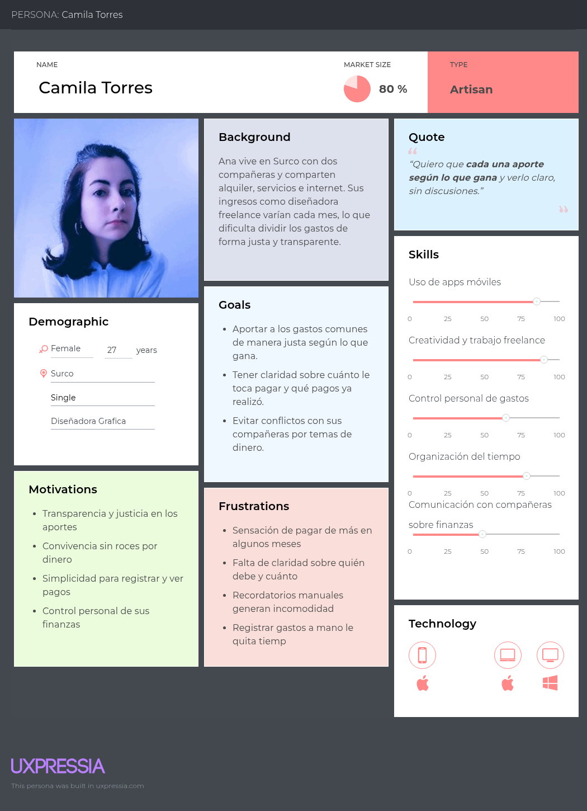
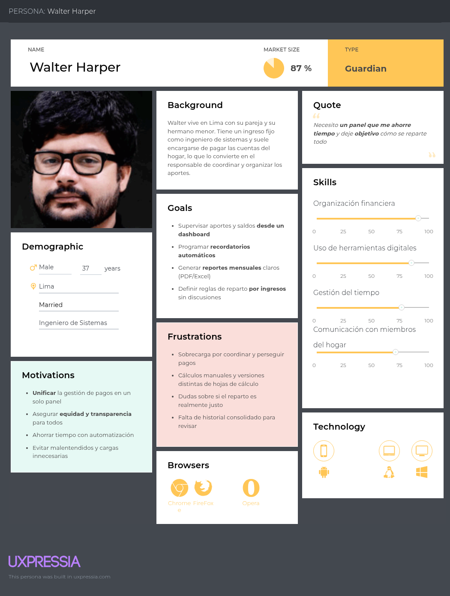
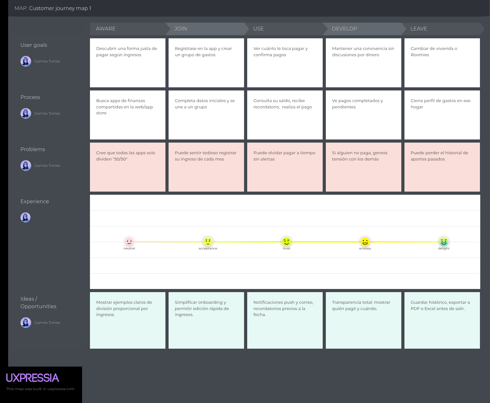

# Capítulo II: Requirements Elicitation & Analysis

## 2.1. Competidores

### 2.1.1. Análisis competitivo
Mediante un análisis comparativo, hemos organizado información clave de cada propuesta de valor. Esto nos ayudará a entender mejor en qué se diferencia nuestra solución y compararla con las de nuestros competidores.

| Competitive Analysis Landscape                                                                                                        |  |                                                                                                            |                                                                                                                                                                                                                      |                                                                                                                                                                                                                  |                                                                                                                                                                                                                             |
|:--------------------------------------------------------------------------------------------------------------------------------------| :---- |------------------------------------------------------------------------------------------------------------|:---------------------------------------------------------------------------------------------------------------------------------------------------------------------------------------------------------------------|:-----------------------------------------------------------------------------------------------------------------------------------------------------------------------------------------------------------------|:----------------------------------------------------------------------------------------------------------------------------------------------------------------------------------------------------------------------------|
| ¿Por qué llevar a cabo este análisis?                                                                                                 |  | Competidores Directos                                                                                      |                                                                                                                                                                                                                      |                                                                                                                                                                                                                  |                                                                                                                                                                                                                             |
| Con el fin de reconocer a los competidores y diseñar estrategias comerciales más sólidas que permitan enfrentarlos de manera efectiva |  | Harmonix                                                                                                   | Goodbudget                                                                                                                                                                                                           | Sesterce                                                                                                                                                                                                         | Honeydue                                                                                                                                                                                                                    |
|                                                                                                                                       |  |                                                                                                            |                                                                                                                                                                          |                                                                                                                                                                      |                                                                                                                                                                                 |
| Perfil                                                                                                                                | Overview | Aplicación de gestión financiera del hogar. Divide los gastos tomando en cuenta los ingresos.              | App de presupuestos basada en sobres digitales, donde los usuarios asignan manualmente sus ingresos a distintas categorías.                                                                                          | Aplicación para compartir gastos en grupos o parejas sin necesidad de registro                                                                                                                                   | Aplicación móvil que permite vincular cuentas bancarias, categorizar automáticamente los gastos, fijar recordatorios de pagos y tener visibilidad de los saldos de cada persona.                                            |
|                                                                                                                                       | Ventaja Competitiva | Reparto justo y automatizado según ingresos. Fomenta equidad y transparencia.                              | Fomenta disciplina financiera al obligar a planificar, ofrece colaboración en tiempo real y tiene una versión gratuita muy completa, lo que la hace accesible y educativa                                            | Destaca por su sencillez y anonimato, sin publicidad ni fricciones en el uso. Es rápida para organizar gastos compartidos y muy práctica frente a apps más complejas.                                            | Ofrece transparencia financiera con control de lo que se comparte, y combina sincronización bancaria con comunicación directa                                                                                               |
| Perfil de Marketing                                                                                                                   | Mercado Objetivo | Familias, parejas y roommates con economías compartidas y distintos niveles de ingreso.                    | Personas que buscan aprender a manejar sus finanzas personales con un método práctico y educativo, principalmente familias y parejas                                                                                 | Grupos pequeños como amigos, compañeros de piso o parejas que necesitan una solución rápida, privada y sin complicaciones para dividir gastos.                                                                   | Parejas jóvenes o adultas que desean transparencia en la gestión del dinero compartido, con enfoque en la confianza y la comunicación.                                                                                      |
|                                                                                                                                       | Estrategias de marketing | Enfocado en la equidad financiera y automatización. Redes sociales, foros y comunidades financieras.       | Se apoya en la reputación de su sistema de sobres digitales, en reseñas positivas en blogs financieros y en tiendas de apps                                                                                          | Basa su crecimiento en el boca a boca, en su facilidad de uso y en su propuesta de privacidad.                                                                                                                   | Utiliza la gratuidad como gancho principal, promueve la app en medios especializados en finanzas personales y estilo de vida                                                                                                |
| Perfil de Producto                                                                                                                    | Productos & Servicios | Plataforma para dividir gastos del hogar según ingresos. Incluye reportes, historial, metas y seguimiento. | App de presupuestos con sobres digitales, reportes de gastos y sincronización entre varios dispositivos                                                                                                              | App centrada en el registro y la gestión de gastos compartidos, con funciones como exportación de datos y reportes en gráficos simples.                                                                          | Aplicación móvil que combina vinculación bancaria, categorización automática de gastos, recordatorios y un chat interno para parejas                                                                                        |
|                                                                                                                                       | Precios & Costos | Freemium: versión gratuita con funciones básicas. Premium: reportes, metas, recordatorios, exportación.    | Freemium: versión gratuita con funciones limitadas. Premium: Sobre ilimitados y opciones avanzadas                                                                                                                   | Ofrece servicio gratuito sin costo alguno                                                                                                                                                                        | Ofrece servicio gratuito sin costo alguno                                                                                                                                                                                   |
|                                                                                                                                       | Canales de Distribución | App móvil (Google Play y App Store), redes sociales, foros, influencers de finanzas personales.            | Aplicaciones móviles (App Store y Google Play) y su versión web                                                                                                                                                      | Aplicaciones móviles (App Store y Google Play)                                                                                                                                                                   | Aplicaciones móviles (Google Play y App Store), además de difusión en medios digitales y redes sociales                                                                                                                     |
| Análisis SWOT                                                                                                                         | Fortalezas | Equidad proporcional basada en ingresos. Automatización. Foco en convivencia y economía compartida.        | Facilidad de uso, la sincronización en varios dispositivos y el enfoque educativo que fomenta la disciplina financiera                                                                                               | Facilidad y simplicidad en su uso, privacidad y protección de datos asegurada                                                                                                                                    | Gratuito, vinculación con miles de bancos, categorización automática de gastos e integración de un chat interno                                                                                                             |
|                                                                                                                                       | Debilidades | Proyecto en etapa inicial. Requiere datos sensibles (ingresos).                                            | Falta de integración bancaria y en que requiere un esfuerzo manual que puede desmotivar a algunos usuarios                                                                                                           | Limitada frente a competidores con opciones más avanzadas                                                                                                                                                        | Se centra exclusivamente en parejas                                                                                                                                                                                         |
|                                                                                                                                       | Oportunidades | Más hogares con economías compartidas. Creciente interés en equidad y herramientas de finanzas personales. | Posibilidad de ampliar su base de clientes en familias y usuarios que busquen planificación financiera más consciente                                                                                                | Capitalizar la creciente demanda de soluciones rápidas y ligeras para grupos de amigos o compañeros de piso                                                                                                      | Expandirse hacia más mercados y en ofrecer servicios premium con valor añadido                                                                                                                                              |
|                                                                                                                                       | Amenazas | Competencia consolidada. Preferencia por métodos tradicionales (Excel, notas, billeteras físicas).         | Apps más automatizadas y con mayor integración tecnológica que podrían desplazarla en el mercado.                                                                                                                    | Falta de diferenciación a largo plazo, ya que otros competidores podrían replicar fácilmente su propuesta minimalista.                                                                                           | Fuerte competencia de apps más generales como Splitwise o Goodbudget, que pueden abarcar un público más amplio.                                                                                                             |
### 2.1.2. Estrategias y tácticas frente a competidores
La estrategia general de Harmonix debe centrarse en reforzar su propuesta única de valor: la equidad automatizada según ingresos. Esta característica lo distingue de Goodbudget, que es más manual; de Sesterce, que es más limitado; y de Honeydue, que se enfoca solo en parejas. Comunicar de forma clara que Harmonix asegura justicia en los aportes de cada miembro del hogar es la base para competir.

En paralelo, debe posicionarse como una app más integral y flexible que los competidores. A diferencia de soluciones demasiado simples o muy nicho, Harmonix atiende tanto a familias como a roommates o parejas con diferentes ingresos, lo que le da un mercado más amplio. Su estrategia debe ser mostrarse como la alternativa más completa y adaptable para distintos tipos de convivencia.

Por último, en términos de marketing, conviene apostar por la educación y el contenido social: mostrar casos reales, testimonios y consejos de convivencia financiera. Esto no solo genera diferenciación frente a Goodbudget y Honeydue, sino que posiciona a Harmonix como una app que no solo divide gastos, sino que mejora la convivencia.
## 2.2. Entrevistas

### 2.2.1. Diseño de entrevistas

### Segmento objetivo 1: Personas del hogar

**Aspectos demográficos y psicográficos clave**

- Sexo: Masculino y femenino
- Edad: 18 a 65 años
- Nivel socioeconómico: A, B, y C
- Estado civil: Solteros, casados, convivientes, parejas, roommates
- Zona: Urbana y suburbana (Perú)

**Preguntas demográficas:**

1. ¿Me podria decir su edad?
2. ¿Cual es su sexo?
3. ¿En que zona vive actualmente?
4. ¿Con cuál de estas opciones se identifica su nivel socioeconómico? (A / B / C)
5. ¿Cuál es su estado civil o situación actual?

**Preguntas Principales:**

1. ¿Con quién vive actualmente y cómo reparten los gastos del hogar?
2. ¿Considera justo el sistema que usan para dividir los pagos? ¿Por qué?
3. ¿Cuáles son los mayores retos al organizar los gastos compartidos?
4. ¿Han tenido desacuerdos por temas de dinero o pagos en el hogar?
5. ¿Han considerado dividir los gastos en función de los ingresos de cada persona?
6. ¿Utilizan alguna app para anotar los pagos del hogar? ¿Cuál y qué tan útil les resulta?
7. ¿Qué funcionalidades cree que debería tener una app ideal para gestionar gastos entre varias personas?
8. ¿Cómo le gustaría visualizar lo que le toca pagar, lo que ya pagó y lo que está pendiente?
9. ¿Cree que una aplicación como Harmonix podría ayudar a mejorar la convivencia y la organización en su hogar?

### Segmento objetivo 2: Representante del hogar

**Aspectos demográficos y psicográficos clave**

- Sexo: Masculino y femenino
- Edad: 25 a 50 años
- Nivel socioeconómico: A, B, y C
- Estado civil: Casados, convivientes, parejas con hijos, personas responsables de las finanzas del hogar
- Zona: Urbana y suburbana (Perú)

**Preguntas demográficas:**

1. ¿Me podria decir su edad?
2. ¿Cual es su sexo?
3. ¿En que zona vive actualmente?
4. ¿Con cuál de estas opciones se identifica su nivel socioeconómico? (A / B / C)
5. ¿Cuál es su estado civil o situación actual?

**Preguntas Principales:**

1. ¿Cuál es su rol dentro de su hogar en cuanto a la administración del dinero?
2. ¿Cómo organiza actualmente los ingresos y gastos del hogar?
3. ¿Considera que el reparto de los gastos es equitativo para todos los miembros?
4. ¿Qué dificultades enfrenta para lograr un reparto justo de los gastos?
5. ¿Cómo controla que cada miembro cumpla con su parte financiera?
6. ¿Qué herramientas (apps, cuadernos, Excel, etc.) usa actualmente para llevar este control?
7. ¿Qué funcionalidades le gustaría que tenga una app como SplitEasy?
8. ¿Qué tan importante considera la transparencia financiera dentro del hogar?
9. ¿Estaría dispuesto(a) a registrar los ingresos de cada miembro para que la aplicación calcule automáticamente cuánto debe aportar cada uno?
10. ¿Qué beneficios cree que traería una solución como Harmonix en la convivencia familiar?

### 2.2.2. Registro de entrevistas

En esta sección, se registra cada entrevista realizada. En total, se realizaron tres entrevistas por cada segmento objetivo. Se detalla el nombre del miembro entrevistador y el del entrevistado. Además, se redacta un resumen general del contenido de la entrevista realizada.

Segmento Objetivo 1: Personas del hogar
  
Entrevista 1:  
  
| Entrevista | Registro |  
| ----- | ----- |  
| 

 | **Zona:** Bruguerio Miran  **Entrevistado:** Harris Herrada |  
| [Link](https://acortar.link/q0QWyL)|  **Entrevistadora:** Camila Leonor Espinoza Vivas |  
| Timing: Minuto 0:05-3:24| **Resumen:** Harri Herrada, de 20 años, es soltero y vive junto a su padre y su primo. En su hogar, los gastos más importantes, como el pago de servicios principales y compromisos de mayor monto, son asumidos por su padre. En cambio, los gastos comunes, relacionados con el día a día, se dividen entre Harri y su primo. Esta forma de organización les resulta práctica y cómoda, ya que no genera conflictos y todos saben con claridad qué parte les corresponde cubrir. El principal reto que enfrenta al organizar sus finanzas surge al momento de realizar las compras para la casa, aunque señala que no han tenido desacuerdos al repartir los gastos. Harri no considera necesario dividirlos según los ingresos de cada miembro, ya que el método que utilizan les resulta más cómodo. Además, opina que una aplicación amigable y fácil de usar le ayudaría a gestionar mejor sus gastos. Utiliza como browser Google Chrome y Safari. Como tecnologias utiliza un celular android y una laptop con sistema operativo MacOS.|  
  
Entrevista 2:  
  
| Entrevista | Registro |  
| ----- | ----- |  
| 

 | **Zona:** Magdalena  **Entrevistada:** Maria Fernanda |  
| [Link](https://acortar.link/q0QWyL)|  **Entrevistador:** Jose Luis Martinez Valdivia |  
| Timing: Minuto 3:25-7:49| **Resumen:** María Fernanda, de 20 años, es soltera y vive con su familia. En su hogar, los gastos se dividen entre todos los miembros, lo que en general les permite cubrir sus necesidades de manera organizada. Ella considera que el sistema que llevan actualmente para gestionar los gastos es eficiente, ya que cada integrante asume una parte proporcional, pero reconoce que su mayor dificultad está en mantener un registro claro y ordenado de cada desembolso. Para ella, contar con una aplicación que ofrezca registros rápidos y fáciles de consultar sería de gran utilidad, pues le permitiría llevar un control más transparente y evitar confusiones en el futuro. Utiliza como browser Google Chrome y Edge. Como tecnologias utiliza un celular iphone y una laptop con sistema operativo Windows.|  
  
Entrevista 3:  
  
| Entrevista | Registro |  
| ----- | ----- |  
| 

 | **Zona:** Lima Metropolitana **Entrevistado:** Abraham Estrada |  
| [Link](https://acortar.link/q0QWyL)|  **Entrevistador:** Sebastias Cordova Valdivia |  
| Timing: Minuto 7:50-12:46| **Resumen:** Abraham Estrada, de 22 años, es soltero y comparte vivienda con tres amigos, todos ellos con empleo. Para organizarse, decidieron dividir los gastos del hogar entre los cuatro. Aunque este método les permite cubrir sus necesidades básicas, Abraham comenta que el mayor reto que enfrentan es ponerse de acuerdo sobre quién debe pagar en cada ocasión, así como recordar quién ya cumplió con su parte y quién no lo ha hecho. Esta situación ha generado varios desacuerdos, especialmente al momento de realizar los pagos compartidos. considera que dividir los gastos según los ingresos de cada miembro no sería una alternativa viable, ya que complicaría aún más la organización y la gestión de sus finanzas. Por esta razón, Abraham cree que una aplicación con funciones específicas, como recordar los gastos pendientes y notificar las acciones que realizan los demás integrantes, sería de gran utilidad. Utiliza como browser Google Chrome y Safari. Como tecnologias utiliza un celular iphone y una laptop MacOS.|  
  
Segmento Objetivo 2: Representante del hogar
  
Entrevista 4:  
  
| Entrevista | Registro |  
| ----- | ----- |  
| 

 | **Zona:** Chorrillos **Entrevistada:** Jessica Castillo |  
| [Link](https://acortar.link/q0QWyL)| **Entrevistador:** Angel Martin Gonzales Castillo |  
| Timing: Minuto 12:47-18:12| **Resumen:** Jessica Castillo, de 47 años es casada y vive con su familia. Ella se encarga de administrar el dinero destinado a los pagos y la organización de los gastos del hogar. Considera que la distribución de los gastos es equitativa, ya que tanto ella como su esposo aportan a las necesidades principales de la familia, cubriendo servicios, alimentación y otros compromisos esenciales. Su mayor dificultad al momento de gestionar las finanzas surge cuando realiza compras innecesarias, ya que esto provoca que en ocasiones se exceda del presupuesto establecido. Jessica cree que una aplicación que registre los gastos de manera automática y que, además, envíe recordatorios mensuales sobre pagos próximos o recurrentes sería de gran ayuda para evitar retrasos y mantener un control más estricto. También considera muy útil una función que identifique y clasifique los gastos innecesarios, lo que le permitiría reconocer patrones de consumo, tomar decisiones más conscientes y, al mismo tiempo, contar con una herramienta que calcule de forma automática cuánto gasta cada integrante de la familia, garantizando mayor transparencia y equidad en la administración del dinero, y fortaleciendo así la confianza y la organización en el hogar. Utiliza como browser Google Chrome y Edge. Como tecnologias utiliza un celular android y una laptop con sistema operativo Windows.|  

Entrevista 5:  
  
| Entrevista | Registro |  
| ----- | ----- |  
| 

 | **Zona:** San Isidro  **Entrevistado:** Frank |  
| [Link](https://acortar.link/q0QWyL)|  **Entrevistador:** Kevin Patrick Pardo Chumpitazi |  
| Timing: Minuto 18:13-22:18| **Resumen:** Frank, de 25 años, vive con su pareja y es quien se encarga principalmente de los gastos del hogar. Para mantener un control adecuado, organiza un presupuesto mensual en el que contempla tanto los gastos fijos como los variables. Además, utiliza Excel como herramienta de apoyo para calcular y registrar sus finanzas, lo que le permite tener una visión más ordenada de sus ingresos y egresos. Él considera que la forma en que distribuyen los gastos en el hogar es equitativa; sin embargo, reconoce que su mayor dificultad surge con los gastos imprevistos, especialmente aquellos relacionados con urgencias o problemas que no estaban contemplados en el presupuesto inicial. Frank cree que sería de gran utilidad contar con una aplicación que automatice la división de los gastos y que, además, ofrezca reportes claros, alertas y recordatorios. Para él, una herramienta sencilla de usar que le permita organizar mejor las finanzas del hogar, anticiparse a posibles problemas y visualizar de manera clara la distribución de sus recursos sería clave para optimizar la gestión de su dinero.Utiliza como browser Google Chrome y Safari. Como tecnologias utiliza un celular iphone y una laptop MacOS.|  
  
Entrevista 6:  
  
| Entrevista | Registro |  
| ----- | ----- |  
| 

 | **Zona:** Chorrillos  **Entrevistado:** Renzo Ichibache |  
| [Link](https://acortar.link/q0QWyL)|  **Entrevistador:** Sebastian Cordova Valdivia |  
| Timing: Minuto 22:19-27:04| **Resumen:**  Renzo Ichibache, de 27 años, es soltero pero vive con su pareja. Él se encarga principalmente de pagar los servicios del hogar y, junto con su pareja, organiza sus gastos a través de hojas de cálculo en Excel. Este método les permite tener cierto control, aunque reconoce que pueden surgir dificultades al momento de gestionar las finanzas debido a que los sueldos de cada uno varían, lo que genera diferencias en la capacidad de aportar de manera constante. Para Renzo, una de las principales necesidades es contar con una herramienta más práctica y sencilla que les ayude a clasificar sus gastos de forma detallada. Considera que una aplicación similar a Excel, pero con una interfaz más amigable y con la posibilidad de implementar subcategorías, sería de gran utilidad para su uso diario. Utiliza como browser Google Chrome y Edge. Como tecnologias utiliza un celular android y una laptop con sistema operativo Windows.|

Entrevista 7:  
  
| Entrevista | Registro |  
| ----- | ----- |  
| 

 | **Zona:** Santiago de Surco  **Entrevistado:** Ronald Vivas |  
| [Link](https://acortar.link/q0QWyL)|  **Entrevistador:** Camila Leonor Espinoza Vivas |  
| Timing: Minuto 28:17-31:08| **Resumen:**  Ronald Vivas, de 36 años, está casado y vive con su familia. Junto con su esposa administra los gastos del hogar, utilizando para ello hojas de cálculo en Excel. Él considera que la distribución de los gastos es equitativa y no enfrenta mayores dificultades al momento de repartirlos. Sin embargo, cree que sería de gran utilidad contar con una aplicación que no solo genere reportes sobre los ingresos, sino que también realice proyecciones de los gastos futuros. Además, considera importante registrar los ingresos de cada miembro de la familia para calcular de forma automática la proporción de gastos que le corresponde a cada uno y poder comparar esos resultados con los cálculos que actualmente realiza manualmente. Ronald señala que una solución de este tipo sería mucho más práctica si estuviera disponible tanto en una página web como en una aplicación móvil, lo que facilitaría su acceso y uso diario. Utiliza como browser Google Chrome y Edge. Como tecnologias utiliza un celular Iphone y una laptop con sistema operativo Windows.|

### 2.2.3. Análisis de entrevistas ###

En primer lugar, con base en las tres entrevistas realizadas al primer segmento objetivo, conformado por los miembros del hogar, se puede concluir lo siguiente:

* La organización de los gastos depende más de la practicidad que de los ingresos. Tanto Harri como Abraham mencionan que no consideran dividir los gastos según lo que gana cada miembro, ya que prefieren métodos más simples y cómodos que les permitan organizarse sin complicaciones.
    
* La principal dificultad surge en el control y la claridad de los pagos. María Fernanda y Abraham coinciden en que los mayores problemas aparecen al momento de llevar registros claros y ponerse de acuerdo sobre quién pagó o qué parte le corresponde a cada uno, lo que en algunos casos ha generado desacuerdos.
    
* Existe una necesidad común de apoyo digital para gestionar mejor los gastos. Los tres entrevistados consideran que una aplicación amigable, con funciones como registros rápidos, recordatorios de pagos y notificaciones, sería de gran ayuda para evitar confusiones, mejorar la organización y facilitar la convivencia.

A continuación, se presentan los porcentajes destacados en las respuestas de los entrevistados a las preguntas planteadas:

* Division de gastos:  
    
  

  
    
  	En esta imagen, se visualiza una relación de respuestas sobre el tema planteado. Luego del análisis a este gráfico, se concluye que hay una gran mayoría que considera que si se deberia de dividir las gastos segun la ganancia de cada miembro. Pero, hay una pequeña parte que no esta deacuerdo.  
    
* Desacuerdo en los pagos:  
    
  

  
    
  En esta imagen, se visualiza una relación de respuestas sobre el tema planteado. Luego del análisis a este gráfico, se concluye que hay una gran mayoría que si presento desacuerdos a la hora de realizar sus pagos correspondientes. Pero, hay una pequeña parte que no presenta desacuerdos entre los miembros del hogar.

* Aplicacion que mejora la organizacion:  
    
  

  
    
  En esta imagen, se visualiza una relación de respuestas sobre el tema planteado. Luego del análisis a este gráfico, se concluye que todos los entrevistados consideran util e imprensindible una aplicacion que mejore la organizacion de sus gastos.  

* Browser utilizados:

 En esta imagen, se visualiza una relación de respuestas sobre el tema planteado. Luego del análisis a este gráfico, se concluye que las mayoria de los entrevistados utilizan los navegadores de Google Chrome y Safari.
 
* Tecnologias utilizadas:

En esta imagen, se visualiza una relación de respuestas sobre el tema planteado. Luego del análisis a este gráfico, se concluye que las mayoria de los entrevistados utilizan los dispositivos celular Iphone y laptop con sistema operativos MacOS

Segundo, con base en las cuatro entrevistas realizadas al segundo segmento objetivo, conformado por los representantes del hogar, se puede concluir lo siguiente:

* Uso de métodos previos para gestionar las finanzas. Todos los entrevistados ya emplean algún tipo de organización antes de recurrir a una aplicación digital. Jessica administra los pagos directamente, Frank y Renzo utilizan hojas de cálculo en Excel para presupuestar y clasificar gastos, mientras que Ronald también recurre a Excel junto con su esposa para la administración del hogar. Esto refleja una clara disposición hacia el orden y la planificación financiera.
* Necesidad de un control más profundo y adaptable. Las principales dificultades giran en torno a factores que desequilibran la organización: Jessica con las compras innecesarias, Frank con los gastos imprevistos, Renzo con la variación de ingresos y Ronald con la falta de proyecciones claras a futuro. Todos coinciden en que requieren herramientas que permitan un seguimiento más detallado, con funciones que automaticen cálculos, generen reportes y se adapten a la realidad de cada hogar.
* Preferencia por soluciones digitales prácticas y accesibles. Existe un consenso en valorar una aplicación que sea fácil de usar, amigable e intuitiva. Los entrevistados consideran importantes funciones como reportes automáticos, alertas, subcategorías de gastos, proyecciones futuras y cálculos individuales por integrante. Además, Ronald resalta que estas herramientas serían más útiles si se ofrecen tanto en versión web como móvil, lo que refuerza la necesidad de accesibilidad y practicidad en su uso cotidiano.

A continuación, se presentan los porcentajes destacados en las respuestas de los entrevistados a las preguntas planteadas:

* Mantener un control de estructurado de gastos

  

  En esta imagen, se visualiza una relación de respuestas sobre el tema planteado. Luego del análisis a este gráfico, se concluye que todos los entrevistados requieren un control mas estructurado de sus gastos.

* Necesidad de controlar gastos

  

  En esta imagen, se visualiza una relación de respuestas sobre el tema planteado. Luego del análisis a este gráfico, se concluye que todos los entrevistados tienen una necesidad para poder controlar de forma mas detallada y adaptable

* Uso de herramientas digitales

  	

  	
  	En esta imagen, se visualiza una relación de respuestas sobre el tema planteado. Luego del análisis a este gráfico, se concluye que todos los entrevistados consideran el uso de herramientas digitales para poder mejorar el control de gastos

* Browser utilizados:

 En esta imagen, se visualiza una relación de respuestas sobre el tema planteado. Luego del análisis a este gráfico, se concluye que las mayoria de los entrevistados utilizan los navegadores de Google Chrome y Edge.
 
* Tecnologias utilizadas:

En esta imagen, se visualiza una relación de respuestas sobre el tema planteado. Luego del análisis a este gráfico, se concluye que las mayoria de los entrevistados utilizan los dispositivos celular android, iphone y laptop con sistema operativos windows

## 2.3. Needfinding
En esta sección se detallan las principales necesidades detectadas en los segmentos objetivos de Harmonix. A través del análisis de sus contextos, se identificaron las dificultades que enfrentan al momento de repartir los gastos comunes del hogar, como la falta de equidad, transparencia y control en los pagos. Estas necesidades constituyen la base para orientar el diseño del producto, asegurando que las funcionalidades de Harmonix respondan directamente a los problemas reales de los usuarios y contribuyan a mejorar la convivencia en el hogar.

De esta manera, se presentan a continuación los hallazgos clave que guiarán el desarrollo de la solución
  
## Segmento #1: Personas del hogar

- **Dividir los gastos comunes** de forma justa y proporcional a los ingresos de cada miembro.  
- **Contar con visibilidad en tiempo real** sobre pagos realizados y saldos pendientes.  
- **Garantizar transparencia** para evitar malentendidos y conflictos dentro de la convivencia.  
- **Usar una aplicación sencilla** que organice los pagos del hogar.  

## Segmento #2: Representante del hogar

- **Gestionar y supervisar** todos los aportes desde un panel centralizado.  
- **Recibir alertas automáticas** y recordatorios de pagos pendientes.  
- **Asegurar contribuciones equitativas**, basadas en ingresos reales.  
- **Obtener reportes financieros claros** y automáticos para ahorrar tiempo en la planificación.  

### 2.3.1. User Personas

- Segmento #1: Personas del hogar

  

- Segmento #2: Representante del hogar

  

### 2.3.2. User Task Matrix.

- En esta sección se presenta la User Task Matrix, enfocada en los dos segmentos clave de Harmonix: miembros del hogar y representantes del hogar. Permite identificar sus tareas habituales y principales necesidades, facilitando la priorización de funcionalidades en el producto.

| **Persona**                 | **Tarea**                                  | **Importancia** | **Frecuencia** |
|------------------------------|--------------------------------------------|-----------------|----------------|
| **Ana (Miembro del hogar)** | Registrar su ingreso mensual                | Alta            | Baja           |
|                              | Revisar cuánto debe aportar según su ingreso | Alta            | Alta           |
|                              | Recibir recordatorios y confirmar pagos    | Media           | Media          |
|                              | Consultar historial de pagos               | Media           | Baja           |
| **Luis (Representante del hogar)** | Crear y gestionar gastos compartidos       | Alta            | Alta           |
|                              | Supervisar pagos realizados y pendientes   | Alta            | Alta           |
|                              | Enviar recordatorios automáticos           | Media           | Media          |
|                              | Generar reportes mensuales                 | Alta            | Baja           |

### 2.3.3. User Journey Mapping.

Aquí se presentan los User Journey Mapping para cada user persona. El recorrido refleja cómo los usuarios reciben notificaciones de nuevos gastos, consultan su historial, calculan su aporte proporcional y completan el pago, asegurando claridad y transparencia en el proceso.

- Segmento #1: Personas del hogar

  

- Segmento #2: Representante del hogar

  

### 2.3.4. Empathy Mapping.

El Empathy Mapping permite comprender a fondo qué piensan, sienten, ven, escuchan y hacen los usuarios, así como sus frustraciones y motivaciones. Este análisis facilita diseñar soluciones alineadas con sus verdaderas necesidades.

- Segmento #1: Personas del hogar
  

  

- Segmento #2: Representante del hogar

  

### 2.3.5. As-is Scenario Mapping.

El As-Is Scenario Mapping describe cómo los usuarios actualmente gestionan sus gastos compartidos sin Harmonix, mostrando sus acciones, pensamientos y emociones en cada paso. Esto ayuda a identificar los principales puntos de dolor que la plataforma busca resolver.

- Segmento #1: Personas del hogar
  

  

- Segmento #2: Representante del hogar

  

## 2.4. Ubiquitous Language.

| **Término en Inglés**          | **Término en Español**       | **Definición**                                                                                                                                           |
|--------------------------------|-----------------------------|----------------------------------------------------------------------------------------------------------------------------------------------------------|
| Household Representative      | Representante del hogar     | Usuario responsable de administrar el hogar dentro del sistema. Tiene permisos especiales para registrar nuevos miembros, ingresar gastos comunes y visualizar los aportes de todos. |
| Household Member              | Miembro del hogar           | Usuario que forma parte de un hogar registrado. Aporta según su capacidad económica y puede visualizar su historial de gastos y contribuciones.              |
| Income-Based Contribution     | Contribución basada en ingresos | Mecanismo mediante el cual se calcula la cantidad que debe aportar cada miembro del hogar, según el ingreso personal declarado. Busca que el reparto sea justo y equitativo. |
| Shared Expense                | Gasto compartido             | Gasto que afecta a todo el hogar y que debe dividirse proporcionalmente entre sus miembros (por ejemplo, alquiler, servicios, compras comunes).              |
| Spending Record               | Registro de gastos          | Documento digital o entrada dentro del sistema que detalla la fecha, el monto, la categoría y quién ingresó el gasto.                                       |
| Contribution Percentage       | Porcentaje de contribución  | Valor en porcentaje que representa la participación proporcional de cada miembro en los gastos comunes del hogar, calculado con base en su ingreso.         |
| Financial Overview            | Resumen financiero          | Vista general de los ingresos, aportes y gastos de un hogar, accesible para sus miembros y con mayor detalle para el representante.                       |
| Pending Contribution          | Contribución pendiente      | Monto que un miembro del hogar aún no ha cubierto con respecto a los gastos registrados. Puede generar recordatorios o alertas.                             |
| Expense Category              | Categoría de gasto          | Clasificación usada para organizar los gastos ingresados (por ejemplo: alimentación, servicios, alquiler, entretenimiento). Facilita el análisis y el seguimiento. |
| Adjustment Report             | Reporte de ajustes          | Documento generado automáticamente por el sistema cuando hay una variación significativa en los ingresos de un miembro, sugiriendo una nueva distribución de aportes. |
