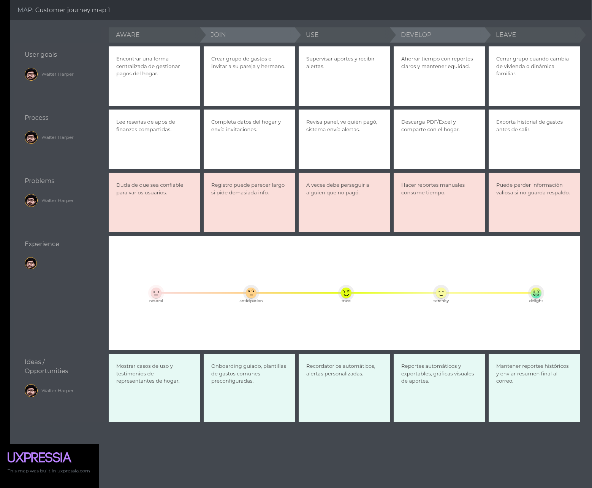

# Capítulo II: Requirements Elicitation & Analysis

## 2.1. Competidores

### 2.1.1. Análisis competitivo
Mediante un análisis comparativo, hemos organizado información clave de cada propuesta de valor. Esto nos ayudará a entender mejor en qué se diferencia nuestra solución y compararla con las de nuestros competidores.

| Competitive Analysis Landscape                                                                                                        |  |                                                                                                            |                                                                                                                                                                                                                      |                                                                                                                                                                                                                  |                                                                                                                                                                                                                             |
|:--------------------------------------------------------------------------------------------------------------------------------------| :---- |------------------------------------------------------------------------------------------------------------|:---------------------------------------------------------------------------------------------------------------------------------------------------------------------------------------------------------------------|:-----------------------------------------------------------------------------------------------------------------------------------------------------------------------------------------------------------------|:----------------------------------------------------------------------------------------------------------------------------------------------------------------------------------------------------------------------------|
| ¿Por qué llevar a cabo este análisis?                                                                                                 |  | Competidores Directos                                                                                      |                                                                                                                                                                                                                      |                                                                                                                                                                                                                  |                                                                                                                                                                                                                             |
| Con el fin de reconocer a los competidores y diseñar estrategias comerciales más sólidas que permitan enfrentarlos de manera efectiva |  | Harmonix                                                                                                   | Goodbudget                                                                                                                                                                                                           | Sesterce                                                                                                                                                                                                         | Honeydue                                                                                                                                                                                                                    |
|                                                                                                                                       |  |                                                                                                            |                                                                                                                                                                          |                                                                                                                                                                      |                                                                                                                                                                                 |
| Perfil                                                                                                                                | Overview | Aplicación de gestión financiera del hogar. Divide los gastos tomando en cuenta los ingresos.              | App de presupuestos basada en sobres digitales, donde los usuarios asignan manualmente sus ingresos a distintas categorías.                                                                                          | Aplicación para compartir gastos en grupos o parejas sin necesidad de registro                                                                                                                                   | Aplicación móvil que permite vincular cuentas bancarias, categorizar automáticamente los gastos, fijar recordatorios de pagos y tener visibilidad de los saldos de cada persona.                                            |
|                                                                                                                                       | Ventaja Competitiva | Reparto justo y automatizado según ingresos. Fomenta equidad y transparencia.                              | Fomenta disciplina financiera al obligar a planificar, ofrece colaboración en tiempo real y tiene una versión gratuita muy completa, lo que la hace accesible y educativa                                            | Destaca por su sencillez y anonimato, sin publicidad ni fricciones en el uso. Es rápida para organizar gastos compartidos y muy práctica frente a apps más complejas.                                            | Ofrece transparencia financiera con control de lo que se comparte, y combina sincronización bancaria con comunicación directa                                                                                               |
| Perfil de Marketing                                                                                                                   | Mercado Objetivo | Familias, parejas y roommates con economías compartidas y distintos niveles de ingreso.                    | Personas que buscan aprender a manejar sus finanzas personales con un método práctico y educativo, principalmente familias y parejas                                                                                 | Grupos pequeños como amigos, compañeros de piso o parejas que necesitan una solución rápida, privada y sin complicaciones para dividir gastos.                                                                   | Parejas jóvenes o adultas que desean transparencia en la gestión del dinero compartido, con enfoque en la confianza y la comunicación.                                                                                      |
|                                                                                                                                       | Estrategias de marketing | Enfocado en la equidad financiera y automatización. Redes sociales, foros y comunidades financieras.       | Se apoya en la reputación de su sistema de sobres digitales, en reseñas positivas en blogs financieros y en tiendas de apps                                                                                          | Basa su crecimiento en el boca a boca, en su facilidad de uso y en su propuesta de privacidad.                                                                                                                   | Utiliza la gratuidad como gancho principal, promueve la app en medios especializados en finanzas personales y estilo de vida                                                                                                |
| Perfil de Producto                                                                                                                    | Productos & Servicios | Plataforma para dividir gastos del hogar según ingresos. Incluye reportes, historial, metas y seguimiento. | App de presupuestos con sobres digitales, reportes de gastos y sincronización entre varios dispositivos                                                                                                              | App centrada en el registro y la gestión de gastos compartidos, con funciones como exportación de datos y reportes en gráficos simples.                                                                          | Aplicación móvil que combina vinculación bancaria, categorización automática de gastos, recordatorios y un chat interno para parejas                                                                                        |
|                                                                                                                                       | Precios & Costos | Freemium: versión gratuita con funciones básicas. Premium: reportes, metas, recordatorios, exportación.    | Freemium: versión gratuita con funciones limitadas. Premium: Sobre ilimitados y opciones avanzadas                                                                                                                   | Ofrece servicio gratuito sin costo alguno                                                                                                                                                                        | Ofrece servicio gratuito sin costo alguno                                                                                                                                                                                   |
|                                                                                                                                       | Canales de Distribución | App móvil (Google Play y App Store), redes sociales, foros, influencers de finanzas personales.            | Aplicaciones móviles (App Store y Google Play) y su versión web                                                                                                                                                      | Aplicaciones móviles (App Store y Google Play)                                                                                                                                                                   | Aplicaciones móviles (Google Play y App Store), además de difusión en medios digitales y redes sociales                                                                                                                     |
| Análisis SWOT                                                                                                                         | Fortalezas | Equidad proporcional basada en ingresos. Automatización. Foco en convivencia y economía compartida.        | Facilidad de uso, la sincronización en varios dispositivos y el enfoque educativo que fomenta la disciplina financiera                                                                                               | Facilidad y simplicidad en su uso, privacidad y protección de datos asegurada                                                                                                                                    | Gratuito, vinculación con miles de bancos, categorización automática de gastos e integración de un chat interno                                                                                                             |
|                                                                                                                                       | Debilidades | Proyecto en etapa inicial. Requiere datos sensibles (ingresos).                                            | Falta de integración bancaria y en que requiere un esfuerzo manual que puede desmotivar a algunos usuarios                                                                                                           | Limitada frente a competidores con opciones más avanzadas                                                                                                                                                        | Se centra exclusivamente en parejas                                                                                                                                                                                         |
|                                                                                                                                       | Oportunidades | Más hogares con economías compartidas. Creciente interés en equidad y herramientas de finanzas personales. | Posibilidad de ampliar su base de clientes en familias y usuarios que busquen planificación financiera más consciente                                                                                                | Capitalizar la creciente demanda de soluciones rápidas y ligeras para grupos de amigos o compañeros de piso                                                                                                      | Expandirse hacia más mercados y en ofrecer servicios premium con valor añadido                                                                                                                                              |
|                                                                                                                                       | Amenazas | Competencia consolidada. Preferencia por métodos tradicionales (Excel, notas, billeteras físicas).         | Apps más automatizadas y con mayor integración tecnológica que podrían desplazarla en el mercado.                                                                                                                    | Falta de diferenciación a largo plazo, ya que otros competidores podrían replicar fácilmente su propuesta minimalista.                                                                                           | Fuerte competencia de apps más generales como Splitwise o Goodbudget, que pueden abarcar un público más amplio.                                                                                                             |
### 2.1.2. Estrategias y tácticas frente a competidores
La estrategia general de Harmonix debe centrarse en reforzar su propuesta única de valor: la equidad automatizada según ingresos. Esta característica lo distingue de Goodbudget, que es más manual; de Sesterce, que es más limitado; y de Honeydue, que se enfoca solo en parejas. Comunicar de forma clara que Harmonix asegura justicia en los aportes de cada miembro del hogar es la base para competir.

En paralelo, debe posicionarse como una app más integral y flexible que los competidores. A diferencia de soluciones demasiado simples o muy nicho, Harmonix atiende tanto a familias como a roommates o parejas con diferentes ingresos, lo que le da un mercado más amplio. Su estrategia debe ser mostrarse como la alternativa más completa y adaptable para distintos tipos de convivencia.

Por último, en términos de marketing, conviene apostar por la educación y el contenido social: mostrar casos reales, testimonios y consejos de convivencia financiera. Esto no solo genera diferenciación frente a Goodbudget y Honeydue, sino que posiciona a Harmonix como una app que no solo divide gastos, sino que mejora la convivencia.
## 2.2. Entrevistas

### 2.2.1. Diseño de entrevistas

### 2.2.2. Registro de entrevistas

### 2.2.3. Análisis de entrevistas

## 2.3. Needfinding
En esta sección se detallan las principales necesidades detectadas en los segmentos objetivos de Harmonix. A través del análisis de sus contextos, se identificaron las dificultades que enfrentan al momento de repartir los gastos comunes del hogar, como la falta de equidad, transparencia y control en los pagos. Estas necesidades constituyen la base para orientar el diseño del producto, asegurando que las funcionalidades de Harmonix respondan directamente a los problemas reales de los usuarios y contribuyan a mejorar la convivencia en el hogar.

De esta manera, se presentan a continuación los hallazgos clave que guiarán el desarrollo de la solución
  
## Segmento #1: Personas del hogar

- **Dividir los gastos comunes** de forma justa y proporcional a los ingresos de cada miembro.  
- **Contar con visibilidad en tiempo real** sobre pagos realizados y saldos pendientes.  
- **Garantizar transparencia** para evitar malentendidos y conflictos dentro de la convivencia.  
- **Usar una aplicación sencilla** que organice los pagos del hogar.  

## Segmento #2: Representante del hogar

- **Gestionar y supervisar** todos los aportes desde un panel centralizado.  
- **Recibir alertas automáticas** y recordatorios de pagos pendientes.  
- **Asegurar contribuciones equitativas**, basadas en ingresos reales.  
- **Obtener reportes financieros claros** y automáticos para ahorrar tiempo en la planificación.  

### 2.3.1. User Personas

- Segmento #1: Personas del hogar

  

- Segmento #2: Representante del hogar

  

### 2.3.2. User Task Matrix.

- En esta sección se presenta la User Task Matrix, enfocada en los dos segmentos clave de Harmonix: miembros del hogar y representantes del hogar. Permite identificar sus tareas habituales y principales necesidades, facilitando la priorización de funcionalidades en el producto.

| **Persona**                 | **Tarea**                                  | **Importancia** | **Frecuencia** |
|------------------------------|--------------------------------------------|-----------------|----------------|
| **Ana (Miembro del hogar)** | Registrar su ingreso mensual                | Alta            | Baja           |
|                              | Revisar cuánto debe aportar según su ingreso | Alta            | Alta           |
|                              | Recibir recordatorios y confirmar pagos    | Media           | Media          |
|                              | Consultar historial de pagos               | Media           | Baja           |
| **Luis (Representante del hogar)** | Crear y gestionar gastos compartidos       | Alta            | Alta           |
|                              | Supervisar pagos realizados y pendientes   | Alta            | Alta           |
|                              | Enviar recordatorios automáticos           | Media           | Media          |
|                              | Generar reportes mensuales                 | Alta            | Baja           |

### 2.3.3. User Journey Mapping.

Aquí se presentan los User Journey Mapping para cada user persona. El recorrido refleja cómo los usuarios reciben notificaciones de nuevos gastos, consultan su historial, calculan su aporte proporcional y completan el pago, asegurando claridad y transparencia en el proceso.

- Segmento #1: Personas del hogar

  

- Segmento #2: Representante del hogar

  

### 2.3.4. Empathy Mapping.

El Empathy Mapping permite comprender a fondo qué piensan, sienten, ven, escuchan y hacen los usuarios, así como sus frustraciones y motivaciones. Este análisis facilita diseñar soluciones alineadas con sus verdaderas necesidades.

- Segmento #1: Personas del hogar
  

  

- Segmento #2: Representante del hogar

  

### 2.3.5. As-is Scenario Mapping.

El As-Is Scenario Mapping describe cómo los usuarios actualmente gestionan sus gastos compartidos sin Harmonix, mostrando sus acciones, pensamientos y emociones en cada paso. Esto ayuda a identificar los principales puntos de dolor que la plataforma busca resolver.

- Segmento #1: Personas del hogar
  

  

- Segmento #2: Representante del hogar

  

## 2.4. Ubiquitous Language.

| **Término en Inglés**          | **Término en Español**       | **Definición**                                                                                                                                           |
|--------------------------------|-----------------------------|----------------------------------------------------------------------------------------------------------------------------------------------------------|
| Household Representative      | Representante del hogar     | Usuario responsable de administrar el hogar dentro del sistema. Tiene permisos especiales para registrar nuevos miembros, ingresar gastos comunes y visualizar los aportes de todos. |
| Household Member              | Miembro del hogar           | Usuario que forma parte de un hogar registrado. Aporta según su capacidad económica y puede visualizar su historial de gastos y contribuciones.              |
| Income-Based Contribution     | Contribución basada en ingresos | Mecanismo mediante el cual se calcula la cantidad que debe aportar cada miembro del hogar, según el ingreso personal declarado. Busca que el reparto sea justo y equitativo. |
| Shared Expense                | Gasto compartido             | Gasto que afecta a todo el hogar y que debe dividirse proporcionalmente entre sus miembros (por ejemplo, alquiler, servicios, compras comunes).              |
| Spending Record               | Registro de gastos          | Documento digital o entrada dentro del sistema que detalla la fecha, el monto, la categoría y quién ingresó el gasto.                                       |
| Contribution Percentage       | Porcentaje de contribución  | Valor en porcentaje que representa la participación proporcional de cada miembro en los gastos comunes del hogar, calculado con base en su ingreso.         |
| Financial Overview            | Resumen financiero          | Vista general de los ingresos, aportes y gastos de un hogar, accesible para sus miembros y con mayor detalle para el representante.                       |
| Pending Contribution          | Contribución pendiente      | Monto que un miembro del hogar aún no ha cubierto con respecto a los gastos registrados. Puede generar recordatorios o alertas.                             |
| Expense Category              | Categoría de gasto          | Clasificación usada para organizar los gastos ingresados (por ejemplo: alimentación, servicios, alquiler, entretenimiento). Facilita el análisis y el seguimiento. |
| Adjustment Report             | Reporte de ajustes          | Documento generado automáticamente por el sistema cuando hay una variación significativa en los ingresos de un miembro, sugiriendo una nueva distribución de aportes. |
