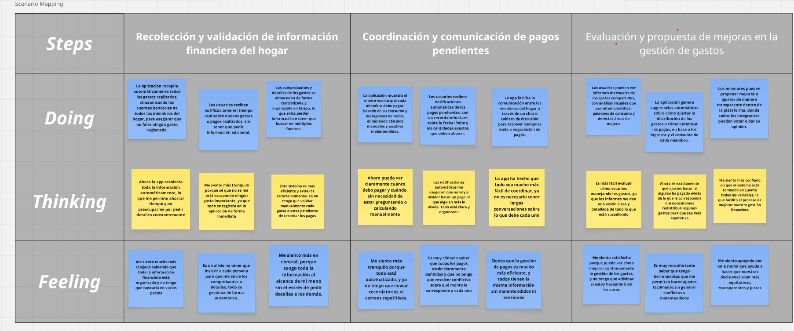
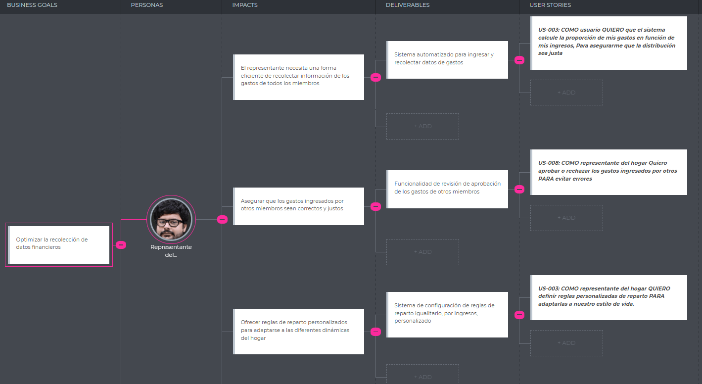

# Capítulo III: Requirements Specification
## 3.1. To-Be Scenario Mapping

- Segmento 1: Miembros del Hogar

  

- Segmento 2: Representante del Hogar

  

## 3.2. User Stories
## Epic

| EPIC ID | Nombre del Epic                  | Descripción |
|---------|----------------------------------|-------------|
| EP00    | Arquitectura Técnica y Documentación     | Como desarrollador, quiero diseñar y documentar la arquitectura del sistema para garantizar escalabilidad, mantenimiento y comunicación clara entre miembros del equipo |
| EP01    | Registro y Gestión de Perfil     | Como usuario, quiero registrarme y gestionar mi perfil de forma segura y personalizada, para acceder a Harmonix desde cualquier dispositivo. |
| EP02    | Panel del Representante del Hogar| Como representante del hogar, quiero gestionar y supervisar las finanzas del hogar de forma centralizada y transparente. |
| EP03    | Panel del Miembro del Hogar      | Como miembro del hogar, quiero registrar mis ingresos, ver mis responsabilidades y mantenerme al día con mis pagos. |
| EP04    | Gestión de Gastos Compartidos    | Como usuario, quiero registrar, clasificar y gestionar gastos para mantener el control financiero del hogar. |
| EP05    | Seguimiento y Recordatorios      | Como usuario, quiero recibir recordatorios y alertas automáticas para no olvidar mis responsabilidades financieras. |
| EP06    | Soporte y Comunidad              | Como usuario, quiero acceder a soporte técnico y a recursos para mejorar mi uso de la plataforma y resolver dudas. |
| EP07    | Exploración como Visitante       | Como visitante, quiero conocer la funcionalidad, beneficios y casos de uso de Harmonix desde la landing page para evaluar si la plataforma es útil para mi hogar antes de registrarme. |

### EP01 - Registro y Gestión de Perfil

| User Story ID | Título                          |
|---------------|----------------------------------|
| US01          | Registro de usuario              |
| US02          | Inicio de sesión seguro          |
| US03          | Edición de información personal  |
| US04          | Cierre de sesión desde todos los dispositivos |
| US05          | Configuración de notificaciones personales |
| TS01          | Implementar autenticación JWT |
| TS02          | Cifrar contraseñas en base de datos |
| TS03          | Validar roles de administrador y miembro en backend |
| TS04          | Implementar actualización de perfil a partir de API |  
| TS05          | Conectar formularios de registro y login del front-end con endpoints   |
| TS06          | Validar respuestas del backend en la gestión de perfil del usuario      |

### EP02 - Panel del Representante del Hogar

| User Story ID | Título                          |
|---------------|----------------------------------|
| US06          | Crear hogar                      |
| US07          | Aprobar gastos                   |
| US08          | Ajustar porcentajes de aportes   |
| US09          | Visualizar reportes mensuales    |
| US10          | Configurar métodos de pago aceptados |
| US36          | Manejar errores del servidor en vistas del representante               |

### EP03 - Panel del Miembro del Hogar

| User Story ID | Título                          |
|---------------|----------------------------------|
| US11          | Ingresar ingresos personales     |
| US12          | Ver monto a pagar                |
| US13          | Registrar pagos realizados       |
| US14          | Ver historial de pagos           |
| US15          | Ver distribución de gastos del hogar |
| US37          | Implementar manejo de estados de carga y éxito en el panel del miembro |

### EP04 - Gestión de Gastos Compartidos

| User Story ID | Título                          |
|---------------|----------------------------------|
| US16          | Registrar nuevo gasto            |
| US17          | Adjuntar comprobantes de gasto   |
| US18          | Clasificar gastos por categoría  |
| US19          | Comentar o justificar un gasto   |
| US20          | Visualizar gráficos de gastos    |
| TS07          | Validar que el gasto tiene adjunto al menos 1 comprobante |
| TS08          | Agregar API para filtrar gastos por rango de fecha |
| TS09          | Implementar actualización y eliminación de gastos |  
| TS10          | Verificar integración entre back-end de gastos y sus componentes en front-end |

### EP05 - Seguimiento y Recordatorios

| User Story ID | Título                          |
|---------------|----------------------------------|
| US21          | Recordatorios de pago            |
| US22          | Alertas de pagos pendientes      |
| US23          | Recordatorio de actualización de ingresos |
| US24          | Confirmación de aportes          |
| US25          | Notificación de cambios en el hogar |
| TS11          | API para programar recordatorios de pago |
| TS12          | Integrar cron job para envío de recordatorios |  
| TS13          | Conectar notificaciones del sistema con el backend                     |

### EP06 - Soporte y Comunidad

| User Story ID | Título                          |
|---------------|----------------------------------|
| US26          | Acceso a ayuda en línea          |
| US27          | Chat con soporte técnico         |
| US28          | Reportar un problema             |
| US29          | Sugerencias de mejora            |
| US30          | Foro comunitario                 |
| TS14          | API para dar seguimiento a reportes de problemas |
| TS15          | Implementar comentarios o respuestas en el foro |
| TS16          | Validar seguridad de comunicación entre frontend y backend (CORS, HTTPS) |
| TS17          | Probar funcionamiento completo en entorno de producción                |

### EP07 - Exploración como Visitante

| User Story ID | Título                          |
|---------------|----------------------------------|
  | US31          | Visualizar información general sobre Harmonix desde la landing page              |
| US32          | Conocer las funciones principales para representantes y miembros del hogar         |
| US33          | Explorar beneficios del sistema de aportes proporcionales  |
| US34          | Ver ejemplos o simulaciones de cómo funciona la plataforma |
| US35          | 	Acceder fácilmente al registro o login desde botones destacados |
| TS18          | Documentar los pasos para desplegar nuevas versiones                   |
| TS19          | Habilitar monitoreo básico del sistema desplegado (logs, uptime)       |

### USER STORIES

| **ID Épica** | **Épica**                         | **ID HU** | **Título HU**                                       | **Descripción HU**                                                                                                                                                                     | **Criterios de Aceptación**                                                                                                                                                                                                                                                                                                                                                                                                                                                                                                                                                                                                                                                                                              |
| ------------ | --------------------------------- | --------- | --------------------------------------------------- | -------------------------------------------------------------------------------------------------------------------------------------------------------------------------------------- | ------------------------------------------------------------------------------------------------------------------------------------------------------------------------------------------------------------------------------------------------------------------------------------------------------------------------------------------------------------------------------------------------------------------------------------------------------------------------------------------------------------------------------------------------------------------------------------------------------------------------------------------------------------------------------------------------------------------------ |
| EP01         | Registro y Gestión de Perfil      | US01      | Registro de usuario                                 | Como usuario de ambos segmentos, quiero registrarme en la plataforma para comenzar a usar Harmonix.                                                                                   | - **Escenario 1: Registro como miembro del hogar exitoso**  Dado que un usuario quiere registrarse como miembro del hogar,  Cuando proporciona todos los datos requeridos correctamente,  Entonces el sistema registra al usuario como miembro del hogar,  Y el usuario puede acceder a las funcionalidades correspondientes a ese rol.   - **Escenario 2: Registro como representante del hogar exitoso**  Dado que un usuario desea registrarse como representante del hogar,  Cuando proporciona todos los datos requeridos correctamente,  Entonces el sistema lo registra como representante del hogar,  Y el usuario puede acceder a las funcionalidades correspondientes a ese rol. |
| EP01         | Registro y Gestión de Perfil      | US02      | Inicio de sesión seguro                             | Como usuario registrado, quiero iniciar sesión de forma segura para acceder a mis datos personales.                                                                                    | - **Escenario 1: Inicio de sesión exitoso**  Dado que el usuario está registrado,  Cuando proporciona credenciales válidas,  Entonces el sistema le permite acceder a su cuenta.   - **Escenario 2: Inicio de sesión fallido por credenciales incorrectas**  Dado que el usuario intenta autenticarse,  Cuando las credenciales proporcionadas no son válidas,  Entonces el sistema rechaza el intento de acceso,  Y le indica que las credenciales no son válidas.                                                                                                                                                                                                                           |
| EP01         | Registro y Gestión de Perfil      | US03      | Edición de información personal                     | Como usuario de ambos segmentos, quiero editar mi información personal para mantenerla actualizada.                                                                                    | - **Escenario 1: Visualización de información personal**  Dado que el usuario ya está logueado,  Cuando accede a su información de perfil,  Entonces el sistema le muestra sus datos personales actuales en formato editable.   - **Escenario 2: Actualización de datos personales**  Dado que el usuario modifica su información personal,  Cuando envía los nuevos datos,  Entonces el sistema actualiza correctamente la información.                                                                                                                                                                                                                                                         |
| EP01         | Registro y Gestión de Perfil      | US04      | Cierre de sesión desde todos los dispositivos       | Como usuario de ambos segmentos, quiero cerrar sesión desde todos mis dispositivos para mayor seguridad.                                                                               | - **Escenario 1: Cierre de sesión en todos los dispositivos**  Dado que el usuario ha iniciado sesión en su cuenta,  Cuando solicita cerrar sesión en todos los dispositivos,  Entonces el sistema invalida todas las sesiones activas asociadas a su cuenta.                                                                                                                                                                                                                                                                                                                                                                                                                                                   |
| EP01         | Registro y Gestión de Perfil      | US05      | Configuración de notificaciones personales          | Como usuario de ambos segmentos, quiero configurar mis notificaciones para recibir alertas relevantes.                                                                                 | - **Escenario 1: Visualización de opciones de notificación**  Dado que el usuario accede a su configuración de perfil,  Cuando solicita ver las opciones de notificación,  Entonces el sistema muestra las opciones disponibles para activar o desactivar alertas.   - **Escenario 2: Aplicación de configuración de notificaciones**  Dado que el usuario selecciona sus preferencias de notificación,  Cuando envía la configuración,  Entonces el sistema guarda las preferencias y las aplica para futuras alertas.                                                                                                                                                                          |
| EP01         | Registro y Gestión de Perfil      | TS01      | Implementar autenticación JWT                       | Como desarrollador, quiero que el inicio de sesión implemente autenticación JWT para mayor seguridad en el manejo de sesiones.                                                         | - **Escenario 1: Generación del JWT**  Dado que el usuario proporciona credenciales correctas,  Cuando se autentica,  Entonces el backend genera y responde con un JWT válido.   - **Escenario 2: Validación del JWT**  Dado que el JWT se adjunta en el encabezado de la solicitud,  Cuando el backend verifica el token,  Entonces autoriza el acceso si el token es válido.                                                                                                                                                                                                                                                                                                                   |
| EP01         | Registro y Gestión de Perfil      | TS02      | Cifrar contraseñas en base de datos                 | Como desarrollador, quiero que las contraseñas de los usuarios sean encriptadas antes de guardarlas en la base de datos para garantizar la seguridad.                                  | - **Escenario 1: Almacenar contraseña cifrada**  Dado que la contraseña llega en texto plano,  Cuando el backend lo encripta,  Entonces se almacena en la base de datos de forma cifrada.   - **Escenario 2: Validar contraseña cifrada durante autenticación**  Dado que la contraseña en la base de datos está cifrada,  Cuando el backend verifica credenciales,  Entonces primero hace el hash de la contraseña ingresada y lo compara con el guardado.                                                                                                                                                                                                                                      |
| EP01         | Registro y Gestión de Perfil      | TS03      | Validar roles de administrador y miembro en backend | Como desarrollador, quiero que ciertos endpoints sean usados solo por determinados roles para asegurar que solo los usuarios autorizados puedan ejecutar determinadas acciones         | - **Escenario 1: Acceso permitido a endpoint por rol administrador**  Dado que el rol incluido en el JWT es administrador,  Cuando invoque un endpoint de administrador,  Entonces el backend permitirá el acceso.   - **Escenario 2: Acceso denegado a endpoint por rol no autorizado**  Dado que el rol incluido en el JWT es miembro,  Cuando invoque un endpoint de administrador,  Entonces el backend rechazará la solicitud con 403 (Forbidden).                                                                                                                                                                                                                                          |
| EP01         | Registro y Gestión de Perfil      | TS04      | Implementar actualización de perfil a partir de API | Como desarrollador, quiero implementar la actualización del perfil de usuario mediante una API para permitir que los usuarios modifiquen su información de manera segura y controlada. | - **Escenario 1: Actualización exitosa**  Dado que el token es válido,  Cuando el usuario envía nuevos datos,  Entonces el backend actualiza el perfil en la base de datos.   - **Escenario 2: Solicitud sin autenticación válida**  Dado que el token es vencido o inexistente,  Cuando el backend recibe la solicitud,  Entonces responde con 401 (Unauthorized).                                                                                                                                                                                                                                                                                                                              |
| EP01         | Registro y Gestión de Perfil      | TS05      | Conectar formularios con endpoints                  | Como desarrollador, quiero conectar los formularios de registro y login con los endpoints del backend para que funcionen correctamente.                                                | - **Escenario 1: Envío de datos de registro al backend**  Dado que el usuario completa el formulario de registro,  Cuando envía el formulario,  Entonces el formulario envía la información al endpoint correspondiente.   - **Escenario 2: Autenticación de usuario mediante el backend**  Dado que el usuario ingresa sus credenciales,  Cuando el frontend las envía al endpoint de autenticación,  Entonces el backend valida las credenciales.                                                                                                                                                                                                                                              |
| EP01         | Registro y Gestión de Perfil      | TS06      | Validar respuestas del backend                      | Como desarrollador, quiero validar las respuestas del backend para mostrar mensajes adecuados al usuario.                                                                              | - **Escenario 1: Error en el registro**  Dado que haya un error del backend al procesar el registro,  Cuando el usuario envíe un formulario,  Entonces se mostrará un mensaje de error específico.   - **Escenario 2: Fallo en el inicio de sesión**  Dado que el backend retorne un 401 Unauthorized,  Cuando se intente iniciar sesión,  Entonces el frontend indicará que las credenciales son inválidas.                                                                                                                                                                                                                                                                                     |
| EP02         | Panel del Representante del Hogar | US06      | Crear hogar                                         | Como representante del hogar, quiero crear un hogar en la app para empezar a gestionar sus finanzas.                                                                                   | - **Escenario 1: Acceso al proceso de creación de hogar**  Dado que el usuario ha iniciado sesión como representante del hogar,  Cuando accede a la opción de creación de hogar,  Entonces podrá ingresar un nombre e ID para el hogar.   - **Escenario 2: Creación exitosa del hogar**  Dado que el usuario completa los campos requeridos,  Cuando envía la solicitud de creación,  Entonces se crea el hogar y se muestra en su panel.                                                                                                                                                                                                                                                        |
| EP02         | Panel del Representante del Hogar | US07      | Aprobar gastos                                      | Como representante, quiero aprobar gastos para tener control sobre lo que se gasta en el hogar.                                                                                        | - **Escenario 1: Listado de gastos pendientes**  Dado que haya gastos sin aprobar,  Cuando el representante acceda al panel,  Entonces verá una lista de gastos para revisar.   - **Escenario 2: Aprobación de un gasto**  Dado que el representante selecciona un gasto,  Cuando confirme su aprobación,  Entonces el gasto pasará a estado "Aprobado".                                                                                                                                                                                                                                                                                                                                         |
| EP02         | Panel del Representante del Hogar | US08      | Ajustar porcentajes de aportes                      | Como representante, quiero modificar los porcentajes de contribución de cada miembro según sus ingresos.                                                                               | - **Escenario 1: Acceso a la configuración de aportes**  Dado que el representante está autenticado y accede al módulo de gestión del hogar,  Cuando accede a la sección de configuración de aportes,  Entonces verá una lista editable de miembros.   - **Escenario 2: Modificación y guardado de aportes**  Dado que el representante ha realizado ajustes en los porcentajes,  Cuando envía los nuevos valores,  Entonces se actualizarán los porcentajes automáticamente.                                                                                                                                                                                                                    |
| EP02         | Panel del Representante del Hogar | US09      | Visualizar reportes mensuales                       | Como representante, quiero ver reportes de ingresos y gastos mensuales para tomar decisiones informadas sobre la economía del hogar.                                                   | - **Escenario 1: Acceso a reportes mensuales**  Dado que el representante esté en su dashboard,  Cuando accede a la sección de reportes mensuales,  Entonces se mostrarán gráficos y resúmenes.   - **Escenario 2: Descarga de reporte**  Dado que el representante ha visualizado un reporte,  Cuando solicita su descarga,  Entonces el sistema genera un archivo PDF y se descargará el informe correspondiente.                                                                                                                                                                                                                                                                              |
| EP02         | Panel del Representante del Hogar | US10      | Configurar métodos de pago aceptados                | Como representante, quiero configurar qué métodos de pago están habilitados en el hogar.                                                                                               | - **Escenario 1: Ver métodos disponibles**  Dado que el usuario acceda a configuración,  Cuando seleccione "Métodos de pago",  Entonces verá una lista de métodos disponibles.   - **Escenario 2: Activar métodos**  Dado que seleccione métodos específicos,  Cuando presione “Guardar”,  Entonces esos métodos quedarán habilitados para el hogar.                                                                                                                                                                                                                                                                                                                                             |

| **ID Épica** | **Épica**                         | **ID HU** | **Título HU**                                             | **Descripción HU**                                                                                                     | **Criterios de Aceptación**                                                                                                                                                                                                                                                                                                                                                                                                                                                                                                                         |
| ------------ | --------------------------------- | --------- | --------------------------------------------------------- | ---------------------------------------------------------------------------------------------------------------------- | --------------------------------------------------------------------------------------------------------------------------------------------------------------------------------------------------------------------------------------------------------------------------------------------------------------------------------------------------------------------------------------------------------------------------------------------------------------------------------------------------------------------------------------------------- |
| EP02         | Gestión Personal de Finanzas      | US14      | Ver historial de pagos                                    | Como miembro del hogar, quiero consultar un historial de todos mis pagos anteriores para verificar mis contribuciones. | - **Escenario 1: Acceso al historial**  Dado que el usuario quiere ver sus aportes anteriores,  Cuando acceda a la sección “Historial de pagos” desde su panel,  Entonces verá una lista ordenada cronológicamente con fechas, montos, conceptos y comprobantes de cada pago realizado.   - **Escenario 2: Filtro por periodo**  Dado que el usuario desea consultar un periodo específico,  Cuando seleccione un mes o rango de fechas,  Entonces el sistema mostrará únicamente los pagos correspondientes a ese periodo. |
| EP02         | Panel del Representante del Hogar | US36      | Manejar errores del servidor                              | Como representante, quiero que el sistema maneje errores del servidor de forma clara para entender qué ocurre.         | - **Escenario 1: Error al cargar gastos**  Dado que haya una falla en el endpoint de gastos,  Cuando se intente acceder al listado,  Entonces se mostrará un mensaje "No se pudo cargar los datos".                                                                                                                                                                                                                                                                                                                                        |
| EP03         | Panel del Miembro del Hogar       | US11      | Ingresar ingresos personales                              | Como miembro del hogar, quiero registrar mis ingresos para que el sistema calcule mi aporte.                           | - **Escenario 1: Acceso al formulario de ingresos**  Dado que el miembro haya iniciado sesión,  Cuando seleccione "Ingresos",  Entonces se mostrará el formulario de ingreso de datos.   - **Escenario 2: Confirmación de ingreso**  Dado que complete los datos,  Cuando presione "Guardar",  Entonces su ingreso quedará registrado en el sistema.                                                                                                                                                                        |
| EP03         | Panel del Miembro del Hogar       | US12      | Ver monto a pagar                                         | Como miembro del hogar, quiero visualizar cuánto debo aportar al hogar basado en mis ingresos.                         | - **Escenario 1: Acceso al panel de pagos**  Dado que el usuario haya ingresado sus ingresos,  Cuando acceda a "Mis aportes",  Entonces verá el monto que le corresponde pagar este mes.                                                                                                                                                                                                                                                                                                                                                   |
| EP03         | Panel del Miembro del Hogar       | US13      | Registrar pagos realizados                                | Como miembro del hogar, quiero registrar que realicé un pago para que el sistema lleve un seguimiento.                 | - **Escenario 1: Ingreso de pago**  Dado que el miembro haya realizado un pago,  Cuando acceda a "Registrar pago",  Entonces podrá indicar el monto, la fecha y el método usado.   - **Escenario 2: Confirmación**  Dado que ingrese los datos,  Cuando presione “Guardar”,  Entonces el pago quedará registrado correctamente.                                                                                                                                                                                             |
| EP03         | Gestión Personal de Finanzas      | US15      | Ver historial de pagos                                    | Como miembro del hogar, quiero consultar un historial de todos mis pagos anteriores para verificar mis contribuciones. | - **Escenario 1: Acceso al historial**  Dado que el usuario quiere ver sus aportes anteriores,  Cuando acceda a la sección “Historial de pagos” desde su panel,  Entonces verá una lista ordenada cronológicamente con fechas, montos, conceptos y comprobantes de cada pago realizado.   - **Escenario 2: Filtro por periodo**  Dado que el usuario desea consultar un periodo específico,  Cuando seleccione un mes o rango de fechas,  Entonces el sistema mostrará únicamente los pagos correspondientes a ese periodo. |
| EP03         | Panel del Miembro del Hogar       | US37      | Manejo de estados de carga y éxito                        | Como miembro del hogar, quiero ver indicadores de carga o éxito al registrar mis datos para mejorar la experiencia.    | - **Escenario 1: Indicador de carga**  Dado que se envían datos al backend,  Cuando aún no se recibe respuesta,  Entonces se mostrará un spinner de carga.   - **Escenario 2: Registro exitoso**  Dado que se guarde correctamente,  Cuando el servidor responda,  Entonces se muestra un mensaje de éxito.                                                                                                                                                                                                                 |
| EP04         | Gestión de Gastos Compartidos     | US16      | Registrar nuevo gasto                                     | Como usuario, quiero registrar un nuevo gasto para mantener actualizados los movimientos financieros.                  | - **Escenario 1: Acceso al formulario**  Dado que el usuario haya iniciado sesión,  Cuando acceda a "Registrar gasto",  Entonces verá un formulario con campos de monto, categoría y descripción.   - **Escenario 2: Guardado del gasto**  Dado que complete el formulario,  Cuando presione “Guardar”,  Entonces el nuevo gasto se almacenará en el sistema.                                                                                                                                                               |
| EP04         | Gestión de Gastos Compartidos     | US17      | Adjuntar comprobantes de gasto                            | Como usuario, quiero subir comprobantes para respaldar los gastos registrados.                                         | - **Escenario 1: Carga de comprobante**  Dado que el usuario registre un gasto,  Cuando presione “Adjuntar archivo”,  Entonces podrá subir una imagen o PDF como comprobante.   - **Escenario 2: Visualización**  Dado que se haya adjuntado un comprobante,  Cuando acceda al gasto,  Entonces podrá ver o descargar el archivo.                                                                                                                                                                                           |
| EP04         | Gestión de Gastos Compartidos     | US18      | Clasificar gastos por categoría                           | Como usuario, quiero categorizar los gastos para facilitar su análisis y visualización.                                | - **Escenario 1: Selección de categoría**  Dado que el usuario registre un gasto,  Cuando acceda a la lista de categorías,  Entonces podrá seleccionar entre alimentación, servicios, mantenimiento, etc.   - **Escenario 2: Filtro**  Dado que seleccione una categoría,  Cuando aplique el filtro,  Entonces se mostrarán solo los gastos correspondientes.                                                                                                                                                               |
| EP04         | Gestión de Gastos Compartidos     | US19      | Comentar o justificar un gasto                            | Como usuario, quiero añadir comentarios para explicar el motivo de un gasto compartido.                                | - **Escenario 1: Comentario en gasto**  Dado que el usuario haya registrado un gasto,  Cuando seleccione “Añadir comentario”,  Entonces podrá escribir y guardar una nota explicativa visible a los miembros del hogar.                                                                                                                                                                                                                                                                                                                    |
| EP04         | Gestión de Gastos Compartidos     | US20      | Visualizar gráficos de gastos                             | Como usuario, quiero ver gráficos de gastos para entender en qué se gasta más.                                         | - **Escenario 1: Acceso a visualizaciones**  Dado que el usuario esté en el panel de gastos,  Cuando acceda a “Ver gráficos”,  Entonces podrá ver gráficos circulares o de barras agrupados por categoría, fecha o usuario.                                                                                                                                                                                                                                                                                                                |
| EP04         | Gestión de Gastos Compartidos     | TS07      | Validar que el gasto tenga adjunto al menos 1 comprobante | Como desarrollador, quiero que cada gasto tenga al menos 1 comprobante adjunto antes de guardarlo.                     | - **Escenario 1: Gasto sin adjunto**  Dado que el gasto no tiene comprobante,  Cuando el backend recibe la solicitud,  Entonces responde con error 400. - **Escenario 2: Gasto con adjunto**  Dado que el gasto tiene comprobante,  Cuando el backend grava en la base de datos,  Entonces lo acepta.                                                                                                                                                                                                                          |
| EP04         | Gestión de Gastos Compartidos     | TS08      | Agregar API para filtrar gastos por rango de fecha        | Como desarrollador, quiero filtrar gastos según rango de fecha.                                                        | - **Escenario 1: Filtrar con rango válido**  Dado que envío inicio y fin,  Cuando el backend filtra,  Entonces responde con gastos en ese rango. - **Escenario 2: Rango sin resultados**  Dado que el rango no tiene gastos,  Cuando el backend consulta,  Entonces responde con una lista vacía.                                                                                                                                                                                                                              |
| EP04         | Gestión de Gastos Compartidos     | TS09      | Implementar actualización y eliminación de gastos         | Como desarrollador, quiero poder actualizar o eliminar gastos.                                                         | - **Escenario 1: Actualización**  Dado que el gasto existe,  Cuando el administrador envía nuevos datos,  Entonces el backend actualiza el registro. - **Escenario 2: Eliminado**  Dado que el administrador solicita borrar,  Cuando el backend elimina el gasto,  Entonces deja de aparecer en futuros reportes.                                                                                                                                                                                                             |
| EP04         | Gestión de Gastos Compartidos     | TS10      | Verificar integración de gastos                           | Como desarrollador, quiero verificar que el backend de gastos esté correctamente conectado al frontend.                | - **Escenario 1: Mostrar lista de gastos**  Dado que haya gastos registrados,  Cuando el usuario acceda a la sección de gastos,  Entonces se mostrará la información proveniente del backend.   - **Escenario 2: Agregar gasto**  Dado que se complete el formulario,  Cuando se presione "Guardar",  Entonces se guardará mediante la API y se actualizará la vista.                                                                                                                                                       |
| EP05         | Seguimiento y Recordatorios       | US21      | Recordatorios de pago                                     | Como usuario, quiero recibir recordatorios automáticos de pago para no retrasarme en mis aportes.                      | - **Escenario 1: Activación del recordatorio**  Dado que el usuario tenga una fecha límite de pago,  Cuando se acerque esa fecha,  Entonces recibirá una notificación automática por correo o en la app.   - **Escenario 2: Configuración**  Dado que acceda a ajustes,  Cuando edite preferencias,  Entonces podrá activar o desactivar los recordatorios.                                                                                                                                                                 |
| EP05         | Seguimiento y Recordatorios       | US22      | Alertas de pagos pendientes                               | Como usuario, quiero ser alertado si tengo pagos atrasados para regularizar mi situación.                              | - **Escenario 1: Detección automática**  Dado que el usuario no haya pagado después de la fecha límite,  Cuando acceda al sistema,  Entonces verá una alerta destacada en su panel.   - **Escenario 2: Alerta múltiple**  Dado que haya varios pagos pendientes,  Cuando abra la alerta,  Entonces podrá ver el detalle de cada uno.                                                                                                                                                                                        |
| EP05         | Seguimiento y Recordatorios       | US23      | Recordatorio de actualización de ingresos                 | Como usuario, quiero ser recordado de actualizar mis ingresos para mantener la equidad del sistema.                    | - **Escenario 1: Periodicidad**  Dado que haya pasado un mes sin actualización,  Cuando el usuario inicie sesión,  Entonces verá un mensaje solicitando revisar su ingreso.   - **Escenario 2: Confirmación**  Dado que actualice el ingreso,  Cuando guarde los cambios,  Entonces se reiniciará el periodo de espera.                                                                                                                                                                                                     |
| EP05         | Seguimiento y Recordatorios       | US24      | Confirmación de aportes                                   | Como usuario, quiero recibir confirmación cada vez que realizo un aporte para mayor seguridad.                         | - **Escenario 1: Notificación inmediata**  Dado que el usuario registre un pago,  Cuando el sistema lo procese,  Entonces recibirá una confirmación por correo o notificación dentro de la app.   - **Escenario 2: Registro visible**  Dado que quiera revisar sus confirmaciones,  Cuando acceda al historial,  Entonces verá las confirmaciones pasadas.                                                                                                                                                                  |
| EP05         | Seguimiento y Recordatorios       | US25      | Notificación de cambios en el hogar                       | Como usuario, quiero ser notificado si hay cambios en el hogar para estar informado.                                   | - **Escenario 1: Nuevo miembro**  Dado que un nuevo miembro se una,  Cuando sea aprobado por el representante,  Entonces se notificará a todos los miembros.   - **Escenario 2: Cambios administrativos**  Dado que el representante edite los porcentajes de aporte,  Cuando se guarde el cambio,  Entonces se notificará a los afectados.                                                                                                                                                                                 |
| EP05         | Seguimiento y Recordatorios       | TS11      | API para programar recordatorios de pago                  | Como desarrollador, quiero dar de alta recordatorios específicos de pago en el backend.                                | - **Escenario 1: Crear recordatorio**  Dado que el administrador proporciona fecha y monto,  Cuando el backend graba el recordatorio,  Entonces el recordatorio queda incluido en la base de datos. - **Escenario 2: Listar recordatorios**  Dado que el administrador consulta,  Cuando el backend responde,  Entonces proporciona la lista de recordatorios pendientes.                                                                                                                                                      |

## 3.3. Impact Mapping

### Segmento 1: Miembros del hogar

  

### Segmento 2: Representante del hogar

  

## 3.4. Product Backlog

| Prioridad | User Story ID | Título HU                                                 | Story Points |
| --------- | ------------- | --------------------------------------------------------- | ------------ |
| Alta      | US01          | Registro de usuario                                       | 8            |
| Alta      | US02          | Inicio de sesión seguro                                   | 5            |
| Alta      | TS01          | Implementar autenticación JWT                             | 8            |
| Alta      | TS02          | Cifrar contraseñas en base de datos                       | 5            |
| Alta      | TS03          | Validar roles de administrador y miembro en backend       | 8            |
| Alta      | TS05          | Conectar formularios con endpoints                        | 5            |
| Alta      | TS06          | Validar respuestas del backend                            | 3            |
| Media     | US03          | Edición de información personal                           | 5            |
| Media     | US04          | Cierre de sesión desde todos los dispositivos             | 5            |
| Media     | US05          | Configuración de notificaciones personales                | 5            |
| Media     | TS04          | Implementar actualización de perfil a partir de API       | 5            |
| Alta      | US06          | Crear hogar                                               | 8            |
| Alta      | US07          | Aprobar gastos                                            | 5            |
| Alta      | US08          | Ajustar porcentajes de aportes                            | 8            |
| Alta      | US09          | Visualizar reportes mensuales                             | 8            |
| Media     | US10          | Configurar métodos de pago aceptados                      | 5            |
| Media     | US14          | Ver historial de pagos (representante)                    | 5            |
| Media     | US36          | Manejar errores del servidor                              | 3            |
| Alta      | US11          | Ingresar ingresos personales                              | 5            |
| Alta      | US12          | Ver monto a pagar                                         | 5            |
| Alta      | US13          | Registrar pagos realizados                                | 5            |
| Media     | US15          | Ver historial de pagos (miembro)                          | 5            |
| Media     | US37          | Manejo de estados de carga y éxito                        | 3            |
| Alta      | US16          | Registrar nuevo gasto                                     | 8            |
| Media     | US17          | Adjuntar comprobantes de gasto                            | 5            |
| Media     | US18          | Clasificar gastos por categoría                           | 5            |
| Media     | US19          | Comentar o justificar un gasto                            | 3            |
| Media     | US20          | Visualizar gráficos de gastos                             | 8            |
| Alta      | TS07          | Validar que el gasto tenga adjunto al menos 1 comprobante | 5            |
| Media     | TS08          | Agregar API para filtrar gastos por rango de fecha        | 5            |
| Media     | TS09          | Implementar actualización y eliminación de gastos         | 8            |
| Media     | TS10          | Verificar integración de gastos                           | 5            |
| Media     | US21          | Recordatorios de pago                                     | 5            |
| Media     | US22          | Alertas de pagos pendientes                               | 5            |
| Baja      | US23          | Recordatorio de actualización de ingresos                 | 3            |
| Baja      | US24          | Confirmación de aportes                                   | 3            |
| Baja      | US25          | Notificación de cambios en el hogar                       | 3            |
| Media     | TS11          | API para programar recordatorios de pago                  | 5            |
