# Capítulo IV: Product Design
## 4.1. Style Guidelines.

Harmonix es una plataforma digital orientada a la simplificación y el equilibrio en la gestión financiera del hogar. Mediante un sistema de cálculo proporcional basado en los ingresos, facilita la distribución justa de los gastos, promoviendo la transparencia, la colaboración y el control compartido. Su interfaz, de carácter moderno y minimalista, responde a las demandas de los hogares contemporáneos que requieren soluciones eficientes, accesibles y sostenibles en el tiempo.

La presente sección consolida una guía integral de estilo, en la cual se definen los elementos visuales y de diseño que sustentan la identidad de Harmonix. Se incorporan tipografías, paleta cromática —con predominio de negro, blanco y azul celeste—, íconos y componentes de interfaz, con el objetivo de asegurar una representación visual coherente, sobria y alineada con la visión tecnológica y funcional de la marca.

La estructura de las guías de estilo se organiza en tres bloques principales: General Style Guidelines, Web Style Guidelines y Mobile Style Guidelines. Esta división garantiza una experiencia uniforme, accesible y consistente en todos los dispositivos, fortaleciendo la navegabilidad, la confianza del usuario y la comunicación visual de los valores fundamentales de la plataforma: claridad, equilibrio y control.

### 4.1.1. General Style Guidelines.

Harmonix transmite una identidad visual moderna, clara y funcional, alineada con sus valores de transparencia, colaboración y equidad financiera. La marca se apoya en una base cromática oscura para reflejar profesionalismo y seriedad, mientras que el azul celeste se utiliza como color de acento para resaltar interacciones relevantes, aportando frescura y un carácter tecnológico.

El logotipo, de diseño simple y distintivo, asegura un reconocimiento inmediato en diferentes dispositivos y formatos. La tipografía, de estilo limpio y legible, contribuye a una navegación fluida y una experiencia coherente en todas las interfaces.

En conjunto, la estética de Harmonix busca transmitir control y confianza, reforzando el propósito de la plataforma: facilitar la organización financiera del hogar de manera justa, práctica y accesible.

#### Tipografía

La tipografía oficial de Harmonix es **Roboto**, seleccionada por su estilo moderno, alta legibilidad en fondos oscuros y flexibilidad en interfaces digitales. Se emplean las variantes Regular, Medium, Bold y Black para establecer jerarquías visuales claras.

- `h1` → 3em (48px)  
- `h2` → 2em (32px)  
- `h3` → 1em (16px)  
- **Texto general** → 1em (16px)

Esta estructura tipográfica garantiza consistencia visual y facilidad de lectura en todos los dispositivos.

#### Colores

La identidad visual se apoya en un esquema cromático que combina **sobriedad y modernidad**.  

- **Color base (fondo principal)**: `#000000` (negro)  
- **Primario**: `#1565C0` (azul oscuro)  
- **Secundario**: `#42A5F5` (celeste)  
- **Apoyo**: `#E3F2FD` (azul claro)  
- **Texto**: `#FFFFFF` (blanco)  

  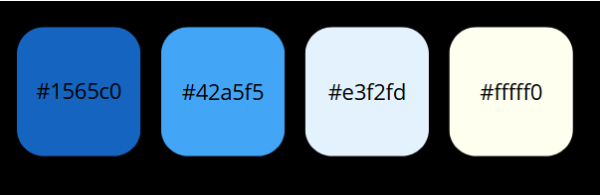

  

Esta combinación de colores refuerza la **claridad, accesibilidad y coherencia visual** de la plataforma.  

#### Espaciado  

La estructura de espaciado está diseñada para mantener un **orden visual armónico**:  

- **Botones**: `padding 1rem` (vertical), `2rem` (horizontal)  
- **Texto**: `margin-bottom: 1rem` en `h1`, `h2`, `p`, etc.  
- **Elementos**: `margin-bottom: 1.5rem` en tarjetas y componentes similares  
- **Secciones**: `padding: 2rem` en contenedores (ajustable a `6rem`)  

#### Iconografía  

Harmonix utiliza **Bootstrap Icons**, garantizando consistencia, escalabilidad y compatibilidad en diferentes resoluciones.  

**Íconos principales**  
- `bi-house-door-fill` → Inicio  
- `bi-info-circle-fill` → Información  
- `bi-gear-fill` → Servicios  
- `bi-question-circle-fill` → Guía de uso  
- `bi-currency-dollar` → Planes  
- `bi-chat-left-quote-fill` → Opiniones  
- `bi-envelope-fill` → Contacto  

**Íconos en servicios**  
- `bi-calculator` → Cálculo proporcional  
- `bi-pie-chart-fill` → Seguimiento de gastos  
- `bi-people-fill` → Colaboración  

**Íconos en flujo de uso**  
- `bi-person-plus-fill` → Registro  
- `bi-house-fill` → Crear hogar  
- `bi-cash-coin` → Aportes  
- `bi-bar-chart-fill` → Control financiero  

**Íconos en footer**
- Redes sociales: `bi-facebook`, `bi-instagram`, `bi-twitter`, `bi-linkedin`  
- Contacto: `bi-envelope-fill`  

El uso uniforme de iconos asegura **coherencia estética y usabilidad**.  

#### Tono de Comunicación y Lenguaje Aplicado

El tono de Harmonix es **claro, inclusivo y accesible**, diseñado para generar confianza y facilitar la adopción de la plataforma.  

**Características principales**:  
- **Amigable y cercano**: lenguaje directo y motivador  
- **Claridad funcional**: roles diferenciados  
  - **Representante**: crea y gestiona el hogar  
  - **Miembro**: se une mediante ID  
- **Proceso simplificado**: instrucciones breves y fáciles de seguir  
- **Empatía**: reconoce y aborda los desafíos de la gestión financiera en el hogar  
- **Acción inmediata**: llamadas directas como *“Crea tu hogar”* o *“Ingresa a tu hogar”*  
- **Accesibilidad**: redacción libre de tecnicismos innecesarios  

Este tono refuerza la **transparencia y cercanía** de la marca, asegurando que cada usuario se sienta acompañado en el control de sus finanzas compartidas.  

### 4.1.2. Web Style Guidelines.

Se utilizó la tendencia web de **funcionalismo minimalista** con un esquema de colores oscuros predominante (negro y gris oscuro) como fondo. Esto proporciona una experiencia visual suave, favoreciendo el contraste con elementos interactivos y textos claros.

  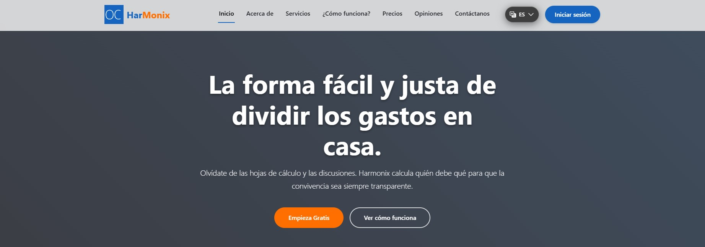

Para enriquecer la estética y agregar dinamismo:

- Se emplearon íconos blancos con moderación.  
- El diseño se mantiene minimalista pero atractivo.  
- Los íconos, claramente visibles sobre el fondo oscuro, refuerzan una experiencia visual limpia y ordenada.

Este equilibrio entre funcionalidad y diseño moderno garantiza una interfaz eficaz y atractiva.

  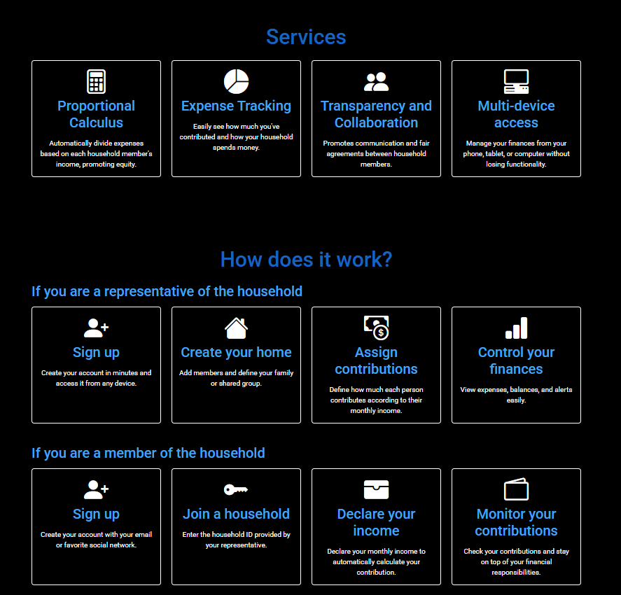

## 4.2. Information Architecture.
### 4.2.1. Organization Systems  

En la plataforma **Harmonix**, se aplican diferentes sistemas de organización del contenido para optimizar la **accesibilidad** y la **experiencia de usuario**, en función del tipo de información presentada.  
Estos sistemas garantizan una navegación intuitiva, clara y eficiente.  

#### Organización Visual del Contenido  

**Jerárquica (Visual Hierarchy):**  
Se utiliza en secciones que requieren una estructura clara de importancia y relevancia, como formularios de creación de hogar o asignación de aportes.  
Se aplican **variaciones tipográficas** y un **orden lógico de presentación** para resaltar los elementos más relevantes (botones de acción o campos requeridos), guiando al usuario de manera natural a través del flujo de la aplicación.  

**Secuencial (Step-by-Step):**  
En procesos que deben completarse paso a paso —como el registro de usuario o la creación de un hogar— se aplica un enfoque secuencial.  
Cada paso se presenta en una pantalla específica, lo que permite a los usuarios comprender y completar cada acción antes de avanzar, reduciendo errores y confusión.  

#### Esquemas de Categorización de Contenido  

**Por Audiencia (User Groups):**  
La plataforma distingue entre **representantes de hogar** y **miembros de hogar**:  
- **Representantes** → gestionan aportes y creación de hogar.  
- **Miembros** → consultan sus aportes y realizan seguimiento de gastos.  

Esta categorización asegura que cada tipo de usuario acceda únicamente a las funcionalidades que necesita, reforzando la simplicidad y eficiencia de la experiencia.  

**Por Tópicos:**  
En las secciones de ayuda y soporte, el contenido se organiza por categorías temáticas:  
- *Preguntas Frecuentes*  
- *Política de Privacidad*  
- *Centro de Ayuda*  

Esto facilita la búsqueda de información relevante y la resolución autónoma de dudas por parte del usuario.  

#### Implementación en la Interfaz  

La aplicación de estos sistemas se refleja en el diseño mediante:  
- **Navegación clara y estructurada** con menús desplegables.  
- **Botones con texto explicativo** que guían acciones.  
- **Flujos visibles paso a paso** en procesos clave.  
- **Íconos y etiquetas textuales** que refuerzan la comprensión del contenido.  

De esta manera, Harmonix asegura una experiencia de navegación **intuitiva, eficiente y adaptada** a cada perfil de usuario, manteniendo coherencia con su estilo visual minimalista y accesible.  

### 4.2.2. Labeling Systems.

La landing page de **Harmonix** emplea un sistema de etiquetado **directo, simple y orientado a la acción**, cuyo objetivo principal es facilitar la comprensión inmediata del contenido y garantizar una navegación fluida para distintos tipos de usuarios.  

El sistema de etiquetado se caracteriza por:  
- Uso de **términos cortos y claros**, evitando ambigüedades.  
- Refuerzo mediante **íconos visuales de Bootstrap Icons**, que optimizan la identificación de secciones.  
- Consistencia terminológica en todas las áreas de la interfaz, reforzando la coherencia comunicativa.  

#### Menú de navegación  

En el menú principal, ubicado en la parte superior de la landing page, se emplean etiquetas simples y directas, acompañadas de íconos para mejorar la comprensión visual:  

- **Home** (`bi-house-door-fill`)  
- **About** (`bi-info-circle-fill`)  
- **Services** (`bi-tools`)  
- **How does it work?** (`bi-lightbulb-fill`)  
- **Prices** (`bi-currency-dollar`)  
- **Reviews** (`bi-chat-dots-fill`)  
- **Contact us** (`bi-envelope-fill`)  

    

  

#### Botón principal (CTA)  

El botón principal de la landing page funciona como la **llamada a la acción (CTA)** más destacada:  

- **Register** → etiqueta clara y universal, válida tanto para miembros como para representantes.  

    

  

#### Sección *How does it work?* – Representantes  

Para los **representantes del hogar**, las etiquetas enfatizan acciones de gestión:  

- **Sign up** (`bi-person-plus-fill`)  
- **Create your home** (`bi-house-fill`)  
- **Assign contributions** (`bi-cash-coin`)  
- **Control your finances** (`bi-bar-chart-fill`)  

  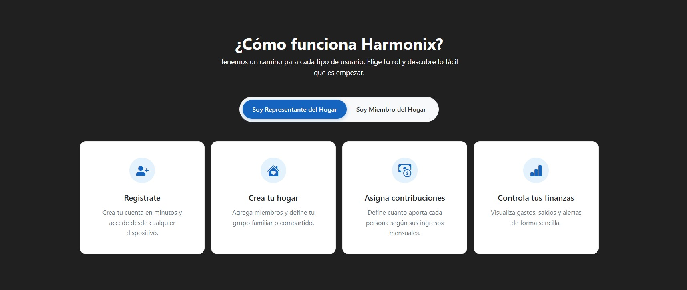  

  

#### Sección *How does it work?* – Miembros  

Para los **miembros del hogar**, las etiquetas refuerzan su rol de participación:  

- **Sign up** (`bi-person-plus-fill`)  
- **Join a household** (`bi-key-fill`)  
- **Declare your income** (`bi-wallet-fill`)  
- **Monitor your contributions** (`bi-graph-up-arrow`)  

  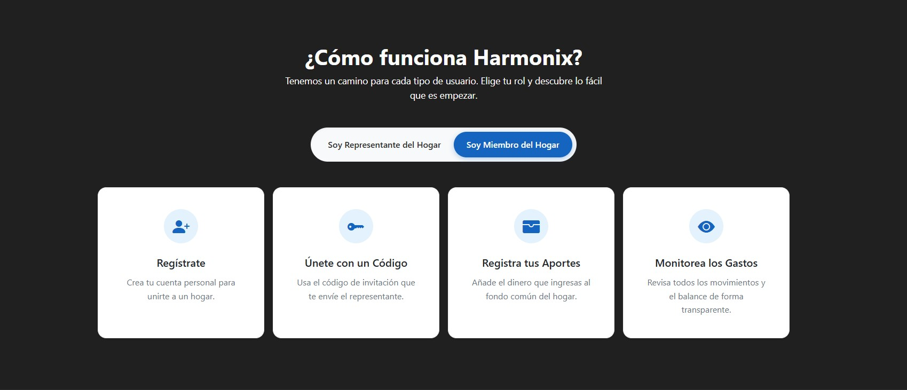  

  

#### Footer  

El pie de página organiza el etiquetado en dos bloques principales:  

- **Enlaces legales:**  
  - Legal notice  
  - Privacy Policy  
  - Cookies Policy  

- **Soporte y ayuda:**  
  - Contact Support  
  - Help Center  
  - Frequently asked questions

Además, se incluyen **íconos de redes sociales** (Facebook, Instagram, Twitter, LinkedIn) que funcionan como accesos rápidos.  

    

  

### 4.2.3. SEO Tags and Meta Tags

En el desarrollo de la landing page de Harmonix, la correcta implementación de etiquetas SEO (Search Engine Optimization) y Meta Tags resulta fundamental para optimizar la visibilidad del sitio en motores de búsqueda y garantizar una adecuada indexación del contenido. Estas etiquetas permiten describir de manera precisa el propósito de la plataforma, los servicios ofrecidos y las palabras clave asociadas, favoreciendo que el proyecto sea fácilmente localizable por usuarios interesados en soluciones de gestión financiera compartida.

Asimismo, los Meta Tags proporcionan información esencial para la accesibilidad y la experiencia del usuario, ya que definen parámetros técnicos como la codificación de caracteres, la adaptación a distintos dispositivos y la atribución de autoría del proyecto. En conjunto, estos elementos no solo fortalecen el posicionamiento orgánico de Harmonix en buscadores, sino que también refuerzan su identidad digital, coherente con los valores de claridad, transparencia y equidad financiera que la marca transmite.

html
<head>
    <meta charset="utf-8">
    <meta name="viewport" content="width=device-width, initial-scale=1">

    <title>Hamonix - Control financiero justo para tu hogar</title>
    <meta name="description" content="Hamonix te ayuda a dividir los gastos del hogar de forma proporcional según los ingresos de cada miembro. Fácil, justo y transparente.">
    <meta name="keywords" content="Hamonix, finanzas compartidas, gastos del hogar, app de finanzas, control de gastos, división de pagos">
    <meta name="author" content="Equipo Hamonix">

    <!-- CSS & Icons -->
    <link href="https://cdn.jsdelivr.net/npm/bootstrap@5.3.3/dist/css/bootstrap.min.css" rel="stylesheet">
    <link rel="stylesheet" href="https://cdn.jsdelivr.net/npm/bootstrap-icons@1.11.3/font/bootstrap-icons.min.css">
    <link rel="preconnect" href="https://fonts.googleapis.com">
    <link rel="preconnect" href="https://fonts.gstatic.com" crossorigin>
    <link href="https://fonts.googleapis.com/css2?family=Roboto&display=swap" rel="stylesheet">
    <link rel="stylesheet" href="css/style.css">
    <link rel="icon" href="/images/logo.PNG" alt="Logo">
</head>

### 4.2.4. Searching Systems.

En el caso de **Harmonix**, se implementará un sistema de búsqueda y filtros diseñado para que tanto los **miembros** como los **representantes del hogar** puedan acceder de manera rápida y sencilla a la información que necesitan.  
El sistema estará optimizado según el rol del usuario, garantizando una navegación fluida y eficiente dentro de la aplicación.

#### Filtros de búsqueda por entradas

**Miembros del hogar:**
- **Buscar por ID de hogar:** Permite unirse a un hogar ya creado ingresando el ID proporcionado por el representante.  
- **Filtrar por fecha de contribución:** Visualizar el historial de aportes organizados por periodos (semanal, mensual).  
- **Estado de los aportes:** Filtrar contribuciones por estado: `"Aportado"`, `"Pendiente"`, `"Excedente"`.  
- **Filtrar por tipo de gasto:** Clasificar los gastos en categorías como `"Alimentos"`, `"Servicios"`, `"Otros"`.  

**Representantes del hogar:**
- **Filtrar por estado de los aportes:** Consultar las contribuciones según estado o rango de fechas.  
- **Filtrar por miembros:** Buscar por nombre o ID de miembro para revisar su historial de aportes.  
- **Balance financiero:** Filtrar el balance general del hogar por periodo o tipo de gasto.  

#### Filtros de búsqueda por tabs

Para una mejor experiencia, la aplicación contará con **tabs interactivos** que agrupan la información de forma clara y ordenada.

**Miembros:**
- **Historial de aportes:** Resumen con filtros por fecha, monto y estado.  
- **Estado de gastos:** Visualización gráfica de la distribución de los gastos del hogar.  
- **Unirse a hogar (ID):** Asociación rápida al perfil vinculado mediante el ID del hogar.  

**Representantes:**
- **Gestión de aportes:** Vista completa de aportes de todos los miembros, filtrable por estado y fecha.  
- **Balance general:** Resumen financiero global con filtros por categorías y periodos.  

#### Flujo de búsqueda y filtros

El flujo será **intuitivo y dinámico**.  
En cada sección relevante (aportaciones, balances, gastos), se integrarán campos de búsqueda y filtros configurables.  
Los usuarios podrán aplicar o remover filtros con facilidad, garantizando una experiencia ágil, clara y sin fricciones.

### 4.2.5. Navigation Systems.

En **Harmonix**, la navegación está diseñada para ser **fluida, intuitiva y accesible**, garantizando una experiencia clara tanto en la **Landing Page** como en la **Web Application**.

#### 1. Navegación en la Landing Page

La **página principal** guía a nuevos usuarios de manera sencilla hacia el registro y la información clave del producto, combinando estética y usabilidad.

**Elementos principales de navegación:**
- **Menú de navegación superior (con iconos):**
  - *Home*  
  - *About*  
  - *Services*  
  - *How it works*  
  - *Plans & Pricing*  
  - *Reviews*  
  - *Contact us*
- **Call To Actions (CTAs):**
  - Ejemplo: *"Sign up now"*, *"Get started"*.
- **Desplazamiento fluido:**
  - Scroll natural por secciones sin necesidad de recargar la página. 

#### 2. Navegación en la Web Application

La navegación se adapta al **tipo de usuario** y sus funcionalidades más relevantes.

#### Para Representantes del Hogar:

**Menú lateral fijo con opciones:**
- Dashboard  
- Miembros del hogar  
- Gastos  
- Aportes  
- Configuración del hogar  

**Breadcrumbs (migas de pan):**  
Permiten volver fácilmente a secciones anteriores o más generales.

#### Para Miembros del Hogar:

**Menú superior simplificado con opciones:**
- Dashboard  
- Aportes  
- Estado del hogar  
- Unirse mediante ID de hogar  

**Accesos rápidos (botones flotantes):**
- Agregar aporte  
- Ver detalles del gasto  

#### Interacción con el sistema 

- **Accesibilidad:** Navegación clara, visible y con etiquetas comprensibles para todo tipo de usuarios.  
- **Navegación de búsqueda:** Accesos rápidos para filtrar por ID de hogar, estado de aportes o categorías de gastos.  
- **Soporte y ayuda:** Sección de tutoriales y guías interactivas paso a paso, integradas dentro de la aplicación.  

## 4.3. Landing Page UI Design.
### 4.3.1. Landing Page Wireframe.

La **Landing Page** constituye el primer punto de interacción entre el usuario y la plataforma **Harmonix**, por lo que su diseño debe ser claro, atractivo y funcional.  
El wireframe presentado a continuación permite visualizar de manera preliminar la disposición de los elementos clave, garantizando una **navegación intuitiva**, la **jerarquización de la información** y la correcta integración de **llamadas a la acción (CTAs)** que orienten al usuario hacia el registro y el uso de la aplicación.  

Los esquemas se centran en reflejar los bloques fundamentales de la interfaz, como el menú de navegación, secciones de presentación de servicios, planes de precios, testimonios, y la sección de contacto. Este enfoque asegura una experiencia de usuario consistente con los objetivos de comunicación de la startup.

  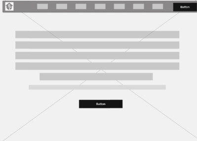

  

  

  

  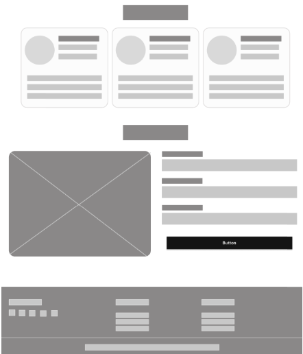

### 4.3.2. Landing Page Mock-up.

El **mock-up de la Landing Page** representa la materialización visual del wireframe previamente diseñado, incorporando el uso de tipografías, paleta de colores, íconos y demás elementos gráficos definidos en las **Web Style Guidelines**.  
Este recurso permite evaluar de manera más precisa la apariencia final de la página antes de su desarrollo, asegurando la coherencia entre la propuesta conceptual, la identidad visual de la marca y la experiencia de usuario deseada.  

El mock-up facilita la validación temprana con los interesados (stakeholders), al ofrecer una visión clara y tangible de cómo se presentarán los contenidos, las llamadas a la acción y la navegación en un entorno realista.

  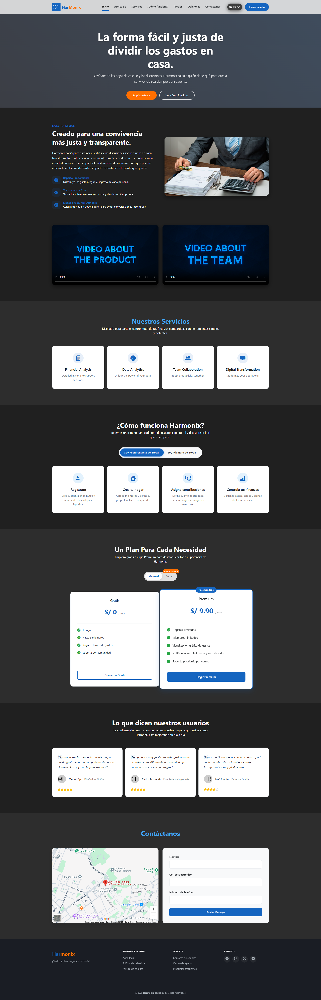

## 4.4. Web Applications UX/UI Design.
En este apartado se define la propuesta de diseño UX/UI para Harmonix, enfocada en brindar una experiencia simple, intuitiva y transparente en la gestión de gastos compartidos. El diseño prioriza la facilidad de uso para los distintos perfiles de usuario (miembros y representantes del hogar), asegurando accesibilidad desde dispositivos móviles y navegadores web. Se emplean principios de usabilidad, consistencia visual y jerarquía de la información, con el objetivo de reducir fricciones en el registro de datos, visualización de aportes y seguimiento de pagos, fortaleciendo la confianza y satisfacción de los usuarios.

### 4.4.1. Web Applications Wireframes.

  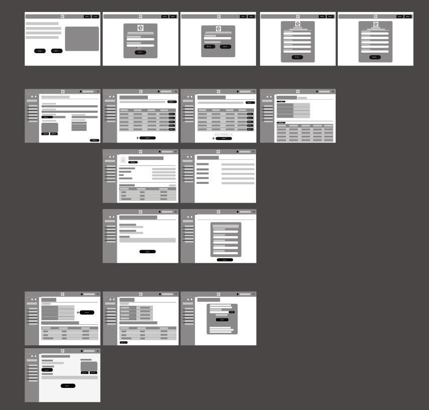

### 4.4.2. Web Applications Wireflow Diagrams.

  

### 4.4.2. Web Applications Mock-ups.

  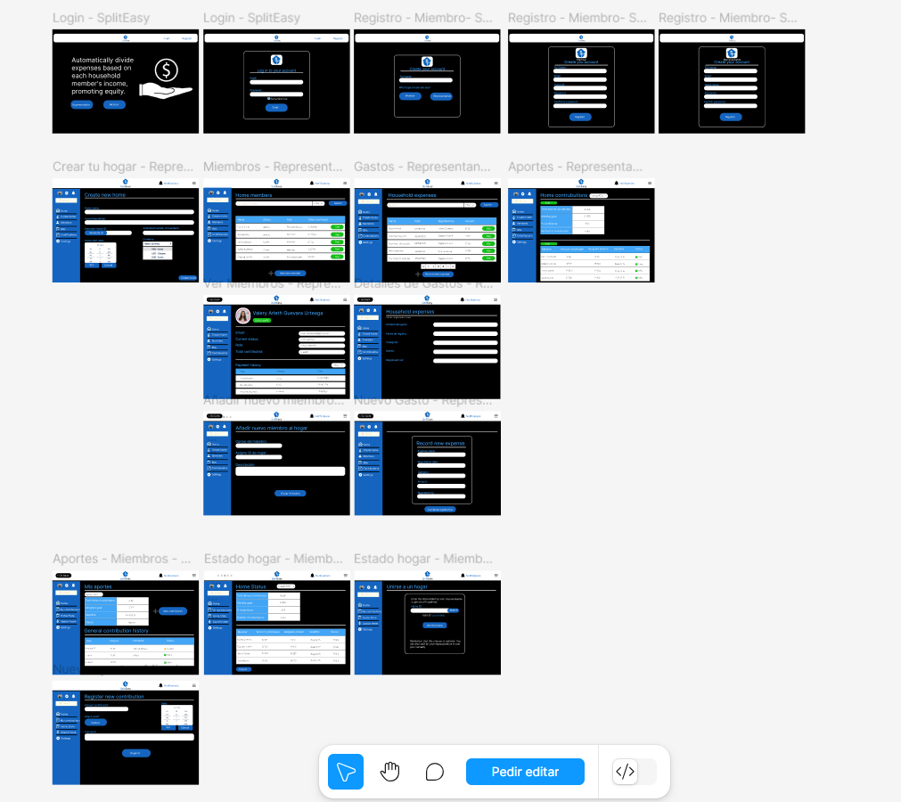

### 4.4.3. Web Applications User Flow Diagrams.
A continuación, se presenta el User Flow Diagram, diseñado a partir de los objetivos principales de los usuarios. El flujo refleja cada meta funcional dentro de la aplicación y los distintos recorridos que pueden seguir para alcanzarla. Para una mejor comprensión, se incluyen mockups de alta fidelidad que ilustran visualmente cada paso, facilitando la validación de la experiencia y la coherencia del diseño.

  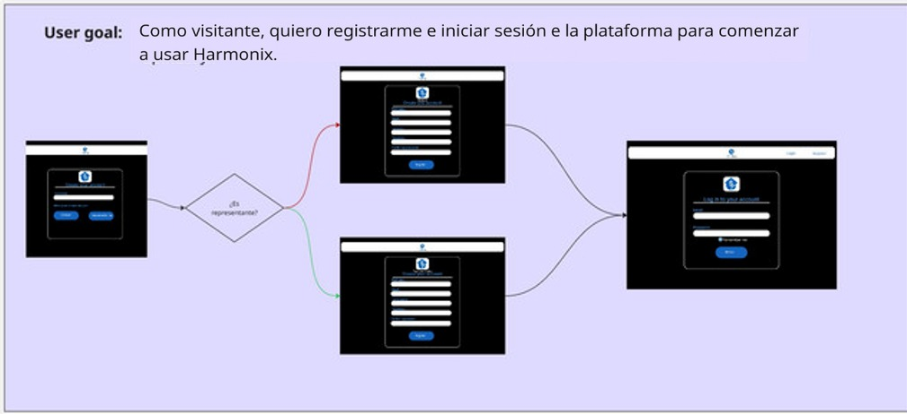

  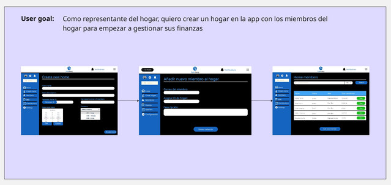

  

  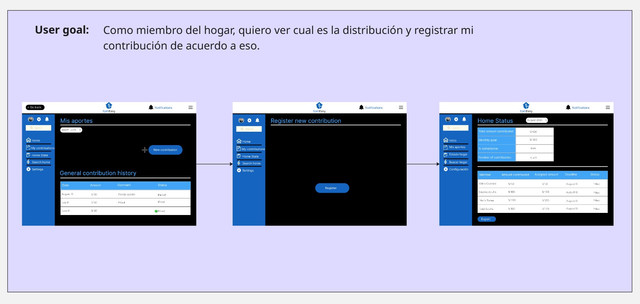

## 4.5. Web Applications Prototyping.
## 4.6. Domain-Driven Software Architecture.

La arquitectura de Harmonix se plantea bajo el enfoque de Domain-Driven Design (DDD), lo que permite alinear el desarrollo técnico con el modelo de negocio y las reglas que rigen la distribución de gastos en el hogar. El sistema se organiza en dominios principales como la gestión de usuarios (registro, autenticación y roles), gestión de ingresos y aportes (cálculo proporcional y validación de pagos), gestión de notificaciones (recordatorios automáticos y alertas) y reportes (visualización de saldos y exportación de datos).

Este enfoque modular asegura que cada componente evolucione de forma independiente, manteniendo la coherencia del dominio central y garantizando la escalabilidad de la plataforma.

### 4.6.1. Software Architecture Context Diagram.

  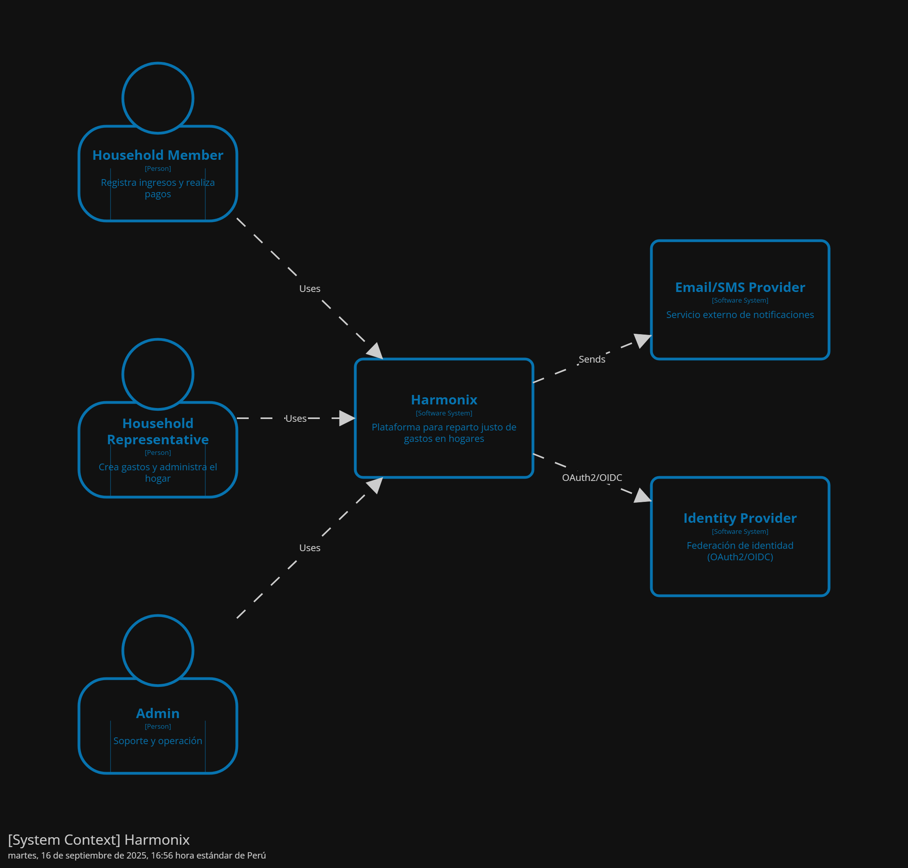

### 4.6.2. Software Architecture Container Diagrams.

  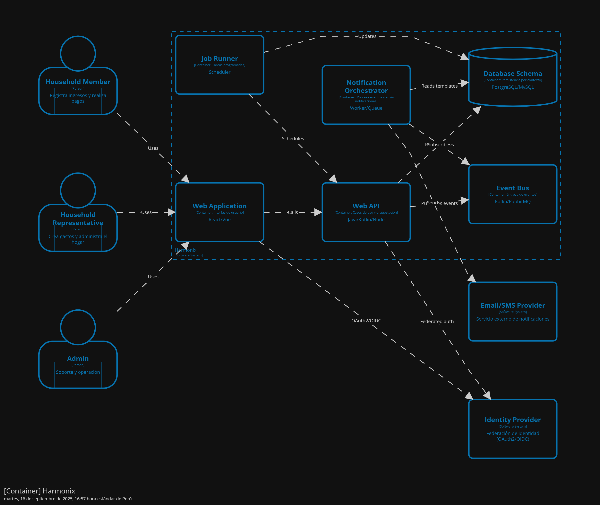

### 4.6.3. Software Architecture Components Diagrams.

  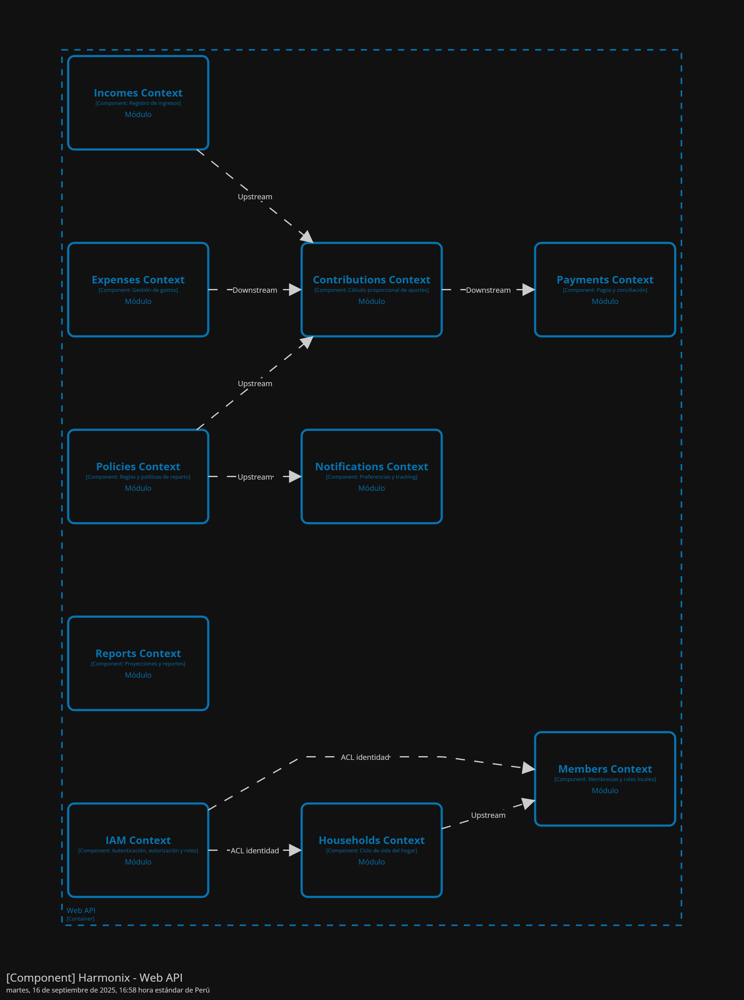

## 4.7. Software Object-Oriented Design.
### 4.7.1. Class Diagrams.

  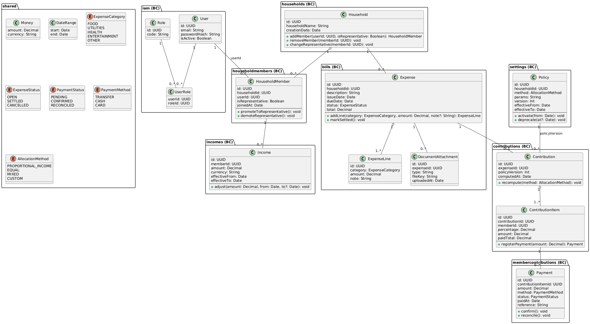

### 4.7.2. Class Dictionary.
#### [IAM Bounded Context]

**Class: User**  
- `id: UUID` — Identificador único del usuario.  
- `email: String` — Correo electrónico.  
- `passwordHash: String` — Contraseña en hash.  
- `isActive: Boolean` — Estado de la cuenta.  

**Class: Role**  
- `id: UUID` — Identificador único del rol.  
- `code: String` — Código o nombre del rol.  

**Class: UserRole**  
- `userId: UUID` — Referencia a User.  
- `roleId: UUID` — Referencia a Role.  

---

#### [Households Bounded Context]

**Class: Household**  
- `id: UUID` — Identificador único del hogar.  
- `householdName: String` — Nombre del hogar.  
- `creationDate: Date` — Fecha de creación.  

**Methods:**  
- `addMember(userId: UUID, isRepresentative: Boolean): HouseholdMember` — Agrega un nuevo miembro.  
- `removeMember(memberId: UUID): void` — Elimina un miembro existente.  
- `changeRepresentative(memberId: UUID): void` — Designa un nuevo representante.  

---

#### [Household Members Bounded Context]

**Class: HouseholdMember**  
- `id: UUID` — Identificador del miembro.  
- `householdId: UUID` — Referencia al hogar.  
- `userId: UUID` — Referencia al usuario.  
- `isRepresentative: Boolean` — Indica si es representante.  
- `joinedAt: Date` — Fecha de incorporación.  

**Methods:**  
- `promoteToRepresentative(): void` — Asigna rol de representante.  
- `demoteRepresentative(): void` — Revoca el rol de representante.  

---

#### [Incomes Bounded Context]

**Class: Income**  
- `id: UUID` — Identificador único del ingreso.  
- `memberId: UUID` — Miembro asociado.  
- `amount: Decimal` — Monto del ingreso.  
- `currency: String` — Moneda usada.  
- `effectiveFrom: Date` — Inicio de vigencia.  
- `effectiveTo: Date?` — Fin de vigencia.  

**Methods:**  
- `adjust(amount: Decimal, from: Date, to?: Date): void` — Ajusta monto y vigencia.  

---

#### [Bills Bounded Context]

**Class: Expense**  
- `id: UUID` — Identificador único del gasto.  
- `householdId: UUID` — Referencia al hogar.  
- `description: String` — Descripción del gasto.  
- `issueDate: Date` — Fecha de registro.  
- `dueDate: Date?` — Fecha de vencimiento.  
- `status: ExpenseStatus` — Estado actual.  
- `total: Decimal` — Importe total.  

**Methods:**  
- `addLine(category: ExpenseCategory, amount: Decimal, note?: String): ExpenseLine` — Agrega línea de gasto.  
- `markSettled(): void` — Marca el gasto como liquidado.  

**Class: ExpenseLine**  
- `id: UUID` — Identificador de la línea.  
- `category: ExpenseCategory` — Categoría.  
- `amount: Decimal` — Importe.  
- `note: String` — Nota opcional.  

**Class: DocumentAttachment**  
- `id: UUID` — Identificador del documento.  
- `expenseId: UUID` — Referencia al gasto.  
- `type: String` — Tipo de documento (Invoice, Receipt).  
- `fileKey: String` — Ruta o clave del archivo.  
- `uploadedAt: Date` — Fecha de carga.  

---

#### [Contributions Bounded Context]

**Class: Contribution**  
- `id: UUID` — Identificador del cálculo.  
- `expenseId: UUID` — Gasto asociado.  
- `policyVersion: Int` — Versión de la política.  
- `computedAt: Date` — Fecha del cálculo.  

**Methods:**  
- `recompute(method: AllocationMethod): void` — Recalcula con la política seleccionada.  

**Class: ContributionItem**  
- `id: UUID` — Identificador del ítem.  
- `contributionId: UUID` — Aporte padre.  
- `memberId: UUID` — Miembro asociado.  
- `percentage: Decimal` — Porcentaje asignado.  
- `amount: Decimal` — Monto asignado.  
- `paidTotal: Decimal` — Total pagado.  

**Methods:**  
- `registerPayment(amount: Decimal): Payment` — Registra un pago.  

---

#### [Member Contributions Bounded Context]

**Class: Payment**  
- `id: UUID` — Identificador del pago.  
- `contributionItemId: UUID` — Ítem de aporte asociado.  
- `amount: Decimal` — Monto del pago.  
- `method: PaymentMethod` — Método de pago.  
- `status: PaymentStatus` — Estado.  
- `paidAt: Date` — Fecha de pago.  
- `reference: String?` — Referencia externa.  

**Methods:**  
- `confirm(): void` — Confirma el pago.  
- `reconcile(): void` — Concilia el pago.  

---

#### [Settings Bounded Context]

**Class: Policy**  
- `id: UUID` — Identificador único.  
- `householdId: UUID` — Hogar al que pertenece.  
- `method: AllocationMethod` — Método de asignación.  
- `params: String` — Parámetros extra.  
- `version: Int` — Versión de la política.  
- `effectiveFrom: Date` — Vigencia inicial.  
- `effectiveTo: Date` — Vigencia final.  

**Methods:**  
- `activate(from: Date): void` — Activa la política.  
- `deprecate(at?: Date): void` — Marca como obsoleta.  

---

### Enumerations

**ExpenseStatus**  
- `OPEN` — Gasto pendiente.  
- `SETTLED` — Gasto liquidado.  
- `CANCELLED` — Gasto anulado.  

**ExpenseCategory**  
- `FOOD` — Alimentación.  
- `UTILITIES` — Servicios básicos.  
- `HEALTH` — Salud.  
- `ENTERTAINMENT` — Ocio.  
- `OTHER` — Otros gastos.  

**AllocationMethod**  
- `PROPORTIONAL_INCOME` — Según ingresos.  
- `EQUAL` — En partes iguales.  
- `MIXED` — Mixto.  
- `CUSTOM` — Configuración manual.  

**PaymentStatus**  
- `PENDING` — Pago pendiente.  
- `CONFIRMED` — Pago confirmado.  
- `RECONCILED` — Pago conciliado.  

**PaymentMethod**  
- `TRANSFER` — Transferencia bancaria.  
- `CASH` — Pago en efectivo.  
- `CARD` — Tarjeta.  
## 4.8. Database Design.
#### Descripción General
La base de datos de Harmonix ha sido diseñada bajo un enfoque relacional, orientado a la gestión financiera colaborativa dentro del hogar. Su estructura busca garantizar integridad referencial, equidad en la distribución de gastos y transparencia entre los miembros. Soporta funcionalidades clave como el cálculo proporcional de contribuciones, seguimiento de pagos, notificaciones automáticas, metas financieras compartidas, entre otras.

#### Diagrama Entidad-Relación
A continuación, se describen las principales entidades del sistema, alineadas con la implementación real en la base de datos:

**users**  
Representa a todos los usuarios del sistema (miembros o representantes).  
- `id: INT (PK)`  
- `name: VARCHAR(100)`  
- `email: VARCHAR(100)` – único  
- `password: VARCHAR(255)`  
- `role: ENUM('REPRESENTANTE', 'MIEMBRO')`  
- `created_at: TIMESTAMP`  

**households**  
Entidad que representa un hogar.  
- `id: INT (PK)`  
- `name: VARCHAR(100)`  
- `description: TEXT`  
- `currency: VARCHAR(10)` – por defecto 'USD'  
- `representante_id: INT (FK → users.id)`  
- `created_at: TIMESTAMP`  

**household_members**  
Relación que indica qué usuarios pertenecen a qué hogares.  
- `id: INT (PK)`  
- `user_id: INT (FK → users.id)`  
- `household_id: INT (FK → households.id)`  
- `joined_at: TIMESTAMP`  

**bills**  
Facturas o cuentas registradas dentro del hogar.  
- `id: INT (PK)`  
- `household_id: INT (FK → households.id)`  
- `descripcion: VARCHAR(255)`  
- `monto: DECIMAL(10,2)`  
- `created_by: INT (FK → users.id)`  
- `fecha: DATE`  
- `created_at: TIMESTAMP`  

**contributions**  
Contribuciones planificadas para cubrir facturas.  
- `id: INT (PK)`  
- `bill_id: INT (FK → bills.id)`  
- `household_id: INT (FK → households.id)`  
- `descripcion: VARCHAR(255)`  
- `fecha_limite: DATE`  
- `created_at: TIMESTAMP`  
- `updated_at: TIMESTAMP`  

**member_contributions**  
Contribuciones específicas que realiza cada miembro.  
- `id: INT (PK)`  
- `contribution_id: INT (FK → contributions.id)`  
- `member_id: INT (FK → users.id)`  
- `monto: DECIMAL(10,2)`  
- `status: ENUM('PENDIENTE', 'PAGADO')`  
- `pagado_en: TIMESTAMP`  
- `created_at: TIMESTAMP`  
- `updated_at: TIMESTAMP`  

**settings**  
Configuraciones individuales de los usuarios.  
- `id: INT (PK)`  
- `user_id: INT (FK → users.id)`  
- `language: VARCHAR(10)`  
- `dark_mode: BOOLEAN`  
- `notifications_enabled: BOOLEAN`  

---

#### Índices Adicionales
Se incluyen índices para optimizar el rendimiento de consultas frecuentes:  
- `Income.memberId`  
- `Contribution.memberId`  
- `Expense.householdId`  
- `Payment.expenseId`  
- `Notification.memberId`  

---

#### Objetivos del Diseño
- **Transparencia:** cada miembro puede ver su historial y estado financiero.  
- **Equidad:** los gastos se distribuyen proporcionalmente en función de los ingresos.  
- **Escalabilidad:** permite añadir nuevas funcionalidades sin alterar el núcleo del sistema.  
- **Mantenimiento:** una estructura clara y bien normalizada facilita la administración y evolución del sistema.  

### 4.8.1. Database Diagrams

  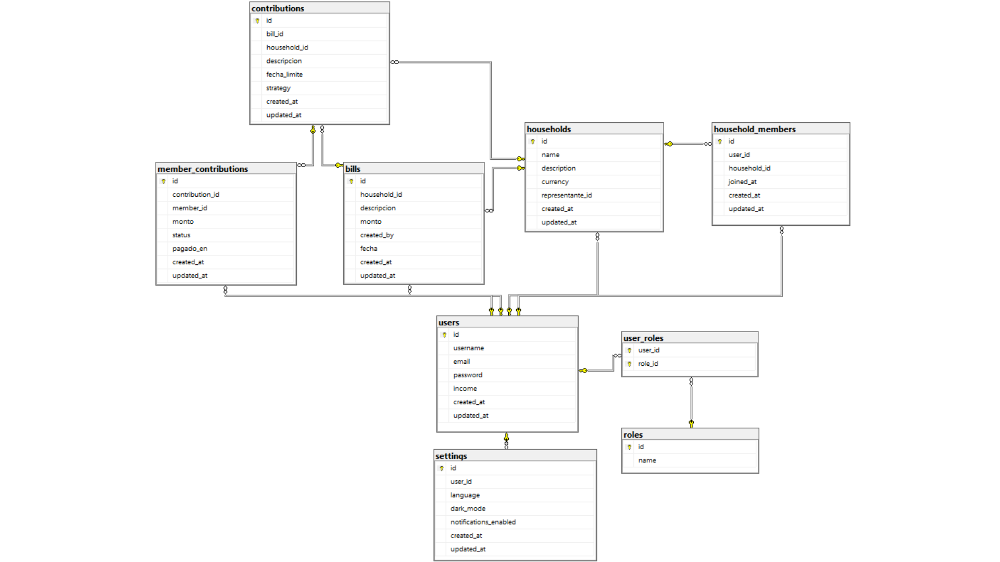  

  
