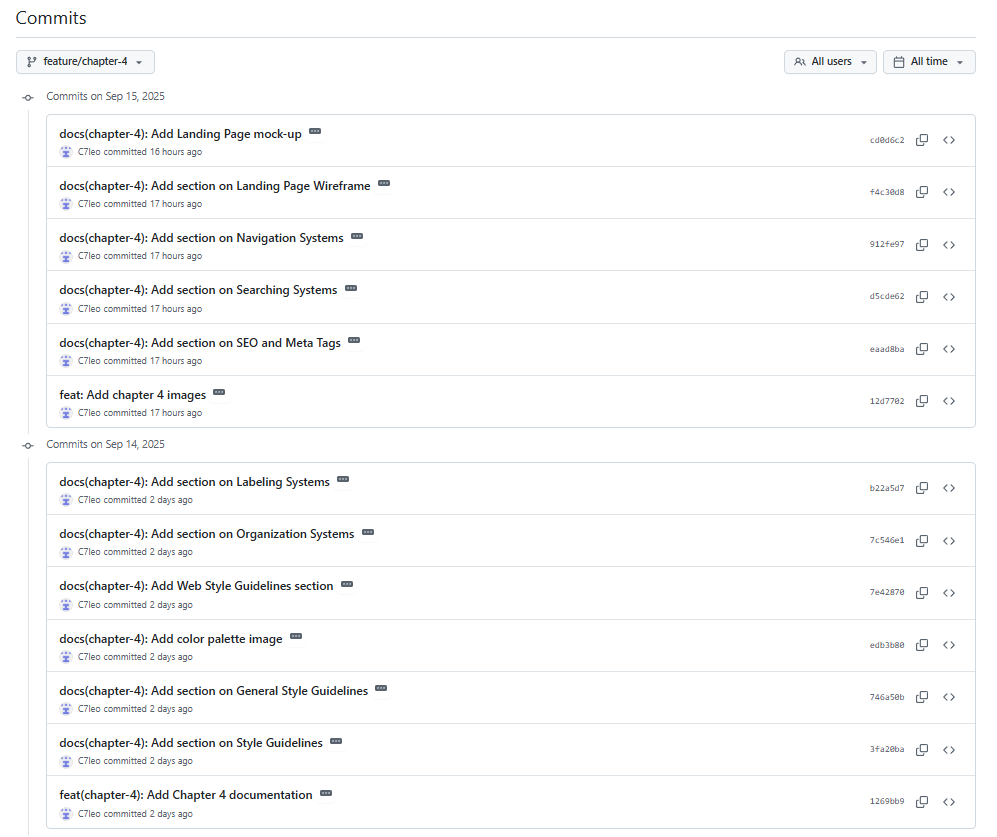

# Capítulo 5: Product Implementation, Validation & Deployment #

## _5.1. Software Configuration Management_ ##

En esta sección, se detalla la configuración de la tecnología a usar en el ciclo de vida de desarrollo del proyecto del curso.

### 5.1.1. Software Development Environment Configuration ###

En esta sección, se explica los entornos en donde se decidió llevar a cabo el ciclo de vida de desarrollo de los productos de software relacionados al proyecto del curso.

* **Project Management**

  - En el aspecto de gestión y desarrollo del ciclo de vida del proyecto se utilizó la aplicación DISCORD y GOOGLE MEET para las reuniones de grupo en las cuales se conversan sobre temas relacionados a avances y corrección de aspectos del proyecto. Además, para la documentación del proyecto, se utilizó el formato Mark Down en un repositorio de GitHub para el control de versiones del informe.

* **Requirements Management**

  - Para el manejo de los requisitos (historias de usuario, product backlog, sprint backlog) del producto, se utilizó TRELLO la cual es una herramienta ideal para gestionar proyectos. Además, usando esta herramienta, se puede organizar un product backlog, ya que permite estructurar tareas visualmente en un tablero. También puedes crear listas que representen etapas del flujo de trabajo, y en cada lista añadir tarjetas que describan las user stories o tareas individuales. Estas tarjetas permiten detallar información clave, como prioridades, etiquetas de color, descripciones y checklists, facilitando así el seguimiento y la colaboración del equipo.

* **Product UX/UI Design**

  - Para el desarrollo de plantillas de los user persona, de los Impact Maps y los User Journey Maps se utilizó la aplicación UXPRESSIA la cual es una plataforma especializada en la creación de mapas de experiencia del usuario ofreciendo una interfaz enfocada exclusivamente en UX que facilita la estructuración clara y profesional de estos elementos. Destaca por sus plantillas personalizables, la posibilidad de añadir datos reales, imágenes y métricas, y por permitir la colaboración en tiempo real.

  - Para la creación del Lean UX Canvas se utilizó la aplicación de diseño CANVA. Esta aplicación es una herramienta versátil para crear diversos diseños. Canva facilita la colaboración del equipo y la exportación de los proyectos en archivo PNG o PDF, manteniendo el proceso creativo ordenado y atractivo. Para los Journey Mapping, Empathy Mapping, entre otros mapas,  se decidió utilizar Miro. Esta aplicación permite una colaboración en tiempo real entre equipos, ofrece una interfaz visual e intuitiva, y cuenta con plantillas prediseñadas que agilizan el proceso sin perder calidad metodológica.

  - Finalmente, para el desarrollo de interfaces de usuario (wireframes, mockups y prototipos de aplicación) se decidió utilizar FIGMA. Esta es una herramienta que facilita el diseño de interfaces, permitiéndonos trabajar con colores, imágenes, formas, y otros elementos visuales para crear nuestra aplicación. Nos ofrece la posibilidad de probar diversos modelos de dispositivos. Además, esta plataforma será clave en la creación de nuestro prototipo, ya que brinda una simulación interactiva que permite visualizar y experimentar el proyecto desde la perspectiva del usuario.

* **Software Development**

  - Para el desarrollo del producto de software correspondiente al Landing Page, se utilizarán dos aplicaciones, las cuales son GITHUB y JETBRAINS WEBSTORM. La primera ayuda al equipo a gestionar de manera correcta los avances colaborativos del proyecto. Por otro lado, JetBrains WebStorm ayudará a trabajar el proyecto con lenguajes como HTML5, CSS y JavaScript para el desarrollo del landing page.
 
* **Software Testing**

  - Las pruebas de la Landing Page se realizarán mediante uso del navegador web GOOGLE para verificar que el diseño del mismo cumple con aspectos como el diseño responsivo en cualquier dispositivo desde el que se acceda al landing page del proyecto. Además, para visualizar que se han implementado correctamente elementos visuales que deben aparecer en las distintas secciones de la página.

* **Software Deployment**

  - Para los despliegues de la Landing Page se uso el servicio web de GITHUB PAGES, este servicio se especializa en el despliegue de sitios web staticos directamente desde un repositorio creado en GitHub.

### 5.1.2. Source Code Management ###

En esta sección, se describen los medios y esquemas de organización para gestionar de manera efectiva los archivos de proyecto relacionados a Landing Page, Web Services y Frontend Web Applications. En el caso de los repositorios, se usará GitHub para almacenar los archivos. Además, se implementará GitFlow. Esta función de GitHub ayudará al equipo, gracias a las ramas de características de lanzamiento, a poder trabajar paralelamente en el proyecto y a tomar el control de versiones de avance del proyecto.

#### **5.1.2.1. Repositorios**

A continuación, se adjuntan los enlaces para acceder a los repositorios donde se almacenarán los archivos y avances de proyecto relacionados al Landing Page, Front-End y Back-End Application.

* **Landing Page: [https://github.com/1ASI0730-2520-7432-G1-Harmonix/LandingPage.git](https://github.com/1ASI0730-2520-7432-G1-Harmonix/LandingPage.git)**

**5.1.2.2. GitFlow**

Para el desarrollo de este proyecto, GITFLOW ayudará al equipo de desarrollo a gestionar de manera efectiva el proyecto en su ciclo de vida. En general, GITHUB ayudará a facilitar el desarrollo del proyecto para el equipo ya que es más sencillo desarrollar trabajos en equipo en los repositorios de los archivos de proyecto.

##### **5.1.2.2.1. Main Branches**

* **Main Branch**   
  Llamada también rama principal del proyecto, esta es la rama predeterminada del proyecto creado en el repositorio. Esta rama representa el historial del proyecto lo que ayuda a llevar el control de versiones del mismo.
    
* **Develop Branch**  
  Llamada también rama de desarrollo del proyecto. Esta rama es una bifurcación de código original del proyecto para definir nuevos rumbos respecto del proyecto original que servirá para evaluar variaciones del proyecto para su evolución. Además, ayudan a incorporar nuevas funciones al proyecto.

##### **5.1.2.2.2. Supporting Branches**

* **Feature Branch**  
  También llamada rama de característica del proyecto, es una rama de desarrollo que ayuda a incorporar nuevas funciones al proyecto en desarrollo. Además, permite el aislamiento de la función agregada y que varios colaboradores puedan trabajar simultáneamente en dicha funcionalidad.

* **Release Branch**  
  También llamada rama de lanzamiento del proyecto, es una versión de código del proyecto que se usa para empezar un nuevo ciclo de lanzamiento del producto de software. Además, en esta rama se pueden realizar correcciones de errores de la versión pasada del proyecto. Finalmente, una vez terminada con esta rama, se suma a la rama principal del proyecto y se le asigna un nuevo número de versión de proyecto.
    
* **Hotfix Branch**  
  También llamada rama de corrección del proyecto, es una rama que permite dar mantenimiento al código del proyecto. Se utiliza principalmente para arreglar errores en alguna sección del producto de software de manera rápida.

#### **5.1.2.3. Release Versioning Conventions**

Para la nomenclatura de los lanzamientos de la Landing Page, se utilizará Semantic Versioning que consta de tres partes para describir cambios mayores, cambios menores y parches para corrección de bugs, según la siguiente estructura:

* Número principal: Incrementa cuando se realiza un cambio mayor y significativo al proyecto.  
* Número secundario: Incrementa cuando se realiza un cambio menor al proyecto como arreglo de errores o agregación de características.  
* Número terciario: Incrementa cuando se realiza un parche al proyecto como una corrección de bugs o errores visuales.

#### **5.1.2.3. Commits Conventions**

Para los textos de mensajes en los *‘commits’* del proyecto en Git, se utilizará Conventional Commits. Estos son mensajes de confirmación que son fáciles de entender por los colaboradores del proyecto. Finalmente, estos mensajes siguen la siguiente estructura:

<!-- Commits-->

  

La sección *‘type’* indica el tipo de mensaje de confirmación que se usará. A continuación, la sección *‘description’* indica la descripción que se le agrega al mensaje de confirmación, por ejemplo, una característica agregada. Además, la sección *‘body’* incluye una descripción más detallada del cambio aplicado al proyecto.  
Luego, se tienen distintos tipos de mensajes de confirmación. Por ejemplo, se tiene el mensaje tipo *‘fix’* que incluye una corrección al proyecto. Utilizar este tipo conlleva aumentar el número terciario de la versión del proyecto (por ejemplo, de 1.0.0. a 1.0.1.). Después, utilizar el mensaje de tipo *‘feat’* conlleva agregar una nueva función a la aplicación, por lo tanto, se debe aumentar el número secundario de la versión (por ejemplo, de 1.0.0. a 1.1.0.). Finalmente, si se agrega una sección de tipo ‘BREAKING CHANGE’ indicaría que las versiones anteriores del proyecto dejarán de ser compatibles entre sí, lo que conlleva un cambio significativo y el aumento del número principal de la versión (por ejemplo, de 1.0.0. a 2.0.0.).

### 5.1.3. Source Code Style Guide & Conventions ###

En esta sección, se definen las referencias que se usaron para adoptar estrategias de nomenclatura de elementos de programación en los lenguajes que se usarán para la solución (HTML, CSS, JavaScript, y C\#). En general, la nomenclatura de los archivos y secciones en la programación se hará en inglés.

* **Nomenclatura en HTML:**  
  Para la codificación del proyecto en HTML, se utilizará el artículo *“HTML Style Guide and Coding Conventions”.* Este artículo contiene información útil y necesaria para conocer cómo debe ser la nomenclatura de los diversos aspectos que incluye la programación en HTML como si se debe escribir en minúsculas o mayúsculas las secciones del cuerpo del documento. A continuación se adjunta el enlace para acceder al artículo de referencia: [https://www.w3schools.com/html/html5\_syntax.asp](https://www.w3schools.com/html/html5_syntax.asp)   
  Finalmente, se aplicará el contenido del artículo para la nomenclatura en HTML para la landing page de StockSip a desarrollar.

* **Nomenclatura en CSS:**  
  Para la codificación del proyecto en Cascading Style Sheets (CSS), se utilizará el artículo *“Google HTML/CSS Style Guide”.* Este artículo contiene información útil y necesaria para conocer cómo debe ser la nomenclatura de los diversos aspectos que incluye la programación en CSS como capitalización en código de colores, referencias a imágenes, etc. A continuación se adjunta el enlace para acceder al artículo de referencia: [https://google.github.io/styleguide/htmlcssguide.html](https://google.github.io/styleguide/htmlcssguide.html)   
  Finalmente, se aplicará el contenido del artículo para la nomenclatura en CSS para el estilo de colores que se quiere agregar al landing page de Harmonix a desarrollar.

* **Nomenclatura en JavaScript:**  
  Para la codificación del proyecto en JavaScript, se utilizará el artículo *“Google JavaScript Style Guide”.* Este artículo contiene información útil y necesaria para conocer cómo debe ser la nomenclatura de los diversos aspectos que conforman un proyecto desarrollado en JavaScript, según los lineamientos establecidos por Google.Se trata de la guía de estilo oficial de JavaScript de Google, un documento detallado que establece una serie de convenciones para escribir código JavaScript limpio, coherente y fácil de mantener, especialmente en equipos de trabajo. A continuación se adjunta el enlace para acceder al artículo de referencia: [https://google.github.io/styleguide/jsguide.html](https://google.github.io/styleguide/jsguide.html)  
  Finalmente, se aplicará el contenido del artículo para el Web Services de Harmonix.  
    
* **Nomenclatura en Vue:**  
  Para la codificación del proyecto en Vue, se utilizará el artículo *“Vue Style Guide”.* Este artículo contiene información útil y necesaria para conocer cómo debe ser la nomenclatura de los diversos aspectos que conforman un proyecto desarrollado con Vue.js 2\. Se trata de la guía de estilo oficial de Vue 2, en la cual se detallan las convenciones recomendadas para escribir código claro, consistente y fácil de mantener. Esta guía organiza sus recomendaciones en diferentes niveles de prioridad; reglas esenciales, reglas fuertemente recomendadas, reglas recomendadas, reglas de uso con precaución y reglas estrictamente opcionales. A continuación se adjunta el enlace para acceder al artículo de referencia: [https://v2.vuejs.org/v2/style-guide/?redirect=true](https://v2.vuejs.org/v2/style-guide/?redirect=true)  
  Finalmente, se aplicará el contenido del artículo para el Frontend Applications de Harmonix.  
    
* **Nomenclatura en C\#:**  
  Para la codificación del proyecto en C\#, se utilizará el artículo *“C\# Coding Conventions”.* Este artículo contiene información útil y necesaria para conocer cómo debe ser la nomenclatura de los diversos aspectos que conforman un proyecto desarrollado en C\#, según las convenciones oficiales de codificación establecidas por Microsoft. Se trata de la guía de convenciones de estilo de código para C\# publicada por Microsoft, la cual proporciona una serie de recomendaciones para escribir código claro, coherente y mantenible en aplicaciones .NET. A continuación se adjunta el enlace para acceder al artículo de referencia:  [https://learn.microsoft.com/en-us/dotnet/csharp/fundamentals/coding-style/coding-conventions](https://learn.microsoft.com/en-us/dotnet/csharp/fundamentals/coding-style/coding-conventions)  
  Finalmente, se aplicará el contenido del artículo para el Web Services de Harmonix.

* **Nomenclatura en ASP.NET:**  
  Para la codificación del proyecto en ASP.NET, se utilizará el artículo *“Microsoft ASP.NET Core Coding Guidelines”.* Este artículo contiene información útil y necesaria para conocer cómo debe ser la nomenclatura y el estilo de los diversos aspectos que conforman un proyecto desarrollado con ASP.NET Core. Se trata de la guía de ingeniería oficial del equipo de ASP.NET Core, en la cual se detallan las convenciones recomendadas para escribir código claro, consistente y fácil de mantener. Esta guía organiza sus recomendaciones en distintos apartados que abarcan desde el formato del código, el uso de tipos y palabras clave, la compatibilidad multiplataforma, hasta el control de cambios en versiones del framework. Cada sección tiene como propósito establecer prácticas que favorezcan la legibilidad, el rendimiento, y la calidad del desarrollo colaborativo a gran escala. A continuación se adjunta el enlace para acceder al artículo de referencia:  [https://github.com/dotnet/aspnetcore/wiki/Engineering-guidelines#codingguidelines](https://github.com/dotnet/aspnetcore/wiki/Engineering-guidelines#codingguidelines)  
  Finalmente, se aplicará el contenido del artículo para el Web Services de Harmonix

* **Nomenclatura para RESTful API:**

  Para la nomenclatura de endpoints a implementar en la aplicación Back-End, se usó el artículo *"REST API URI Naming Conventions and Best Practices".* Este mismo contiene información sobre consejos y buenas prácticas al momento de nombrar correctamente a los endpoints en una aplicación back-end que use el esquema REST. A continuación se adjunta el enlace para acceder al artículo de referencia: [https://restfulapi.net/resource-naming/](https://restfulapi.net/resource-naming/).

* **Nomenclatura en MySQL:**

  Para la nomenclatura de objetos en una base de datos relacional usando MySQL, se usó el artículo *"MYSQL Naming Conventions"* como base para la correcta nomenclatura de tablas y columnas. A continuación, se adjunta el enlace para acceder al artículo de referencia: [(https://medium.com/@centizennationwide/mysql-naming-conventions-e3a6f6219efe)](https://medium.com/@centizennationwide/mysql-naming-conventions-e3a6f6219efe) .

### 5.1.4. Software Deployment Configuration ###

En esta sección, se especifica la configuración para realizar el despliegue de la solución en el repositorio. Para realizar esto, se usó GITHUB PAGES para desplegar el landing page.

## Sitio web estático ##
* **Paso 1: Creación del repositorio**  
  Como primer paso, se debe crear el repositorio en GitHub que será el lugar donde se aloja todo lo relacionado al Landing Page.

  

* **Paso 2: Carga de archivos necesarios**  
  Como segundo paso, se importan todos los archivos necesarios para el desarrollo de la landing page como imágenes, archivos HTML, CSS y JavaScript.

  

* **Paso 3: Preparar el lanzamiento**  
  Como tercer paso, se juntan todas las características del proyecto en una sola para verificar el correcto funcionamiento de cada una. Luego, se envía todo a la rama principal donde se encuentra, por defecto, el proyecto.

  

* **Paso 4: Desplegar la Landing Page**  
  Como cuarto paso, cuando todo se encuentre en la rama principal, se accede a la sección Configuración del repositorio, luego, se selecciona la opción “GitHub Pages” y se seleccionará la rama principal que es la que se desea desplegar.

  

* **Paso 5: Acceder al Landing Page**  
  Como paso final, el entorno otorgará un enlace para poder acceder al proyecto desplegado.
  

  

## _5.2. Landing Page, Services & Applications Implementation_ ##

### 5.2.1. Sprint 1 ###

A continuación, se presenta el Sprint Planning 1, donde se incluyen las evidencias de planificación e implementación del Landing Page. También se registran los avances del proyecto e insights de colaboración del equipo a través de GitHub.

#### 5.2.1.1. Sprint Planning 1
| **Campo**                              | **Descripción**                                                                                                                                                                                                                                                                                                    |
| -------------------------------------- | ------------------------------------------------------------------------------------------------------------------------------------------------------------------------------------------------------------------------------------------------------------------------------------------------------------------ |
| **Sprint #**                           | Sprint 1                                                                                                                                                                                                                                                                                                           |
| **Sprint Planning Background**         |                                                                                                                                                                                                                                                                                                                    |
| **Date**                               | 2025-09-01                                                                                                                                                                                                                                                                                                         |
| **Time**                               | 03:00 PM (GMT -5)                                                                                                                                                                                                                                                                                                  |
| **Location**                           | Modalidad remota por Google Meet                                                                                                                                                                                                                                                                                   |
| **Prepared By**                        | Testigos de Harmonix                                                                                                                                                                                                                                                                                              |
| **Attendees (to planning meeting)**    | Equipo Harmonix                                                                                                                                                                                                                                                            |
| **Sprint 0 Review Summary**        | Este es el primer sprint, por lo tanto, no hay una revisión de sprint anterior.                                                                                                                                                                                                                                    |
| **Sprint 0 Retrospective Summary** | Al ser el inicio del proyecto, se identificaron aspectos técnicos por aprender, como el uso de frameworks CSS. Se revisó el diseño del Landing Page en Figma, se discutió el contenido textual a incluir y se definió el objetivo principal: lograr desplegar el Landing Page en GitHub Pages al final del sprint. |
| **Sprint Goal & User Stories**         |                                                                                                                                                                                                                                                                                                                    |
| **Sprint 1 Goal**                      | Desplegar un Landing Page funcional con diseño responsive y estructura definida, accesible públicamente desde GitHub Pages.                                                                                                                                                                                        |
| **Sprint 1 Velocity**                  | 20                                                                                                                                                                                                                                                                                                                  |
| **Sum of Story Points**                | 10                                                                                                                                                                                                                                                                                                                  |

#### 5.2.1.2. Aspect Leaders and Collaborators

 |Team Member | GitHub Username |  Delegating Responsibilities   Leader (L) / Collaborator (C) | Merging Branches  Leader (L) /Collaborator (C)| Correcting Mistakes   Leader (L) /Collaborator (C)|
|-------------|--------------|------------|----------|----------|
| Jose Luis Martinez Validivia | hmongus  |    C   |    L     | C  |
| Camila Leonor Espinoza Vivas		 | C7leo  |    L   |     C    | C  |
| Kevin Patrick Panto Chuquipiondo		 | Kevinyin11  |  C     |   C      |  C  |
| Sebastián Córdova	 | Sevas04  |    C   |    C     |   C   |
| Martin Gonzales | XdiabloX426  |   C    |    C     |   L   |

#### 5.2.1.3. Sprint Backlog 1

| **User Story Id** | **Title**                                                                  | **Task Id** | **Task Title**              | **Description**                                                                                  | **Estimation (Hours)** | **Assigned To** | **Status (To-do/In-Process/To-Review/Done)** |
| ----------------- | -------------------------------------------------------------------------- | ----------- | --------------------------- | ------------------------------------------------------------------------------------------------ | ---------------------- | --------------- | -------------------------------------------- |
| US31              | Visualizar información general sobre SplitEasy desde la landing page       | T1          | Información general         | Desarrollo de la sección con información introductoria de SplitEasy                              | 2                      | Jose Luis Martinez Validivia               | Done                                        |
| US32              | Conocer las funciones principales para representantes y miembros del hogar | T1          | Funciones principales       | Diseño y desarrollo de la sección que explica las funciones clave para representantes y miembros | 2                      | Camila Leonor Espinoza Vivas               | Done                                        |
| US33              | Explorar beneficios del sistema de aportes proporcionales                  | T1          | Beneficios                  | Desarrollo de la sección que muestre los beneficios de usar el sistema de aportes proporcionales | 2                      | Kevin Patrick Panto Chuquipiondo               | Done                                        |
| US34              | Ver ejemplos o simulaciones de cómo funciona la plataforma                 | T1          | Ejemplos y simulaciones     | Implementación de ejemplos visuales o simulaciones del funcionamiento de la plataforma           | 3                      |  Sebastián Córdova               | Done                                        |
| US35              | Acceder fácilmente al registro o login desde botones destacados            | T1          | Botones de acceso           | Diseño e implementación de botones visibles para registro y login                                | 1                      | Martin Gonzales               | Done                                        |
| TS18              | Documentar los pasos para desplegar nuevas versiones                       | T1          | Documentación de despliegue | Redacción de la guía de pasos necesarios para desplegar nuevas versiones                         | 2                      | Jose Luis Martinez Validivia               | Done                                        |
| TS19              | Habilitar monitoreo básico del sistema desplegado (logs, uptime)           | T1          | Monitoreo básico            | Configuración inicial para registrar logs y habilitar monitoreo de uptime                        | 3                      | Camila Leonor Espinoza Vivas               | Done                                        |

#### 5.2.1.4. Development Evidence for Sprint Review

|Repository Branch |  Commit Id  |  Commit Message | Commit Message Body | Commited on (Date)|
|-----------------|--------------|-----------------|---------------------|-------------------|
|Landing Page - develop   |   4c76760…f3dcfd9     |  chores(landingpage): added some translation words    |           |   16/09/2025 |
|Landing Page - develop   |    c62b615…4c76760     |  chore(landingpage): add completed landing page       |           |   15/09/2025 |
|Landing Page - reviews   |   c62b615…3c7fbde      |  feature(reviews): completed landing page-OurSystem - added HTML  |    |12/09/2025|
|Landing Page - home   |   c62b615…7769d76     |  feat: add section home structure and styling    |           |   11/09/2025 |
|Landing Page - about us   |   c62b615…3f0f246     |  update landing page about us   |           |   13/09/2025 |
| Landing Page - pricing |  c62b615…6a35cc4         |  feature(pricing): completed Reviews on an 80%  |    |      10/09/2025     |

#### 5.2.1.5. Execution Evidence for Sprint Review
A continuación se presentan capturas del landing page implementado en código, con el uso de HTML, CSS y JavaScript.
Link: ()

- Home: 

   
 
- About Us: 

   

   
  
- Services:  

  
  
   
- How does it work?:  

  

   

- Prices:  

  

   

- Contact us:  

  

   

#### 5.2.1.6. Software Deployment Evidence for Sprint Review

Hasta ahora, no hemos utilizado servicios web en el proceso de desarrollo de la página de inicio. Esto significa que no hemos realizado actividades como la creación de cuentas, la configuración de recursos en proveedores de servicios en la nube, la creación de proyectos de desarrollo para la integración o automatización de tareas de implementación, entre otras acciones relacionadas.

En cuanto al despliegue de la página de inicio, lo hemos realizado en la plataforma de Github Pages.

Se puede acceder a la página de inicio a través del siguiente enlace: https://1asi0730-2520-7432-g1-harmonix.github.io/LandingPage/

#### 5.2.1.7. Team Collaboration Insights during Sprint

A continuación, se muestran las capturas de los insights del repositorio de la Landing Page para evidenciar la participación de todos los miembros del grupo:

- feature/chapter-1

- feature/chapter-2

- feature/chapter-3

- feature/chapter-4

- feature/chapter-5

