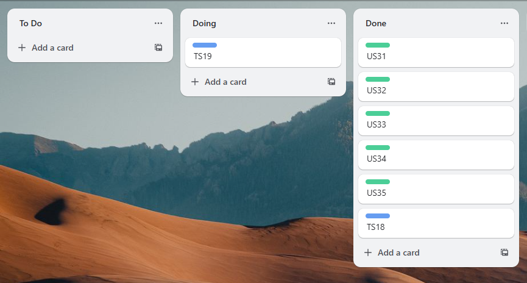
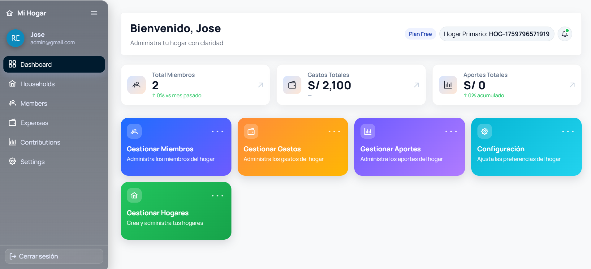
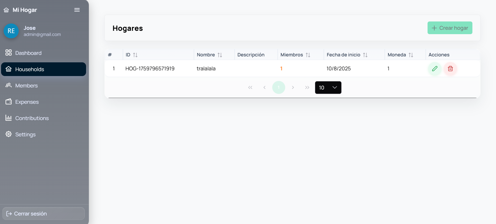
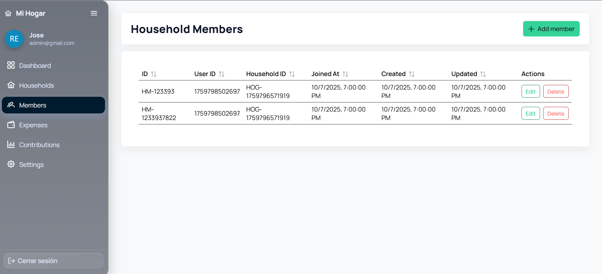
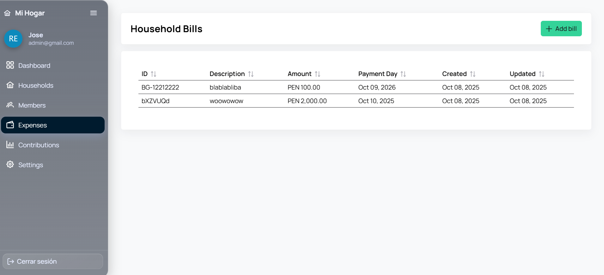
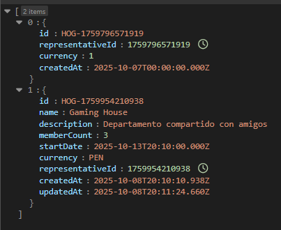

# Capítulo 5: Product Implementation, Validation & Deployment #

## 5.1. Software Configuration Management

En esta sección, se detalla la configuración de la tecnología a usar en el ciclo de vida de desarrollo del proyecto del curso.

### 5.1.1. Software Development Environment Configuration 

En esta sección, se explica los entornos en donde se decidió llevar a cabo el ciclo de vida de desarrollo de los productos de software relacionados al proyecto del curso.

* **Project Management**

  - En el aspecto de gestión y desarrollo del ciclo de vida del proyecto se utilizó la aplicación DISCORD y GOOGLE MEET para las reuniones de grupo en las cuales se conversan sobre temas relacionados a avances y corrección de aspectos del proyecto. Además, para la documentación del proyecto, se utilizó el formato Mark Down en un repositorio de GitHub para el control de versiones del informe.

* **Requirements Management**

  - Para el manejo de los requisitos (historias de usuario, product backlog, sprint backlog) del producto, se utilizó TRELLO la cual es una herramienta ideal para gestionar proyectos. Además, usando esta herramienta, se puede organizar un product backlog, ya que permite estructurar tareas visualmente en un tablero. También puedes crear listas que representen etapas del flujo de trabajo, y en cada lista añadir tarjetas que describan las user stories o tareas individuales. Estas tarjetas permiten detallar información clave, como prioridades, etiquetas de color, descripciones y checklists, facilitando así el seguimiento y la colaboración del equipo.

* **Product UX/UI Design**

  - Para el desarrollo de plantillas de los user persona, de los Impact Maps y los User Journey Maps se utilizó la aplicación UXPRESSIA la cual es una plataforma especializada en la creación de mapas de experiencia del usuario ofreciendo una interfaz enfocada exclusivamente en UX que facilita la estructuración clara y profesional de estos elementos. Destaca por sus plantillas personalizables, la posibilidad de añadir datos reales, imágenes y métricas, y por permitir la colaboración en tiempo real.

  - Para la creación del Lean UX Canvas se utilizó la aplicación de diseño CANVA. Esta aplicación es una herramienta versátil para crear diversos diseños. Canva facilita la colaboración del equipo y la exportación de los proyectos en archivo PNG o PDF, manteniendo el proceso creativo ordenado y atractivo. Para los Journey Mapping, Empathy Mapping, entre otros mapas,  se decidió utilizar Miro. Esta aplicación permite una colaboración en tiempo real entre equipos, ofrece una interfaz visual e intuitiva, y cuenta con plantillas prediseñadas que agilizan el proceso sin perder calidad metodológica.

  - Finalmente, para el desarrollo de interfaces de usuario (wireframes, mockups y prototipos de aplicación) se decidió utilizar FIGMA. Esta es una herramienta que facilita el diseño de interfaces, permitiéndonos trabajar con colores, imágenes, formas, y otros elementos visuales para crear nuestra aplicación. Nos ofrece la posibilidad de probar diversos modelos de dispositivos. Además, esta plataforma será clave en la creación de nuestro prototipo, ya que brinda una simulación interactiva que permite visualizar y experimentar el proyecto desde la perspectiva del usuario.

* **Software Development**

  - Para el desarrollo del producto de software correspondiente al Landing Page, se utilizarán dos aplicaciones, las cuales son GITHUB y JETBRAINS WEBSTORM. La primera ayuda al equipo a gestionar de manera correcta los avances colaborativos del proyecto. Por otro lado, JetBrains WebStorm ayudará a trabajar el proyecto con lenguajes como HTML5, CSS y JavaScript para el desarrollo del landing page.
 
* **Software Testing**

  - Las pruebas de la Landing Page se realizarán mediante uso del navegador web GOOGLE para verificar que el diseño del mismo cumple con aspectos como el diseño responsivo en cualquier dispositivo desde el que se acceda al landing page del proyecto. Además, para visualizar que se han implementado correctamente elementos visuales que deben aparecer en las distintas secciones de la página.

* **Software Deployment**

  - Para los despliegues de la Landing Page se uso el servicio web de GITHUB PAGES, este servicio se especializa en el despliegue de sitios web staticos directamente desde un repositorio creado en GitHub.

### 5.1.2. Source Code Management ###

En esta sección, se describen los medios y esquemas de organización para gestionar de manera efectiva los archivos de proyecto relacionados a Landing Page, Web Services y Frontend Web Applications. En el caso de los repositorios, se usará GitHub para almacenar los archivos. Además, se implementará GitFlow. Esta función de GitHub ayudará al equipo, gracias a las ramas de características de lanzamiento, a poder trabajar paralelamente en el proyecto y a tomar el control de versiones de avance del proyecto.

#### **5.1.2.1. Repositorios**

A continuación, se adjuntan los enlaces para acceder a los repositorios donde se almacenarán los archivos y avances de proyecto relacionados al Landing Page, Front-End y Back-End Application.

* **Landing Page: [https://github.com/1ASI0730-2520-7432-G1-Harmonix/LandingPage.git](https://github.com/1ASI0730-2520-7432-G1-Harmonix/LandingPage.git)**
* **Front End: [https://github.com/1ASI0730-2520-7432-G1-Harmonix/FrontEnd.git](https://github.com/1ASI0730-2520-7432-G1-Harmonix/FrontEnd.git)**

**5.1.2.2. GitFlow**

Para el desarrollo de este proyecto, GITFLOW ayudará al equipo de desarrollo a gestionar de manera efectiva el proyecto en su ciclo de vida. En general, GITHUB ayudará a facilitar el desarrollo del proyecto para el equipo ya que es más sencillo desarrollar trabajos en equipo en los repositorios de los archivos de proyecto.

##### **5.1.2.2.1. Main Branches**

* **Main Branch**   
  Llamada también rama principal del proyecto, esta es la rama predeterminada del proyecto creado en el repositorio. Esta rama representa el historial del proyecto lo que ayuda a llevar el control de versiones del mismo.
    
* **Develop Branch**  
  Llamada también rama de desarrollo del proyecto. Esta rama es una bifurcación de código original del proyecto para definir nuevos rumbos respecto del proyecto original que servirá para evaluar variaciones del proyecto para su evolución. Además, ayudan a incorporar nuevas funciones al proyecto.

##### **5.1.2.2.2. Supporting Branches**

* **Feature Branch**  
  También llamada rama de característica del proyecto, es una rama de desarrollo que ayuda a incorporar nuevas funciones al proyecto en desarrollo. Además, permite el aislamiento de la función agregada y que varios colaboradores puedan trabajar simultáneamente en dicha funcionalidad.

* **Release Branch**  
  También llamada rama de lanzamiento del proyecto, es una versión de código del proyecto que se usa para empezar un nuevo ciclo de lanzamiento del producto de software. Además, en esta rama se pueden realizar correcciones de errores de la versión pasada del proyecto. Finalmente, una vez terminada con esta rama, se suma a la rama principal del proyecto y se le asigna un nuevo número de versión de proyecto.
    
* **Hotfix Branch**  
  También llamada rama de corrección del proyecto, es una rama que permite dar mantenimiento al código del proyecto. Se utiliza principalmente para arreglar errores en alguna sección del producto de software de manera rápida.

#### **5.1.2.3. Release Versioning Conventions**

Para la nomenclatura de los lanzamientos de la Landing Page, se utilizará Semantic Versioning que consta de tres partes para describir cambios mayores, cambios menores y parches para corrección de bugs, según la siguiente estructura:

* Número principal: Incrementa cuando se realiza un cambio mayor y significativo al proyecto.  
* Número secundario: Incrementa cuando se realiza un cambio menor al proyecto como arreglo de errores o agregación de características.  
* Número terciario: Incrementa cuando se realiza un parche al proyecto como una corrección de bugs o errores visuales.

#### **5.1.2.3. Commits Conventions**

Para los textos de mensajes en los *‘commits’* del proyecto en Git, se utilizará Conventional Commits. Estos son mensajes de confirmación que son fáciles de entender por los colaboradores del proyecto. Finalmente, estos mensajes siguen la siguiente estructura:

<!-- Commits-->
<p align="center">
  
</p>

La sección *‘type’* indica el tipo de mensaje de confirmación que se usará. A continuación, la sección *‘description’* indica la descripción que se le agrega al mensaje de confirmación, por ejemplo, una característica agregada. Además, la sección *‘body’* incluye una descripción más detallada del cambio aplicado al proyecto.  
Luego, se tienen distintos tipos de mensajes de confirmación. Por ejemplo, se tiene el mensaje tipo *‘fix’* que incluye una corrección al proyecto. Utilizar este tipo conlleva aumentar el número terciario de la versión del proyecto (por ejemplo, de 1.0.0. a 1.0.1.). Después, utilizar el mensaje de tipo *‘feat’* conlleva agregar una nueva función a la aplicación, por lo tanto, se debe aumentar el número secundario de la versión (por ejemplo, de 1.0.0. a 1.1.0.). Finalmente, si se agrega una sección de tipo ‘BREAKING CHANGE’ indicaría que las versiones anteriores del proyecto dejarán de ser compatibles entre sí, lo que conlleva un cambio significativo y el aumento del número principal de la versión (por ejemplo, de 1.0.0. a 2.0.0.).

### 5.1.3. Source Code Style Guide & Conventions ###

En esta sección, se definen las referencias que se usaron para adoptar estrategias de nomenclatura de elementos de programación en los lenguajes que se usarán para la solución (HTML, CSS, JavaScript, y C\#). En general, la nomenclatura de los archivos y secciones en la programación se hará en inglés.

* **Nomenclatura en HTML:**  
  Para la codificación del proyecto en HTML, se utilizará el artículo *“HTML Style Guide and Coding Conventions”.* Este artículo contiene información útil y necesaria para conocer cómo debe ser la nomenclatura de los diversos aspectos que incluye la programación en HTML como si se debe escribir en minúsculas o mayúsculas las secciones del cuerpo del documento. A continuación se adjunta el enlace para acceder al artículo de referencia: [https://www.w3schools.com/html/html5\_syntax.asp](https://www.w3schools.com/html/html5_syntax.asp)   
  Finalmente, se aplicará el contenido del artículo para la nomenclatura en HTML para la landing page de StockSip a desarrollar.

* **Nomenclatura en CSS:**  
  Para la codificación del proyecto en Cascading Style Sheets (CSS), se utilizará el artículo *“Google HTML/CSS Style Guide”.* Este artículo contiene información útil y necesaria para conocer cómo debe ser la nomenclatura de los diversos aspectos que incluye la programación en CSS como capitalización en código de colores, referencias a imágenes, etc. A continuación se adjunta el enlace para acceder al artículo de referencia: [https://google.github.io/styleguide/htmlcssguide.html](https://google.github.io/styleguide/htmlcssguide.html)   
  Finalmente, se aplicará el contenido del artículo para la nomenclatura en CSS para el estilo de colores que se quiere agregar al landing page de Harmonix a desarrollar.

* **Nomenclatura en JavaScript:**  
  Para la codificación del proyecto en JavaScript, se utilizará el artículo *“Google JavaScript Style Guide”.* Este artículo contiene información útil y necesaria para conocer cómo debe ser la nomenclatura de los diversos aspectos que conforman un proyecto desarrollado en JavaScript, según los lineamientos establecidos por Google.Se trata de la guía de estilo oficial de JavaScript de Google, un documento detallado que establece una serie de convenciones para escribir código JavaScript limpio, coherente y fácil de mantener, especialmente en equipos de trabajo. A continuación se adjunta el enlace para acceder al artículo de referencia: [https://google.github.io/styleguide/jsguide.html](https://google.github.io/styleguide/jsguide.html)  
  Finalmente, se aplicará el contenido del artículo para el Web Services de Harmonix.  
    
* **Nomenclatura en Vue:**  
  Para la codificación del proyecto en Vue, se utilizará el artículo *“Vue Style Guide”.* Este artículo contiene información útil y necesaria para conocer cómo debe ser la nomenclatura de los diversos aspectos que conforman un proyecto desarrollado con Vue.js 2\. Se trata de la guía de estilo oficial de Vue 2, en la cual se detallan las convenciones recomendadas para escribir código claro, consistente y fácil de mantener. Esta guía organiza sus recomendaciones en diferentes niveles de prioridad; reglas esenciales, reglas fuertemente recomendadas, reglas recomendadas, reglas de uso con precaución y reglas estrictamente opcionales. A continuación se adjunta el enlace para acceder al artículo de referencia: [https://v2.vuejs.org/v2/style-guide/?redirect=true](https://v2.vuejs.org/v2/style-guide/?redirect=true)  
  Finalmente, se aplicará el contenido del artículo para el Frontend Applications de Harmonix.  
    
* **Nomenclatura en C\#:**  
  Para la codificación del proyecto en C\#, se utilizará el artículo *“C\# Coding Conventions”.* Este artículo contiene información útil y necesaria para conocer cómo debe ser la nomenclatura de los diversos aspectos que conforman un proyecto desarrollado en C\#, según las convenciones oficiales de codificación establecidas por Microsoft. Se trata de la guía de convenciones de estilo de código para C\# publicada por Microsoft, la cual proporciona una serie de recomendaciones para escribir código claro, coherente y mantenible en aplicaciones .NET. A continuación se adjunta el enlace para acceder al artículo de referencia:  [https://learn.microsoft.com/en-us/dotnet/csharp/fundamentals/coding-style/coding-conventions](https://learn.microsoft.com/en-us/dotnet/csharp/fundamentals/coding-style/coding-conventions)  
  Finalmente, se aplicará el contenido del artículo para el Web Services de Harmonix.

* **Nomenclatura en ASP.NET:**  
  Para la codificación del proyecto en ASP.NET, se utilizará el artículo *“Microsoft ASP.NET Core Coding Guidelines”.* Este artículo contiene información útil y necesaria para conocer cómo debe ser la nomenclatura y el estilo de los diversos aspectos que conforman un proyecto desarrollado con ASP.NET Core. Se trata de la guía de ingeniería oficial del equipo de ASP.NET Core, en la cual se detallan las convenciones recomendadas para escribir código claro, consistente y fácil de mantener. Esta guía organiza sus recomendaciones en distintos apartados que abarcan desde el formato del código, el uso de tipos y palabras clave, la compatibilidad multiplataforma, hasta el control de cambios en versiones del framework. Cada sección tiene como propósito establecer prácticas que favorezcan la legibilidad, el rendimiento, y la calidad del desarrollo colaborativo a gran escala. A continuación se adjunta el enlace para acceder al artículo de referencia:  [https://github.com/dotnet/aspnetcore/wiki/Engineering-guidelines#codingguidelines](https://github.com/dotnet/aspnetcore/wiki/Engineering-guidelines#codingguidelines)  
  Finalmente, se aplicará el contenido del artículo para el Web Services de Harmonix

* **Nomenclatura para RESTful API:**

  Para la nomenclatura de endpoints a implementar en la aplicación Back-End, se usó el artículo *"REST API URI Naming Conventions and Best Practices".* Este mismo contiene información sobre consejos y buenas prácticas al momento de nombrar correctamente a los endpoints en una aplicación back-end que use el esquema REST. A continuación se adjunta el enlace para acceder al artículo de referencia: [https://restfulapi.net/resource-naming/](https://restfulapi.net/resource-naming/).

* **Nomenclatura en MySQL:**

  Para la nomenclatura de objetos en una base de datos relacional usando MySQL, se usó el artículo *"MYSQL Naming Conventions"* como base para la correcta nomenclatura de tablas y columnas. A continuación, se adjunta el enlace para acceder al artículo de referencia: [(https://medium.com/@centizennationwide/mysql-naming-conventions-e3a6f6219efe)](https://medium.com/@centizennationwide/mysql-naming-conventions-e3a6f6219efe) .


### 5.1.4. Software Deployment Configuration ###

En esta sección, se especifica la configuración para realizar el despliegue de la solución en el repositorio. Para realizar esto, se usó GITHUB PAGES para desplegar el landing page.

## Sitio web estático ##
* **Paso 1: Creación del repositorio**  
  Como primer paso, se debe crear el repositorio en GitHub que será el lugar donde se aloja todo lo relacionado al Landing Page.

<p align="center">
  
</p>

* **Paso 2: Carga de archivos necesarios**  
  Como segundo paso, se importan todos los archivos necesarios para el desarrollo de la landing page como imágenes, archivos HTML, CSS y JavaScript.

<p align="center">
  
</p>

* **Paso 3: Preparar el lanzamiento**  
  Como tercer paso, se juntan todas las características del proyecto en una sola para verificar el correcto funcionamiento de cada una. Luego, se envía todo a la rama principal donde se encuentra, por defecto, el proyecto.

<p align="center">
  
</p>

* **Paso 4: Desplegar la Landing Page**  
  Como cuarto paso, cuando todo se encuentre en la rama principal, se accede a la sección Configuración del repositorio, luego, se selecciona la opción “GitHub Pages” y se seleccionará la rama principal que es la que se desea desplegar.

<p align="center">
  
</p>

* **Paso 5: Acceder al Landing Page**  
  Como paso final, el entorno otorgará un enlace para poder acceder al proyecto desplegado.
  
<p align="center">
  
</p>


## 5.2. Landing Page, Services & Applications Implementation

### 5.2.1. Sprint 1 

A continuación, se presenta el Sprint Planning 1, donde se incluyen las evidencias de planificación e implementación del Landing Page. También se registran los avances del proyecto e insights de colaboración del equipo a través de GitHub.

#### 5.2.1.1. Sprint Planning 1
| **Campo**                              | **Descripción**                                                                                                                                                                                                                                                                                                    |
| -------------------------------------- | ------------------------------------------------------------------------------------------------------------------------------------------------------------------------------------------------------------------------------------------------------------------------------------------------------------------ |
| **Sprint #**                           | Sprint 1                                                                                                                                                                                                                                                                                                           |
| **Sprint Planning Background**         |                                                                                                                                                                                                                                                                                                                    |
| **Date**                               | 2025-09-01                                                                                                                                                                                                                                                                                                         |
| **Time**                               | 03:00 PM (GMT -5)                                                                                                                                                                                                                                                                                                  |
| **Location**                           | Modalidad remota por Google Meet                                                                                                                                                                                                                                                                                   |
| **Prepared By**                        | Testigos de Harmonix                                                                                                                                                                                                                                                                                              |
| **Attendees (to planning meeting)**    | Equipo Harmonix                                                                                                                                                                                                                                                            |
| **Sprint 0 Review Summary**        | Este es el primer sprint, por lo tanto, no hay una revisión de sprint anterior.                                                                                                                                                                                                                                    |
| **Sprint 0 Retrospective Summary** | Al ser el inicio del proyecto, se identificaron aspectos técnicos por aprender, como el uso de frameworks CSS. Se revisó el diseño del Landing Page en Figma, se discutió el contenido textual a incluir y se definió el objetivo principal: lograr desplegar el Landing Page en GitHub Pages al final del sprint. |
| **Sprint Goal & User Stories**         |                                                                                                                                                                                                                                                                                                                    |
| **Sprint 1 Goal**                      | Desplegar un Landing Page funcional con diseño responsive y estructura definida, accesible públicamente desde GitHub Pages.                                                                                                                                                                                        |
| **Sprint 1 Velocity**                  | 20                                                                                                                                                                                                                                                                                                                  |
| **Sum of Story Points**                | 10                                                                                                                                                                                                                                                                                                                  |

#### 5.2.1.2. Aspect Leaders and Collaborators

 |Team Member | GitHub Username |  Delegating Responsibilities <br> Leader (L) / Collaborator (C) | Merging Branches <br>Leader (L) /Collaborator (C)| Correcting Mistakes <br> Leader (L) /Collaborator (C)|
|-------------|--------------|------------|----------|----------|
| Jose Luis Martinez Validivia | hmongus  |    C   |    L     | C  |
| Camila Leonor Espinoza Vivas		 | C7leo  |    L   |     C    | C  |
| Kevin Patrick Panto Chuquipiondo		 | Kevinyin11  |  C     |   C      |  C  |
| Sebastián Córdova	 | Sevas04  |    C   |    C     |   C   |
| Martin Gonzales | XdiabloX426  |   C    |    C     |   L   |

#### 5.2.1.3. Sprint Backlog 1

El Sprint Backlog 1 corresponde a la planificación inicial del desarrollo de la plataforma Harmonix, donde se definieron y priorizaron las primeras funcionalidades clave para la Landing Page y la configuración básica de despliegue. En este sprint, el equipo trabajó en la implementación de secciones informativas que presentan los objetivos, beneficios y funcionalidades de la aplicación, así como en la incorporación de ejemplos visuales y accesos directos para el registro e inicio de sesión de usuarios.

Adicionalmente, se incluyeron tareas técnicas relacionadas con la documentación del despliegue y la configuración de monitoreo básico, asegurando que el proyecto cuente con una base sólida para futuras iteraciones.

El trabajo colaborativo del equipo se gestionó en la herramienta Trello, lo que permitió organizar, priorizar y dar seguimiento a cada tarea de manera eficiente.

Link al tablero de Trello: https://trello.com/invite/b/647377f527633648e32f8b34/ATTId97694eca59f351dc52e5b0eced257d936D70AE8/product-backlog 



| **User Story Id** | **Title**                                                                  | **Task Id** | **Task Title**              | **Description**                                                                                  | **Estimation (Hours)** | **Assigned To** | **Status (To-do/In-Process/To-Review/Done)** |
| ----------------- | -------------------------------------------------------------------------- | ----------- | --------------------------- | ------------------------------------------------------------------------------------------------ | ---------------------- | --------------- | -------------------------------------------- |
| US31              | Visualizar información general sobre Harmonix desde la landing page       | T1          | Información general         | Desarrollo de la sección con información introductoria de Harmonix                              | 2                      | Jose Luis Martinez Validivia               | Done                                        |
| US32              | Conocer las funciones principales para representantes y miembros del hogar | T1          | Funciones principales       | Diseño y desarrollo de la sección que explica las funciones clave para representantes y miembros | 2                      | Camila Leonor Espinoza Vivas               | Done                                        |
| US33              | Explorar beneficios del sistema de aportes proporcionales                  | T1          | Beneficios                  | Desarrollo de la sección que muestre los beneficios de usar el sistema de aportes proporcionales | 2                      | Kevin Patrick Panto Chuquipiondo               | Done                                        |
| US34              | Ver ejemplos o simulaciones de cómo funciona la plataforma                 | T1          | Ejemplos y simulaciones     | Implementación de ejemplos visuales o simulaciones del funcionamiento de la plataforma           | 3                      |  Sebastián Córdova               | Done                                        |
| US35              | Acceder fácilmente al registro o login desde botones destacados            | T1          | Botones de acceso           | Diseño e implementación de botones visibles para registro y login                                | 1                      | Martin Gonzales               | Done                                        |
| TS18              | Documentar los pasos para desplegar nuevas versiones                       | T1          | Documentación de despliegue | Redacción de la guía de pasos necesarios para desplegar nuevas versiones                         | 2                      | Jose Luis Martinez Validivia               | Done                                        |
| TS19              | Habilitar monitoreo básico del sistema desplegado (logs, uptime)           | T1          | Monitoreo básico            | Configuración inicial para registrar logs y habilitar monitoreo de uptime                        | 3                      | Camila Leonor Espinoza Vivas               | Done                                        |

#### 5.2.1.4. Development Evidence for Sprint Review

|Repository Branch |  Commit Id  |  Commit Message | Commit Message Body | Commited on (Date)|
|-----------------|--------------|-----------------|---------------------|-------------------|
|Landing Page - develop   |   4c76760…f3dcfd9     |  chores(landingpage): added some translation words    |           |   16/09/2025 |
|Landing Page - develop   |    c62b615…4c76760     |  chore(landingpage): add completed landing page       |           |   15/09/2025 |
|Landing Page - reviews   |   c62b615…3c7fbde      |  feature(reviews): completed landing page-OurSystem - added HTML  |    |12/09/2025|
|Landing Page - home   |   c62b615…7769d76     |  feat: add section home structure and styling    |           |   11/09/2025 |
|Landing Page - about us   |   c62b615…3f0f246     |  update landing page about us   |           |   13/09/2025 |
| Landing Page - pricing |  c62b615…6a35cc4         |  feature(pricing): completed Reviews on an 80%  |    |      10/09/2025     |


#### 5.2.1.5. Execution Evidence for Sprint Review
Como parte de la revisión del sprint, se presentan las evidencias de ejecución relacionadas con el desarrollo del Landing Page de Harmonix. La implementación se realizó empleando HTML, CSS y JavaScript, asegurando una estructura semántica clara, un diseño visual coherente con las guías de estilo y funcionalidades interactivas que mejoran la experiencia de usuario.

Además de las capturas del código implementado, se incluye un video demostrativo donde se explica y evidencia la navegación lograda durante este sprint, así como el flujo de interacción principal que se validó.

Video about the product: bit.ly/4nxTsa6  

Link: https://1asi0730-2520-7432-g1-harmonix.github.io/LandingPage/

- Home:<br>

   
<br>

- About Us:<br>

   <p align="center">
  
  </p>

  <br>
  
- Services: <br>

  
  
  <br>
- How does it work?: <br>

  

  <br>

- Prices: <br>

  

  <br>

- Contact us: <br>

  

  <br>

#### 5.2.1.6. Software Deployment Evidence for Sprint Review

Hasta ahora, no hemos utilizado servicios web en el proceso de desarrollo de la página de inicio. Esto significa que no hemos realizado actividades como la creación de cuentas, la configuración de recursos en proveedores de servicios en la nube, la creación de proyectos de desarrollo para la integración o automatización de tareas de implementación, entre otras acciones relacionadas.

En cuanto al despliegue de la página de inicio, lo hemos realizado en la plataforma de Github Pages.

Se puede acceder a la página de inicio a través del siguiente enlace: https://1asi0730-2520-7432-g1-harmonix.github.io/LandingPage/

#### 5.2.1.7. Team Collaboration Insights during Sprint

A continuación, se muestran las capturas de los insights del repositorio de la Landing Page para evidenciar la participación de todos los miembros del grupo:

- feature/chapter-1


- feature/chapter-2


- feature/chapter-3


- feature/chapter-4


- feature/chapter-5


### 5.2.2. Sprint 2 ###

A continuación, se presenta el Sprint Planning 2, donde se incluyen las evidencias de planificación e implementación del Frontend También se registran los avances del proyecto e insights de colaboración del equipo a través de GitHub.

#### 5.2.2.1. Sprint Planning 2

| **Campo**                              | **Descripción**                                                                                                                                                                                                                                                                                                    |
| -------------------------------------- | ------------------------------------------------------------------------------------------------------------------------------------------------------------------------------------------------------------------------------------------------------------------------------------------------------------------ |
| **Sprint #**                           | Sprint 2                                                                                                                                                                                                                                                                                                           |
| **Sprint Planning Background**         |                                                                                                                                                                                                                                                                                                                    |
| **Date**                               | 2025-10-06                                                                                                                                                                                                                                                                                                         |
| **Time**                               | 05:00 PM (GMT -5)                                                                                                                                                                                                                                                                                                  |
| **Location**                           | Modalidad remota por Google Meet                                                                                                                                                                                                                                                                                   |
| **Prepared By**                        | Testigos de Harmonix                                                                                                                                                                                                                                                                                              |
| **Attendees (to planning meeting)**    | Equipo Harmonix                                                                                                                                                                                                                                                            |
| **Sprint 1 Review Summary**        | En este primer sprint se desarrolló la Landing Page utilizando el framework de estilos Tailwind CSS. Se revisó y adaptó el contenido textual del landing con base en las propuestas previas realizadas en Figma. Al finalizar el sprint, la Landing Page fue desplegada exitosamente en Github pages y quedó accesible públicamente mediante un enlace funcional.                                                                                                                                                                                                                                    |
| **Sprint 1 Retrospective Summary** | En este sprint se planea avanzar con el desarrollo del front-end de la aplicación web, incluyendo las vistas para la autenticación de usuario y los dashboards para cada rol de usuario. También se tiene previsto implementar la configuración de idioma utilizando la librería i18n con Vue. Además, se contempla desarrollar la sección de Términos de Servicio, el video sobre el producto y el video del equipo. Las tareas han sido organizadas y gestionadas a través de la plataforma Trello. Al finalizar el sprint, se espera contar con una versión actualizada del landing page y una demo funcional del front-end de la aplicación desplegada en Netlify. |
| **Sprint Goal & User Stories**         |                                                                                                                                                                                                                                                                                                                    |
| **Sprint 2 Goal**                      | Desplegar un Front End funcional con diseño responsive y estructura definida, accesible públicamente desde Vercel                                                                                                                                                                                          |
| **Sprint 2 Velocity**                  | 40                                                                                                                                                                                                                                                                                                                  |
| **Sum of Story Points**                | 30                                                                                                                                                                                                                                                                                                                  |


#### 5.2.2.2. Aspect Leaders and Collaborators

 |Team Member | GitHub Username |  Delegating Responsibilities <br> Leader (L) / Collaborator (C) | Merging Branches <br>Leader (L) /Collaborator (C)| Correcting Mistakes <br> Leader (L) /Collaborator (C)|
|-------------|--------------|------------|----------|----------|
| Jose Luis Martinez Validivia | hmongus  |    C   |    L     | C  |
| Camila Leonor Espinoza Vivas		 | C7leo  |    L   |     C    | C  |
| Kevin Patrick Panto Chuquipiondo		 | Kevinyin11  |  C     |   C      |  C  |
| Sebastián Córdova	 | Sevas04  |    C   |    C     |   C   |
| Martin Gonzales | XdiabloX426  |   C    |    C     |   L   |

#### 5.2.2.3. Sprint Backlog 2

El Sprint Backlog 2 corresponde a la planificación inicial del desarrollo de la plataforma Harmonix, donde se definieron y priorizaron las primeras funcionalidades clave para el FrontEnd y la configuración básica de despliegue. En este sprint, el equipo trabajó en la implementación de secciones informativas que presentan los objetivos, beneficios y funcionalidades de la aplicación, así como en la incorporación de ejemplos visuales y accesos directos para el registro e inicio de sesión de usuarios.

El trabajo colaborativo del equipo se gestionó en la herramienta Trello, lo que permitió organizar, priorizar y dar seguimiento a cada tarea de manera eficiente.

Link al tablero de Trello: https://trello.com/invite/b/68e673a454041fb9f6aa1f29/ATTIb113180968d810d2941119d7342ca45b1214775F/sprint-backlog-2


| **User Story Id** | **Title** | **Task Id** | **Task Title** | **Description** | **Estimation (Hours)** | **Assigned To** | **Status** |
| ----------------- | ---------- | ------------ | --------------- | ---------------- | ---------------------- | --------------- | ----------- |
| **US01** | Registro de usuario | T1 | Crear formulario de registro | Implementar formulario para registrar nuevos usuarios con validaciones. | 4 | Camilla Espinoza | Done |
| **US02** | Inicio de sesión seguro | T1 | Implementar autenticación | Añadir login con validación de credenciales y seguridad mediante tokens. | 3 | Camilla Espinoza | Done |
| **US03** | Edición de información personal | T1 | Actualizar datos del usuario | Permitir que el usuario edite su nombre, correo y contraseña. | 3 | Sebastian Cordova | Done |
| **US04** | Cierre de sesión desde todos los dispositivos | T1 | Implementar cierre de sesión global | Añadir funcionalidad para cerrar sesión en todos los dispositivos activos. | 2 | Sebastian Cordova | Done |
| **US05** | Configuración de notificaciones personales | T1 | Diseñar menú de notificaciones | Permitir activar o desactivar tipos de notificaciones del usuario. | 3 | Sebastian Cordova | Done |
| **US06** | Crear hogar | T1 | Crear formulario de creación de hogar | Desarrollar vista y lógica para registrar un nuevo hogar. | 4 | Camilla Espinoza | Done |
| **US07** | Aprobar gastos | T1 | Agregar validación y botón de aprobación | Permitir que el dueño del hogar apruebe o rechace gastos. | 3 | Martin Gonzales | Done |
| **US08** | Ajustar porcentajes de aportes | T1 | Implementar ajuste de porcentajes | Configurar los aportes de los miembros según sus ingresos. | 3 | Jose Martinez | Done |
| **US09** | Visualizar reportes mensuales | T1 | Mostrar resumen mensual | Crear vista con reportes de ingresos y gastos del mes. | 4 | Kevin Pardo | Done |
| **US10** | Configurar métodos de pago aceptados | T1 | Agregar opciones de pago | Permitir seleccionar y guardar métodos de pago disponibles. | 3 | Jose Martinez | Done |
| **US11** | Ingresar ingresos personales | T1 | Crear formulario de ingresos | Habilitar a los miembros para registrar su ingreso mensual. | 3 | Kevin Pardo | Done |
| **US12** | Ver monto a pagar | T1 | Mostrar detalle del monto | Calcular y mostrar cuánto debe pagar cada miembro. | 3 | Martin Gonzales | Done |
| **US13** | Registrar pagos realizados | T1 | Crear formulario de pagos | Registrar pagos con validación de montos y fechas. | 4 | Martin Gonzales | Done |
| **US14** | Ver historial de pagos | T1 | Mostrar historial | Generar listado con todos los pagos realizados por el usuario. | 3 | Martin Gonzales | Done |
| **US15** | Ver distribución de gastos del hogar | T1 | Crear tabla de distribución | Mostrar en qué se gasta el dinero del hogar, segmentado por categorías. | 3 | Jose Martinez | Done |
| **US16** | Registrar nuevo gasto | T1 | Crear formulario de gasto | Registrar gastos realizados por los miembros o el dueño. | 4 | Martin Gonzales | Done |
| **US17** | Adjuntar comprobantes de gasto | T1 | Subir archivo de comprobante | Permitir al usuario subir comprobantes asociados a un gasto. | 2 | Martin Gonzales | Done |
| **US18** | Clasificar gastos por categoría | T1 | Implementar categorías de gasto | Permitir organizar los gastos según tipo (servicio, alimento, etc.). | 3 | Jose Martinez | Done |
| **US19** | Comentar o justificar un gasto | T1 | Agregar sección de comentarios | Habilitar justificación o comentario al registrar un gasto. | 2 | Jose Martinez | Done |
| **US20** | Visualizar gráficos de gastos | T1 | Crear dashboard visual | Mostrar gráficos que representen el comportamiento de gastos. | 4 | Jose Martinez | Done |
| **US37** | Implementar manejo de estados de carga y éxito en el panel del miembro | T1 | Añadir estados visuales de carga | Mostrar animaciones o mensajes durante carga y éxito en operaciones. | 2 | Sebastian Cordova | Done |

#### 5.2.2.4. Development Evidence for Sprint Review

En esta sección se registran las evidencias del desarrollo y despliegue del **FrontEnd de Harmonix** durante el **Sprint 2**, correspondientes a los commits realizados en GitHub por el equipo.

---

#### Commits de desarrollo (funcionalidad)

| Autor | Fecha | Commit Message | Commit ID |
|---|---|---|---|
| **José Martínez Valdivia (hmongus)** | 07/10/2025 | Merge pull request #1 from develop | bf4afd2 |
| **José Martínez Valdivia (hmongus)** | 07/10/2025 | add models and services | dae12a5 |
| **José Martínez Valdivia (hmongus)** | 07/10/2025 | add data to json | 1f066cb |
| **José Martínez Valdivia (hmongus)** | 07/10/2025 | fix server issue | 4b73ea1 |
| **José Martínez Valdivia (hmongus)** | 07/10/2025 | add server | 6750dc5 |
| **Camila Leonor Espinoza Vivas (C7leo)** | 07/10/2025 | feat(main): add mock database file for local development | 67a0fb2 |
| **Camila Leonor Espinoza Vivas (C7leo)** | 07/10/2025 | feat(main): update route configuration and navigation paths | 95d9aed |
| **Camila Leonor Espinoza Vivas (C7leo)** | 07/10/2025 | refactor(main): move authentication components to IAM folder | ccbd905 |
| **Camila Leonor Espinoza Vivas (C7leo)** | 07/10/2025 | chore(main): update English and Spanish translation files | f7c3fc8 |
| **Camila Leonor Espinoza Vivas (C7leo)** | 07/10/2025 | feat(main): update authentication components and role handling | 9789e93 |
| **Camila Leonor Espinoza Vivas (C7leo)** | 07/10/2025 | feat(main): add home-representative page component | 6f8e924 |
| **Camila Leonor Espinoza Vivas (C7leo)** | 07/10/2025 | feat(main): add home-member page component | 20b5a5b |
| **Camila Leonor Espinoza Vivas (C7leo)** | 07/10/2025 | feat(main): add household representative components | 4657bf4 |
| **Camila Leonor Espinoza Vivas (C7leo)** | 07/10/2025 | feat(main): add household member components | bab6cdb |
| **Camila Leonor Espinoza Vivas (C7leo)** | 07/10/2025 | chore(css): remove deprecated main.css file | 7536740 |
| **Camila Leonor Espinoza Vivas (C7leo)** | 07/10/2025 | chore(env): update environment configuration for development | ec1f55c |
| **José Martínez Valdivia (hmongus)** | 06/10/2025 | add locales | 16b5e77 |
| **José Martínez Valdivia (hmongus)** | 06/10/2025 | add language switcher | 8e3e5b0 |
| **José Martínez Valdivia (hmongus)** | 06/10/2025 | add router links | 66561ba |
| **José Martínez Valdivia (hmongus)** | 06/10/2025 | initial setup | 966f6d6 |

**Fuente:** historial de commits en la rama `master` del repositorio [FrontEnd – Harmonix](https://github.com/1ASI0730-2520-7432-G1-Harmonix/FrontEnd).

---

#### Commits de documentación y diseño

Las actualizaciones relacionadas con documentación, diagramas y reportes se encuentran registradas en el repositorio **Report – Harmonix**.

| Autor | Fecha | Commit Message | Commit ID |
|---|---|---|---|
| **Kevinyin11** | 06/10/2025 | Update chapter-1.md | 36f3264 |
| **Kevinyin11** | 06/10/2025 | Add files via upload | 75c45be |
| **Kevinyin11** | 06/10/2025 | Update chapter-1.md | 0be49d3 |
| **Kevinyin11** | 06/10/2025 | Update chapter-1.md | 52a9317 |
| **C7leo** | 19/09/2025 | doc(chapter-4): update | 5bada39 |
| **C7leo** | 19/09/2025 | docs(chapter-5): Add Sprint Backlog 1 details | 969f221 |
| **XdiabloX426** | 18/09/2025 | fix: fix error in documentation | 45b7770 |

**Fuente:** historial de commits en la rama `master` del repositorio [Report – Harmonix](https://github.com/1ASI0730-2520-7432-G1-Harmonix/Report/commits/master/).

---

##### Observaciones

- Los commits corresponden al periodo de desarrollo y documentación del **Sprint 2 (06–07 de octubre de 2025)**.  
- Cada commit evidencia un avance técnico o de documentación del proyecto.  
- La rama `master` concentra los cambios desplegados y validados para revisión en el Sprint Review.

#### 5.2.2.5. Execution Evidence for Sprint Review
A continaucion se presenta captura de las pantallas realizadas del FronteEnd en el desarrollo del Sprint: 

- Link: https://url-shortener.me/6PAX
  
- Representative-Dashboard:

<p align="center">
  
</p>

- Representative-Households:

  <p align="center">
  
</p>

- Representative-Members:

<p align="center">
  
</p>
  
- Representative-Expenses:

<p align="center">
  
</p>
  
- Representative-Contributions:

<p align="center">
  
</p>

- Representative-Configuration:
- 
<p align="center">
  
</p>
  
- Member-HomeState:

<p align="center">
  
</p>

- Member-FindHome:

  <p align="center">
  
</p>


#### 5.2.2.6.Services Documentation Evidence for Sprint Review.

Durante el desarrollo del **Sprint 2**, el equipo de Harmonix implementó y documentó los **servicios simulados (mock API)** utilizados por el FrontEnd para la gestión de usuarios, hogares y contribuciones.  
Estos servicios se definieron en el archivo `db.json`, empleando **JSON Server** como entorno de desarrollo local.  
El objetivo fue garantizar la conexión funcional entre las vistas del sistema y las operaciones de lectura, creación y actualización de datos.  

A continuación, se presenta la documentación de los endpoints registrados y utilizados durante este sprint:

---

| **Endpoint** | **Acción implementada** | **Método HTTP** | **Parámetros** | **Ejemplo de Request** | **Ejemplo de Response** | **Documentación (local)** |
|---------------|--------------------------|------------------|----------------|------------------------|-------------------------|---------------------------|
| `/api/users` | Listar usuarios registrados | **GET** | — | — | ```json [ { "id": 1759796571919, "name": "Jose", "email": "admin@gmail.com", "role": "representative", "plan": "FREE", "status": "active", "isNewUser": false } ]``` | `http://localhost:3000/users` |
| `/api/users` | Registrar usuario | **POST** | name, email, password, role, plan | ```json { "name": "Eduardo", "email": "eduardo@example.com", "password": "Ednoru123", "role": "member", "plan": "PREMIUM", "isNewUser": false }``` | ```json { "id": 1759954533800, "name": "Eduardo", "email": "eduardo@example.com", "role": "member", "plan": "PREMIUM", "isNewUser": false }``` | `http://localhost:3000/users` |
| `/api/settings` | Obtener configuración por usuario | **GET** | userId | `/api/settings?userId=1759796571919` | ```json [ { "id": "STT-124490", "userId": 1759796571919, "language": "ES", "darkMode": true, "notificationEnabled": false } ]``` | `http://localhost:3000/settings` |
| `/api/settings` | Actualizar configuración | **PATCH/PUT** | id, darkMode, notificationEnabled | ```json { "darkMode": false, "notificationEnabled": true }``` | ```json { "id": "STT-124490", "userId": 1759796571919, "language": "ES", "darkMode": false, "notificationEnabled": true }``` | `http://localhost:3000/settings/STT-124490` |
| `/api/households` | Crear hogar | **POST** | representativeId, currency, name, description | ```json { "representativeId": 1759954210938, "name": "Gaming House", "description": "Departamento compartido con amigos", "currency": "PEN" }``` | ```json { "id": "HOG-1759954210938", "name": "Gaming House", "description": "Departamento compartido con amigos", "currency": "PEN", "representativeId": 1759954210938 }``` | `http://localhost:3000/households` |
| `/api/households` | Listar hogares registrados | **GET** | — | — | ```json [ { "id": "HOG-1759796571919", "representativeId": 1759796571919, "currency": 1 }, { "id": "HOG-1759954210938", "name": "Gaming House", "currency": "PEN" } ]``` | `http://localhost:3000/households` |
| `/api/householdMember` | Listar miembros por hogar | **GET** | householdId | `/api/householdMember?householdId=HOG-1759796571919` | ```json [ { "id": "HM-123393", "userId": "1759798502697", "householdId": "HOG-1759796571919" } ]``` | `http://localhost:3000/householdMember` |
| `/api/householdMember` | Registrar miembro en hogar | **POST** | userId, householdId | ```json { "userId": "1759801172915", "householdId": "HOG-1759796571919" }``` | ```json { "id": "HM-NEW", "userId": "1759801172915", "householdId": "HOG-1759796571919" }``` | `http://localhost:3000/householdMember` |
| `/api/bills` | Registrar gasto o factura | **POST** | householdId, description, amount, createdBy, paymentDay | ```json { "householdId": "HOG-1759796571919", "description": "Internet", "amount": "100.00", "createdBy": 1759796571919, "paymentDay": "2026-10-10T00:00:00.000Z" }``` | ```json { "id": "BG-12212222", "description": "Internet", "amount": "100.00", "paymentDay": "2026-10-10T00:00:00.000Z" }``` | `http://localhost:3000/bills` |
| `/api/contributions` | Crear contribución | **POST** | billId, householdId, description, deadlineForMembers, strategy | ```json { "billId": "BG-12212222", "householdId": "HOG-1759796571919", "description": "Aporte mensual", "deadlineForMembers": "2026-09-09T00:00:00.000Z", "strategy": 1 }``` | ```json { "id": "CN-272818", "billId": "BG-12212222", "householdId": "HOG-1759796571919" }``` | `http://localhost:3000/contributions` |
| `/api/memberContributions` | Registrar aporte de miembro | **POST** | contributionId, memberId, amount, status | ```json { "contributionId": "CN-272818", "memberId": "HM-123393", "amount": "20.0", "status": 1 }``` | ```json { "id": "MC-152672", "contributionId": "CN-272818", "memberId": "HM-123393", "amount": "20.0", "status": 1 }``` | `http://localhost:3000/memberContributions` |
| `/api/memberContributions` | Listar aportes por contribución | **GET** | contributionId/memberId | `/api/memberContributions?contributionId=CN-272818` | ```json [ { "id": "MC-152672", "contributionId": "CN-272818", "memberId": "HM-123393", "amount": "20.0", "status": 1 } ]``` | `http://localhost:3000/memberContributions` |

---

#### Evidencias gráficas

Se incluyen capturas del archivo `db.json` que muestran el estado actual de los servicios documentados y sus datos de prueba:

1. **Colección `users`** – evidencia de roles, planes y nuevo campo `isNewUser`.

<p align="center">
  
</p>
   
2. **Colección `households`** – evidencia de creación del hogar *Gaming House* con campos extendidos.  

<p align="center">
  
</p>

**Fuente:** archivo `db.json` del repositorio [FrontEnd – Harmonix](https://github.com/1ASI0730-2520-7432-G1-Harmonix/FrontEnd).  


#### 5.2.2.7.Software Deployment Evidence for Sprint Review.

Durante el desarrollo se relaizo el deploy del FrontEnd desarrollado en VueJS, asimismo se realizo el deploy del FakeApi usando JsonServer

  - FrontEnd (Netlify): https://storied-concha-593faf.netlify.app/

     <p align="center">
  
</p>

  - FakeApi(Render): https://fake-json-api.onrender.com/users
<p align="center">
  
</p> 

#### 5.2.2.8.Team Collaboration Insights during Sprint

En esta sección se detalla cómo se llevaron a cabo las actividades de implementación durante el sprint, así como la participación de cada miembro del equipo. Para este sprint, el equipo se organizó en torno a los dos principales productos: Landing Page y Web Application (Frontend). Cada integrante asumió responsabilidades específicas en uno o más de estos componentes, trabajando mediante ramas individuales y siguiendo una estrategia de integración continua.

El proyecto se realizo mediante repositorio en GitHub. Integrantes participantes:

<p align="center">
  
</p>

A continuacion de detallara el trabajo que realizo cada integrante del equipo:
- El integrante Martín Gonzales fue responsable de implementar la sección de Members en el Frontend de homeowner, asegurando su correcto funcionamiento e integración con el resto de la aplicación.
- La integrante Camilla Espinoza implementó Home y CreateHome en el Frontend de homeowner, registrando su correcto funcionamiento
- El integrante Jose Martinez fue responsable de implementar la seccion de HomeState y Settings en el Frontend de homeowner, se aseguro el correcto funcionamiento.
- El integrante Sebastias Cordova implementó la seccion de Contributions y Settings en el Frontend de HouseholdMember, dentro de esta seccion agrego las guias de conservacion.
- El integrante Kevin Prado implementó la seccion de Home y MyContributions en el Frontend de HouseholdMember, asegurandose su correcto funcionamiento.

Commits de los integrantes en el Landing Page:
<p align="center">
  
</p>

Grafico de los push y merge realizados por el equipo en el landing page:
<p align="center">
  
</p>

Commits de los integrantes en el Frontend:
<p align="center">
  
</p>

Grafico de los push y merge realizados por el equipo en el Frontend: 

<p align="center">
  
</p>


### 5.2.3. Sprint 3
#### 5.2.3.1.Spring Planning 3.


| **Campo**                              | **Descripción**                                                                                                                                                                                                                                                                                                    |
| -------------------------------------- | ------------------------------------------------------------------------------------------------------------------------------------------------------------------------------------------------------------------------------------------------------------------------------------------------------------------ |
| **Sprint #**                           | Sprint 3                                                                                                                                                                                                                                                                                                         |
| **Sprint Planning Background**         |                                                                                                                                                                                                                                                                                                                    |
| **Date**                               | 2025-10-28                                                                                                                                                                                                                                                                                                         |
| **Time**                               | 05:00 PM (GMT -5)                                                                                                                                                                                                                                                                                                  |
| **Location**                           | Modalidad remota por Google Meet                                                                                                                                                                                                                                                                                   |
| **Prepared By**                        | Testigos de Harmonix                                                                                                                                                                                                                                                                                              |
| **Attendees (to planning meeting)**    | Equipo Harmonix                                                                                                                                                                                                                                                            |
  | **Sprint 2 Review Summary**        | En este primer sprint se desarrolló la Web App utilizando el framework VueJs. Se revisó y adaptó el contenido textual de la web app y landing con base en los puntos de mejora del sprint previo . Al finalizar el sprint, la Web App fue desplegada exitosamente en Vercel y quedó accesible públicamente mediante un enlace funcional.                                                                                                                                                                                                                                    |
| **Sprint 2 Retrospective Summary** | En este sprint se logro avanzar con el desarrollo del front-end de la aplicación web, incluyendo las vistas para la autenticación de usuario y los dashboards para cada rol de usuario. También se implemeno la configuración de idioma utilizando la librería i18n con Vue. Además,se desarrollo el video sobre el producto y el video del equipo. Las tareas fueron organizadas y gestionadas a través de la plataforma Trello. Al finalizar el sprint, se espera contar con una versión actualizada del landing page y una demo funcional del front-end de la aplicación desplegada en Netlify. |
| **Sprint Goal & User Stories**         |                                                                                                                                                                                                                                                                                                                    |
| **Sprint 2 Goal**                      | Desplegar un BackEnd funcional con endpoints del 80% de los Bounded Contexts, accesible públicamente desde Render                                                                                                                                                                                          |
| **Sprint 2 Velocity**                  | 30                                                                                                                                                                                                                                                                                                                  |
| **Sum of Story Points**                | 21                                                                                                                                                                                                                                                                                                                 |

#### 5.2.3.2. Aspect Leaders and Collaborators.

 |Team Member | GitHub Username |  Delegating Responsibilities <br> Leader (L) / Collaborator (C) | Merging Branches <br>Leader (L) /Collaborator (C)| Correcting Mistakes <br> Leader (L) /Collaborator (C)|
|-------------|--------------|------------|----------|----------|
| Jose Luis Martinez Validivia | hmongus  |    C   |    L     | C  |
| Camila Leonor Espinoza Vivas		 | C7leo  |    L   |     C    | C  |
| Kevin Patrick Panto Chuquipiondo		 | Kevinyin11  |  C     |   C      |  C  |
| Sebastián Córdova	 | Sevas04  |    C   |    C     |   C   |
| Martin Gonzales | XdiabloX426  |   C    |    C     |   L   |

#### 5.2.3.3.Sprint Backlog 3.

En el Sprint 3 desplegamos el backend y la versión más reciente del frontend, completando la integración entre ambos. Se habilitaron los flujos principales (gastos, aportes, reportes) y se realizaron pruebas funcionales, afinando navegación e interacción. Esto dejó operativa la primera versión funcional del sistema.

Link al tablero de Trello: https://trello.com/invite/b/6917d7d6a76f5231c22a8949/ATTI7ad82ccdf5058e2e7714967dd98a8ab37AD38540/sprint-3 

<p align="center">
  
</p>


| **User Story Id**            | **Title**                         | **Task Id** | **Task Title**                                    | **Description**                                                                                                                         | **Estimation (Hours)** | **Assigned To** | **Status** |
| ---------------------------- | --------------------------------- | ----------- | ------------------------------------------------- | --------------------------------------------------------------------------------------------------------------------------------------- | ---------------------- | --------------- | ---------- |
| TS01         | Inicio de sesión seguro           | TS01        | Implementar autenticación JWT                     | Implementar autenticación basada en JWT, generando tokens seguros al iniciar sesión y validando su uso en endpoints protegidos.         |            4            |      Jose Martinez           |     Done       |
| TS02         | Registro de usuario               | TS02        | Cifrar contraseñas en base de datos               | Implementar cifrado seguro (bcrypt u otro algoritmo) para almacenar contraseñas en la base de datos y validación en login.              |           3             |       Camila Espinoza          |   Done         |
| TS03       | Inicio de sesión seguro           | TS03        | Validar roles de administrador y miembro          | Añadir validación de roles usando JWT claims para restringir endpoints según permisos (representante / miembro).                        |        5                |     Kevin Panto            |    Done        |
| TS04         | Edición de información personal   | TS04        | Implementar actualización de perfil desde API     | Implementar endpoint y lógica para actualizar datos del perfil del usuario de forma segura, validando token y permisos.                 |        3               |    Sebastian Cordova              |   Done         |
| TS09  | Gestión de gastos compartidos     | TS09        | Implementar actualización y eliminación de gastos | Implementar endpoints para actualizar y eliminar gastos, validando existencia, permisos y coherencia de datos.                          |       4                 |     Martin Gonzales            |  Done          |
| TS16         | Seguridad y comunicación (global) | TS16        | Validar seguridad FE–BE (CORS, HTTPS)             | Configurar seguridad entre frontend y backend: CORS, headers, HTTPS, restricciones de origen, reglas de tokens y sanitización de datos. |          5             |     Jose Martinez             |   Done         |

#### 5.2.3.4.Development Evidence for Sprint Review.

En esta sección se registran las evidencias del desarrollo y despliegue del **FrontEnd de Harmonix** durante el **Sprint 3**, correspondientes a los commits realizados en GitHub por el equipo.

Link al tablero de Trello: https://trello.com/invite/b/6917d7d6a76f5231c22a8949/ATTI7ad82ccdf5058e2e7714967dd98a8ab37AD38540/sprint-3 

Asi ismo se muestra un tablero general de los commits en la rama main:

| **Autor**       | **Fecha**  | **Commit Message**                                                                                 | **Commit ID** |
| --------------- | ---------- | -------------------------------------------------------------------------------------------------- | ------------- |
| **hmorgus**     | 2025-11-14 | Merge pull request #12 from 1AS10730-2520-7432-G1-Harmonix/develop                                 | **5aa770a**   |
| **hmorgus**     | 2025-11-14 | chore(IAM): modify authorization pipeline                                                          | **08cd7be**   |
| **hmorgus**     | 2025-11-14 | Merge pull request #11 from 1AS10730-2520-7432-G1-Harmonix/develop                                 | **c176f91**   |
| **hmorgus**     | 2025-11-14 | Merge pull request #10 from 1AS10730-2520-7432-G1-Harmonix/feature/settings                        | **8dcbd37**   |
| **hmorgus**     | 2025-11-14 | Merge branch 'develop' into feature/settings                                                       | **0a5f15b**   |
| **C7leo**     | 2025-11-14 | Merge pull request #9 from 1AS10730-2520-7432-G1-Harmonix/develop                                  | **169fb92**   |
| **hmorgus**     | 2025-11-14 | chore(): add string connections to production and development db                                   | **278896e**   |
| **XdiabloX426** | 2025-11-14 | Merge pull request #7 from 1AS10730-2520-7432-G1-Harmonix/feature/household-members                | **2eea174**   |
| **C7leo** | 2025-11-14 | fix: update appsettings.                                                                           | **3543b46**   |
| **XdiabloX426*** | 2025-11-14 | fix: update appsettings.                                                                           | **19ac9a3**   |
| **XdiabloX426*** | 2025-11-14 | feat(household-members): enhance dependency injection for Household context services               | **fa67532**   |
| **XdiabloX426*** | 2025-11-14 | feat(household-members): configure database connection for development and production environments | **badf98f**   |
| **C7leo** | 2025-11-14 | Merge branch 'develop' into feature/household-members                                              | **4c828dd**   |
| **XdiabloX426*** | 2025-11-14 | Merge remote-tracking branch 'origin/feature/household-members' into feature/household-members     | **7ae9974**   |
| **C7leo** | 2025-11-14 | Merge pull request #5 from 1AS10730-2520-7432-G1-Harmonix/feature/household-members                | **380cb7b**   |
| **XdiabloX426*** | 2025-11-14 | Merge branch 'develop' into feature/household-members                                              | **83f4b30**   |
| **XdiabloX426*** | 2025-11-14 | feat(household-members): update connection string and configure MySQL for development              | **2d24b32**   |
| **C7leo**       | 2025-11-14 | feat(settings): update                                                                             | **55a7126**   |


**Fuente:** historial de commits en la rama `master` del repositorio [Backend – Harmonix](https://github.com/1ASI0730-2520-7432-G1-Harmonix/BackEnd).

#### 5.2.3.5.Execution Evidence for Sprint Review.
A continaucion se presenta captura de las pantallas realizadas del FronteEnd en el desarrollo del Sprint: 

- Link: https://shorturl.at/1Hyl0
  
- Representative-Dashboard:

<p align="center">
  
</p>

- Representative-Households:

  <p align="center">
  
</p>

- Representative-Members:

<p align="center">
  
</p>
  
- Representative-Expenses:

<p align="center">
  
</p>
  
- Representative-Contributions:

<p align="center">
  
</p>

- Representative-Configuration:
- 
<p align="center">
  
</p>
  
- Member-HomeState:

<p align="center">
  
</p>

- Member-FindHome:

  <p align="center">
  
</p>

#### 5.2.3.6.Services Documentation Evidence for Sprint Review.

Durante el desarrollo del **Sprint 3** se implemento los endpoints principales del backend. Asi mismo se realizo el despliegue a base del uso de DockerFiles.


 <br> **Authentication:**
 | **Endpoint**                     | **Acción implementada** | **Método HTTP** | **Parámetros**                    | **Ejemplo Request**                                 | **Ejemplo Response**       |
| -------------------------------- | ----------------------- | --------------- | --------------------------------- | --------------------------------------------------- | -------------------------- |
| `/api/v1/authentication/sign-in` | Iniciar sesión          | POST            | body: `{ email, password }`       | `{ "email":"test@gmail.com", "password":"123456" }` | `{ token, user }`          |
| `/api/v1/authentication/sign-up` | Registrar usuario       | POST            | body: `{ name, email, password }` | `{ "name":"Jose", "email":"x@gmail.com" }`          | `{ id, email, createdAt }` |

 <br> **User:**
| Endpoint                              | Acción implementada                      | Método HTTP | Parámetros           | Ejemplo Request                              | Ejemplo Response         |
| ------------------------------------- | ---------------------------------------- | ----------- | -------------------- | -------------------------------------------- | ------------------------ |
| `/user/{id}`                          | Obtener usuario por ID                   | GET         | `id`                 | `GET /user/1762486245838`                    | `{ id, name, email }`    |
| `/api/v1/user`                        | Obtener usuario autenticado              | GET         | —                    | `GET /api/v1/user`                           | `{ id, name, email }`    |
| `/householdid/{mainHouseHoldId}`      | Obtener usuarios por Household principal | GET         | `mainHouseHoldId`    | `GET /householdid/HOG-1762486245838`         | `[ { user }, { user } ]` |
| `/api/v1/user/byemail/{emailAddress}` | Actualizar usuario por email             | PUT         | `emailAddress`, body | `PUT /api/v1/user/byemail/test@gmail.com`    | `{ updated:true }`       |
| `/api/v1/user/byemail/{email}`        | Eliminar usuario por email               | DELETE      | `email`              | `DELETE /api/v1/user/byemail/test@gmail.com` | `{ deleted:true }`       |

 <br> **Bills:**

| Endpoint                                      | Acción implementada        | Método HTTP | Parámetros                | Ejemplo Request                              | Ejemplo Response    |
| --------------------------------------------- | -------------------------- | ----------- | ------------------------- | -------------------------------------------- | ------------------- |
| `/api/v1/households/{householdId}/bills`      | Listar bills por household | GET         | `householdId`             | `GET /api/v1/households/HOG-123/bills`       | `[ { bill }, ... ]` |
| `/api/v1/households/{householdId}/bills`      | Crear un bill              | POST        | `householdId`, body       | `{ "description":"agua", "amount":50 }`      | `{ id, createdAt }` |
| `/api/v1/households/{householdId}/bills/{id}` | Actualizar bill            | PATCH       | `householdId`, `id`, body | `{ "amount":120 }`                           | `{ updated:true }`  |
| `/api/v1/households/{householdId}/bills/{id}` | Eliminar bill              | DELETE      | `householdId`, `id`       | `DELETE /api/v1/households/HOG-123/bills/55` | `{ deleted:true }`  |


 <br> **HouseHolds:**

| Endpoint                  | Acción implementada      | Método HTTP | Parámetros | Ejemplo Request                             | Ejemplo Response         |
| ------------------------- | ------------------------ | ----------- | ---------- | ------------------------------------------- | ------------------------ |
| `/api/v1/house_hold/{Id}` | Obtener Household por ID | GET         | `Id`       | `GET /api/v1/house_hold/HOG-123`            | `{ id, name, currency }` |
| `/api/v1/house_hold`      | Crear Household          | POST        | body       | `{ "name":"Casa", "representativeId":123 }` | `{ id, createdAt }`      |


<br> **HouseHold Member:**

| Endpoint                                               | Acción implementada                 | Método HTTP | Parámetros    | Ejemplo Request                                            | Ejemplo Response              |
| ------------------------------------------------------ | ----------------------------------- | ----------- | ------------- | ---------------------------------------------------------- | ----------------------------- |
| `/api/v1/household_member`                             | Crear household member              | POST        | body          | `{ userId, householdId }`                                  | `{ id, joinedAt }`            |
| `/api/v1/household_member`                             | Obtener todos los household members | GET         | —             | `GET /api/v1/household_member`                             | `[ { member }, ... ]`         |
| `/api/v1/household_member/{id}`                        | Obtener member por ID               | GET         | `id`          | `GET /api/v1/household_member/HM-123`                      | `{ id, userId, householdId }` |
| `/api/v1/household_member/{id}`                        | Actualizar member                   | PUT         | `id`, body    | `{ "income":500 }`                                         | `{ updated:true }`            |
| `/api/v1/household_member/{id}`                        | Eliminar member                     | DELETE      | `id`          | `DELETE /api/v1/household_member/HM-123`                   | `{ deleted:true }`            |
| `/api/v1/household_member/household/{householdId}`     | Obtener members por household       | GET         | `householdId` | `GET /api/v1/household_member/household/HOG-123`           | `[ { member }, ... ]`         |
| `/api/v1/household_member/user/{userId}`               | Obtener members por user            | GET         | `userId`      | `GET /api/v1/household_member/user/1763005858611`          | `[ { member } ]`              |
| `/api/v1/household_member/{id}/promote-representative` | Promover a representante            | POST        | `id`          | `POST /api/v1/household_member/123/promote-representative` | `{ promoted:true }`           |
| `/api/v1/household_member/{id}/demote-representative`  | Degradar representante              | POST        | `id`          | `POST /api/v1/household_member/123/demote-representative`  | `{ demoted:true }`            |

 <br> **Settings:**

 | Endpoint                | Acción implementada          | Método HTTP | Parámetros | Ejemplo Request                     | Ejemplo Response                              |
| ----------------------- | ---------------------------- | ----------- | ---------- | ----------------------------------- | --------------------------------------------- |
| `/api/v1/settings`      | Obtener settings del usuario | GET         | —          | `GET /api/v1/settings`              | `{ language, darkMode, notificationEnabled }` |
| `/api/v1/settings`      | Crear settings               | POST        | body       | `{ "userId":176, "language":"es" }` | `{ id }`                                      |
| `/api/v1/settings/{id}` | Actualizar settings          | PUT         | `id`, body | `{ "darkMode": true }`              | `{ updated:true }`                            |


#### 5.2.3.7.Software Deployment Evidence for Sprint Review.

Durante el desarrollo se relaizo el deploy del FrontEnd desarrollado en VueJS, asimismo se realizo el deploy del BackEnd usando Render.

  - FrontEnd (Vercel): https://front-end-5cbz.vercel.app/

     <p align="center">
  
</p>

  - ApiRest (Render): https://backend-harmonix.onrender.com/swagger
<p align="center">
  
</p> 


#### 5.2.3.8.Team Collaboration Insights during Sprint.
En esta sección se detalla cómo se llevaron a cabo las actividades de implementación durante el Sprint 3, así como la participación de cada miembro del equipo. Para este sprint, el equipo se organizó en torno a los dos principales productos: Web Application (Frontend/Backend). Cada integrante asumió responsabilidades específicas en uno o más de estos componentes, trabajando mediante ramas individuales y siguiendo una estrategia de integración continua.

El proyecto se realizo mediante repositorio en GitHub. Integrantes participantes:

<p align="center">
  
</p>

A continuacion de detallara el trabajo que realizo cada integrante del equipo:
- El integrante Martín Gonzales fue responsable de implementar los endpoints del Bounde Context HouseHold Members.
- La integrante Camilla Espinoza implementó los endpoints del Bounded Context Settings.
- El integrante Jose Martinez fue responsable de implementar los endpoints del Bounded Context HouseHolds e IAM.
- El integrante Sebastias Cordova implementó los endpoints del Bounded Context Bills.
- El integrante Kevin Prado implementó los endpoints del Bounded Context Collaborations .


Commits de los integrantes en el BackEnd:
<p align="center">
  
</p>

Grafico de los push y merge realizados por el equipo en el BackEnd: 

<p align="center">
  
</p>


## 5.3. Validation Interviews.
### 5.3.1. Diseño de Entrevistas.

Durante el proceso de entrevistas con los usuarios finales, se identificaron diversos requerimientos relevantes para la experiencia en base a las siguientes preguntas:

**Para el Segmento 1: Miembros del hogar**

1. Primera impresión sobre la interfaz:

- ¿Qué opinas del diseño de la página? ¿Te resulta fácil de entender?

- ¿Hay algún elemento visual que te llame la atención o que encuentres confuso?

2. Facilidad de uso:

- ¿Fue fácil encontrar dónde se registran los gastos o contribuciones?

- ¿Hubo algún momento en el que te sentiste perdido o no supieras qué hacer en la página?

3. Navegación y funcionalidades:

- ¿La navegación entre secciones (como ver tus aportes, revisar los gastos) fue clara?

- ¿Te resultó sencillo agregar un gasto o una contribución? ¿Qué mejoras sugerirías?

4. Transparencia y confianza:

- ¿Qué piensas sobre la transparencia de la herramienta? ¿Te resultó útil ver las contribuciones de los demás miembros del hogar?

- ¿Sientes que el sistema te ayuda a comprender mejor la distribución de los gastos en el hogar?

5. Gráficos y reportes:

- ¿Qué opinas de los gráficos o reportes que muestra la página? ¿Son claros y fáciles de entender?

- ¿Te gustaría tener más detalles en los reportes, o consideras que la información mostrada es suficiente?

6. Experiencia general:

- ¿Te parece que esta herramienta puede ayudarte a gestionar los gastos del hogar de manera más equitativa?

- ¿Usarías esta página de manera regular? ¿Qué haría que la usaras más seguido?


**Para el Segmento 2: Representantes del hogar**

1. Gestión de finanzas en el panel:

- ¿Qué opinas del panel de control donde puedes gestionar los gastos y contribuciones? ¿Lo encuentras útil?

- ¿Fue fácil aprobar o modificar los gastos? ¿Hubo algo que te resultó confuso en el proceso?

2. Visibilidad y control:

- ¿Te pareció que tienes suficiente visibilidad sobre las contribuciones de los miembros del hogar?

- ¿Qué tan útil encuentras la capacidad de ver los reportes mensuales y las contribuciones de todos los miembros del hogar?

3. Personalización y ajustes:

- ¿Te gustaría poder personalizar más aspectos de la herramienta, como las categorías de gastos o las reglas de división?

- ¿Fue fácil ajustar los porcentajes de contribución o cambiar cualquier configuración?

4. Usabilidad y eficiencia:

- ¿Te resultó fácil realizar tareas como agregar miembros al hogar o asignar contribuciones?

- ¿Hubo algún momento en que pensaste que la plataforma podía hacer algo más para facilitar la gestión de los gastos?

5. Confianza en el sistema:

- ¿Confías en que el sistema divide los gastos de manera justa? ¿Te gustaría que el sistema explique de manera más clara cómo se calculan los porcentajes?

- ¿Hay alguna parte del proceso donde te gustaría tener más detalles o explicaciones sobre cómo funcionan los cálculos?

6. Satisfacción general y recomendaciones:

- ¿Crees que esta plataforma facilitaría la convivencia en términos de finanzas? ¿Por qué?

- ¿Qué cambios harías para mejorar la experiencia como representante del hogar?


### 5.3.2. Registro de Entrevistas.
En esta sección se presentan los registros de las entrevistas realizadas para validar los productos de software enfocados a los representantes y miembros del hogar. Cada entrevista incluye información sobre el entrevistado, el entrevistador, el tiempo de la entrevista, un resumen de la misma

**Entrevista 1**

| Entrevista                                                         | Registro                                                                                                                                                                                                                                                                                                                                                                                                                                                                                                                                                                                                                                                                                                                                                                                                                                                                                                                                                                                                                                                                                                                                                                                                                                                                                                                                                                                                                                                                                                                             |
|--------------------------------------------------------------------|--------------------------------------------------------------------------------------------------------------------------------------------------------------------------------------------------------------------------------------------------------------------------------------------------------------------------------------------------------------------------------------------------------------------------------------------------------------------------------------------------------------------------------------------------------------------------------------------------------------------------------------------------------------------------------------------------------------------------------------------------------------------------------------------------------------------------------------------------------------------------------------------------------------------------------------------------------------------------------------------------------------------------------------------------------------------------------------------------------------------------------------------------------------------------------------------------------------------------------------------------------------------------------------------------------------------------------------------------------------------------------------------------------------------------------------------------------------------------------------------------------------------------------------|
| <p align="center"></p> | **Distrito:** Italia <br>**Entrevistado:** Harris Herrada                                                                                                                                                                                                                                                                                                                                                                                                                                                                                                                                                                                                                                                                                                                                                                                                                                                                                                                                                                                                                                                                                                                                                                                                                                                                                                                                                                                                                                                                |
| [Link](bit.ly/444Hopn)                                | **Entrevistador:** Camilla Espinoza                                                                                                                                                                                                                                                                                                                                                                                                                                                                                                                                                                                                                                                                                                                                                                                                                                                                                                                                                                                                                                                                                                                                                                                                                                                                                                                                                                                                                                                                                   |
| Timing: 3:34                                          | **Resumen:** El entrevistado comentó que al inicio se confundió un poco, pero tras explorar la interfaz entendió rápido cómo usar la aplicación web. Consideró que la navegación es clara una vez familiarizado, los gráficos son suficientes y que la herramienta sí ayuda a comprender y gestionar mejor los gastos del hogar. |

**Entrevista 2**

| Entrevista                                                         | Registro                                                                                                                                                                                                                                                                                                                                                                                                                                                                                                                                                                                                                                                                                                                                                                                                                                                                                                                                                                                                                                                                                                                                                                                                                                                                                                                                                                                                                                  |
|--------------------------------------------------------------------|-------------------------------------------------------------------------------------------------------------------------------------------------------------------------------------------------------------------------------------------------------------------------------------------------------------------------------------------------------------------------------------------------------------------------------------------------------------------------------------------------------------------------------------------------------------------------------------------------------------------------------------------------------------------------------------------------------------------------------------------------------------------------------------------------------------------------------------------------------------------------------------------------------------------------------------------------------------------------------------------------------------------------------------------------------------------------------------------------------------------------------------------------------------------------------------------------------------------------------------------------------------------------------------------------------------------------------------------------------------------------------------------------------------------------------------------|
| <p align="center"></p> | **Distrito:** Italia <br>**Entrevistado:**  Antonio Herrada                                                                                                                                                                                                                                                                                                                                                                                                                                                                                                                                                                                                                                                                                                                                                                                                                                                                                                                                                                                                                                                                                                                                                                                                                                                                                                                                                                       |
| [Link](bit.ly/4hYUwlD)                                | **Entrevistador:**    Camilla Espinoza                                                                                                                                                                                                                                                                                                                                                                                                                                                                                                                                                                                                                                                                                                                                                                                                                                                                                                                                                                                                                                                                                                                                                                                                                                                                                                                                                                                        |
| Timing:  2:51                                        | **Resumen:** El entrevistado indicó que no tuvo ningún problema al usar el panel de control y que todas las funciones —gestión de gastos, visibilidad de contribuciones, reportes y ajustes— le parecieron claras y suficientes. Señaló que todo estuvo en orden, que la herramienta funciona como espera un representante del hogar y que considera que puede facilitar la gestión financiera sin necesidad de cambios adicionales. |

**Entrevista 3**

| Entrevista                                                         | Registro                                                                                                                                                                                                                                                                                                                                                                                                                                                                                                                                                                                                                                                                                                                                                                                                                                                                                                                                                                                                                                                                                                                                                                                                                                                                                                                                                                                                                                                                                                                                                                                                                                                                                                                                                                                           |
|--------------------------------------------------------------------|----------------------------------------------------------------------------------------------------------------------------------------------------------------------------------------------------------------------------------------------------------------------------------------------------------------------------------------------------------------------------------------------------------------------------------------------------------------------------------------------------------------------------------------------------------------------------------------------------------------------------------------------------------------------------------------------------------------------------------------------------------------------------------------------------------------------------------------------------------------------------------------------------------------------------------------------------------------------------------------------------------------------------------------------------------------------------------------------------------------------------------------------------------------------------------------------------------------------------------------------------------------------------------------------------------------------------------------------------------------------------------------------------------------------------------------------------------------------------------------------------------------------------------------------------------------------------------------------------------------------------------------------------------------------------------------------------------------------------------------------------------------------------------------------------|
| <p align="center"></p> | **Distrito:** Chorrillos <br>**Entrevistado:** Eduardo Chareo                                                                                                                                                                                                                                                                                                                                                                                                                                                                                                                                                                                                                                                                                                                                                                                                                                                                                                                                                                                                                                                                                                                                                                                                                                                                                                                                                                                                                                                                                                                                                                                                                                                                                                                                |
| [Link]()                                | **Entrevistador:** Sebastian Cordova                                                                                                                                                                                                                                                                                                                                                                                                                                                                                                                                                                                                                                                                                                                                                                                                                                                                                                                                                                                                                                                                                                                                                                                                                                                                                                                                                                                                                                                                                                                                                                                                                                                                                                                                                |
| Timing:   6:50                                | **Resumen:**  Eduardo, representante del hogar de 23 años, consideró la plataforma clara, intuitiva y útil para organizar gastos y aportes entre los miembros. Destacó que el dashboard es fácil de entender, la gestión de gastos es sencilla y los reportes mensuales serían muy valiosos. Sugirió únicamente añadir un calendario y una explicación más transparente de cómo se calculan los porcentajes de contribución. En general, afirmó que la herramienta facilitaría la convivencia financiera y no hizo más cambios adicionales. |

**Entrevista 4**

| Entrevista                                                         | Registro                                                                                                                                                                                                                                                                                                                                                                                                                                                                                                                                                                                                                                                                                                                                                                                                                                                                                                                                                                                                                                                                                                                                                                                                                                                                                                                                                                                                                                                                                                                                                                                                                                                                                                                                                                                           |
|TiminG: 6:40| **Resumen:** Mafer, menciono que tuvo facilidad para entender la plataforma, funcionalidades y como usrala en el dia dia. Destaca que esto le ayudara mucho en su dia a dia, en los gastos hormiga|
| <p align="center"></p> | **Distrito:** <br>**Entrevistado:**                                                                                                                                                                                                                                                                                                                                                                                                                                                                                                                                                                                                                                                                                                                                                                                                                                                                                                                                                                                                                                                                                                                                                                                                                                                                                                                                                                                                                                                                                                                                                                                                                                                                                                                                |
| [Link]()                                | **Entrevistador:** Jose Martinez                                                                                                                                                                                                                                                                                                                                                                                                                                                                                                                                                                                                                                                                                                                                                                                                                                                                                                                                                                                                                                                                                                                                                                                                                                                                                                                                                                                                                                                                                                                                                                                                                                                                                                                                                 |
| Timing:                                        | **Resumen:**  |

**Entrevista 5**

| Entrevista                                                         | Registro                                                                                                                                                                                                                                                                                                                                                                                                                                                                                                                                                                                                                                                                                                                                                                                                                                                                                                                                                                                                                                                                                                                                                                                                                                                                                                                                                                                                                                                                                                                                                                                                                                                                                                                                                                                           |
|--------------------------------------------------------------------|----------------------------------------------------------------------------------------------------------------------------------------------------------------------------------------------------------------------------------------------------------------------------------------------------------------------------------------------------------------------------------------------------------------------------------------------------------------------------------------------------------------------------------------------------------------------------------------------------------------------------------------------------------------------------------------------------------------------------------------------------------------------------------------------------------------------------------------------------------------------------------------------------------------------------------------------------------------------------------------------------------------------------------------------------------------------------------------------------------------------------------------------------------------------------------------------------------------------------------------------------------------------------------------------------------------------------------------------------------------------------------------------------------------------------------------------------------------------------------------------------------------------------------------------------------------------------------------------------------------------------------------------------------------------------------------------------------------------------------------------------------------------------------------------------|
| <p align="center"></p> | **Distrito:** <br>**Entrevistado:**                                                                                                                                                                                                                                                                                                                                                                                                                                                                                                                                                                                                                                                                                                                                                                                                                                                                                                                                                                                                                                                                                                                                                                                                                                                                                                                                                                                                                                                                                                                                                                                                                                                                                                                                |
| [Link]()                                | **Entrevistador:**                                                                                                                                                                                                                                                                                                                                                                                                                                                                                                                                                                                                                                                                                                                                                                                                                                                                                                                                                                                                                                                                                                                                                                                                                                                                                                                                                                                                                                                                                                                                                                                                                                                                                                                                                 |
| Timing:                                        | **Resumen:**  |

**Entrevista 6**

| Entrevista                                                         | Registro                                                                                                                                                                                                                                                                                                                                                                                                                                                                                                                                                                                                                                                                                                                                                                                                                                                                                                                                                                                                                                                                                                                                                                                                                                                                                                                                                                                                                                                                                                                                                                                                                                                                                                                                                                                           |
|--------------------------------------------------------------------|----------------------------------------------------------------------------------------------------------------------------------------------------------------------------------------------------------------------------------------------------------------------------------------------------------------------------------------------------------------------------------------------------------------------------------------------------------------------------------------------------------------------------------------------------------------------------------------------------------------------------------------------------------------------------------------------------------------------------------------------------------------------------------------------------------------------------------------------------------------------------------------------------------------------------------------------------------------------------------------------------------------------------------------------------------------------------------------------------------------------------------------------------------------------------------------------------------------------------------------------------------------------------------------------------------------------------------------------------------------------------------------------------------------------------------------------------------------------------------------------------------------------------------------------------------------------------------------------------------------------------------------------------------------------------------------------------------------------------------------------------------------------------------------------------|
| <p align="center"></p> | **Distrito:** Chorrillos<br>**Entrevistada:** Jessica Castillo                                                                                                                                                                                                                                                                                                                                                                                                                                                                                                                                                                                                                                                                                                                                                                                                                                                                                                                                                                                                                                                                                                                                                                                                                                                                                                                                                                                                                                                                                                                                                                                                                                                                                                                                |
| [Link]()                                | **Entrevistador:** Angel Martin Gonzales Castillo                                                                                                                                                                                                                                                                                                                                                                                                                                                                                                                                                                                                                                                                                                                                                                                                                                                                                                                                                                                                                                                                                                                                                                                                                                                                                                                                                                                                                                                                                                                                                                                                                                                                                                                                                 | 
| Timing:                                        | **Resumen:**  Jessica Castillo, de 47 años, consideró que la herramienta es interesante y útil porque le permitiría medir y organizar sus gastos mensuales, mantener sus pagos al día y controlar mejor el dinero disponible en su hogar, especialmente porque a veces se desfasa en sus compras y termina quedándose ajustada. Durante la demostración, comprendió y validó las funciones principales como la creación y edición del hogar, el registro de miembros, la carga de facturas, la visualización de contribuciones y el uso de ajustes, confirmando que estas características responden a sus necesidades de orden y seguimiento. Además, resaltó que la aplicación la ayudaría a ahorrar un poco al tener claro qué debe pagar y cuándo, y como única mejora sugirió incorporar la opción de realizar pagos directamente desde la plataforma, lo cual reforzaría aún más su utilidad como herramienta de gestión financiera.|


### 5.3.3. Evaluaciones según heurísticas.

**UX Heuristics & Principles Evaluation**  
**Usability – Inclusive Design – Information Architecture**

---

# 1. Datos Generales

### **Carrera:**  
Ingeniería de Software

### **Curso:**  
Aplicaciones Web

### **Sección:**  
6642

### **Profesores:**  
Oscar Ivan Villafuerte

### **Auditor:**  
Grupo: Testigos de Harmonix

### **Cliente(s):**  
Camila Leonor Espinoza  
Ángel Martín Gonzales  
Kevin Patrick Pardo  
José Luis Martínez  
Sebastián Córdova  

### **Site / App evaluada:**  
**Harmonix – Plataforma web para gestión equitativa de gastos del hogar**

---

# 2. Alcance de la Evaluación

## 2.1. Tareas Evaluadas

1. Registro de un usuario nuevo  
2. Inicio de sesión seguro  
3. Creación de un hogar (representante)  
4. Unión a un hogar mediante código (miembro)  
5. Declaración de ingresos personales  
6. Registro de un gasto compartido  
7. Visualización del monto proporcional a pagar  
8. Registro de pago y adjuntar comprobante  
9. Revisión del historial de gastos  

## 2.2. Tareas Excluidas

1. Integración con pasarelas de pago reales  
2. Intercambio de gastos con usuarios externos  
3. Programas de fidelización o acumulación de puntos  
4. Alertas automáticas avanzadas de consumo futuro  
5. Foro comunitario o soporte técnico en vivo  
6. Gestión de recordatorios y alertas  
---

# 3. Marco de Evaluación UX

La evaluación se realizó siguiendo:

- **10 Heurísticas de Usabilidad de Nielsen**
- **Principios de Diseño Inclusivo**
- **Buenas prácticas de Arquitectura de Información**
- **Escala de severidad (Nielsen 0–4):**

| Severidad | Descripción |
|----------|-------------|
| **0** | No es problema |
| **1** | Problema cosmético |
| **2** | Problema menor |
| **3** | Problema mayor |
| **4** | Catastrófico, atender de inmediato |

---

# 4. Matriz de Evaluación Heurística (Nielsen)

---

## 4.1. Visibilidad del estado del sistema

| Observación | Severidad |
|------------|-----------|
| Loaders poco visibles al registrar ingresos o gastos. | 2 |
| Falta de confirmaciones animadas tras acciones importantes. | 1 |

**Recomendación:**  
Añadir indicadores visuales persistentes y notificaciones de éxito.

---

## 4.2. Relación entre el sistema y el mundo real

| Observación | Severidad |
|------------|-----------|
| Términos como “aporte proporcional” pueden ser complejos para usuarios no técnicos. | 2 |
| No se muestra duración o reglas sobre el código de unión al hogar. | 1 |

**Recomendación:**  
Usar lenguaje más natural y explicativo.

---

## 4.3. Control y libertad del usuario

| Observación | Severidad |
|------------|-----------|
| Falta botón de “volver” en pantallas internas. | 3 |
| Confirmaciones de eliminación con un solo botón. | 2 |

---

## 4.4. Consistencia y estándares

| Observación | Severidad |
|------------|-----------|
| Formularios de ingresos y gastos con estilos distintos. | 2 |
| Mezcla de Bootstrap Icons con íconos personalizados. | 1 |

---

## 4.5. Prevención de errores

| Observación | Severidad |
|------------|-----------|
| Se permiten números negativos en ingresos/gastos. | 3 |
| Validación débil en tipos de archivo de comprobante. | 2 |

---

## 4.6. Reconocer en lugar de recordar

| Observación | Severidad |
|------------|-----------|
| El usuario debe memorizar el código de unión; no se copia automáticamente. | 2 |
| Algunos botones solo tienen ícono sin texto. | 1 |

---

## 4.7. Flexibilidad y eficiencia

| Observación | Severidad |
|------------|-----------|
| No hay atajos de usuario avanzado (filtros, plantillas, etc.) | 2 |
| No existe autocompletado de categorías. | 2 |

---

## 4.8. Diseño estético y minimalista

| Observación | Severidad |
|------------|-----------|
| Algunas pantallas tienen contenido muy agrupado. | 1 |

---

## 4.9. Ayuda al usuario a reconocer y recuperarse de errores

| Observación | Severidad |
|------------|-----------|
| Mensajes de error genéricos (“Ocurrió un error”). | 3 |
| No se explica cómo solucionar entradas duplicadas. | 2 |

---

## 4.10. Ayuda y documentación

| Observación | Severidad |
|------------|-----------|
| No existe sección de ayuda o FAQs. | 3 |
| Falta onboarding para nuevos usuarios. | 2 |

---

# 5. Evaluación de Diseño Inclusivo

| Criterio | Estado | Observación |
|---------|--------|-------------|
| Accesibilidad visual | Parcial | Falta modo claro y mejor contraste en algunas áreas. |
| Accesibilidad motora | Adecuado | Botones suficientemente grandes. |
| Accesibilidad cognitiva | Parcial | Vocabulario financiero puede confundir. |
| Lectura de pantalla (ARIA) | Insuficiente | Faltan etiquetas en varios componentes. |
| Uso sin color | Adecuado | Estructura funcional se mantiene. |

---

# 6. Evaluación de Arquitectura de Información

| Aspecto | Desempeño | Observación |
|---------|-----------|-------------|
| Estructura del menú | Buena | Navegación simple y entendible. |
| Flujo de tareas | Correcto | Flujo claro para representantes y miembros. |
| Etiquetado | Consistente | Verbos claros y orientados a acción. |
| Navegación | Mejorable | Falta breadcrumb o navegación secundaria. |

---

# 7. Hallazgos Críticos Prioritarios

### **Prioridad Alta (Severidad 3–4)**
- Validaciones insuficientes en ingresos y gastos.  
- Falta de mensajes correctivos y explicativos.  
- Ausencia de navegación “volver” en flujos internos.

### **Prioridad Media (Severidad 2)**
- Lenguaje técnico para usuarios no financieros.  
- Falta de autocompletado y accesos rápidos.  
- Loaders poco visibles.

### **Prioridad Baja (Severidad 1)**
- Inconsistencias visuales menores.  
- Íconos sin textos complementarios.

---

# 8. Recomendaciones Específicas

## 8.1. Usabilidad
- Agregar loaders animados y mensajes persistentes.  
- Uniformizar estilos de formularios y pantallas.  

## 8.2. Inclusividad
- Añadir etiquetas ARIA y roles accesibles.  
- Simplificar texto y agregar modo claro/oscuro.  

## 8.3. Arquitectura de Información
- Incorporar breadcrumbs.  
- Añadir plantillas de categorías de gastos.  

---

# 9. Conclusiones Generales

La aplicación **Harmonix** presenta una propuesta sólida y funcional, centrada en la equidad financiera en hogares. Su estilo visual es moderno y minimalista, aunque aún requiere mejoras en:

- Comunicación de errores  
- Accesibilidad  
- Consistencia visual  
- Prevención de errores  
- Retroalimentación al usuario  

Los problemas identificados son en su mayoría **moderados** y pueden resolverse sin rediseños completos.  
Aplicar estas mejoras fortalecera la experiencia del usuario, aumentando claridad, accesibilidad y confianza en el sistema.


## 5.4. Video About-the-Product.
En el siguiente video se muestra una vista detallada del uso y proposito del aplicativo deasarrollado: https://shorturl.at/1Hyl0

