# Universidad Peruana de Ciencias Aplicadas


**Ciclo:** 2025 - 02  
**Curso:** Aplicaciones Web - 7432  
**Docente:** Villafuerte Bazán, Óscar Iván  

**Startup:** *SymmetriQ*  
**Producto:** *Harmonix*  

**Integrantes:**  
- Gonzales Castillo Angel Martin - U202319724 
- Martinez Valdivis Jose Luis - U202213989 
- Pardo Chumpitazi Kevin Patrick -U20221A525
- Camilla Leonor Espinoza Vivas - U202214572
- Córdova Valdivia Sebastián — U202111041  

**Fecha:** Septiembre, 2025  

---

# Registro de Versiones del Informe

| Versión | Fecha      | Autor           | Descripción de la modificación                                                                                            |
|---------|------------|-----------------|---------------------------------------------------------------------------------------------------------------------------|
| 1.0     | 12-09-2025 |Kevin Pardo| Se añadio la sección de Startup Profile para el capítulo 1.                                                               |
| 1.0     | 12-09-2025 |Kevin Pardo   | Se añadio la sección de Solution Profile para el capítulo 1.                                                              |
| 1.0     | 12-09-2025 |Kevin Pardo   | Se añadio la sección de Lean UX Problem Statements para el capítulo 1.                                                    |
| 1.0     | 13-09-2025 |Kevin Pardo   | Se añadio la sección de Lean UX Assumptions para el capítulo 1.                                                           |
| 1.0     | 13-09-2025 |Kevin Pardo   | Se añadio la sección de Lean UX Hypotheses para el capítulo 1.                                                            |
| 1.0     | 13-09-2025 |Kevin Pardo   | Se añadio la sección de Lean UX Canvas para el capítulo 1.                                                                |
| 1.0     | 13-09-2025 |Kevin Pardo   | Se añadio la sección de Target Segments para el capítulo 1.                                                               |
| 1.0     | 03-09-2025 | Martin Gonzales | Se añadio la sección de Competidores para el capítulo 2.                                                                  |
| 1.0     | 15-09-2025 | Martin Gonzales | Se añadio la sección de Diseño de Entrevistas para el capítulo 2.                                                         |
| 1.0     | 15-09-2025 | Martin Gonzales | Se añadio la sección de Registro de Entrevistas para el capítulo 2.                                                       |
| 1.0     | 15-09-2025 | Martin Gonzales | Se añadio la sección de Análisis de Entrevistas para el capítulo 2.                                                       |
| 1.0     | 03-09-2025 | Sebastián Córdova | Se añadio la sección de User Personas para el capítulo 2.                                                                 |
| 1.0     | 10-09-2025 | Sebastián Córdova  | Se añadio la sección de Needfinding para el capítulo 2.                                                                   |
| 1.0     | 04-09-2025 | Camilla Espinoza  | Se añadio la sección de To-Be Scenario Mapping para el capítulo 3.                                                        |
| 1.0     | 05-09-2025 | Jose Martinez  | Se añadio la sección de User Stories para el capítulo 3.                                                                  |
| 1.0     | 06-09-2025 | Camilla Espinoza  | Se añadio la sección de Impact Mapping para el capítulo 3.                                                                |
| 1.0     | 06-09-2025 | Jose Martinez  | Se añadio la sección de Product Backlog para el capítulo 3.                                                               |
| 1.0     | 14-09-2025 | Camilla Espinoza | Se añadio la sección de Style Guidelines para el capítulo 4.                                                              |
| 1.0     | 15-09-2025 | Camilla Espinoza | Se añadio la sección de Information Architecture para el capítulo 4.                                                      |
| 1.0     | 15-09-2025 | Camilla Espinoza | Se añadio la sección de Landing Page Wireframe y Mockup en el capítulo 4.                                                 |
| 1.0     | 15-09-2025 | Sebastián Córdova | Se añadio la sección de Web Applications Wireframes en el capítulo 4.                                                     |
| 1.0     | 15-09-2025 | Sebastián Córdova | Se añadio la sección de Wireflow Diagrams en el capítulo 4.                                                               |
| 1.0     | 15-09-2025 | Sebastián Córdova | Se añadio la sección de Web Applications Mockups en el capítulo 4.                                                        |
| 1.0     | 16-09-2025 | Sebastián Córdova | Se añadio la sección de Userflow Diagrams en el capítulo 4.                                                               |
| 1.0     | 16-09-2025 | Camilla Espinoza | Se añadio la sección de Strategic Domain-Driven Design en el capítulo 4.                                                  |
| 1.0     | 16-09-2025 | Sebastián Córdova | Se añadio la sección de Domain-Driven Software Architecture en el capítulo 4.                                             |
| 1.0     | 16-09-2025 | Sebastián Córdova | Se añadio la sección de Class Diagram en el capítulo 4.                                                                   |
| 1.0     | 16-09-2025 | Sebastián Córdova | Se añadio la sección de Database Diagram en el capítulo 4.                                                                |
| 1.0     | 13-09-2025 | Martin Gonzales | Se añadio la sección de Software Configuration Management en el capítulo 5.                                               |
| 1.0     | 14-09-2025 | Jose Martinez  | Se añadio la sección de Sprint 1 en el capítulo 5.                                                                        |
| 2.0     | 06-10-2025 | Camilla Espinoza  | Se añadio la sección de Sprint Planning 2 en el capítulo 5.                                                                        |
| 2.0     | 06-10-2025 | Martin Gonzales  | Se corrigio la seccion de Analisis de entrevistas en el capitulo 2.                                                                        |
| 2.0      | 07-10-2025 | Sebastián Córdova    | Se realizaron correcciones en el Capítulo 2 sobre las secciones de User Persona, Journey Map y Empathy Map según el feedback del profesor. |
| 2.0      | 07-10-2025 | Sebastián Córdova    | Se añadió la sección correspondiente al Sprint 2 en el Capítulo 5, incluyendo la documentación de servicios y evidencias del FrontEnd. |
| 2.0      | 07-10-2025 | Sebastián Córdova    | Se implementaron mejoras en el FrontEnd, desarrollando las secciones de búsqueda de hogar y estado de los miembros del hogar. |
| 2.0      | 07-10-2025 | Kevin Pardo| Se corrigió el capítulo 1 según las indicaciones recibidas, ajustando contenido para mejorar la coherencia con los objetivos del proyecto. |
| 2.0      | 08-10-2025 | Kevin Pardo | Se documentó la sección de Team Collaboration, herramientas utilizadas, prácticas de commits y organización grupal. |

# Project Report Collaboration Insights

URL Project Report (Github): https://github.com/1ASI0730-2520-7432-G1-Harmonix/Report.git

A continuación, se detalla el desarrollo de las actividades relacionadas con la elaboración del informe, incluyendo capturas de los análisis de colaboración y los commits en GitHub. 

**TB1**


# STUDENT OUTCOME

| Criterio especifico                                                                                                                      | Acciones realizadas                                                                                                                                                                                                                                                                                                                                                    | Conclusiones                                                                                                                                                                                                                                         |
| ---------------------------------------------------------------------------------------------------------------------------------------- | ---------------------------------------------------------------------------------------------------------------------------------------------------------------------------------------------------------------------------------------------------------------------------------------------------------------------------------------------------------------------- | ---------------------------------------------------------------------------------------------------------------------------------------------------------------------------------------------------------------------------------------------------- |
| Trabaja en equipo para proporcionar liderazgo en forma conjunta | *Camilla Leonor Espinoza Vivas*<br> **TB1**<br>Asumí un liderazgo compartido al coordinar la división de tareas dentro del equipo, realicé las observaciones del informe para proponer mejoras y asegurar el cumplimiento de los lineamientos, y participé activamente en el desarrollo de las secciones To-Be Scenario Mapping, Impact Mapping, Style Guidelines, Information Architecture y Landing Page UI Design, fomentando la organización, la responsabilidad y el trabajo colaborativo en consenso con mis compañeros.<br> **TP**<br>Apoyé a mis compañeros en la integración y adecuación del frontend, adaptando los componentes de login y signup a los requerimientos funcionales. Asimismo, estructuré las carpetas del proyecto siguiendo el enfoque Domain-Driven Design (DDD), diseñé los dashboards por rol con sus respectivos *sidebars* e implementé la interfaz correspondiente al *bounded context* HouseHold. Además, colaboré en el desarrollo del informe, participando activamente en el apartado de Sprint Planning 2.                                                                                                                                        |  **TB1**<br>La participación activa permitió mantener una organización clara dentro del equipo y cumplir con las entregas de manera eficiente. El liderazgo compartido facilitó que cada integrante asuma responsabilidad sobre su parte y que el informe avance con calidad y coherencia.<br>**TP**<br>El trabajo colaborativo y la correcta división de responsabilidades permitieron integrar el frontend con éxito, asegurando coherencia entre las vistas y los requerimientos técnicos. La aplicación del enfoque DDD fortaleció la estructura del proyecto y el avance en el Sprint Planning consolidó la coordinación del equipo hacia objetivos comunes.                                                                                                           |
|                                                                                                                                          | *Angel Martin Gonzales Castillo*<br> **TB1**<br>Trabajo en equipo asumiendo un liderazgo compartido en cada fase del proyecto. Participo activamente en la investigación de competidores, en el diseño, registro y análisis de entrevistas, y en el Software Configuration Management, fomentando la organización, la responsabilidad y la toma de decisiones en consenso con mis compañeros.<br>**TP**<br>Participo activamente en la corrección del análisis de entrevistas, coordinando con mis compañeros para mejorar la calidad de los resultados obtenidos. En la elaboración del Sprint Backlog 2, contribuyo en la organización de tareas y en la definición de prioridades, promoviendo la cooperación y el cumplimiento de los objetivos del sprint. Además, colaboro en la realización del Execution Evidence for Sprint Review, asegurando que las evidencias reflejen fielmente los avances del equipo. Finalmente, participo en el desarrollo de las secciones de members y bills en el frontend, manteniendo una comunicación constante con mis compañeros para integrar correctamente los componentes y garantizar la coherencia del sistema.                |**TB1**<br>Haber asumido un liderazgo compartido en las distintas etapas del proyecto me permitió no solo fortalecer mis habilidades de coordinación, sino también aprender a tomar decisiones en conjunto y valorar las aportaciones de mis compañeros. Esta experiencia reafirma la importancia de la colaboración y del liderazgo distribuido para alcanzar resultados más completos y equilibrados. <br>**TP**<br> Durante el desarrollo del proyecto, pude fortalecer mis habilidades de liderazgo compartido al coordinar tareas y colaborar activamente con mi equipo. La corrección del análisis de entrevistas, la elaboración del Sprint Backlog 2, el registro de evidencias en el Execution Evidence for Sprint Review y el desarrollo de las secciones members y bills en el frontend me permitieron comprender la importancia de la comunicación, la organización y la toma de decisiones en conjunto para alcanzar los objetivos propuestos con eficiencia.|
|                                                                                                                                          | *Kevin Patrick Pardo Chumpitazi*<br> **TB1**<br>Desarrollé la introducción del proyecto y la estructuración del informe en el Capítulo 1. Participé activamente en la elaboración de los apartados de Contexto, Lean UX Assumptions y Objetivos, así como en la redacción conjunta de conclusiones. Además, apoyé en la revisión de consistencia del documento, asegurando coherencia entre los apartados elaborados por el equipo.<br>**TP**<br>Durante esta entrega revisé y corregí el contenido del capítulo 1, asegurando su coherencia con los objetivos del proyecto. También trabajé en la sección de colaboración en equipo, documentando el uso de herramientas como GitHub Projects y Notion, así como las prácticas aplicadas para mantener la calidad del código y la organización del flujo de trabajo.                                                                                                                              |**TB1**<br>Esta experiencia me permitió fortalecer mis habilidades de comunicación y organización, ya que asumí un rol de apoyo en la integración de contenidos y en la coordinación del avance grupal. Concluí que el liderazgo compartido es clave para mantener orden y claridad en los entregables.<br>**TP**<br>A lo largo del desarrollo del TP1 fortalecí mis habilidades de planificación, documentación y trabajo colaborativo. Aprendí a coordinar tareas técnicas y organizativas de forma equilibrada, y gané experiencia en el uso de herramientas como GitHub para la gestión de proyectos.         |
|                                                                                                                                          | *Sebastián Córdova Valdivia*<br> **TB1**<br> Desarrollé las secciones de Needfinding, Ubiquitous Language y los apartados de diseño (UX/UI, Prototyping, DDD, OOD y Database), coordinando con mis compañeros la integración de los entregables para mantener coherencia en el documento.<br>**TP**<br> En esta entrega participé en la documentación del Sprint 2, colaborando en la integración de los endpoints y la actualización de los capítulos del informe según el feedback del profesor. También apoyé en la revisión del documento para mantener coherencia entre la parte técnica y teórica.                                                 | **TB1**<br>Esto me permitió ejercer liderazgo compartido dentro del equipo y aportar a la organización del trabajo en conjunto, logrando un avance ordenado y alineado a los objetivos comunes.<br>**TP**<br>  Fortalecí mis habilidades de trabajo colaborativo al participar activamente en la mejora de los entregables y contribuir a la consistencia del documento final del sprint.                                                                  |
|                                                                                                                                          | *Jose Luis Martinez Valdivia*<br> **TB1**<br> Elaboré las user stories para definir claramente los requerimientos del sistema, estableciendo las prioridades para el desarrollo de la solución de software.<br>**TP**<br> Elabore vistas pertenecientes al usuario Reprentante en el aplicativo web                                                                                                                                                                   | **TB1**<br>Las user stories nos permiten entender las expectativas de los usuarios, alineando el desarrollo de la solución con sus necesidades reales.<br>**TP**<br> Fortalezi mis habiliadades CI y CD al realizar el deployment y integracion continua del aplicativo web. Asimismo aplique reglas DDD para el buen desarrollo.                                                                                                         |
| Crea un entorno colaborativo e inclusivo, establece metas, planifica tareas y cumple objetivos.                    | *Camilla Leonor Espinoza Vivas*<br> **TB1**<br>Promoví un entorno colaborativo e inclusivo coordinando la planificación de tareas y la asignación de responsabilidades de manera equitativa, establecí metas claras junto con mis compañeros para asegurar el avance del proyecto, y participé activamente en el cumplimiento de los objetivos a través de la elaboración de las secciones del informe y la revisión de observaciones, fomentando la comunicación y el compromiso dentro del equipo.<br> **TP**<br> Contribuí en la planificación técnica del equipo orientando la estructura del frontend según el enfoque DDD (Domain-Driven Design). Organicé las carpetas y flujos de trabajo para facilitar la colaboración, asegurando que cada integrante pueda avanzar en su parte sin conflictos. Además, apoyé en la creación de los dashboards por rol, el ajuste del login y signup a los requerimientos, y la implementación del bounded context HouseHold, cumpliendo los objetivos propuestos dentro del Sprint Planning 2.                                                                 | **TB1**<br>La organización del trabajo y la definición de metas claras permitieron cumplir con los objetivos establecidos en los plazos acordados. El entorno colaborativo e inclusivo facilitó la comunicación constante y el compromiso de cada integrante, fortaleciendo la coordinación y asegurando la calidad de los entregables del proyecto.<br> **TP**<br> La adecuada planificación técnica y la aplicación de principios de diseño estructurado permitieron mantener un entorno de desarrollo colaborativo y ordenado. La coordinación entre roles favoreció el cumplimiento de los objetivos del sprint, consolidando la integración del frontend con los requerimientos funcionales del sistema.  |
|                                                                                                                                          | *Angel Martin Gonzales Castillo*<br> **TB1**<br>Creo un entorno colaborativo e inclusivo dentro del equipo, donde se valoran las ideas de todos los integrantes. Contribuyo al establecimiento de metas claras, a la planificación de tareas y al cumplimiento de los objetivos en la investigación de competidores, en el desarrollo de entrevistas y en la gestión de la configuración del software, asegurando un trabajo ordenado y eficiente. <br>**TP**<br>Durante la corrección del análisis de entrevistas, propongo metas claras para mejorar los resultados y coordino la distribución de tareas de manera equitativa. En la realización del Sprint Backlog 2, participo en la planificación y definición de objetivos alcanzables, asegurando que cada integrante conozca sus responsabilidades. Además, colaboro en la elaboración del Execution Evidence for Sprint Review y en el desarrollo de las secciones de members y bills en el frontend, cumpliendo con los plazos establecidos y promoviendo una dinámica de trabajo eficiente y organizada.                                                                                         |**TB1**<br>El fomentar un entorno colaborativo e inclusivo me permitió trabajar de manera organizada y orientada a objetivos claros. Gracias a la planificación conjunta y al cumplimiento de tareas, comprendí que el éxito del equipo depende tanto de la comunicación y el respeto mutuo como de la disciplina en la gestión de nuestras actividades.<br> **TP**<br>Trabajar en un entorno colaborativo e inclusivo me permitió valorar las distintas perspectivas del equipo y mantener una planificación efectiva. Establecer metas claras y cumplir con los objetivos en el Sprint Backlog 2, el análisis de entrevistas, las evidencias de ejecución y las secciones del frontend me ayudó a desarrollar una mayor capacidad para coordinar, respetar los aportes de mis compañeros y mantener la cohesión necesaria para lograr resultados de calidad.|
|                                                                                                                                          | *Kevin Patrick Pardo Chumpitazi*<br> **TB1**<br>Contribuí a crear un entorno colaborativo mediante la redacción conjunta de secciones y el apoyo a mis compañeros en la organización de tareas, validando avances y proponiendo ajustes para cumplir los plazos establecidos. Participé en la definición de metas iniciales y en la planificación de entregables, asegurando que el Capítulo 1 se completara de forma clara y coherente.<br>**TP**<br>Durante esta entrega revisé y corregí el contenido del capítulo 1, asegurando su coherencia con los objetivos del proyecto. También trabajé en la sección de colaboración en equipo, documentando el uso de herramientas como GitHub Projects y Notion, así como las prácticas aplicadas para mantener la calidad del código y la organización del flujo de trabajo.   |  **TB1**<br>Concluí que fomentar la colaboración y el respeto dentro del equipo permite integrar mejor las ideas y cumplir los objetivos de manera más eficiente. La planificación compartida me ayudó a reforzar la importancia de la organización y la comunicación constante en proyectos grupales.<br>**TP**<br>A lo largo del desarrollo del TP1 fortalecí mi capacidad de organización y trabajo colaborativo, aprendiendo a coordinar tareas técnicas y documentales de forma equilibrada.                               |
|                                                                                                                                          | *Sebastián Córdova Valdivia*<br> **TB1**<br> Colaboré en la construcción de diagramas (Journey Mapping, Empathy Mapping, Wireframes, Database Diagram, Class Diagram), trabajando de forma inclusiva con mis compañeros para definir metas, dividir tareas y cumplir plazos establecidos.<br>**TP**<br>  Contribuí al desarrollo del FrontEnd en las secciones de búsqueda y estado de los hogares, coordinando con mis compañeros la validación de funcionalidades y el cumplimiento de las tareas planificadas para el Sprint 2. También participé en la mejora de capítulos anteriores aplicando el feedback del profesor.                                                 | **TB1**<br>Concluí que fomentar un entorno colaborativo e inclusivo facilita alcanzar los objetivos, fortalece la comunicación del equipo y asegura que todos los aportes se integren en el proyecto final.<br>**TP**<br>Reforcé mi capacidad de organización y cooperación dentro del equipo, cumpliendo los objetivos establecidos y asegurando el avance equilibrado entre la parte técnica y documental del proyecto Harmonix.                                                      |
|                                                                                                                                          | *Jose Luis Martinez Valdivia*<br> **TB1**<br> Apliqué las metodologías de validación de user stories y pruebas de usabilidad, lo que me permitió mejorar la calidad de las funcionalidades y detectar posibles errores en el desarrollo.<br>**TP**<br> Colabore con el desarrollo del aplicativo web y la integracion continua a base de deployments.                                                                                                                                       | **TB1**<br>El aprendizaje continuo en la validación de user stories y usabilidad es esencial para entregar soluciones de software que realmente se ajusten a las expectativas de los usuarios finales.<br>**TP**<br> Logre desarrollar habilidades de comunicacion y tecnicas gracias al desarrollo de esta entrega junto a las mejora continuas                                                         |

---

# Tabla de Contenidos

- [Capítulo I: Introducción](#capítulo-i-introducción)  
  - [1.1. Startup Profile](#11-startup-profile)  
    - [1.1.1. Descripción de la Startup](#111-descripción-de-la-startup)  
    - [1.1.2. Perfiles de integrantes del equipo](#112-perfiles-de-integrantes-del-equipo)  
  - [1.2. Solution Profile](#12-solution-profile)  
    - [1.2.1 Antecedentes y problemática](#121-antecedentes-y-problematica)
    - [1.2.2 Lean UX Process](#122-lean-ux-process)
     - [1.2.2.1 Lean UX Problem Statements](#1221-lean-ux-problem-statements)
     - [1.2.2.2 Lean UX Assumptions](#1222-lean-ux-assumptions)
     - [1.2.2.3 Lean UX Hypothesis Statements](#1223-lean-ux-hypothesis-statements)
     - [1.2.2.4 Lean UX Canvas](#1224-lean-ux-canvas)
  - [1.3 Segmentos objetivo](#13-segmentos-objetivo)

- [Capítulo II: Requirements Elicitation & Analysis](#capítulo-ii-requirements-elicitation--analysis)  
  - [2.1. Competidores](#21-competidores)  
    - [2.1.1. Análisis competitivo](#211-análisis-competitivo)  
    - [2.1.2. Estrategias y tácticas frente a competidores](#212-estrategias-y-tácticas-frente-a-competidores)  
  - [2.2. Entrevistas](#22-entrevistas)  
    - [2.2.1. Diseño de entrevistas](#221-diseño-de-entrevistas)  
    - [2.2.2. Registro de entrevistas](#222-registro-de-entrevistas)  
    - [2.2.3. Análisis de entrevistas](#223-análisis-de-entrevistas)  
  - [2.3. Needfinding](#23-needfinding)  
    - [2.3.1. User Personas](#231-user-personas)  
    - [2.3.2. User Task Matrix](#232-user-task-matrix)  
    - [2.3.3. User Journey Mapping](#233-user-journey-mapping)  
    - [2.3.4. Empathy Mapping](#234-empathy-mapping)  
    - [2.3.5. As-is Scenario Mapping](#235-as-is-scenario-mapping)  
  - [2.4. Ubiquitous Language](#24-ubiquitous-language)  

- [Capítulo III: Requirements Specification](#capítulo-iii-requirements-specification)  
  - [3.1. To-Be Scenario Mapping](#31-to-be-scenario-mapping)  
  - [3.2. User Stories](#32-user-stories)  
  - [3.3. Impact Mapping](#33-impact-mapping)  
  - [3.4. Product Backlog](#34-product-backlog)  

- [Capítulo IV: Product Design](#capítulo-iv-product-design)  
  - [4.1. Style Guidelines](#41-style-guidelines)  
    - [4.1.1. General Style Guidelines](#411-general-style-guidelines)  
    - [4.1.2. Web Style Guidelines](#412-web-style-guidelines)  
  - [4.2. Information Architecture](#42-information-architecture)  
    - [4.2.1. Organization Systems](#421-organization-systems)  
    - [4.2.2. Labeling Systems](#422-labeling-systems)  
    - [4.2.3. SEO Tags and Meta Tags](#423-seo-tags-and-meta-tags)  
    - [4.2.4. Searching Systems](#424-searching-systems)  
    - [4.2.5. Navigation Systems](#425-navigation-systems)  
  - [4.3. Landing Page UI Design](#43-landing-page-ui-design)  
    - [4.3.1. Landing Page Wireframe](#431-landing-page-wireframe)  
    - [4.3.2. Landing Page Mock-up](#432-landing-page-mock-up)  
  - [4.4. Web Applications UX/UI Design](#44-web-applications-uxui-design)  
    - [4.4.1. Web Applications Wireframes](#441-web-applications-wireframes)  
    - [4.4.2. Web Applications Wireflow Diagrams](#442-web-applications-wireflow-diagrams)  
    - [4.4.3. Web Applications Mock-ups](#443-web-applications-mock-ups)  
    - [4.4.4. Web Applications User Flow Diagrams](#444-web-applications-user-flow-diagrams)  
  - [4.5. Web Applications Prototyping](#45-web-applications-prototyping)  
  - [4.6. Domain-Driven Software Architecture](#46-domain-driven-software-architecture)  
    - [4.6.1. Software Architecture Context Diagram](#461-software-architecture-context-diagram)  
    - [4.6.2. Software Architecture Container Diagrams](#462-software-architecture-container-diagrams)  
    - [4.6.3. Software Architecture Components Diagrams](#463-software-architecture-components-diagrams)  
  - [4.7. Software Object-Oriented Design](#47-software-object-oriented-design)  
    - [4.7.1. Class Diagrams](#471-class-diagrams)  
    - [4.7.2. Class Dictionary](#472-class-dictionary)  
  - [4.8. Database Design](#48-database-design)  
    - [4.8.1. Database Diagram](#481-database-diagram)  

- [Capítulo V: Product Implementation, Validation & Deployment](#capítulo-v-product-implementation-validation--deployment)  
  - [5.1. Software Configuration Management](#51-software-configuration-management)  
    - [5.1.1. Software Development Environment Configuration](#511-software-development-environment-configuration)  
    - [5.1.2. Source Code Management](#512-source-code-management)  
    - [5.1.3. Source Code Style Guide & Conventions](#513-source-code-style-guide--conventions)  
    - [5.1.4. Software Deployment Configuration](#514-software-deployment-configuration)  
  - [5.2. Landing Page, Services & Applications Implementation](#52-landing-page-services--applications-implementation)  
    - [5.2.1. Sprint 1](#52x-sprint-n)  
      - [5.2.1.1. Sprint Planning 1](#52x1-sprint-planning-n)  
      - [5.2.1.2. Aspect Leaders and Collaborators](#52x2-aspect-leaders-and-collaborators)  
      - [5.2.1.3. Sprint Backlog 1](#52x3-sprint-backlog-n)  
      - [5.2.1.4. Development Evidence for Sprint Review](#52x4-development-evidence-for-sprint-review)  
      - [5.2.1.5. Execution Evidence for Sprint Review](#52x5-execution-evidence-for-sprint-review)  
      - [5.2.1.6. Services Documentation Evidence for Sprint Review](#52x6-services-documentation-evidence-for-sprint-review)  
      - [5.2.1.7. Software Deployment Evidence for Sprint Review](#52x7-software-deployment-evidence-for-sprint-review)  
      - [5.2.1.8. Team Collaboration Insights during Sprint](#52x8-team-collaboration-insights-during-sprint)  
    - [5.2.2. Sprint 2](#52x-sprint-n)  
      - [5.2.2.1. Sprint Planning 2](#52x1-sprint-planning-n)  
      - [5.2.2.2. Aspect Leaders and Collaborators](#52x2-aspect-leaders-and-collaborators)  
      - [5.2.2.3. Sprint Backlog 2](#52x3-sprint-backlog-n)  
      - [5.2.2.4. Development Evidence for Sprint Review](#52x4-development-evidence-for-sprint-review)  
      - [5.2.2.5. Execution Evidence for Sprint Review](#52x5-execution-evidence-for-sprint-review)  
      - [5.2.2.6. Services Documentation Evidence for Sprint Review](#52x6-services-documentation-evidence-for-sprint-review)  
      - [5.2.2.7. Software Deployment Evidence for Sprint Review](#52x7-software-deployment-evidence-for-sprint-review)  
      - [5.2.2.8. Team Collaboration Insights during Sprint](#52x8-team-collaboration-insights-during-sprint)  

# Capítulo I: Introducción

## 1.1 Startup Profile

### 1.1.1 Descripción de la Startup

**SymmetriQ** es una empresa emergente del sector tecnológico dedicada a desarrollar soluciones innovadoras para la gestión financiera en entornos de convivencia. Su producto principal, **Harmonix**, está diseñado para facilitar la organización y distribución equitativa de los gastos compartidos del hogar, considerando los ingresos de cada miembro.  

A través de un sistema digital automatizado, claro y accesible, Harmonix fomenta la responsabilidad económica, la comunicación eficaz y la adecuada gestión del presupuesto común, reduciendo conflictos y fortaleciendo una cultura de colaboración dentro del hogar.

**Título:** Harmonix  

**Misión:** Brindar un manejo eficiente de las finanzas compartidas mediante una aplicación digital que distribuye los gastos de forma proporcional a los ingresos de cada integrante, fomentando la equidad, la claridad y una convivencia armoniosa.  

**Visión:** Convertirse en la plataforma líder en la gestión financiera compartida en los hogares, reconocida por empoderar a las personas para tomar decisiones económicas justas, responsables y colaborativas.  

**Principios:** Transparencia, justicia y colaboración.  


### 1.1.2 Perfiles de integrantes del equipo

| Integrante | Descripción Personal | Conocimientos Técnicos |
|-------------|----------------------|-------------------------|
| **Camilla Leonor Espinoza Vivas - u202214572**<br> | Soy estudiante de ingeniería de software, con conocimiento en programación, diseño web y arquitecturas orientadas a servicios. Me caracterizo por ser responsable, disciplinada y colaborativa, aportando siempre soluciones técnicas y creativas. Además, me considero comprometida, constante y proactiva, cualidades que fortalecen mi desarrollo personal y académico. | Cuento con conocimientos en desarrollo de software, estructuras de datos, algoritmos y arquitecturas orientadas a servicios. Manejo lenguajes como **Java, TypeScript, JavaScript, HTML5 y CSS3**, además de frameworks y herramientas como **Angular, Spring Boot, Git/GitHub, Swagger** y bases de datos relacionales. Me interesan el diseño y desarrollo de aplicaciones web, la experiencia de usuario, la innovación tecnológica y la creación de soluciones que aporten valor real a las personas. |
| **Angel Martin Gonzales Castillo - u202319724**<br> | Soy estudiante de la carrera de Ingeniería de Software y actualmente me encuentro en el sexto ciclo. Me caracterizo por mi interés en la programación, la tecnología y el aprendizaje continuo. Tengo una actitud analítica y organizada, lo que me permite desarrollar proyectos académicos y prácticos con dedicación, buscando siempre aplicar los conocimientos adquiridos de manera efectiva. | Tengo conocimientos en **Python, C++, Java (básico), HTML y CSS (básico)**, además de frameworks como **Angular** y **Vue**. Apoyo al equipo activamente y trato de aprender cosas nuevas y mejorar los conocimientos que ya poseo. |
| **Kevin Patrick Pardo Chumpitazi - U20221A525**<br> | Mi nombre es Kevin Patrick Pardo Chumpitazi y actualmente estudio la carrera de Ingeniería de Software. Soy una persona comprometida y con responsabilidad para poder lograr mis metas. Me esfuerzo por mantener el orden en el trabajo grupal y asegurar que todos los integrantes puedan contribuir sin obstáculos. | Tengo conocimientos en **C#, Python, C++ y HTML**. Actualmente estoy aprendiendo sobre el desarrollo de aplicaciones móviles en **backend y frontend**, lo cual me ha ayudado en el desarrollo de este trabajo. |
| **Jose Luis Martinez Valdivia - u202213989**<br> | Soy estudiante de la Universidad Peruana de Ciencias Aplicadas y actualmente estoy cursando el séptimo ciclo de la carrera de Ingeniería de Software, tengo 21 años. Me destaco en el trabajo en equipo y en encontrar formas de mejorar la eficiencia del equipo. | Tengo un nivel intermedio de conocimiento en **C++, Node.js, TypeScript y Java**, así como habilidades en **Angular, Vue.js, HTML, CSS**. También manejo el desarrollo bajo los principios **SOLID** y **DDD**. |
| **Sebastián Córdova Valdivia - U202111041**<br> | Mi nombre es Sebastián Córdova y estudio la carrera de Ingeniería de Software. Me considero una persona con ganas de aprender, actitud positiva y con disposición para aportar al equipo y crecer profesionalmente. | A lo largo de mi carrera he logrado obtener experiencia en lenguajes de programación como **C++, Python y Java**, así como en el desarrollo web utilizando **HTML, CSS y JavaScript**. He trabajado con los frameworks **Angular, .NET y Vue.js**, lo que me ha permitido crear aplicaciones dinámicas. |


## 1.2. Solution Profile

**Harmonix**, producto desarrollado por **SymmetriQ**, es una aplicación digital diseñada para facilitar la distribución equitativa de los gastos del hogar entre sus miembros, considerando los ingresos personales de cada individuo. La plataforma calcula automáticamente el aporte correspondiente de cada integrante, basándose en su situación económica, y garantiza así una distribución justa de los gastos compartidos como alquiler, servicios esenciales y alimentos.  

Los usuarios pueden registrar sus ingresos, conocer cuánto deben contribuir y monitorear sus pagos, mientras que la persona responsable de la gestión del hogar obtiene una visión integral del proceso. Además, Harmonix ofrece monitoreo en tiempo real, informes mensuales claros y alertas de pagos pendientes.  

Con una interfaz intuitiva y accesible, la aplicación no solo simplifica la gestión de las finanzas, sino que también promueve la transparencia, la confianza y la cooperación entre los integrantes del hogar, reduciendo posibles conflictos y asegurando un manejo económico eficaz y equilibrado.  

### 1.2.1. Antecedentes y Problemática

La metodología **5W y 2H** es un recurso utilizado para analizar la causa fundamental de un problema, error o discrepancia en los sistemas. Esta metodología, promovida por Toyota, constituye un pilar del Sistema de Producción Toyota (TPS). Según Taichii Ohno, permite comprender con claridad los problemas y facilita la implementación de acciones correctivas o preventivas (Palko et al., 2015). Asimismo, es un enfoque adaptable que puede aplicarse en diversos tipos de organizaciones, convirtiéndose en una herramienta valiosa para la resolución de disputas y la optimización de procesos.  


---

### What – ¿Cuál es la dificultad?

La cuestión central se encuentra en la ausencia de una repartición equitativa de los gastos en hogares con ingresos desiguales. Esto origina contribuciones desiguales que producen tensiones y posibles disputas entre los miembros, especialmente cuando se intenta repartir los gastos sin tener en cuenta la situación económica de cada individuo.

**¿Cuál es el vínculo con la persona mencionada?**  
El sistema tiene como objetivo que cada miembro pueda observar su contribución correspondiente y cumplir con ella de forma equitativa. El responsable del hogar asume la tarea de supervisar el proceso y asegurar la igualdad en las aportaciones.

---

### When – ¿Cuándo ocurre el inconveniente?

La dificultad aparece principalmente en los momentos en que se deben pagar las facturas del hogar, las cuales suelen ser mensuales. Al repartir los gastos sin un cálculo justo, las discrepancias en los ingresos se hacen visibles y provocan problemas.

**¿Cuándo emplea el consumidor el artículo?**  
El producto se utiliza cada vez que se incurre en un gasto compartido, como servicios, alquiler, alimentos o compras en general. Al concluir cada mes, los usuarios pueden revisar el estado de los pagos efectuados y las deudas por saldar.

---

### Where – ¿Dónde ocurre?

**¿En qué lugar se encuentra el cliente al utilizar el producto?**  
El cliente suele estar en su casa o en cualquier lugar con conexión a Internet, ya sea mediante un dispositivo móvil o una computadora.

**¿Hacia dónde se encamina?**  
El usuario ingresa al panel principal de la aplicación para examinar en detalle los gastos, las contribuciones que debe efectuar y los pagos pendientes.

**¿Cuál es el origen del problema?**  
El conflicto se origina en el hogar, cuando es necesario dividir los gastos compartidos (como luz, agua, alimentos, alquiler, etc.) y no se dispone de un método que permita realizar esta división de manera equitativa y proporcional.

---

### Why – ¿Por qué ocurre?

La razón principal es la falta de un sistema claro y justo que facilite el cálculo de las contribuciones conforme a los ingresos de cada individuo. La ausencia de proporcionalidad provoca que algunos paguen más de lo que les corresponde y otros menos, generando descontento y disputas.

---

### Who – ¿Quiénes están involucrados?

**¿Quiénes están involucrados?**  
Los actores principales son los integrantes del hogar que comparten los costos, así como el encargado de gestionar dichos gastos.

**¿A quiénes les ocurre el problema?**  
Afecta a todas las personas que conviven y comparten responsabilidades financieras: familias, parejas o compañeros de vivienda con distintos niveles de ingresos.

**¿Quién hará uso de esto?**  
Todos los integrantes del hogar, ya que cada uno podrá revisar su aporte proporcional. El representante será responsable de planificar y supervisar la adecuada distribución de los gastos.

---

### How - ¿Cómo ocurre el problema?

#### ¿Cómo ocurre el problema?

La dificultad surge al momento de repartir los gastos compartidos (alquiler, servicios básicos, alimentos, entre otros) sin considerar un criterio proporcional a los ingresos de cada miembro, lo que provoca aportes desiguales.

#### ¿En qué condiciones los clientes usan nuestro producto?

Los usuarios recurrirán al producto cuando deseen calcular su aporte proporcional en los gastos del hogar o revisar cuánto han abonado y qué parte aún tienen pendiente de acuerdo con sus ingresos. Asimismo, podrán emplearlo para llevar un control más ordenado de las finanzas compartidas.

#### ¿Qué llevará a la persona a usar nuestro producto?

La persona recurrirá al producto ante la necesidad de dividir los gastos del hogar de manera justa, la falta de claridad en las aportaciones o el interés por prevenir conflictos financieros dentro de la convivencia. Del mismo modo, si desean consultar los montos pendientes de forma clara y en tiempo real, el sistema funcionará como una herramienta práctica.

<p align="center"><strong>Representación de costo promedio de errores en cálculos manuales - 2020</strong></p>
<p align="center">
  
</p>
<p align="center">Fernando Blanco P. (2020). Gráfico de LDL – ESTADÍSTICA VISUAL (VIII). Gráficos con barras de error: manual de usuario – Lima, 2020</p>
<p align="center"><em>Figura: Representación visual del costo promedio de errores manuales.</em></p>

---

### How much - ¿Cúanto?

#### ¿Cuánto impacta en la convivencia y las finanzas no dividir equitativamente los gastos?

Genera tensiones, discusiones y desequilibrios económicos dentro del hogar, mientras que con el producto se logra transparencia, justicia en las aportaciones y una mejor organización financiera compartida.


## 1.2.2 Lean UX Process

El Lean UX se define como un proceso en el que varios colaboradores trabajan juntos de manera continua y repetitiva, centrado en la experimentación y el aprendizaje constante. A diferencia de los métodos convencionales, este enfoque no se centra en la creación de una documentación detallada, sino que enfatiza la elaboración de prototipos y la ejecución de pruebas rápidas. Estas pruebas se realizan con usuarios auténticos y en situaciones específicas, lo que facilita la validación de hipótesis y la realización de cambios en el producto basados en la evidencia recopilada. Su propósito esencial es minimizar el desperdicio de recursos y optimizar la eficiencia en el ciclo de desarrollo, facilitando que los equipos de diseño y desarrollo puedan adaptarse con mayor agilidad a las demandas y expectativas de los usuarios (Gothelf & Seiden, 2013).

### 1.2.2.1 Lean UX Problem Statements

El producto **Harmonix** busca optimizar la forma en que los hogares administran sus finanzas compartidas, promoviendo una gestión más equitativa, transparente y colaborativa. Su objetivo actual es ofrecer una experiencia digital que fortalezca la convivencia económica y fomente la corresponsabilidad en los gastos del hogar. Además, pretende consolidarse como una alternativa moderna frente a los métodos tradicionales de registro manual, aportando simplicidad y justicia financiera.

En la actualidad, los miembros de un mismo hogar enfrentan dificultades constantes al intentar dividir los gastos de manera justa. La mayoría de las herramientas disponibles —como hojas de cálculo o aplicaciones genéricas de finanzas personales— solo realizan divisiones matemáticas simples, sin considerar los ingresos reales de cada integrante. Esto genera tensiones, desconfianza y una sensación de inequidad que afecta la organización económica familiar, y limita el potencial de herramientas existentes para resolver esta problemática.  
Desde la perspectiva del negocio, esta situación representa una brecha en el mercado, pues existe una alta demanda de soluciones que ofrezcan transparencia y cálculo proporcional adaptado a la realidad de cada usuario.

**Desde la perspectiva del usuario**, la principal frustración radica en la falta de herramientas que reflejen su realidad económica y distribuyan los gastos de manera proporcional. Esta carencia genera desmotivación, conflictos domésticos y desconfianza hacia los métodos actuales. Los usuarios buscan una solución que les brinde seguridad, claridad y equilibrio al gestionar sus aportes financieros, sin necesidad de procesos técnicos o complicados.

Se requiere una mejora que permita gestionar los gastos compartidos del hogar de forma proporcional a los ingresos de cada integrante, con mecanismos que promuevan la transparencia y la comunicación económica. Esta mejora debe ser intuitiva, accesible y adaptable, de manera que incentive la colaboración y la responsabilidad financiera conjunta sin imponer procesos complejos.  
La solicitud de mejora se enfoca en alcanzar una experiencia más equitativa, donde cada usuario tenga visibilidad sobre las finanzas del grupo y confianza en la distribución automática de los aportes.

La oportunidad radica en un mercado con carencia de herramientas centradas en la equidad doméstica y la planificación financiera colectiva. **Harmonix** busca aprovechar esta brecha al ofrecer un enfoque innovador que combina tecnología, usabilidad y justicia financiera.  
Entre las principales restricciones se encuentran el nivel de alfabetización digital de los usuarios, la confianza en los cálculos automáticos y el acceso limitado a recursos tecnológicos en determinados hogares.

### 1.2.2.2 Lean UX Assumptions

**Business Outcomes**

Creemos que existe una necesidad significativa en los hogares modernos de contar con una herramienta digital que permita administrar los gastos compartidos de manera justa y transparente.  
El propósito del proyecto es mejorar la convivencia, la confianza y la organización financiera entre los integrantes del hogar.

Asumimos que la automatización en el cálculo proporcional de aportes según los ingresos permitirá reducir los conflictos y facilitar la toma de decisiones económicas.  
Si esta suposición resulta incorrecta, es probable que los usuarios no perciban valor en el producto y abandonen su uso en las primeras semanas.

El modelo de negocio se basará en una versión gratuita con funciones básicas y una versión premium con características avanzadas, como análisis histórico, exportación de datos y personalización de reglas.  
Consideramos que la propuesta de valor diferencial frente a la competencia (aplicaciones de gestión financiera o hojas de cálculo) radica en su enfoque colaborativo y equitativo, orientado a la justicia financiera y la transparencia.

Nuestro mayor riesgo se encuentra en la desconfianza hacia los cálculos automáticos o en la resistencia al cambio de los usuarios acostumbrados a métodos tradicionales.  
Para afrontarlo, se priorizará una interfaz sencilla, explicaciones visuales de los cálculos y asistencia personalizada durante el uso inicial.

**User Outcomes**

¿Quién será el usuario que utilizaremos?  
Integrantes de un mismo hogar (parejas, familias, compañeros de vivienda) que desean administrar las finanzas conjuntas de manera justa, clara y cooperativa.

¿En qué parte de su vida se integra nuestro producto?  
En la organización y administración de los gastos mensuales compartidos, particularmente al repartir gastos fundamentales como alquiler, servicios, alimentación o metas comunes. Harmonix se convierte en un recurso habitual para facilitar la toma de decisiones económicas equitativas.

¿Cuáles son los inconvenientes de nuestro producto y de qué manera se pueden solucionar?  
**Situación:** Ausencia de dedicación o fallos en la anotación de ingresos y gastos.  
**Solución:** Incorporar comprobaciones básicas, alertas automáticas y un sistema de recompensas por cumplimiento colectivo.

¿Cómo y en qué momento se utiliza nuestro producto?  
Se utiliza de manera continua y en cooperación:  
- Al inicio y cierre de cada mes, para organizar y evaluar las contribuciones.  
- Durante transacciones significativas (alquiler, servicios, adquisiciones).  
- En cualquier momento, para consultar la situación de las finanzas compartidas.

¿Qué inconvenientes podría tener nuestro producto?  
Podría existir resistencia al cambio en hogares con rutinas establecidas. Para abordar esto, Harmonix ofrecerá:  
- Migración sencilla de datos anteriores.  
- Beneficios inmediatos desde el primer uso (claridad, ahorro de tiempo y disminución de discusiones).

¿Cuáles son las características más significativas?  
- Cálculo automático proporcional a los ingresos  
- Informes visuales y detallados sobre gastos y aportes  
- Tablero de control para el representante doméstico  
- Registro histórico de transacciones  
- Notificaciones de vencimiento y alertas  
- Establecimiento de metas de ahorro y objetivos conjuntos  
- Protección de datos y confidencialidad  
- Experiencia accesible, cooperativa y práctica

### 1.2.2.3 Lean UX Hypothesis Statements

**Hipótesis 1 – Distribución equitativa de gastos**  
Creemos que automatizar la asignación de contribuciones según los ingresos individuales aumentará la equidad y reducirá los conflictos financieros.  
**Consideraremos que hemos alcanzado el éxito cuando** el **70 % de los usuarios** manifieste una **disminución en las discusiones por dinero** y una **mayor satisfacción con la gestión financiera** durante los primeros tres meses.

**Hipótesis 2 – Transparencia y control del representante del hogar**  
Suponemos que al ofrecer reportes automáticos y alertas visuales, el representante del hogar logrará fortalecer la transparencia y el cumplimiento de pagos.  
**Consideraremos que hemos alcanzado el éxito cuando** el número de **pagos atrasados se reduzca en un 50 %**, y el **60 % de los hogares** utilice activamente el panel de control.

**Hipótesis 3 – Adopción y facilidad de uso**  
Creemos que una interfaz intuitiva y adaptable incrementará la adopción del sistema incluso entre usuarios con poca experiencia digital.  
**Consideraremos que hemos alcanzado el éxito cuando** el **80 % de los usuarios** complete el registro y uso básico sin requerir asistencia técnica.

**Hipótesis 4 – Cultura de ahorro cooperativo**  
Consideramos que introducir metas de ahorro compartidas fomentará la planificación y cooperación económica familiar.  
**Consideraremos que hemos alcanzado el éxito cuando** al menos el **50 % de los hogares** cree y mantenga una **meta de ahorro en común** durante los primeros dos meses.

### 1.2.2.4 Lean UX Canvas


---

## 1.3 Segmentos objetivo

### Segmento objetivo 1: Personas del hogar

**Aspectos demográficos**  
- Sexo: Masculino y femenino  
- Edad: 18 – 65 años  
- Nivel socioeconómico: Clases A, B y C (alta, media-alta y media)  
- Estado civil: Solteros, casados, convivientes, parejas, compañeros de cuarto

**Aspectos geográficos**  
- Nacionalidad: Peruana  
- Zona geográfica: Urbana y suburbana  
- Departamento: Lima Metropolitana y principales ciudades del país

**Aspectos psicográficos**  
- Buscan una forma justa y equitativa de compartir gastos del hogar (alquiler, servicios, alimentación, etc.)  
- Están interesados en herramientas que brinden transparencia y simplicidad en la gestión de las finanzas  
- Se preocupan por mantener un equilibrio financiero entre los miembros del hogar, asegurando que cada uno aporte de acuerdo a sus ingresos  
- Tienen un estilo de vida basado en la convivencia y la corresponsabilidad, por lo que valoran soluciones que reduzcan discusiones y simplifiquen la organización de pagos

---

### Segmento objetivo 2: Representante del hogar

**Aspectos demográficos**  
- Sexo: Masculino y femenino  
- Edad: 25 – 50 años  
- Nivel socioeconómico: Clases A, B y C (alta, media-alta y media)  
- Estado civil: Casados, convivientes, parejas con hijos o personas encargadas de la administración financiera del hogar

**Aspectos geográficos**  
- Nacionalidad: Peruana  
- Zona geográfica: Urbana y suburbana  
- Departamento: Lima Metropolitana y principales ciudades del país

**Aspectos psicográficos**  
- Son responsables de la planificación y control de los gastos familiares, buscando asegurar la equidad entre los integrantes  
- Muestran interés en herramientas digitales que permitan monitorear y organizar finanzas de manera práctica  
- Buscan evitar conflictos financieros dentro del hogar mediante claridad y control en los aportes de cada miembro  
- Están comprometidos con la eficiencia en la gestión de recursos y valoran soluciones que distribuyan gastos de manera proporcional y transparente


# Capítulo II: Requirements Elicitation & Analysis

## 2.1. Competidores

### 2.1.1. Análisis competitivo
Mediante un análisis comparativo, hemos organizado información clave de cada propuesta de valor. Esto nos ayudará a entender mejor en qué se diferencia nuestra solución y compararla con las de nuestros competidores.

| Competitive Analysis Landscape                                                                                                        |  |                                                                                                            |                                                                                                                                                                                                                      |                                                                                                                                                                                                                  |                                                                                                                                                                                                                             |
|:--------------------------------------------------------------------------------------------------------------------------------------| :---- |------------------------------------------------------------------------------------------------------------|:---------------------------------------------------------------------------------------------------------------------------------------------------------------------------------------------------------------------|:-----------------------------------------------------------------------------------------------------------------------------------------------------------------------------------------------------------------|:----------------------------------------------------------------------------------------------------------------------------------------------------------------------------------------------------------------------------|
| ¿Por qué llevar a cabo este análisis?                                                                                                 |  | Competidores Directos                                                                                      |                                                                                                                                                                                                                      |                                                                                                                                                                                                                  |                                                                                                                                                                                                                             |
| Con el fin de reconocer a los competidores y diseñar estrategias comerciales más sólidas que permitan enfrentarlos de manera efectiva |  | Harmonix                                                                                                   | Goodbudget                                                                                                                                                                                                           | Sesterce                                                                                                                                                                                                         | Honeydue                                                                                                                                                                                                                    |
|                                                                                                                                       |  |                                                                                                  |                                                                                                                                                                          |                                                                                                                                                                      |                                                                                                                                                                                 |
| Perfil                                                                                                                                | Overview | Aplicación de gestión financiera del hogar. Divide los gastos tomando en cuenta los ingresos.              | App de presupuestos basada en sobres digitales, donde los usuarios asignan manualmente sus ingresos a distintas categorías.                                                                                          | Aplicación para compartir gastos en grupos o parejas sin necesidad de registro                                                                                                                                   | Aplicación móvil que permite vincular cuentas bancarias, categorizar automáticamente los gastos, fijar recordatorios de pagos y tener visibilidad de los saldos de cada persona.                                            |
|                                                                                                                                       | Ventaja Competitiva | Reparto justo y automatizado según ingresos. Fomenta equidad y transparencia.                              | Fomenta disciplina financiera al obligar a planificar, ofrece colaboración en tiempo real y tiene una versión gratuita muy completa, lo que la hace accesible y educativa                                            | Destaca por su sencillez y anonimato, sin publicidad ni fricciones en el uso. Es rápida para organizar gastos compartidos y muy práctica frente a apps más complejas.                                            | Ofrece transparencia financiera con control de lo que se comparte, y combina sincronización bancaria con comunicación directa                                                                                               |
| Perfil de Marketing                                                                                                                   | Mercado Objetivo | Familias, parejas y roommates con economías compartidas y distintos niveles de ingreso.                    | Personas que buscan aprender a manejar sus finanzas personales con un método práctico y educativo, principalmente familias y parejas                                                                                 | Grupos pequeños como amigos, compañeros de piso o parejas que necesitan una solución rápida, privada y sin complicaciones para dividir gastos.                                                                   | Parejas jóvenes o adultas que desean transparencia en la gestión del dinero compartido, con enfoque en la confianza y la comunicación.                                                                                      |
|                                                                                                                                       | Estrategias de marketing | Enfocado en la equidad financiera y automatización. Redes sociales, foros y comunidades financieras.       | Se apoya en la reputación de su sistema de sobres digitales, en reseñas positivas en blogs financieros y en tiendas de apps                                                                                          | Basa su crecimiento en el boca a boca, en su facilidad de uso y en su propuesta de privacidad.                                                                                                                   | Utiliza la gratuidad como gancho principal, promueve la app en medios especializados en finanzas personales y estilo de vida                                                                                                |
| Perfil de Producto                                                                                                                    | Productos & Servicios | Plataforma para dividir gastos del hogar según ingresos. Incluye reportes, historial, metas y seguimiento. | App de presupuestos con sobres digitales, reportes de gastos y sincronización entre varios dispositivos                                                                                                              | App centrada en el registro y la gestión de gastos compartidos, con funciones como exportación de datos y reportes en gráficos simples.                                                                          | Aplicación móvil que combina vinculación bancaria, categorización automática de gastos, recordatorios y un chat interno para parejas                                                                                        |
|                                                                                                                                       | Precios & Costos | Freemium: versión gratuita con funciones básicas. Premium: reportes, metas, recordatorios, exportación.    | Freemium: versión gratuita con funciones limitadas. Premium: Sobre ilimitados y opciones avanzadas                                                                                                                   | Ofrece servicio gratuito sin costo alguno                                                                                                                                                                        | Ofrece servicio gratuito sin costo alguno                                                                                                                                                                                   |
|                                                                                                                                       | Canales de Distribución | App móvil (Google Play y App Store), redes sociales, foros, influencers de finanzas personales.            | Aplicaciones móviles (App Store y Google Play) y su versión web                                                                                                                                                      | Aplicaciones móviles (App Store y Google Play)                                                                                                                                                                   | Aplicaciones móviles (Google Play y App Store), además de difusión en medios digitales y redes sociales                                                                                                                     |
| Análisis SWOT                                                                                                                         | Fortalezas | Equidad proporcional basada en ingresos. Automatización. Foco en convivencia y economía compartida.        | Facilidad de uso, la sincronización en varios dispositivos y el enfoque educativo que fomenta la disciplina financiera                                                                                               | Facilidad y simplicidad en su uso, privacidad y protección de datos asegurada                                                                                                                                    | Gratuito, vinculación con miles de bancos, categorización automática de gastos e integración de un chat interno                                                                                                             |
|                                                                                                                                       | Debilidades | Proyecto en etapa inicial. Requiere datos sensibles (ingresos).                                            | Falta de integración bancaria y en que requiere un esfuerzo manual que puede desmotivar a algunos usuarios                                                                                                           | Limitada frente a competidores con opciones más avanzadas                                                                                                                                                        | Se centra exclusivamente en parejas                                                                                                                                                                                         |
|                                                                                                                                       | Oportunidades | Más hogares con economías compartidas. Creciente interés en equidad y herramientas de finanzas personales. | Posibilidad de ampliar su base de clientes en familias y usuarios que busquen planificación financiera más consciente                                                                                                | Capitalizar la creciente demanda de soluciones rápidas y ligeras para grupos de amigos o compañeros de piso                                                                                                      | Expandirse hacia más mercados y en ofrecer servicios premium con valor añadido                                                                                                                                              |
|                                                                                                                                       | Amenazas | Competencia consolidada. Preferencia por métodos tradicionales (Excel, notas, billeteras físicas).         | Apps más automatizadas y con mayor integración tecnológica que podrían desplazarla en el mercado.                                                                                                                    | Falta de diferenciación a largo plazo, ya que otros competidores podrían replicar fácilmente su propuesta minimalista.                                                                                           | Fuerte competencia de apps más generales como Splitwise o Goodbudget, que pueden abarcar un público más amplio.                                                                                                             |
### 2.1.2. Estrategias y tácticas frente a competidores
La estrategia general de Harmonix debe centrarse en reforzar su propuesta única de valor: la equidad automatizada según ingresos. Esta característica lo distingue de Goodbudget, que es más manual; de Sesterce, que es más limitado; y de Honeydue, que se enfoca solo en parejas. Comunicar de forma clara que Harmonix asegura justicia en los aportes de cada miembro del hogar es la base para competir.

En paralelo, debe posicionarse como una app más integral y flexible que los competidores. A diferencia de soluciones demasiado simples o muy nicho, Harmonix atiende tanto a familias como a roommates o parejas con diferentes ingresos, lo que le da un mercado más amplio. Su estrategia debe ser mostrarse como la alternativa más completa y adaptable para distintos tipos de convivencia.

Por último, en términos de marketing, conviene apostar por la educación y el contenido social: mostrar casos reales, testimonios y consejos de convivencia financiera. Esto no solo genera diferenciación frente a Goodbudget y Honeydue, sino que posiciona a Harmonix como una app que no solo divide gastos, sino que mejora la convivencia.
## 2.2. Entrevistas

### 2.2.1. Diseño de entrevistas

### Segmento objetivo 1: Personas del hogar

**Aspectos demográficos y psicográficos clave**

- Sexo: Masculino y femenino
- Edad: 18 a 65 años
- Nivel socioeconómico: A, B, y C
- Estado civil: Solteros, casados, convivientes, parejas, roommates
- Zona: Urbana y suburbana (Perú)

**Preguntas demográficas:**

1. ¿Me podria decir su edad?
2. ¿Cual es su sexo?
3. ¿En que zona vive actualmente?
4. ¿Con cuál de estas opciones se identifica su nivel socioeconómico? (A / B / C)
5. ¿Cuál es su estado civil o situación actual?

**Preguntas Principales:**

1. ¿Con quién vive actualmente y cómo reparten los gastos del hogar?
2. ¿Considera justo el sistema que usan para dividir los pagos? ¿Por qué?
3. ¿Cuáles son los mayores retos al organizar los gastos compartidos?
4. ¿Han tenido desacuerdos por temas de dinero o pagos en el hogar?
5. ¿Han considerado dividir los gastos en función de los ingresos de cada persona?
6. ¿Utilizan alguna app para anotar los pagos del hogar? ¿Cuál y qué tan útil les resulta?
7. ¿Qué funcionalidades cree que debería tener una app ideal para gestionar gastos entre varias personas?
8. ¿Cómo le gustaría visualizar lo que le toca pagar, lo que ya pagó y lo que está pendiente?
9. ¿Cree que una aplicación como Harmonix podría ayudar a mejorar la convivencia y la organización en su hogar?

### Segmento objetivo 2: Representante del hogar

**Aspectos demográficos y psicográficos clave**

- Sexo: Masculino y femenino
- Edad: 25 a 50 años
- Nivel socioeconómico: A, B, y C
- Estado civil: Casados, convivientes, parejas con hijos, personas responsables de las finanzas del hogar
- Zona: Urbana y suburbana (Perú)

**Preguntas demográficas:**

1. ¿Me podria decir su edad?
2. ¿Cual es su sexo?
3. ¿En que zona vive actualmente?
4. ¿Con cuál de estas opciones se identifica su nivel socioeconómico? (A / B / C)
5. ¿Cuál es su estado civil o situación actual?

**Preguntas Principales:**

1. ¿Cuál es su rol dentro de su hogar en cuanto a la administración del dinero?
2. ¿Cómo organiza actualmente los ingresos y gastos del hogar?
3. ¿Considera que el reparto de los gastos es equitativo para todos los miembros?
4. ¿Qué dificultades enfrenta para lograr un reparto justo de los gastos?
5. ¿Cómo controla que cada miembro cumpla con su parte financiera?
6. ¿Qué herramientas (apps, cuadernos, Excel, etc.) usa actualmente para llevar este control?
7. ¿Qué funcionalidades le gustaría que tenga una app como SplitEasy?
8. ¿Qué tan importante considera la transparencia financiera dentro del hogar?
9. ¿Estaría dispuesto(a) a registrar los ingresos de cada miembro para que la aplicación calcule automáticamente cuánto debe aportar cada uno?
10. ¿Qué beneficios cree que traería una solución como Harmonix en la convivencia familiar?

### 2.2.2. Registro de entrevistas

En esta sección, se registra cada entrevista realizada. En total, se realizaron tres entrevistas por cada segmento objetivo. Se detalla el nombre del miembro entrevistador y el del entrevistado. Además, se redacta un resumen general del contenido de la entrevista realizada.

Segmento Objetivo 1: Personas del hogar
  
Entrevista 1:  
  
| Entrevista | Registro |  
| ----- | ----- |  
| <p align="center"></p> | **Zona:** Bruguerio Miran <br>**Entrevistado:** Harris Herrada |  
| [Link](https://acortar.link/zzUnyO)|  **Entrevistadora:** Camila Leonor Espinoza Vivas |  
| Timing: Minuto 0:05-3:24| **Resumen:** Harri Herrada, de 20 años, es soltero y vive junto a su padre y su primo. En su hogar, los gastos más importantes, como el pago de servicios principales y compromisos de mayor monto, son asumidos por su padre. En cambio, los gastos comunes, relacionados con el día a día, se dividen entre Harri y su primo. Esta forma de organización les resulta práctica y cómoda, ya que no genera conflictos y todos saben con claridad qué parte les corresponde cubrir. El principal reto que enfrenta al organizar sus finanzas surge al momento de realizar las compras para la casa, aunque señala que no han tenido desacuerdos al repartir los gastos. Harri no considera necesario dividirlos según los ingresos de cada miembro, ya que el método que utilizan les resulta más cómodo. Además, opina que una aplicación amigable y fácil de usar le ayudaría a gestionar mejor sus gastos. Utiliza como browser Google Chrome y Safari. Como tecnologias utiliza un celular android y una laptop con sistema operativo MacOS.|  
  
Entrevista 2:  
  
| Entrevista | Registro |  
| ----- | ----- |  
| <p align="center"></p> | **Zona:** Magdalena <br>**Entrevistada:** Maria Fernanda |  
| [Link](https://acortar.link/zzUnyO)|  **Entrevistador:** Jose Luis Martinez Valdivia |  
| Timing: Minuto 3:25-7:49| **Resumen:** María Fernanda, de 20 años, es soltera y vive con su familia. En su hogar, los gastos se dividen entre todos los miembros, lo que en general les permite cubrir sus necesidades de manera organizada. Ella considera que el sistema que llevan actualmente para gestionar los gastos es eficiente, ya que cada integrante asume una parte proporcional, pero reconoce que su mayor dificultad está en mantener un registro claro y ordenado de cada desembolso. Para ella, contar con una aplicación que ofrezca registros rápidos y fáciles de consultar sería de gran utilidad, pues le permitiría llevar un control más transparente y evitar confusiones en el futuro. Utiliza como browser Google Chrome y Edge. Como tecnologias utiliza un celular iphone y una laptop con sistema operativo Windows.|  
  
Entrevista 3:  
  
| Entrevista | Registro |  
| ----- | ----- |  
| <p align="center"></p> | **Zona:** Lima Metropolitana<br>**Entrevistado:** Abraham Estrada |  
| [Link](https://acortar.link/zzUnyO)|  **Entrevistador:** Sebastias Cordova Valdivia |  
| Timing: Minuto 7:50-12:46| **Resumen:** Abraham Estrada, de 22 años, es soltero y comparte vivienda con tres amigos, todos ellos con empleo. Para organizarse, decidieron dividir los gastos del hogar entre los cuatro. Aunque este método les permite cubrir sus necesidades básicas, Abraham comenta que el mayor reto que enfrentan es ponerse de acuerdo sobre quién debe pagar en cada ocasión, así como recordar quién ya cumplió con su parte y quién no lo ha hecho. Esta situación ha generado varios desacuerdos, especialmente al momento de realizar los pagos compartidos. considera que dividir los gastos según los ingresos de cada miembro no sería una alternativa viable, ya que complicaría aún más la organización y la gestión de sus finanzas. Por esta razón, Abraham cree que una aplicación con funciones específicas, como recordar los gastos pendientes y notificar las acciones que realizan los demás integrantes, sería de gran utilidad. Utiliza como browser Google Chrome y Safari. Como tecnologias utiliza un celular iphone y una laptop MacOS.|  
  
Segmento Objetivo 2: Representante del hogar
  
Entrevista 4:  
  
| Entrevista | Registro |  
| ----- | ----- |  
| <p align="center"></p> | **Zona:** Chorrillos<br>**Entrevistada:** Jessica Castillo |  
| [Link](https://acortar.link/zzUnyO)| **Entrevistador:** Angel Martin Gonzales Castillo |  
| Timing: Minuto 12:47-18:12| **Resumen:** Jessica Castillo, de 47 años es casada y vive con su familia. Ella se encarga de administrar el dinero destinado a los pagos y la organización de los gastos del hogar. Considera que la distribución de los gastos es equitativa, ya que tanto ella como su esposo aportan a las necesidades principales de la familia, cubriendo servicios, alimentación y otros compromisos esenciales. Su mayor dificultad al momento de gestionar las finanzas surge cuando realiza compras innecesarias, ya que esto provoca que en ocasiones se exceda del presupuesto establecido. Jessica cree que una aplicación que registre los gastos de manera automática y que, además, envíe recordatorios mensuales sobre pagos próximos o recurrentes sería de gran ayuda para evitar retrasos y mantener un control más estricto. También considera muy útil una función que identifique y clasifique los gastos innecesarios, lo que le permitiría reconocer patrones de consumo, tomar decisiones más conscientes y, al mismo tiempo, contar con una herramienta que calcule de forma automática cuánto gasta cada integrante de la familia, garantizando mayor transparencia y equidad en la administración del dinero, y fortaleciendo así la confianza y la organización en el hogar. Utiliza como browser Google Chrome y Edge. Como tecnologias utiliza un celular android y una laptop con sistema operativo Windows.|  

Entrevista 5:  
  
| Entrevista | Registro |  
| ----- | ----- |  
| <p align="center"></p> | **Zona:** San Isidro<br> **Entrevistado:** Frank |  
| [Link](https://acortar.link/zzUnyO)|  **Entrevistador:** Kevin Patrick Pardo Chumpitazi |  
| Timing: Minuto 18:13-22:18| **Resumen:** Frank, de 25 años, vive con su pareja y es quien se encarga principalmente de los gastos del hogar. Para mantener un control adecuado, organiza un presupuesto mensual en el que contempla tanto los gastos fijos como los variables. Además, utiliza Excel como herramienta de apoyo para calcular y registrar sus finanzas, lo que le permite tener una visión más ordenada de sus ingresos y egresos. Él considera que la forma en que distribuyen los gastos en el hogar es equitativa; sin embargo, reconoce que su mayor dificultad surge con los gastos imprevistos, especialmente aquellos relacionados con urgencias o problemas que no estaban contemplados en el presupuesto inicial. Frank cree que sería de gran utilidad contar con una aplicación que automatice la división de los gastos y que, además, ofrezca reportes claros, alertas y recordatorios. Para él, una herramienta sencilla de usar que le permita organizar mejor las finanzas del hogar, anticiparse a posibles problemas y visualizar de manera clara la distribución de sus recursos sería clave para optimizar la gestión de su dinero.Utiliza como browser Google Chrome y Safari. Como tecnologias utiliza un celular iphone y una laptop MacOS.|  
  
Entrevista 6:  
  
| Entrevista | Registro |  
| ----- | ----- |  
| <p align="center"></p> | **Zona:** Chorrillos<br> **Entrevistado:** Renzo Ichibache |  
| [Link](https://acortar.link/zzUnyO)|  **Entrevistador:** Sebastian Cordova Valdivia |  
| Timing: Minuto 22:19-27:04| **Resumen:**  Renzo Ichibache, de 27 años, es soltero pero vive con su pareja. Él se encarga principalmente de pagar los servicios del hogar y, junto con su pareja, organiza sus gastos a través de hojas de cálculo en Excel. Este método les permite tener cierto control, aunque reconoce que pueden surgir dificultades al momento de gestionar las finanzas debido a que los sueldos de cada uno varían, lo que genera diferencias en la capacidad de aportar de manera constante. Para Renzo, una de las principales necesidades es contar con una herramienta más práctica y sencilla que les ayude a clasificar sus gastos de forma detallada. Considera que una aplicación similar a Excel, pero con una interfaz más amigable y con la posibilidad de implementar subcategorías, sería de gran utilidad para su uso diario. Utiliza como browser Google Chrome y Edge. Como tecnologias utiliza un celular android y una laptop con sistema operativo Windows.|

Entrevista 7:  
  
| Entrevista | Registro |  
| ----- | ----- |  
| <p align="center"></p> | **Zona:** Santiago de Surco<br> **Entrevistado:** Ronald Vivas |  
| [Link](https://acortar.link/zzUnyO)|  **Entrevistador:** Camila Leonor Espinoza Vivas |  
| Timing: Minuto 27:05-32:03| **Resumen:**  Ronald Vivas, de 36 años, está casado y vive con su familia. Junto con su esposa administra los gastos del hogar, utilizando para ello hojas de cálculo en Excel. Él considera que la distribución de los gastos es equitativa y no enfrenta mayores dificultades al momento de repartirlos. Sin embargo, cree que sería de gran utilidad contar con una aplicación que no solo genere reportes sobre los ingresos, sino que también realice proyecciones de los gastos futuros. Además, considera importante registrar los ingresos de cada miembro de la familia para calcular de forma automática la proporción de gastos que le corresponde a cada uno y poder comparar esos resultados con los cálculos que actualmente realiza manualmente. Ronald señala que una solución de este tipo sería mucho más práctica si estuviera disponible tanto en una página web como en una aplicación móvil, lo que facilitaría su acceso y uso diario. Utiliza como browser Google Chrome y Edge. Como tecnologias utiliza un celular Iphone y una laptop con sistema operativo Windows.|

### 2.2.3. Análisis de entrevistas ###

En primer lugar, con base en las tres entrevistas realizadas al primer segmento objetivo, conformado por los miembros del hogar, se puede concluir lo siguiente:

* La organización de los gastos depende más de la practicidad que de los ingresos. En primer lugar, Harri considera que la división de gastos no debería depender estrictamente de los ingresos, sino de la practicidad y comodidad que facilite la convivencia. Abraham, por su parte, comparte en parte esta visión, aunque señala que la falta de un método más formal puede generar confusiones con el tiempo. En cambio, María Fernanda muestra una postura más estructurada: considera importante mantener cierta proporcionalidad según los ingresos, para que la distribución sea más justa y transparente.
    
* La principal dificultad surge en el control y la claridad de los pagos. María Fernanda y Abraham coinciden en que el mayor reto está en mantener registros claros y actualizados sobre quién pagó qué, lo que en ocasiones genera pequeños desacuerdos. Harri, aunque no ha tenido tantos conflictos, reconoce que la informalidad puede causar olvidos o desbalances en el largo plazo.
    
* Existe una necesidad común de apoyo digital para gestionar mejor los gastos. Todos los entrevistados manifiestan una necesidad común de apoyo digital para gestionar los gastos del hogar. Sin embargo, sus prioridades difieren ligeramente: Harri busca una herramienta práctica y rápida; Abraham, una con funciones de recordatorios y reportes; y María Fernanda, una aplicación que permita una división más equitativa y transparente. Estas diferencias muestran que, aunque el interés por una solución digital es compartido, las expectativas y motivaciones varían según la experiencia de cada integrante.

A continuación, se presentan los porcentajes destacados en las respuestas de los entrevistados a las preguntas planteadas:

* Division de gastos:  
    
  <p align="center"></p>  
    
  	En esta imagen, se visualiza una relación de respuestas sobre el tema planteado. Luego del análisis a este gráfico, se concluye que hay una gran mayoría que considera que si se deberia de dividir las gastos segun la ganancia de cada miembro. Pero, hay una pequeña parte que no esta deacuerdo.  
    
* Desacuerdo en los pagos:  
    
  <p align="center"></p>  
    
  En esta imagen, se visualiza una relación de respuestas sobre el tema planteado. Luego del análisis a este gráfico, se concluye que hay una gran mayoría que si presento desacuerdos a la hora de realizar sus pagos correspondientes. Pero, hay una pequeña parte que no presenta desacuerdos entre los miembros del hogar.


* Aplicacion que mejora la organizacion:  
    
  <p align="center"></p>  
    
  En esta imagen, se visualiza una relación de respuestas sobre el tema planteado. Luego del análisis a este gráfico, se concluye que todos los entrevistados consideran util e imprensindible una aplicacion que mejore la organizacion de sus gastos.  

* Browser utilizados:
<p align="center">

 En esta imagen, se visualiza una relación de respuestas sobre el tema planteado. Luego del análisis a este gráfico, se concluye que las mayoria de los entrevistados utilizan los navegadores de Google Chrome y Safari.
 
* Tecnologias utilizadas:
<p align="center">

En esta imagen, se visualiza una relación de respuestas sobre el tema planteado. Luego del análisis a este gráfico, se concluye que las mayoria de los entrevistados utilizan los dispositivos celular Iphone y laptop con sistema operativos MacOS

Segundo, con base en las cuatro entrevistas realizadas al segundo segmento objetivo, conformado por los representantes del hogar, se puede concluir lo siguiente:

* Uso de métodos previos para gestionar las finanzas. Todos los entrevistados ya emplean algún tipo de organización antes de recurrir a una aplicación digital. Jessica administra los pagos directamente, Frank y Renzo utilizan hojas de cálculo en Excel para presupuestar y clasificar gastos, mientras que Ronald también recurre a Excel junto con su esposa para la administración del hogar. Esto refleja una clara disposición hacia el orden y la planificación financiera.
* Necesidad de un control más profundo y adaptable. Las principales dificultades giran en torno a factores que desequilibran la organización: Jessica con las compras innecesarias, Frank con los gastos imprevistos, Renzo con la variación de ingresos y Ronald con la falta de proyecciones claras a futuro. Todos coinciden en que requieren herramientas que permitan un seguimiento más detallado, con funciones que automaticen cálculos, generen reportes y se adapten a la realidad de cada hogar.
* Preferencia por soluciones digitales prácticas y accesibles. Existe un consenso en valorar una aplicación que sea fácil de usar, amigable e intuitiva. Los entrevistados consideran importantes funciones como reportes automáticos, alertas, subcategorías de gastos, proyecciones futuras y cálculos individuales por integrante. Además, Ronald resalta que estas herramientas serían más útiles si se ofrecen tanto en versión web como móvil, lo que refuerza la necesidad de accesibilidad y practicidad en su uso cotidiano.

A continuación, se presentan los porcentajes destacados en las respuestas de los entrevistados a las preguntas planteadas:

* Mantener un control de estructurado de gastos

  <p align="center"></p>

  En esta imagen, se visualiza una relación de respuestas sobre el tema planteado. Luego del análisis a este gráfico, se concluye que todos los entrevistados requieren un control mas estructurado de sus gastos.

* Necesidad de controlar gastos

  <p align="center"></p>

  En esta imagen, se visualiza una relación de respuestas sobre el tema planteado. Luego del análisis a este gráfico, se concluye que todos los entrevistados tienen una necesidad para poder controlar de forma mas detallada y adaptable

* Uso de herramientas digitales

  	<p align="center"></p>
  	
  	En esta imagen, se visualiza una relación de respuestas sobre el tema planteado. Luego del análisis a este gráfico, se concluye que todos los entrevistados consideran el uso de herramientas digitales para poder mejorar el control de gastos

* Browser utilizados:
<p align="center">

 En esta imagen, se visualiza una relación de respuestas sobre el tema planteado. Luego del análisis a este gráfico, se concluye que las mayoria de los entrevistados utilizan los navegadores de Google Chrome y Edge.
 
* Tecnologias utilizadas:
<p align="center">

En esta imagen, se visualiza una relación de respuestas sobre el tema planteado. Luego del análisis a este gráfico, se concluye que las mayoria de los entrevistados utilizan los dispositivos celular android, iphone y laptop con sistema operativos windows


## 2.3. Needfinding
A partir del análisis de entrevistas y del Lean UX Canvas presentado en el capítulo 1, se identificaron las principales necesidades y motivaciones de los segmentos objetivo. Los hallazgos confirman los problemas detectados en el Canvas: la falta de equidad en la distribución de gastos, la poca transparencia y la ausencia de herramientas colaborativas adaptadas a la realidad económica de cada hogar.

De esta manera, se presentan a continuación los hallazgos clave que guiarán el desarrollo de la solución
  
## Segmento #1: Personas del hogar

- **Dividir los gastos comunes** forma justa y proporcional a los ingresos de cada miembro.  
- **Contar con visibilidad en tiempo real** sobre pagos realizados y saldos pendientes.  
- **Garantizar transparencia** para evitar malentendidos y conflictos dentro de la convivencia.  
- **Usar una aplicación sencilla** que organice los pagos del hogar y reduzca la carga mental.  

## Segmento #2: Representante del hogar

- **Gestionar y supervisar** todos los aportes desde un panel centralizado.  
- **Recibir alertas automáticas** y recordatorios de pagos pendientes.  
- **Asegurar que las contribuciones** sean equitativas y basadas en ingresos reales.  
- **Obtener reportes financieros claros** y automáticos para ahorrar tiempo en la planificación y fortalecer la confianza del grupo.  

### 2.3.1. User Personas

- Segmento #1: Personas del hogar

<p styles="align: left">
  
</p>

- Segmento #2: Representante del hogar

<p styles="align: left">
  
</p>


### 2.3.2. User Task Matrix.

En esta sección se presenta la *User Task Matrix*, enfocada en los dos segmentos clave de **Harmonix**: miembros del hogar y representantes del hogar.  
Este instrumento permite identificar sus tareas habituales, nivel de importancia y frecuencia, así como los beneficios esperados (*Outcomes*) que el sistema debe ofrecer.  
Su análisis facilita la priorización de funcionalidades y asegura la coherencia con la propuesta de valor del producto: **automatización, transparencia y colaboración en la gestión financiera compartida.**

| **Persona** | **Tarea** | **Importancia** | **Frecuencia** | **Beneficio / Outcome** |
|--------------|------------|------------------|----------------|--------------------------|
| **Camila (Miembro del hogar)** | Registrar su ingreso mensual | Alta | Baja | Permite que el sistema calcule automáticamente su aporte proporcional. |
|  | Revisar cuánto debe aportar según su ingreso | Alta | Alta | Aumenta la transparencia y confianza en los pagos. |
|  | Recibir recordatorios y confirmar pagos | Media | Media | Reduce los olvidos y mejora la convivencia financiera. |
|  | Consultar historial de pagos | Media | Baja | Brinda control y claridad sobre su participación mensual. |
| **Walter (Representante del hogar)** | Crear y gestionar gastos compartidos | Alta | Alta | Centraliza la información y simplifica la planificación mensual. |
|  | Supervisar pagos realizados y pendientes | Alta | Alta | Asegura la equidad y el cumplimiento de las contribuciones. |
|  | Enviar recordatorios automáticos | Media | Media | Disminuye la carga operativa y los conflictos por pagos atrasados. |
|  | Generar reportes mensuales | Alta | Baja | Facilita la toma de decisiones y la comunicación con los miembros. |


### 2.3.3. User Journey Mapping.

Aquí se presentan los User Journey Mapping para cada user persona. El recorrido refleja cómo los usuarios reciben notificaciones de nuevos gastos, consultan su historial, calculan su aporte proporcional y completan el pago, asegurando claridad y transparencia en el proceso.

- Segmento #1: Personas del hogar

<p styles="align: left">
  
</p>

- Segmento #2: Representante del hogar

<p styles="align: left">
  
</p>

### 2.3.4. Empathy Mapping.

El Empathy Mapping permite comprender a fondo qué piensan, sienten, ven, escuchan y hacen los usuarios, así como sus frustraciones y motivaciones. Este análisis facilita diseñar soluciones alineadas con sus verdaderas necesidades.

- Segmento #1: Personas del hogar
  
<p styles="align: left">
  
</p>

- Segmento #2: Representante del hogar

<p styles="align: left">
  
</p>

### 2.3.5. As-is Scenario Mapping.

En esta etapa se representa el flujo actual de actividades que realizan los usuarios antes de la implementación de Harmonix.
Los escenarios permiten identificar problemas, emociones y oportunidades de mejora a partir de la observación de sus tareas reales relacionadas con la gestión de gastos del hogar.

Los mapas evidencian procesos manuales, repetitivos y poco transparentes, los cuales generan frustración y falta de equidad. A partir de estos hallazgos se define la oportunidad de diseño que Harmonix busca resolver mediante automatización, claridad y colaboración entre los miembros del hogar.

- Segmento #1: Personas del hogar
  
<p styles="align: left">
  
</p>

**Insight / Oportunidad de Diseño:**  
Este flujo refleja procesos manuales y poca transparencia, generando confusión y conflictos.  
Harmonix automatiza los cálculos y brinda visibilidad compartida.

---

- Segmento #2: Representante del hogar

<p styles="align: left">
  
</p>

**Insight / Oportunidad de Diseño:**  
El proceso recae completamente en el representante.  
Harmonix automatiza los pasos, centraliza información y genera reportes automáticos.

---

### 2.4 Ubiquitous Language

En esta sección se presenta el *Ubiquitous Language* definido para **Harmonix**, el cual unifica la terminología utilizada por el equipo de desarrollo, los diseñadores y los usuarios.  
Su propósito es garantizar una comprensión común del dominio, evitando ambigüedades en la comunicación y manteniendo la coherencia entre los artefactos de diseño, los modelos de datos y la experiencia de usuario.

| **Término en Inglés** | **Término en Español** | **Definición** |
|------------------------|------------------------|----------------|
| **Household Representative** | **Representante del hogar** | Usuario responsable de administrar el hogar dentro del sistema. Tiene permisos especiales para registrar nuevos miembros, ingresar gastos comunes y visualizar los aportes de todos. |
| **Household Member** | **Miembro del hogar** | Usuario que forma parte de un hogar registrado. Aporta según su capacidad económica y puede visualizar su historial de gastos y contribuciones. |
| **Income-Based Contribution** | **Contribución basada en ingresos** | Mecanismo mediante el cual se calcula la cantidad que debe aportar cada miembro del hogar, según el ingreso personal declarado. Busca que el reparto sea justo y equitativo. |
| **Shared Expense** | **Gasto compartido** | Gasto que afecta a todo el hogar y que debe dividirse proporcionalmente entre sus miembros (por ejemplo, alquiler, servicios o compras comunes). |
| **Spending Record** | **Registro de gastos** | Entrada digital dentro del sistema que detalla la fecha, el monto, la categoría y quién ingresó el gasto. |
| **Contribution Percentage** | **Porcentaje de contribución** | Valor en porcentaje que representa la participación proporcional de cada miembro en los gastos comunes, calculado con base en su ingreso. |
| **Financial Overview** | **Resumen financiero** | Vista general de los ingresos, aportes y gastos de un hogar, accesible para todos los miembros y con mayor detalle para el representante. |
| **Pending Contribution** | **Contribución pendiente** | Monto que un miembro del hogar aún no ha cubierto con respecto a los gastos registrados. Puede generar recordatorios o alertas automáticas. |
| **Expense Category** | **Categoría de gasto** | Clasificación usada para organizar los gastos ingresados (por ejemplo: alimentación, servicios, alquiler, entretenimiento). Facilita el análisis y el seguimiento financiero. |
| **Adjustment Report** | **Reporte de ajustes** | Documento generado automáticamente por el sistema cuando hay variaciones en los ingresos de un miembro, sugiriendo una nueva distribución de aportes. |

# Capítulo III: Requirements Specification
## 3.1. To-Be Scenario Mapping

- Segmento 1: Miembros del Hogar

<p styles="align: left">
  
</p>

- Segmento 2: Representante del Hogar

<p styles="align: left">
  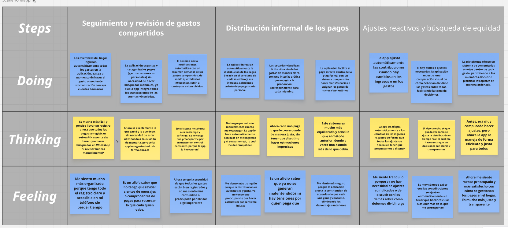
</p>

## 3.2. User Stories
## Epic

| EPIC ID | Nombre del Epic                  | Descripción |
|---------|----------------------------------|-------------|
| EP00    | Arquitectura Técnica y Documentación     | Como desarrollador, quiero diseñar y documentar la arquitectura del sistema para garantizar escalabilidad, mantenimiento y comunicación clara entre miembros del equipo |
| EP01    | Registro y Gestión de Perfil     | Como usuario, quiero registrarme y gestionar mi perfil de forma segura y personalizada, para acceder a Harmonix desde cualquier dispositivo. |
| EP02    | Panel del Representante del Hogar| Como representante del hogar, quiero gestionar y supervisar las finanzas del hogar de forma centralizada y transparente. |
| EP03    | Panel del Miembro del Hogar      | Como miembro del hogar, quiero registrar mis ingresos, ver mis responsabilidades y mantenerme al día con mis pagos. |
| EP04    | Gestión de Gastos Compartidos    | Como usuario, quiero registrar, clasificar y gestionar gastos para mantener el control financiero del hogar. |
| EP05    | Seguimiento y Recordatorios      | Como usuario, quiero recibir recordatorios y alertas automáticas para no olvidar mis responsabilidades financieras. |
| EP06    | Soporte y Comunidad              | Como usuario, quiero acceder a soporte técnico y a recursos para mejorar mi uso de la plataforma y resolver dudas. |
| EP07    | Exploración como Visitante       | Como visitante, quiero conocer la funcionalidad, beneficios y casos de uso de Harmonix desde la landing page para evaluar si la plataforma es útil para mi hogar antes de registrarme. |

### EP01 - Registro y Gestión de Perfil

| User Story ID | Título                          |
|---------------|----------------------------------|
| US01          | Registro de usuario              |
| US02          | Inicio de sesión seguro          |
| US03          | Edición de información personal  |
| US04          | Cierre de sesión desde todos los dispositivos |
| US05          | Configuración de notificaciones personales |
| TS01          | Implementar autenticación JWT |
| TS02          | Cifrar contraseñas en base de datos |
| TS03          | Validar roles de administrador y miembro en backend |
| TS04          | Implementar actualización de perfil a partir de API |  
| TS05          | Conectar formularios de registro y login del front-end con endpoints   |
| TS06          | Validar respuestas del backend en la gestión de perfil del usuario      |

### EP02 - Panel del Representante del Hogar

| User Story ID | Título                          |
|---------------|----------------------------------|
| US06          | Crear hogar                      |
| US07          | Aprobar gastos                   |
| US08          | Ajustar porcentajes de aportes   |
| US09          | Visualizar reportes mensuales    |
| US10          | Configurar métodos de pago aceptados |
| US36          | Manejar errores del servidor en vistas del representante               |

### EP03 - Panel del Miembro del Hogar

| User Story ID | Título                          |
|---------------|----------------------------------|
| US11          | Ingresar ingresos personales     |
| US12          | Ver monto a pagar                |
| US13          | Registrar pagos realizados       |
| US14          | Ver historial de pagos           |
| US15          | Ver distribución de gastos del hogar |
| US37          | Implementar manejo de estados de carga y éxito en el panel del miembro |

### EP04 - Gestión de Gastos Compartidos

| User Story ID | Título                          |
|---------------|----------------------------------|
| US16          | Registrar nuevo gasto            |
| US17          | Adjuntar comprobantes de gasto   |
| US18          | Clasificar gastos por categoría  |
| US19          | Comentar o justificar un gasto   |
| US20          | Visualizar gráficos de gastos    |
| TS07          | Validar que el gasto tiene adjunto al menos 1 comprobante |
| TS08          | Agregar API para filtrar gastos por rango de fecha |
| TS09          | Implementar actualización y eliminación de gastos |  
| TS10          | Verificar integración entre back-end de gastos y sus componentes en front-end |

### EP05 - Seguimiento y Recordatorios

| User Story ID | Título                          |
|---------------|----------------------------------|
| US21          | Recordatorios de pago            |
| US22          | Alertas de pagos pendientes      |
| US23          | Recordatorio de actualización de ingresos |
| US24          | Confirmación de aportes          |
| US25          | Notificación de cambios en el hogar |
| TS11          | API para programar recordatorios de pago |
| TS12          | Integrar cron job para envío de recordatorios |  
| TS13          | Conectar notificaciones del sistema con el backend                     |

### EP06 - Soporte y Comunidad

| User Story ID | Título                          |
|---------------|----------------------------------|
| US26          | Acceso a ayuda en línea          |
| US27          | Chat con soporte técnico         |
| US28          | Reportar un problema             |
| US29          | Sugerencias de mejora            |
| US30          | Foro comunitario                 |
| TS14          | API para dar seguimiento a reportes de problemas |
| TS15          | Implementar comentarios o respuestas en el foro |
| TS16          | Validar seguridad de comunicación entre frontend y backend (CORS, HTTPS) |
| TS17          | Probar funcionamiento completo en entorno de producción                |

### EP07 - Exploración como Visitante

| User Story ID | Título                          |
|---------------|----------------------------------|
  | US31          | Visualizar información general sobre Harmonix desde la landing page              |
| US32          | Conocer las funciones principales para representantes y miembros del hogar         |
| US33          | Explorar beneficios del sistema de aportes proporcionales  |
| US34          | Ver ejemplos o simulaciones de cómo funciona la plataforma |
| US35          | 	Acceder fácilmente al registro o login desde botones destacados |
| TS18          | Documentar los pasos para desplegar nuevas versiones                   |
| TS19          | Habilitar monitoreo básico del sistema desplegado (logs, uptime)       |

### USER STORIES


| **ID Épica** | **Épica**                         | **ID HU** | **Título HU**                                       | **Descripción HU**                                                                                                                                                                     | **Criterios de Aceptación**                                                                                                                                                                                                                                                                                                                                                                                                                                                                                                                                                                                                                                                                                              |
| ------------ | --------------------------------- | --------- | --------------------------------------------------- | -------------------------------------------------------------------------------------------------------------------------------------------------------------------------------------- | ------------------------------------------------------------------------------------------------------------------------------------------------------------------------------------------------------------------------------------------------------------------------------------------------------------------------------------------------------------------------------------------------------------------------------------------------------------------------------------------------------------------------------------------------------------------------------------------------------------------------------------------------------------------------------------------------------------------------ |
| EP01         | Registro y Gestión de Perfil      | US01      | Registro de usuario                                 | Como usuario de ambos segmentos, quiero registrarme en la plataforma para comenzar a usar Harmonix.                                                                                   | - **Escenario 1: Registro como miembro del hogar exitoso**<br> Dado que un usuario quiere registrarse como miembro del hogar,<br> Cuando proporciona todos los datos requeridos correctamente,<br> Entonces el sistema registra al usuario como miembro del hogar,<br> Y el usuario puede acceder a las funcionalidades correspondientes a ese rol.<br><br> - **Escenario 2: Registro como representante del hogar exitoso**<br> Dado que un usuario desea registrarse como representante del hogar,<br> Cuando proporciona todos los datos requeridos correctamente,<br> Entonces el sistema lo registra como representante del hogar,<br> Y el usuario puede acceder a las funcionalidades correspondientes a ese rol. |
| EP01         | Registro y Gestión de Perfil      | US02      | Inicio de sesión seguro                             | Como usuario registrado, quiero iniciar sesión de forma segura para acceder a mis datos personales.                                                                                    | - **Escenario 1: Inicio de sesión exitoso**<br> Dado que el usuario está registrado,<br> Cuando proporciona credenciales válidas,<br> Entonces el sistema le permite acceder a su cuenta.<br><br> - **Escenario 2: Inicio de sesión fallido por credenciales incorrectas**<br> Dado que el usuario intenta autenticarse,<br> Cuando las credenciales proporcionadas no son válidas,<br> Entonces el sistema rechaza el intento de acceso,<br> Y le indica que las credenciales no son válidas.                                                                                                                                                                                                                           |
| EP01         | Registro y Gestión de Perfil      | US03      | Edición de información personal                     | Como usuario de ambos segmentos, quiero editar mi información personal para mantenerla actualizada.                                                                                    | - **Escenario 1: Visualización de información personal**<br> Dado que el usuario ya está logueado,<br> Cuando accede a su información de perfil,<br> Entonces el sistema le muestra sus datos personales actuales en formato editable.<br><br> - **Escenario 2: Actualización de datos personales**<br> Dado que el usuario modifica su información personal,<br> Cuando envía los nuevos datos,<br> Entonces el sistema actualiza correctamente la información.                                                                                                                                                                                                                                                         |
| EP01         | Registro y Gestión de Perfil      | US04      | Cierre de sesión desde todos los dispositivos       | Como usuario de ambos segmentos, quiero cerrar sesión desde todos mis dispositivos para mayor seguridad.                                                                               | - **Escenario 1: Cierre de sesión en todos los dispositivos**<br> Dado que el usuario ha iniciado sesión en su cuenta,<br> Cuando solicita cerrar sesión en todos los dispositivos,<br> Entonces el sistema invalida todas las sesiones activas asociadas a su cuenta.                                                                                                                                                                                                                                                                                                                                                                                                                                                   |
| EP01         | Registro y Gestión de Perfil      | US05      | Configuración de notificaciones personales          | Como usuario de ambos segmentos, quiero configurar mis notificaciones para recibir alertas relevantes.                                                                                 | - **Escenario 1: Visualización de opciones de notificación**<br> Dado que el usuario accede a su configuración de perfil,<br> Cuando solicita ver las opciones de notificación,<br> Entonces el sistema muestra las opciones disponibles para activar o desactivar alertas.<br><br> - **Escenario 2: Aplicación de configuración de notificaciones**<br> Dado que el usuario selecciona sus preferencias de notificación,<br> Cuando envía la configuración,<br> Entonces el sistema guarda las preferencias y las aplica para futuras alertas.                                                                                                                                                                          |
| EP01         | Registro y Gestión de Perfil      | TS01      | Implementar autenticación JWT                       | Como desarrollador, quiero que el inicio de sesión implemente autenticación JWT para mayor seguridad en el manejo de sesiones.                                                         | - **Escenario 1: Generación del JWT**<br> Dado que el usuario proporciona credenciales correctas,<br> Cuando se autentica,<br> Entonces el backend genera y responde con un JWT válido.<br><br> - **Escenario 2: Validación del JWT**<br> Dado que el JWT se adjunta en el encabezado de la solicitud,<br> Cuando el backend verifica el token,<br> Entonces autoriza el acceso si el token es válido.                                                                                                                                                                                                                                                                                                                   |
| EP01         | Registro y Gestión de Perfil      | TS02      | Cifrar contraseñas en base de datos                 | Como desarrollador, quiero que las contraseñas de los usuarios sean encriptadas antes de guardarlas en la base de datos para garantizar la seguridad.                                  | - **Escenario 1: Almacenar contraseña cifrada**<br> Dado que la contraseña llega en texto plano,<br> Cuando el backend lo encripta,<br> Entonces se almacena en la base de datos de forma cifrada.<br><br> - **Escenario 2: Validar contraseña cifrada durante autenticación**<br> Dado que la contraseña en la base de datos está cifrada,<br> Cuando el backend verifica credenciales,<br> Entonces primero hace el hash de la contraseña ingresada y lo compara con el guardado.                                                                                                                                                                                                                                      |
| EP01         | Registro y Gestión de Perfil      | TS03      | Validar roles de administrador y miembro en backend | Como desarrollador, quiero que ciertos endpoints sean usados solo por determinados roles para asegurar que solo los usuarios autorizados puedan ejecutar determinadas acciones         | - **Escenario 1: Acceso permitido a endpoint por rol administrador**<br> Dado que el rol incluido en el JWT es administrador,<br> Cuando invoque un endpoint de administrador,<br> Entonces el backend permitirá el acceso.<br><br> - **Escenario 2: Acceso denegado a endpoint por rol no autorizado**<br> Dado que el rol incluido en el JWT es miembro,<br> Cuando invoque un endpoint de administrador,<br> Entonces el backend rechazará la solicitud con 403 (Forbidden).                                                                                                                                                                                                                                          |
| EP01         | Registro y Gestión de Perfil      | TS04      | Implementar actualización de perfil a partir de API | Como desarrollador, quiero implementar la actualización del perfil de usuario mediante una API para permitir que los usuarios modifiquen su información de manera segura y controlada. | - **Escenario 1: Actualización exitosa**<br> Dado que el token es válido,<br> Cuando el usuario envía nuevos datos,<br> Entonces el backend actualiza el perfil en la base de datos.<br><br> - **Escenario 2: Solicitud sin autenticación válida**<br> Dado que el token es vencido o inexistente,<br> Cuando el backend recibe la solicitud,<br> Entonces responde con 401 (Unauthorized).                                                                                                                                                                                                                                                                                                                              |
| EP01         | Registro y Gestión de Perfil      | TS05      | Conectar formularios con endpoints                  | Como desarrollador, quiero conectar los formularios de registro y login con los endpoints del backend para que funcionen correctamente.                                                | - **Escenario 1: Envío de datos de registro al backend**<br> Dado que el usuario completa el formulario de registro,<br> Cuando envía el formulario,<br> Entonces el formulario envía la información al endpoint correspondiente.<br><br> - **Escenario 2: Autenticación de usuario mediante el backend**<br> Dado que el usuario ingresa sus credenciales,<br> Cuando el frontend las envía al endpoint de autenticación,<br> Entonces el backend valida las credenciales.                                                                                                                                                                                                                                              |
| EP01         | Registro y Gestión de Perfil      | TS06      | Validar respuestas del backend                      | Como desarrollador, quiero validar las respuestas del backend para mostrar mensajes adecuados al usuario.                                                                              | - **Escenario 1: Error en el registro**<br> Dado que haya un error del backend al procesar el registro,<br> Cuando el usuario envíe un formulario,<br> Entonces se mostrará un mensaje de error específico.<br><br> - **Escenario 2: Fallo en el inicio de sesión**<br> Dado que el backend retorne un 401 Unauthorized,<br> Cuando se intente iniciar sesión,<br> Entonces el frontend indicará que las credenciales son inválidas.                                                                                                                                                                                                                                                                                     |
| EP02         | Panel del Representante del Hogar | US06      | Crear hogar                                         | Como representante del hogar, quiero crear un hogar en la app para empezar a gestionar sus finanzas.                                                                                   | - **Escenario 1: Acceso al proceso de creación de hogar**<br> Dado que el usuario ha iniciado sesión como representante del hogar,<br> Cuando accede a la opción de creación de hogar,<br> Entonces podrá ingresar un nombre e ID para el hogar.<br><br> - **Escenario 2: Creación exitosa del hogar**<br> Dado que el usuario completa los campos requeridos,<br> Cuando envía la solicitud de creación,<br> Entonces se crea el hogar y se muestra en su panel.                                                                                                                                                                                                                                                        |
| EP02         | Panel del Representante del Hogar | US07      | Aprobar gastos                                      | Como representante, quiero aprobar gastos para tener control sobre lo que se gasta en el hogar.                                                                                        | - **Escenario 1: Listado de gastos pendientes**<br> Dado que haya gastos sin aprobar,<br> Cuando el representante acceda al panel,<br> Entonces verá una lista de gastos para revisar.<br><br> - **Escenario 2: Aprobación de un gasto**<br> Dado que el representante selecciona un gasto,<br> Cuando confirme su aprobación,<br> Entonces el gasto pasará a estado "Aprobado".                                                                                                                                                                                                                                                                                                                                         |
| EP02         | Panel del Representante del Hogar | US08      | Ajustar porcentajes de aportes                      | Como representante, quiero modificar los porcentajes de contribución de cada miembro según sus ingresos.                                                                               | - **Escenario 1: Acceso a la configuración de aportes**<br> Dado que el representante está autenticado y accede al módulo de gestión del hogar,<br> Cuando accede a la sección de configuración de aportes,<br> Entonces verá una lista editable de miembros.<br><br> - **Escenario 2: Modificación y guardado de aportes**<br> Dado que el representante ha realizado ajustes en los porcentajes,<br> Cuando envía los nuevos valores,<br> Entonces se actualizarán los porcentajes automáticamente.                                                                                                                                                                                                                    |
| EP02         | Panel del Representante del Hogar | US09      | Visualizar reportes mensuales                       | Como representante, quiero ver reportes de ingresos y gastos mensuales para tomar decisiones informadas sobre la economía del hogar.                                                   | - **Escenario 1: Acceso a reportes mensuales**<br> Dado que el representante esté en su dashboard,<br> Cuando accede a la sección de reportes mensuales,<br> Entonces se mostrarán gráficos y resúmenes.<br><br> - **Escenario 2: Descarga de reporte**<br> Dado que el representante ha visualizado un reporte,<br> Cuando solicita su descarga,<br> Entonces el sistema genera un archivo PDF y se descargará el informe correspondiente.                                                                                                                                                                                                                                                                              |
| EP02         | Panel del Representante del Hogar | US10      | Configurar métodos de pago aceptados                | Como representante, quiero configurar qué métodos de pago están habilitados en el hogar.                                                                                               | - **Escenario 1: Ver métodos disponibles**<br> Dado que el usuario acceda a configuración,<br> Cuando seleccione "Métodos de pago",<br> Entonces verá una lista de métodos disponibles.<br><br> - **Escenario 2: Activar métodos**<br> Dado que seleccione métodos específicos,<br> Cuando presione “Guardar”,<br> Entonces esos métodos quedarán habilitados para el hogar.                                                                                                                                                                                                                                                                                                                                             |

| **ID Épica** | **Épica**                         | **ID HU** | **Título HU**                                             | **Descripción HU**                                                                                                     | **Criterios de Aceptación**                                                                                                                                                                                                                                                                                                                                                                                                                                                                                                                         |
| ------------ | --------------------------------- | --------- | --------------------------------------------------------- | ---------------------------------------------------------------------------------------------------------------------- | --------------------------------------------------------------------------------------------------------------------------------------------------------------------------------------------------------------------------------------------------------------------------------------------------------------------------------------------------------------------------------------------------------------------------------------------------------------------------------------------------------------------------------------------------- |
| EP02         | Gestión Personal de Finanzas      | US14      | Ver historial de pagos                                    | Como miembro del hogar, quiero consultar un historial de todos mis pagos anteriores para verificar mis contribuciones. | - **Escenario 1: Acceso al historial**<br> Dado que el usuario quiere ver sus aportes anteriores,<br> Cuando acceda a la sección “Historial de pagos” desde su panel,<br> Entonces verá una lista ordenada cronológicamente con fechas, montos, conceptos y comprobantes de cada pago realizado.<br><br> - **Escenario 2: Filtro por periodo**<br> Dado que el usuario desea consultar un periodo específico,<br> Cuando seleccione un mes o rango de fechas,<br> Entonces el sistema mostrará únicamente los pagos correspondientes a ese periodo. |
| EP02         | Panel del Representante del Hogar | US36      | Manejar errores del servidor                              | Como representante, quiero que el sistema maneje errores del servidor de forma clara para entender qué ocurre.         | - **Escenario 1: Error al cargar gastos**<br> Dado que haya una falla en el endpoint de gastos,<br> Cuando se intente acceder al listado,<br> Entonces se mostrará un mensaje "No se pudo cargar los datos".                                                                                                                                                                                                                                                                                                                                        |
| EP03         | Panel del Miembro del Hogar       | US11      | Ingresar ingresos personales                              | Como miembro del hogar, quiero registrar mis ingresos para que el sistema calcule mi aporte.                           | - **Escenario 1: Acceso al formulario de ingresos**<br> Dado que el miembro haya iniciado sesión,<br> Cuando seleccione "Ingresos",<br> Entonces se mostrará el formulario de ingreso de datos.<br><br> - **Escenario 2: Confirmación de ingreso**<br> Dado que complete los datos,<br> Cuando presione "Guardar",<br> Entonces su ingreso quedará registrado en el sistema.                                                                                                                                                                        |
| EP03         | Panel del Miembro del Hogar       | US12      | Ver monto a pagar                                         | Como miembro del hogar, quiero visualizar cuánto debo aportar al hogar basado en mis ingresos.                         | - **Escenario 1: Acceso al panel de pagos**<br> Dado que el usuario haya ingresado sus ingresos,<br> Cuando acceda a "Mis aportes",<br> Entonces verá el monto que le corresponde pagar este mes.                                                                                                                                                                                                                                                                                                                                                   |
| EP03         | Panel del Miembro del Hogar       | US13      | Registrar pagos realizados                                | Como miembro del hogar, quiero registrar que realicé un pago para que el sistema lleve un seguimiento.                 | - **Escenario 1: Ingreso de pago**<br> Dado que el miembro haya realizado un pago,<br> Cuando acceda a "Registrar pago",<br> Entonces podrá indicar el monto, la fecha y el método usado.<br><br> - **Escenario 2: Confirmación**<br> Dado que ingrese los datos,<br> Cuando presione “Guardar”,<br> Entonces el pago quedará registrado correctamente.                                                                                                                                                                                             |
| EP03         | Gestión Personal de Finanzas      | US15      | Ver historial de pagos                                    | Como miembro del hogar, quiero consultar un historial de todos mis pagos anteriores para verificar mis contribuciones. | - **Escenario 1: Acceso al historial**<br> Dado que el usuario quiere ver sus aportes anteriores,<br> Cuando acceda a la sección “Historial de pagos” desde su panel,<br> Entonces verá una lista ordenada cronológicamente con fechas, montos, conceptos y comprobantes de cada pago realizado.<br><br> - **Escenario 2: Filtro por periodo**<br> Dado que el usuario desea consultar un periodo específico,<br> Cuando seleccione un mes o rango de fechas,<br> Entonces el sistema mostrará únicamente los pagos correspondientes a ese periodo. |
| EP03         | Panel del Miembro del Hogar       | US37      | Manejo de estados de carga y éxito                        | Como miembro del hogar, quiero ver indicadores de carga o éxito al registrar mis datos para mejorar la experiencia.    | - **Escenario 1: Indicador de carga**<br> Dado que se envían datos al backend,<br> Cuando aún no se recibe respuesta,<br> Entonces se mostrará un spinner de carga.<br><br> - **Escenario 2: Registro exitoso**<br> Dado que se guarde correctamente,<br> Cuando el servidor responda,<br> Entonces se muestra un mensaje de éxito.                                                                                                                                                                                                                 |
| EP04         | Gestión de Gastos Compartidos     | US16      | Registrar nuevo gasto                                     | Como usuario, quiero registrar un nuevo gasto para mantener actualizados los movimientos financieros.                  | - **Escenario 1: Acceso al formulario**<br> Dado que el usuario haya iniciado sesión,<br> Cuando acceda a "Registrar gasto",<br> Entonces verá un formulario con campos de monto, categoría y descripción.<br><br> - **Escenario 2: Guardado del gasto**<br> Dado que complete el formulario,<br> Cuando presione “Guardar”,<br> Entonces el nuevo gasto se almacenará en el sistema.                                                                                                                                                               |
| EP04         | Gestión de Gastos Compartidos     | US17      | Adjuntar comprobantes de gasto                            | Como usuario, quiero subir comprobantes para respaldar los gastos registrados.                                         | - **Escenario 1: Carga de comprobante**<br> Dado que el usuario registre un gasto,<br> Cuando presione “Adjuntar archivo”,<br> Entonces podrá subir una imagen o PDF como comprobante.<br><br> - **Escenario 2: Visualización**<br> Dado que se haya adjuntado un comprobante,<br> Cuando acceda al gasto,<br> Entonces podrá ver o descargar el archivo.                                                                                                                                                                                           |
| EP04         | Gestión de Gastos Compartidos     | US18      | Clasificar gastos por categoría                           | Como usuario, quiero categorizar los gastos para facilitar su análisis y visualización.                                | - **Escenario 1: Selección de categoría**<br> Dado que el usuario registre un gasto,<br> Cuando acceda a la lista de categorías,<br> Entonces podrá seleccionar entre alimentación, servicios, mantenimiento, etc.<br><br> - **Escenario 2: Filtro**<br> Dado que seleccione una categoría,<br> Cuando aplique el filtro,<br> Entonces se mostrarán solo los gastos correspondientes.                                                                                                                                                               |
| EP04         | Gestión de Gastos Compartidos     | US19      | Comentar o justificar un gasto                            | Como usuario, quiero añadir comentarios para explicar el motivo de un gasto compartido.                                | - **Escenario 1: Comentario en gasto**<br> Dado que el usuario haya registrado un gasto,<br> Cuando seleccione “Añadir comentario”,<br> Entonces podrá escribir y guardar una nota explicativa visible a los miembros del hogar.                                                                                                                                                                                                                                                                                                                    |
| EP04         | Gestión de Gastos Compartidos     | US20      | Visualizar gráficos de gastos                             | Como usuario, quiero ver gráficos de gastos para entender en qué se gasta más.                                         | - **Escenario 1: Acceso a visualizaciones**<br> Dado que el usuario esté en el panel de gastos,<br> Cuando acceda a “Ver gráficos”,<br> Entonces podrá ver gráficos circulares o de barras agrupados por categoría, fecha o usuario.                                                                                                                                                                                                                                                                                                                |
| EP04         | Gestión de Gastos Compartidos     | TS07      | Validar que el gasto tenga adjunto al menos 1 comprobante | Como desarrollador, quiero que cada gasto tenga al menos 1 comprobante adjunto antes de guardarlo.                     | - **Escenario 1: Gasto sin adjunto**<br> Dado que el gasto no tiene comprobante,<br> Cuando el backend recibe la solicitud,<br> Entonces responde con error 400.<br>- **Escenario 2: Gasto con adjunto**<br> Dado que el gasto tiene comprobante,<br> Cuando el backend grava en la base de datos,<br> Entonces lo acepta.                                                                                                                                                                                                                          |
| EP04         | Gestión de Gastos Compartidos     | TS08      | Agregar API para filtrar gastos por rango de fecha        | Como desarrollador, quiero filtrar gastos según rango de fecha.                                                        | - **Escenario 1: Filtrar con rango válido**<br> Dado que envío inicio y fin,<br> Cuando el backend filtra,<br> Entonces responde con gastos en ese rango.<br>- **Escenario 2: Rango sin resultados**<br> Dado que el rango no tiene gastos,<br> Cuando el backend consulta,<br> Entonces responde con una lista vacía.                                                                                                                                                                                                                              |
| EP04         | Gestión de Gastos Compartidos     | TS09      | Implementar actualización y eliminación de gastos         | Como desarrollador, quiero poder actualizar o eliminar gastos.                                                         | - **Escenario 1: Actualización**<br> Dado que el gasto existe,<br> Cuando el administrador envía nuevos datos,<br> Entonces el backend actualiza el registro.<br>- **Escenario 2: Eliminado**<br> Dado que el administrador solicita borrar,<br> Cuando el backend elimina el gasto,<br> Entonces deja de aparecer en futuros reportes.                                                                                                                                                                                                             |
| EP04         | Gestión de Gastos Compartidos     | TS10      | Verificar integración de gastos                           | Como desarrollador, quiero verificar que el backend de gastos esté correctamente conectado al frontend.                | - **Escenario 1: Mostrar lista de gastos**<br> Dado que haya gastos registrados,<br> Cuando el usuario acceda a la sección de gastos,<br> Entonces se mostrará la información proveniente del backend.<br><br> - **Escenario 2: Agregar gasto**<br> Dado que se complete el formulario,<br> Cuando se presione "Guardar",<br> Entonces se guardará mediante la API y se actualizará la vista.                                                                                                                                                       |
| EP05         | Seguimiento y Recordatorios       | US21      | Recordatorios de pago                                     | Como usuario, quiero recibir recordatorios automáticos de pago para no retrasarme en mis aportes.                      | - **Escenario 1: Activación del recordatorio**<br> Dado que el usuario tenga una fecha límite de pago,<br> Cuando se acerque esa fecha,<br> Entonces recibirá una notificación automática por correo o en la app.<br><br> - **Escenario 2: Configuración**<br> Dado que acceda a ajustes,<br> Cuando edite preferencias,<br> Entonces podrá activar o desactivar los recordatorios.                                                                                                                                                                 |
| EP05         | Seguimiento y Recordatorios       | US22      | Alertas de pagos pendientes                               | Como usuario, quiero ser alertado si tengo pagos atrasados para regularizar mi situación.                              | - **Escenario 1: Detección automática**<br> Dado que el usuario no haya pagado después de la fecha límite,<br> Cuando acceda al sistema,<br> Entonces verá una alerta destacada en su panel.<br><br> - **Escenario 2: Alerta múltiple**<br> Dado que haya varios pagos pendientes,<br> Cuando abra la alerta,<br> Entonces podrá ver el detalle de cada uno.                                                                                                                                                                                        |
| EP05         | Seguimiento y Recordatorios       | US23      | Recordatorio de actualización de ingresos                 | Como usuario, quiero ser recordado de actualizar mis ingresos para mantener la equidad del sistema.                    | - **Escenario 1: Periodicidad**<br> Dado que haya pasado un mes sin actualización,<br> Cuando el usuario inicie sesión,<br> Entonces verá un mensaje solicitando revisar su ingreso.<br><br> - **Escenario 2: Confirmación**<br> Dado que actualice el ingreso,<br> Cuando guarde los cambios,<br> Entonces se reiniciará el periodo de espera.                                                                                                                                                                                                     |
| EP05         | Seguimiento y Recordatorios       | US24      | Confirmación de aportes                                   | Como usuario, quiero recibir confirmación cada vez que realizo un aporte para mayor seguridad.                         | - **Escenario 1: Notificación inmediata**<br> Dado que el usuario registre un pago,<br> Cuando el sistema lo procese,<br> Entonces recibirá una confirmación por correo o notificación dentro de la app.<br><br> - **Escenario 2: Registro visible**<br> Dado que quiera revisar sus confirmaciones,<br> Cuando acceda al historial,<br> Entonces verá las confirmaciones pasadas.                                                                                                                                                                  |
| EP05         | Seguimiento y Recordatorios       | US25      | Notificación de cambios en el hogar                       | Como usuario, quiero ser notificado si hay cambios en el hogar para estar informado.                                   | - **Escenario 1: Nuevo miembro**<br> Dado que un nuevo miembro se una,<br> Cuando sea aprobado por el representante,<br> Entonces se notificará a todos los miembros.<br><br> - **Escenario 2: Cambios administrativos**<br> Dado que el representante edite los porcentajes de aporte,<br> Cuando se guarde el cambio,<br> Entonces se notificará a los afectados.                                                                                                                                                                                 |
| EP05         | Seguimiento y Recordatorios       | TS11      | API para programar recordatorios de pago                  | Como desarrollador, quiero dar de alta recordatorios específicos de pago en el backend.                                | - **Escenario 1: Crear recordatorio**<br> Dado que el administrador proporciona fecha y monto,<br> Cuando el backend graba el recordatorio,<br> Entonces el recordatorio queda incluido en la base de datos.<br>- **Escenario 2: Listar recordatorios**<br> Dado que el administrador consulta,<br> Cuando el backend responde,<br> Entonces proporciona la lista de recordatorios pendientes.                                                                                                                                                      |


## 3.3. Impact Mapping

### Segmento 1: Miembros del hogar

<p styles="align: left">
  
</p>


### Segmento 2: Representante del hogar

<p styles="align: left">
  
</p>

## 3.4. Product Backlog

| Prioridad | User Story ID | Título HU                                                 | Story Points |
| --------- | ------------- | --------------------------------------------------------- | ------------ |
| Alta      | US01          | Registro de usuario                                       | 8            |
| Alta      | US02          | Inicio de sesión seguro                                   | 5            |
| Alta      | TS01          | Implementar autenticación JWT                             | 8            |
| Alta      | TS02          | Cifrar contraseñas en base de datos                       | 5            |
| Alta      | TS03          | Validar roles de administrador y miembro en backend       | 8            |
| Alta      | TS05          | Conectar formularios con endpoints                        | 5            |
| Alta      | TS06          | Validar respuestas del backend                            | 3            |
| Media     | US03          | Edición de información personal                           | 5            |
| Media     | US04          | Cierre de sesión desde todos los dispositivos             | 5            |
| Media     | US05          | Configuración de notificaciones personales                | 5            |
| Media     | TS04          | Implementar actualización de perfil a partir de API       | 5            |
| Alta      | US06          | Crear hogar                                               | 8            |
| Alta      | US07          | Aprobar gastos                                            | 5            |
| Alta      | US08          | Ajustar porcentajes de aportes                            | 8            |
| Alta      | US09          | Visualizar reportes mensuales                             | 8            |
| Media     | US10          | Configurar métodos de pago aceptados                      | 5            |
| Media     | US14          | Ver historial de pagos (representante)                    | 5            |
| Media     | US36          | Manejar errores del servidor                              | 3            |
| Alta      | US11          | Ingresar ingresos personales                              | 5            |
| Alta      | US12          | Ver monto a pagar                                         | 5            |
| Alta      | US13          | Registrar pagos realizados                                | 5            |
| Media     | US15          | Ver historial de pagos (miembro)                          | 5            |
| Media     | US37          | Manejo de estados de carga y éxito                        | 3            |
| Alta      | US16          | Registrar nuevo gasto                                     | 8            |
| Media     | US17          | Adjuntar comprobantes de gasto                            | 5            |
| Media     | US18          | Clasificar gastos por categoría                           | 5            |
| Media     | US19          | Comentar o justificar un gasto                            | 3            |
| Media     | US20          | Visualizar gráficos de gastos                             | 8            |
| Alta      | TS07          | Validar que el gasto tenga adjunto al menos 1 comprobante | 5            |
| Media     | TS08          | Agregar API para filtrar gastos por rango de fecha        | 5            |
| Media     | TS09          | Implementar actualización y eliminación de gastos         | 8            |
| Media     | TS10          | Verificar integración de gastos                           | 5            |
| Media     | US21          | Recordatorios de pago                                     | 5            |
| Media     | US22          | Alertas de pagos pendientes                               | 5            |
| Baja      | US23          | Recordatorio de actualización de ingresos                 | 3            |
| Baja      | US24          | Confirmación de aportes                                   | 3            |
| Baja      | US25          | Notificación de cambios en el hogar                       | 3            |
| Media     | TS11          | API para programar recordatorios de pago                  | 5            |

# Capítulo IV: Product Design
## 4.1. Style Guidelines.

Harmonix es una plataforma digital orientada a la simplificación y el equilibrio en la gestión financiera del hogar. Mediante un sistema de cálculo proporcional basado en los ingresos, facilita la distribución justa de los gastos, promoviendo la transparencia, la colaboración y el control compartido. Su interfaz, de carácter moderno y minimalista, responde a las demandas de los hogares contemporáneos que requieren soluciones eficientes, accesibles y sostenibles en el tiempo.

La presente sección consolida una guía integral de estilo, en la cual se definen los elementos visuales y de diseño que sustentan la identidad de Harmonix. Se incorporan tipografías, paleta cromática —con predominio de negro, blanco y azul celeste—, íconos y componentes de interfaz, con el objetivo de asegurar una representación visual coherente, sobria y alineada con la visión tecnológica y funcional de la marca.

La estructura de las guías de estilo se organiza en tres bloques principales: General Style Guidelines, Web Style Guidelines y Mobile Style Guidelines. Esta división garantiza una experiencia uniforme, accesible y consistente en todos los dispositivos, fortaleciendo la navegabilidad, la confianza del usuario y la comunicación visual de los valores fundamentales de la plataforma: claridad, equilibrio y control.

### 4.1.1. General Style Guidelines.

Harmonix transmite una identidad visual moderna, clara y funcional, alineada con sus valores de transparencia, colaboración y equidad financiera. La marca se apoya en una base cromática oscura para reflejar profesionalismo y seriedad, mientras que el azul celeste se utiliza como color de acento para resaltar interacciones relevantes, aportando frescura y un carácter tecnológico.

El logotipo, de diseño simple y distintivo, asegura un reconocimiento inmediato en diferentes dispositivos y formatos. La tipografía, de estilo limpio y legible, contribuye a una navegación fluida y una experiencia coherente en todas las interfaces.

En conjunto, la estética de Harmonix busca transmitir control y confianza, reforzando el propósito de la plataforma: facilitar la organización financiera del hogar de manera justa, práctica y accesible.

#### Tipografía

La tipografía oficial de Harmonix es **Roboto**, seleccionada por su estilo moderno, alta legibilidad en fondos oscuros y flexibilidad en interfaces digitales. Se emplean las variantes Regular, Medium, Bold y Black para establecer jerarquías visuales claras.

- `h1` → 3em (48px)  
- `h2` → 2em (32px)  
- `h3` → 1em (16px)  
- **Texto general** → 1em (16px)

Esta estructura tipográfica garantiza consistencia visual y facilidad de lectura en todos los dispositivos.

#### Colores

La identidad visual se apoya en un esquema cromático que combina **sobriedad y modernidad**.  

- **Color base (fondo principal)**: `#000000` (negro)  
- **Primario**: `#1565C0` (azul oscuro)  
- **Secundario**: `#42A5F5` (celeste)  
- **Apoyo**: `#E3F2FD` (azul claro)  
- **Texto**: `#FFFFFF` (blanco)  

<p styles="align: left">
  
</p>  

Esta combinación de colores refuerza la **claridad, accesibilidad y coherencia visual** de la plataforma.  

#### Espaciado  

La estructura de espaciado está diseñada para mantener un **orden visual armónico**:  

- **Botones**: `padding 1rem` (vertical), `2rem` (horizontal)  
- **Texto**: `margin-bottom: 1rem` en `h1`, `h2`, `p`, etc.  
- **Elementos**: `margin-bottom: 1.5rem` en tarjetas y componentes similares  
- **Secciones**: `padding: 2rem` en contenedores (ajustable a `6rem`)  

#### Iconografía  

Harmonix utiliza **Bootstrap Icons**, garantizando consistencia, escalabilidad y compatibilidad en diferentes resoluciones.  

**Íconos principales**  
- `bi-house-door-fill` → Inicio  
- `bi-info-circle-fill` → Información  
- `bi-gear-fill` → Servicios  
- `bi-question-circle-fill` → Guía de uso  
- `bi-currency-dollar` → Planes  
- `bi-chat-left-quote-fill` → Opiniones  
- `bi-envelope-fill` → Contacto  

**Íconos en servicios**  
- `bi-calculator` → Cálculo proporcional  
- `bi-pie-chart-fill` → Seguimiento de gastos  
- `bi-people-fill` → Colaboración  

**Íconos en flujo de uso**  
- `bi-person-plus-fill` → Registro  
- `bi-house-fill` → Crear hogar  
- `bi-cash-coin` → Aportes  
- `bi-bar-chart-fill` → Control financiero  

**Íconos en footer**
- Redes sociales: `bi-facebook`, `bi-instagram`, `bi-twitter`, `bi-linkedin`  
- Contacto: `bi-envelope-fill`  

El uso uniforme de iconos asegura **coherencia estética y usabilidad**.  

#### Tono de Comunicación y Lenguaje Aplicado

El tono de Harmonix es **claro, inclusivo y accesible**, diseñado para generar confianza y facilitar la adopción de la plataforma.  

**Características principales**:  
- **Amigable y cercano**: lenguaje directo y motivador  
- **Claridad funcional**: roles diferenciados  
  - **Representante**: crea y gestiona el hogar  
  - **Miembro**: se une mediante ID  
- **Proceso simplificado**: instrucciones breves y fáciles de seguir  
- **Empatía**: reconoce y aborda los desafíos de la gestión financiera en el hogar  
- **Acción inmediata**: llamadas directas como *“Crea tu hogar”* o *“Ingresa a tu hogar”*  
- **Accesibilidad**: redacción libre de tecnicismos innecesarios  

Este tono refuerza la **transparencia y cercanía** de la marca, asegurando que cada usuario se sienta acompañado en el control de sus finanzas compartidas.  

### 4.1.2. Web Style Guidelines.

Se utilizó la tendencia web de **funcionalismo minimalista** con un esquema de colores oscuros predominante (negro y gris oscuro) como fondo. Esto proporciona una experiencia visual suave, favoreciendo el contraste con elementos interactivos y textos claros.

<p styles="align: left">
  
</p>

Para enriquecer la estética y agregar dinamismo:

- Se emplearon íconos blancos con moderación.  
- El diseño se mantiene minimalista pero atractivo.  
- Los íconos, claramente visibles sobre el fondo oscuro, refuerzan una experiencia visual limpia y ordenada.

Este equilibrio entre funcionalidad y diseño moderno garantiza una interfaz eficaz y atractiva.

<p styles="align: left">
  
</p>

## 4.2. Information Architecture.
### 4.2.1. Organization Systems  

En la plataforma **Harmonix**, se aplican diferentes sistemas de organización del contenido para optimizar la **accesibilidad** y la **experiencia de usuario**, en función del tipo de información presentada.  
Estos sistemas garantizan una navegación intuitiva, clara y eficiente.  

#### Organización Visual del Contenido  

**Jerárquica (Visual Hierarchy):**  
Se utiliza en secciones que requieren una estructura clara de importancia y relevancia, como formularios de creación de hogar o asignación de aportes.  
Se aplican **variaciones tipográficas** y un **orden lógico de presentación** para resaltar los elementos más relevantes (botones de acción o campos requeridos), guiando al usuario de manera natural a través del flujo de la aplicación.  

**Secuencial (Step-by-Step):**  
En procesos que deben completarse paso a paso —como el registro de usuario o la creación de un hogar— se aplica un enfoque secuencial.  
Cada paso se presenta en una pantalla específica, lo que permite a los usuarios comprender y completar cada acción antes de avanzar, reduciendo errores y confusión.  

#### Esquemas de Categorización de Contenido  

**Por Audiencia (User Groups):**  
La plataforma distingue entre **representantes de hogar** y **miembros de hogar**:  
- **Representantes** → gestionan aportes y creación de hogar.  
- **Miembros** → consultan sus aportes y realizan seguimiento de gastos.  

Esta categorización asegura que cada tipo de usuario acceda únicamente a las funcionalidades que necesita, reforzando la simplicidad y eficiencia de la experiencia.  

**Por Tópicos:**  
En las secciones de ayuda y soporte, el contenido se organiza por categorías temáticas:  
- *Preguntas Frecuentes*  
- *Política de Privacidad*  
- *Centro de Ayuda*  

Esto facilita la búsqueda de información relevante y la resolución autónoma de dudas por parte del usuario.  

#### Implementación en la Interfaz  

La aplicación de estos sistemas se refleja en el diseño mediante:  
- **Navegación clara y estructurada** con menús desplegables.  
- **Botones con texto explicativo** que guían acciones.  
- **Flujos visibles paso a paso** en procesos clave.  
- **Íconos y etiquetas textuales** que refuerzan la comprensión del contenido.  

De esta manera, Harmonix asegura una experiencia de navegación **intuitiva, eficiente y adaptada** a cada perfil de usuario, manteniendo coherencia con su estilo visual minimalista y accesible.  

### 4.2.2. Labeling Systems.

La landing page de **Harmonix** emplea un sistema de etiquetado **directo, simple y orientado a la acción**, cuyo objetivo principal es facilitar la comprensión inmediata del contenido y garantizar una navegación fluida para distintos tipos de usuarios.  

El sistema de etiquetado se caracteriza por:  
- Uso de **términos cortos y claros**, evitando ambigüedades.  
- Refuerzo mediante **íconos visuales de Bootstrap Icons**, que optimizan la identificación de secciones.  
- Consistencia terminológica en todas las áreas de la interfaz, reforzando la coherencia comunicativa.  

#### Menú de navegación  

En el menú principal, ubicado en la parte superior de la landing page, se emplean etiquetas simples y directas, acompañadas de íconos para mejorar la comprensión visual:  

- **Home** (`bi-house-door-fill`)  
- **About** (`bi-info-circle-fill`)  
- **Services** (`bi-tools`)  
- **How does it work?** (`bi-lightbulb-fill`)  
- **Prices** (`bi-currency-dollar`)  
- **Reviews** (`bi-chat-dots-fill`)  
- **Contact us** (`bi-envelope-fill`)  

<p styles="align: left">
    
</p>  

#### Botón principal (CTA)  

El botón principal de la landing page funciona como la **llamada a la acción (CTA)** más destacada:  

- **Register** → etiqueta clara y universal, válida tanto para miembros como para representantes.  

<p styles="align: left">
    
</p>  

#### Sección *How does it work?* – Representantes  

Para los **representantes del hogar**, las etiquetas enfatizan acciones de gestión:  

- **Sign up** (`bi-person-plus-fill`)  
- **Create your home** (`bi-house-fill`)  
- **Assign contributions** (`bi-cash-coin`)  
- **Control your finances** (`bi-bar-chart-fill`)  

<p styles="align: left">
    
</p>  

#### Sección *How does it work?* – Miembros  

Para los **miembros del hogar**, las etiquetas refuerzan su rol de participación:  

- **Sign up** (`bi-person-plus-fill`)  
- **Join a household** (`bi-key-fill`)  
- **Declare your income** (`bi-wallet-fill`)  
- **Monitor your contributions** (`bi-graph-up-arrow`)  

<p styles="align: left">
    
</p>  


#### Footer  

El pie de página organiza el etiquetado en dos bloques principales:  

- **Enlaces legales:**  
  - Legal notice  
  - Privacy Policy  
  - Cookies Policy  

- **Soporte y ayuda:**  
  - Contact Support  
  - Help Center  
  - Frequently asked questions

Además, se incluyen **íconos de redes sociales** (Facebook, Instagram, Twitter, LinkedIn) que funcionan como accesos rápidos.  

<p styles="align: left">
    
</p>  

### 4.2.3. SEO Tags and Meta Tags

En el desarrollo de la landing page de Harmonix, la correcta implementación de etiquetas SEO (Search Engine Optimization) y Meta Tags resulta fundamental para optimizar la visibilidad del sitio en motores de búsqueda y garantizar una adecuada indexación del contenido. Estas etiquetas permiten describir de manera precisa el propósito de la plataforma, los servicios ofrecidos y las palabras clave asociadas, favoreciendo que el proyecto sea fácilmente localizable por usuarios interesados en soluciones de gestión financiera compartida.

Asimismo, los Meta Tags proporcionan información esencial para la accesibilidad y la experiencia del usuario, ya que definen parámetros técnicos como la codificación de caracteres, la adaptación a distintos dispositivos y la atribución de autoría del proyecto. En conjunto, estos elementos no solo fortalecen el posicionamiento orgánico de Harmonix en buscadores, sino que también refuerzan su identidad digital, coherente con los valores de claridad, transparencia y equidad financiera que la marca transmite.

html
<head>
    <meta charset="utf-8">
    <meta name="viewport" content="width=device-width, initial-scale=1">

    <title>Hamonix - Control financiero justo para tu hogar</title>
    <meta name="description" content="Hamonix te ayuda a dividir los gastos del hogar de forma proporcional según los ingresos de cada miembro. Fácil, justo y transparente.">
    <meta name="keywords" content="Hamonix, finanzas compartidas, gastos del hogar, app de finanzas, control de gastos, división de pagos">
    <meta name="author" content="Equipo Hamonix">

    <!-- CSS & Icons -->
    <link href="https://cdn.jsdelivr.net/npm/bootstrap@5.3.3/dist/css/bootstrap.min.css" rel="stylesheet">
    <link rel="stylesheet" href="https://cdn.jsdelivr.net/npm/bootstrap-icons@1.11.3/font/bootstrap-icons.min.css">
    <link rel="preconnect" href="https://fonts.googleapis.com">
    <link rel="preconnect" href="https://fonts.gstatic.com" crossorigin>
    <link href="https://fonts.googleapis.com/css2?family=Roboto&display=swap" rel="stylesheet">
    <link rel="stylesheet" href="css/style.css">
    <link rel="icon" href="/images/logo.PNG" alt="Logo">
</head>

### 4.2.4. Searching Systems.

En el caso de **Harmonix**, se implementará un sistema de búsqueda y filtros diseñado para que tanto los **miembros** como los **representantes del hogar** puedan acceder de manera rápida y sencilla a la información que necesitan.  
El sistema estará optimizado según el rol del usuario, garantizando una navegación fluida y eficiente dentro de la aplicación.

#### Filtros de búsqueda por entradas

**Miembros del hogar:**
- **Buscar por ID de hogar:** Permite unirse a un hogar ya creado ingresando el ID proporcionado por el representante.  
- **Filtrar por fecha de contribución:** Visualizar el historial de aportes organizados por periodos (semanal, mensual).  
- **Estado de los aportes:** Filtrar contribuciones por estado: `"Aportado"`, `"Pendiente"`, `"Excedente"`.  
- **Filtrar por tipo de gasto:** Clasificar los gastos en categorías como `"Alimentos"`, `"Servicios"`, `"Otros"`.  

**Representantes del hogar:**
- **Filtrar por estado de los aportes:** Consultar las contribuciones según estado o rango de fechas.  
- **Filtrar por miembros:** Buscar por nombre o ID de miembro para revisar su historial de aportes.  
- **Balance financiero:** Filtrar el balance general del hogar por periodo o tipo de gasto.  


#### Filtros de búsqueda por tabs

Para una mejor experiencia, la aplicación contará con **tabs interactivos** que agrupan la información de forma clara y ordenada.

**Miembros:**
- **Historial de aportes:** Resumen con filtros por fecha, monto y estado.  
- **Estado de gastos:** Visualización gráfica de la distribución de los gastos del hogar.  
- **Unirse a hogar (ID):** Asociación rápida al perfil vinculado mediante el ID del hogar.  

**Representantes:**
- **Gestión de aportes:** Vista completa de aportes de todos los miembros, filtrable por estado y fecha.  
- **Balance general:** Resumen financiero global con filtros por categorías y periodos.  


#### Flujo de búsqueda y filtros

El flujo será **intuitivo y dinámico**.  
En cada sección relevante (aportaciones, balances, gastos), se integrarán campos de búsqueda y filtros configurables.  
Los usuarios podrán aplicar o remover filtros con facilidad, garantizando una experiencia ágil, clara y sin fricciones.

### 4.2.5. Navigation Systems.

En **Harmonix**, la navegación está diseñada para ser **fluida, intuitiva y accesible**, garantizando una experiencia clara tanto en la **Landing Page** como en la **Web Application**.

#### 1. Navegación en la Landing Page

La **página principal** guía a nuevos usuarios de manera sencilla hacia el registro y la información clave del producto, combinando estética y usabilidad.

**Elementos principales de navegación:**
- **Menú de navegación superior (con iconos):**
  - *Home*  
  - *About*  
  - *Services*  
  - *How it works*  
  - *Plans & Pricing*  
  - *Reviews*  
  - *Contact us*
- **Call To Actions (CTAs):**
  - Ejemplo: *"Sign up now"*, *"Get started"*.
- **Desplazamiento fluido:**
  - Scroll natural por secciones sin necesidad de recargar la página. 

#### 2. Navegación en la Web Application

La navegación se adapta al **tipo de usuario** y sus funcionalidades más relevantes.

#### Para Representantes del Hogar:

**Menú lateral fijo con opciones:**
- Dashboard  
- Miembros del hogar  
- Gastos  
- Aportes  
- Configuración del hogar  

**Breadcrumbs (migas de pan):**  
Permiten volver fácilmente a secciones anteriores o más generales.

#### Para Miembros del Hogar:

**Menú superior simplificado con opciones:**
- Dashboard  
- Aportes  
- Estado del hogar  
- Unirse mediante ID de hogar  

**Accesos rápidos (botones flotantes):**
- Agregar aporte  
- Ver detalles del gasto  

#### Interacción con el sistema 

- **Accesibilidad:** Navegación clara, visible y con etiquetas comprensibles para todo tipo de usuarios.  
- **Navegación de búsqueda:** Accesos rápidos para filtrar por ID de hogar, estado de aportes o categorías de gastos.  
- **Soporte y ayuda:** Sección de tutoriales y guías interactivas paso a paso, integradas dentro de la aplicación.  

## 4.3. Landing Page UI Design.
### 4.3.1. Landing Page Wireframe.

La **Landing Page** constituye el primer punto de interacción entre el usuario y la plataforma **Harmonix**, por lo que su diseño debe ser claro, atractivo y funcional.  
El wireframe presentado a continuación permite visualizar de manera preliminar la disposición de los elementos clave, garantizando una **navegación intuitiva**, la **jerarquización de la información** y la correcta integración de **llamadas a la acción (CTAs)** que orienten al usuario hacia el registro y el uso de la aplicación.  

Los esquemas se centran en reflejar los bloques fundamentales de la interfaz, como el menú de navegación, secciones de presentación de servicios, planes de precios, testimonios, y la sección de contacto. Este enfoque asegura una experiencia de usuario consistente con los objetivos de comunicación de la startup.

<p styles="align: left">
  
</p>
<p styles="align: left">
  
</p>
<p styles="align: left">
  
</p>
<p styles="align: left">
  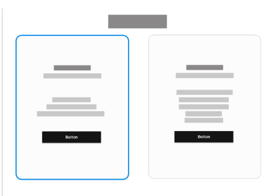
</p>
<p styles="align: left">
  
</p>

### 4.3.2. Landing Page Mock-up.

El **mock-up de la Landing Page** representa la materialización visual del wireframe previamente diseñado, incorporando el uso de tipografías, paleta de colores, íconos y demás elementos gráficos definidos en las **Web Style Guidelines**.  
Este recurso permite evaluar de manera más precisa la apariencia final de la página antes de su desarrollo, asegurando la coherencia entre la propuesta conceptual, la identidad visual de la marca y la experiencia de usuario deseada.  

El mock-up facilita la validación temprana con los interesados (stakeholders), al ofrecer una visión clara y tangible de cómo se presentarán los contenidos, las llamadas a la acción y la navegación en un entorno realista.

<p styles="align: left">
  
</p>

## 4.4. Web Applications UX/UI Design.
En este apartado se define la propuesta de diseño UX/UI para Harmonix, enfocada en brindar una experiencia simple, intuitiva y transparente en la gestión de gastos compartidos. El diseño prioriza la facilidad de uso para los distintos perfiles de usuario (miembros y representantes del hogar), asegurando accesibilidad desde dispositivos móviles y navegadores web. Se emplean principios de usabilidad, consistencia visual y jerarquía de la información, con el objetivo de reducir fricciones en el registro de datos, visualización de aportes y seguimiento de pagos, fortaleciendo la confianza y satisfacción de los usuarios.

### 4.4.1. Web Applications Wireframes.

<p styles="align: left">
  
</p>

### 4.4.2. Web Applications Wireflow Diagrams.

<p styles="align: left">
  
</p>

### 4.4.2. Web Applications Mock-ups.

<p styles="align: left">
  
</p>

### 4.4.3. Web Applications User Flow Diagrams.
A continuación, se presenta el User Flow Diagram, diseñado a partir de los objetivos principales de los usuarios. El flujo refleja cada meta funcional dentro de la aplicación y los distintos recorridos que pueden seguir para alcanzarla. Para una mejor comprensión, se incluyen mockups de alta fidelidad que ilustran visualmente cada paso, facilitando la validación de la experiencia y la coherencia del diseño.

<p styles="align: left">
  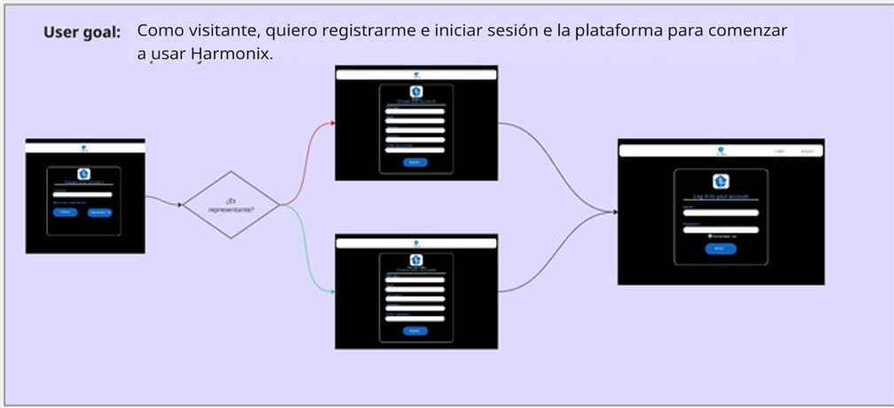
</p>

<p styles="align: left">
  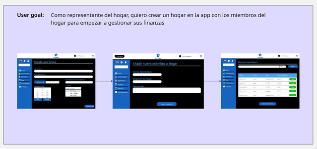
</p>

<p styles="align: left">
  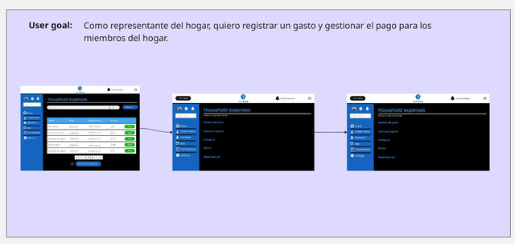
</p>

<p styles="align: left">
  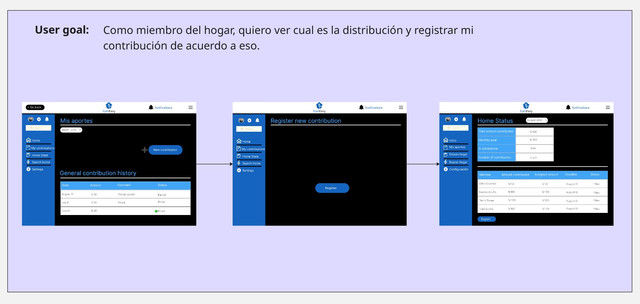
</p>

## 4.5. Web Applications Prototyping.

Se desarrolló un **prototipo interactivo** orientado a la **navegación web**, con el objetivo de evaluar y optimizar la accesibilidad y la experiencia de usuario antes del lanzamiento final.  
Este prototipo simula de manera realista el recorrido dentro de la aplicación, permitiendo a los usuarios explorar secciones y flujos tal como lo harían en la versión definitiva.  

El diseño se basó en una **arquitectura clara**, una **jerarquía visual coherente** y en **principios de diseño inclusivo**, asegurando una navegación intuitiva y accesible para todo tipo de usuarios.  
Gracias a sus **maquetas de alta fidelidad**, el prototipo facilita la validación de decisiones de diseño, la detección temprana de fricciones y la garantía de una experiencia de uso consistente y satisfactoria.  

<p styles="align: left">
  
</p>

**Link al prototipo:** https://www.figma.com/proto/toqBUIAgoZAPRnVn9sTZuE/App-web?node-id=61-17&p=f&t=LoFwY085Rxt0LqeQ-1&scaling=min-zoom&content-scaling=fixed&page-id=33%3A9&starting-point-node-id=61%3A17&show-proto-sidebar=1

## 4.6. Domain-Driven Software Architecture.

La arquitectura de Harmonix se plantea bajo el enfoque de Domain-Driven Design (DDD), lo que permite alinear el desarrollo técnico con el modelo de negocio y las reglas que rigen la distribución de gastos en el hogar. El sistema se organiza en dominios principales como la gestión de usuarios (registro, autenticación y roles), gestión de ingresos y aportes (cálculo proporcional y validación de pagos), gestión de notificaciones (recordatorios automáticos y alertas) y reportes (visualización de saldos y exportación de datos).

Este enfoque modular asegura que cada componente evolucione de forma independiente, manteniendo la coherencia del dominio central y garantizando la escalabilidad de la plataforma.

### 4.6.1. Software Architecture Context Diagram.

<p styles="align: left">
  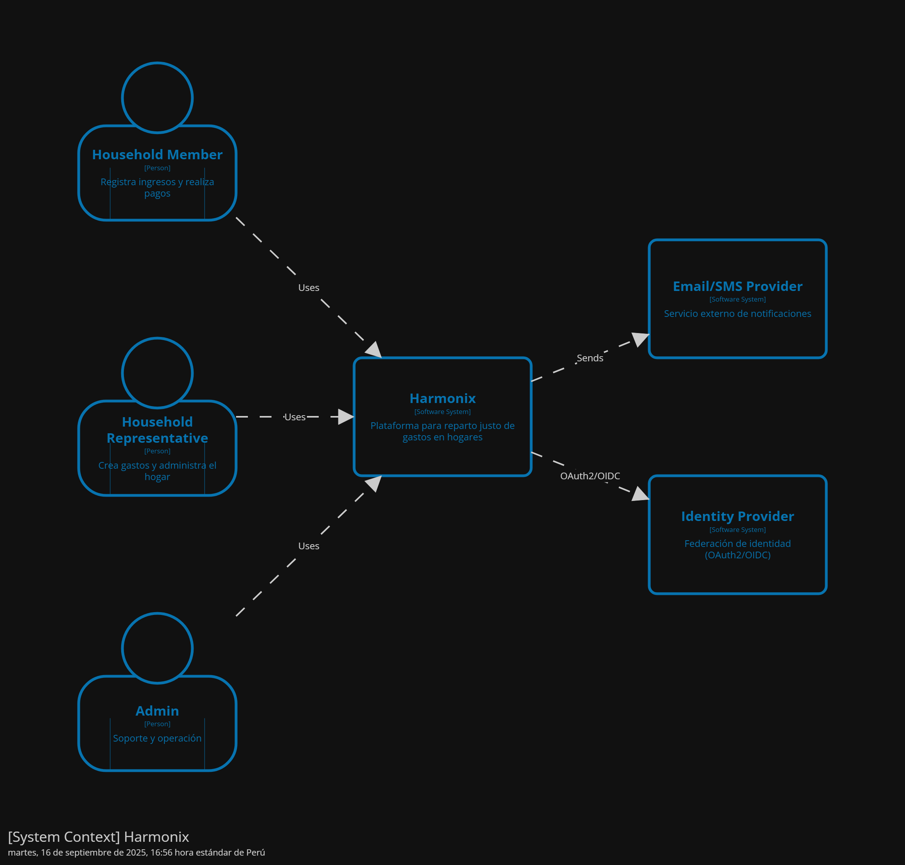
</p>

### 4.6.2. Software Architecture Container Diagrams.

<p styles="align: left">
  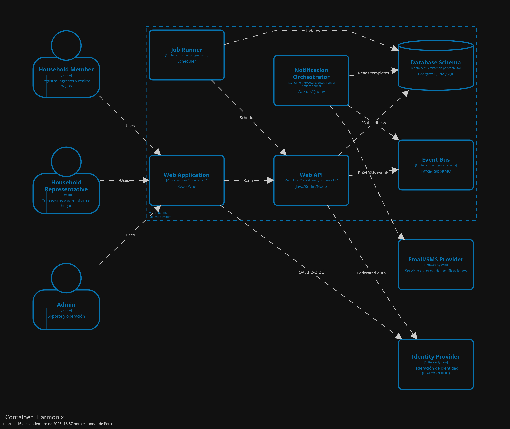
</p>

### 4.6.3. Software Architecture Components Diagrams.

<p styles="align: left">
  
</p>

## 4.7. Software Object-Oriented Design.
### 4.7.1. Class Diagrams.

<p styles="align: left">
  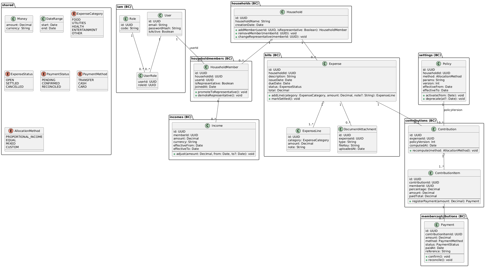
</p>

### 4.7.2. Class Dictionary.
#### [IAM Bounded Context]

**Class: User**  
- `id: UUID` — Identificador único del usuario.  
- `email: String` — Correo electrónico.  
- `passwordHash: String` — Contraseña en hash.  
- `isActive: Boolean` — Estado de la cuenta.  

**Class: Role**  
- `id: UUID` — Identificador único del rol.  
- `code: String` — Código o nombre del rol.  

**Class: UserRole**  
- `userId: UUID` — Referencia a User.  
- `roleId: UUID` — Referencia a Role.  

---

#### [Households Bounded Context]

**Class: Household**  
- `id: UUID` — Identificador único del hogar.  
- `householdName: String` — Nombre del hogar.  
- `creationDate: Date` — Fecha de creación.  

**Methods:**  
- `addMember(userId: UUID, isRepresentative: Boolean): HouseholdMember` — Agrega un nuevo miembro.  
- `removeMember(memberId: UUID): void` — Elimina un miembro existente.  
- `changeRepresentative(memberId: UUID): void` — Designa un nuevo representante.  

---

#### [Household Members Bounded Context]

**Class: HouseholdMember**  
- `id: UUID` — Identificador del miembro.  
- `householdId: UUID` — Referencia al hogar.  
- `userId: UUID` — Referencia al usuario.  
- `isRepresentative: Boolean` — Indica si es representante.  
- `joinedAt: Date` — Fecha de incorporación.  

**Methods:**  
- `promoteToRepresentative(): void` — Asigna rol de representante.  
- `demoteRepresentative(): void` — Revoca el rol de representante.  

---

#### [Incomes Bounded Context]

**Class: Income**  
- `id: UUID` — Identificador único del ingreso.  
- `memberId: UUID` — Miembro asociado.  
- `amount: Decimal` — Monto del ingreso.  
- `currency: String` — Moneda usada.  
- `effectiveFrom: Date` — Inicio de vigencia.  
- `effectiveTo: Date?` — Fin de vigencia.  

**Methods:**  
- `adjust(amount: Decimal, from: Date, to?: Date): void` — Ajusta monto y vigencia.  

---

#### [Bills Bounded Context]

**Class: Expense**  
- `id: UUID` — Identificador único del gasto.  
- `householdId: UUID` — Referencia al hogar.  
- `description: String` — Descripción del gasto.  
- `issueDate: Date` — Fecha de registro.  
- `dueDate: Date?` — Fecha de vencimiento.  
- `status: ExpenseStatus` — Estado actual.  
- `total: Decimal` — Importe total.  

**Methods:**  
- `addLine(category: ExpenseCategory, amount: Decimal, note?: String): ExpenseLine` — Agrega línea de gasto.  
- `markSettled(): void` — Marca el gasto como liquidado.  

**Class: ExpenseLine**  
- `id: UUID` — Identificador de la línea.  
- `category: ExpenseCategory` — Categoría.  
- `amount: Decimal` — Importe.  
- `note: String` — Nota opcional.  

**Class: DocumentAttachment**  
- `id: UUID` — Identificador del documento.  
- `expenseId: UUID` — Referencia al gasto.  
- `type: String` — Tipo de documento (Invoice, Receipt).  
- `fileKey: String` — Ruta o clave del archivo.  
- `uploadedAt: Date` — Fecha de carga.  

---

#### [Contributions Bounded Context]

**Class: Contribution**  
- `id: UUID` — Identificador del cálculo.  
- `expenseId: UUID` — Gasto asociado.  
- `policyVersion: Int` — Versión de la política.  
- `computedAt: Date` — Fecha del cálculo.  

**Methods:**  
- `recompute(method: AllocationMethod): void` — Recalcula con la política seleccionada.  

**Class: ContributionItem**  
- `id: UUID` — Identificador del ítem.  
- `contributionId: UUID` — Aporte padre.  
- `memberId: UUID` — Miembro asociado.  
- `percentage: Decimal` — Porcentaje asignado.  
- `amount: Decimal` — Monto asignado.  
- `paidTotal: Decimal` — Total pagado.  

**Methods:**  
- `registerPayment(amount: Decimal): Payment` — Registra un pago.  

---

#### [Member Contributions Bounded Context]

**Class: Payment**  
- `id: UUID` — Identificador del pago.  
- `contributionItemId: UUID` — Ítem de aporte asociado.  
- `amount: Decimal` — Monto del pago.  
- `method: PaymentMethod` — Método de pago.  
- `status: PaymentStatus` — Estado.  
- `paidAt: Date` — Fecha de pago.  
- `reference: String?` — Referencia externa.  

**Methods:**  
- `confirm(): void` — Confirma el pago.  
- `reconcile(): void` — Concilia el pago.  

---

#### [Settings Bounded Context]

**Class: Policy**  
- `id: UUID` — Identificador único.  
- `householdId: UUID` — Hogar al que pertenece.  
- `method: AllocationMethod` — Método de asignación.  
- `params: String` — Parámetros extra.  
- `version: Int` — Versión de la política.  
- `effectiveFrom: Date` — Vigencia inicial.  
- `effectiveTo: Date` — Vigencia final.  

**Methods:**  
- `activate(from: Date): void` — Activa la política.  
- `deprecate(at?: Date): void` — Marca como obsoleta.  

---

### Enumerations

**ExpenseStatus**  
- `OPEN` — Gasto pendiente.  
- `SETTLED` — Gasto liquidado.  
- `CANCELLED` — Gasto anulado.  

**ExpenseCategory**  
- `FOOD` — Alimentación.  
- `UTILITIES` — Servicios básicos.  
- `HEALTH` — Salud.  
- `ENTERTAINMENT` — Ocio.  
- `OTHER` — Otros gastos.  

**AllocationMethod**  
- `PROPORTIONAL_INCOME` — Según ingresos.  
- `EQUAL` — En partes iguales.  
- `MIXED` — Mixto.  
- `CUSTOM` — Configuración manual.  

**PaymentStatus**  
- `PENDING` — Pago pendiente.  
- `CONFIRMED` — Pago confirmado.  
- `RECONCILED` — Pago conciliado.  

**PaymentMethod**  
- `TRANSFER` — Transferencia bancaria.  
- `CASH` — Pago en efectivo.  
- `CARD` — Tarjeta.  
## 4.8. Database Design.
#### Descripción General
La base de datos de Harmonix ha sido diseñada bajo un enfoque relacional, orientado a la gestión financiera colaborativa dentro del hogar. Su estructura busca garantizar integridad referencial, equidad en la distribución de gastos y transparencia entre los miembros. Soporta funcionalidades clave como el cálculo proporcional de contribuciones, seguimiento de pagos, notificaciones automáticas, metas financieras compartidas, entre otras.

#### Diagrama Entidad-Relación
A continuación, se describen las principales entidades del sistema, alineadas con la implementación real en la base de datos:

**users**  
Representa a todos los usuarios del sistema (miembros o representantes).  
- `id: INT (PK)`  
- `name: VARCHAR(100)`  
- `email: VARCHAR(100)` – único  
- `password: VARCHAR(255)`  
- `role: ENUM('REPRESENTANTE', 'MIEMBRO')`  
- `created_at: TIMESTAMP`  

**households**  
Entidad que representa un hogar.  
- `id: INT (PK)`  
- `name: VARCHAR(100)`  
- `description: TEXT`  
- `currency: VARCHAR(10)` – por defecto 'USD'  
- `representante_id: INT (FK → users.id)`  
- `created_at: TIMESTAMP`  

**household_members**  
Relación que indica qué usuarios pertenecen a qué hogares.  
- `id: INT (PK)`  
- `user_id: INT (FK → users.id)`  
- `household_id: INT (FK → households.id)`  
- `joined_at: TIMESTAMP`  

**bills**  
Facturas o cuentas registradas dentro del hogar.  
- `id: INT (PK)`  
- `household_id: INT (FK → households.id)`  
- `descripcion: VARCHAR(255)`  
- `monto: DECIMAL(10,2)`  
- `created_by: INT (FK → users.id)`  
- `fecha: DATE`  
- `created_at: TIMESTAMP`  

**contributions**  
Contribuciones planificadas para cubrir facturas.  
- `id: INT (PK)`  
- `bill_id: INT (FK → bills.id)`  
- `household_id: INT (FK → households.id)`  
- `descripcion: VARCHAR(255)`  
- `fecha_limite: DATE`  
- `created_at: TIMESTAMP`  
- `updated_at: TIMESTAMP`  

**member_contributions**  
Contribuciones específicas que realiza cada miembro.  
- `id: INT (PK)`  
- `contribution_id: INT (FK → contributions.id)`  
- `member_id: INT (FK → users.id)`  
- `monto: DECIMAL(10,2)`  
- `status: ENUM('PENDIENTE', 'PAGADO')`  
- `pagado_en: TIMESTAMP`  
- `created_at: TIMESTAMP`  
- `updated_at: TIMESTAMP`  

**settings**  
Configuraciones individuales de los usuarios.  
- `id: INT (PK)`  
- `user_id: INT (FK → users.id)`  
- `language: VARCHAR(10)`  
- `dark_mode: BOOLEAN`  
- `notifications_enabled: BOOLEAN`  

---

#### Índices Adicionales
Se incluyen índices para optimizar el rendimiento de consultas frecuentes:  
- `Income.memberId`  
- `Contribution.memberId`  
- `Expense.householdId`  
- `Payment.expenseId`  
- `Notification.memberId`  

---

#### Objetivos del Diseño
- **Transparencia:** cada miembro puede ver su historial y estado financiero.  
- **Equidad:** los gastos se distribuyen proporcionalmente en función de los ingresos.  
- **Escalabilidad:** permite añadir nuevas funcionalidades sin alterar el núcleo del sistema.  
- **Mantenimiento:** una estructura clara y bien normalizada facilita la administración y evolución del sistema.  

### 4.8.1. Database Diagrams
<p styles="align: left">
  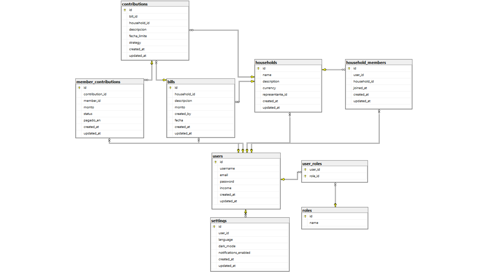  
</p>  

# Capítulo 5: Product Implementation, Validation & Deployment 

## 5.1. Software Configuration Management

En esta sección, se detalla la configuración de la tecnología a usar en el ciclo de vida de desarrollo del proyecto del curso.

### 5.1.1. Software Development Environment Configuration 

En esta sección, se explica los entornos en donde se decidió llevar a cabo el ciclo de vida de desarrollo de los productos de software relacionados al proyecto del curso.

* **Project Management**

  - En el aspecto de gestión y desarrollo del ciclo de vida del proyecto se utilizó la aplicación DISCORD y GOOGLE MEET para las reuniones de grupo en las cuales se conversan sobre temas relacionados a avances y corrección de aspectos del proyecto. Además, para la documentación del proyecto, se utilizó el formato Mark Down en un repositorio de GitHub para el control de versiones del informe.

* **Requirements Management**

  - Para el manejo de los requisitos (historias de usuario, product backlog, sprint backlog) del producto, se utilizó TRELLO la cual es una herramienta ideal para gestionar proyectos. Además, usando esta herramienta, se puede organizar un product backlog, ya que permite estructurar tareas visualmente en un tablero. También puedes crear listas que representen etapas del flujo de trabajo, y en cada lista añadir tarjetas que describan las user stories o tareas individuales. Estas tarjetas permiten detallar información clave, como prioridades, etiquetas de color, descripciones y checklists, facilitando así el seguimiento y la colaboración del equipo.

* **Product UX/UI Design**

  - Para el desarrollo de plantillas de los user persona, de los Impact Maps y los User Journey Maps se utilizó la aplicación UXPRESSIA la cual es una plataforma especializada en la creación de mapas de experiencia del usuario ofreciendo una interfaz enfocada exclusivamente en UX que facilita la estructuración clara y profesional de estos elementos. Destaca por sus plantillas personalizables, la posibilidad de añadir datos reales, imágenes y métricas, y por permitir la colaboración en tiempo real.

  - Para la creación del Lean UX Canvas se utilizó la aplicación de diseño CANVA. Esta aplicación es una herramienta versátil para crear diversos diseños. Canva facilita la colaboración del equipo y la exportación de los proyectos en archivo PNG o PDF, manteniendo el proceso creativo ordenado y atractivo. Para los Journey Mapping, Empathy Mapping, entre otros mapas,  se decidió utilizar Miro. Esta aplicación permite una colaboración en tiempo real entre equipos, ofrece una interfaz visual e intuitiva, y cuenta con plantillas prediseñadas que agilizan el proceso sin perder calidad metodológica.

  - Finalmente, para el desarrollo de interfaces de usuario (wireframes, mockups y prototipos de aplicación) se decidió utilizar FIGMA. Esta es una herramienta que facilita el diseño de interfaces, permitiéndonos trabajar con colores, imágenes, formas, y otros elementos visuales para crear nuestra aplicación. Nos ofrece la posibilidad de probar diversos modelos de dispositivos. Además, esta plataforma será clave en la creación de nuestro prototipo, ya que brinda una simulación interactiva que permite visualizar y experimentar el proyecto desde la perspectiva del usuario.

* **Software Development**

  - Para el desarrollo del producto de software correspondiente al Landing Page, se utilizarán dos aplicaciones, las cuales son GITHUB y JETBRAINS WEBSTORM. La primera ayuda al equipo a gestionar de manera correcta los avances colaborativos del proyecto. Por otro lado, JetBrains WebStorm ayudará a trabajar el proyecto con lenguajes como HTML5, CSS y JavaScript para el desarrollo del landing page.
 
* **Software Testing**

  - Las pruebas de la Landing Page se realizarán mediante uso del navegador web GOOGLE para verificar que el diseño del mismo cumple con aspectos como el diseño responsivo en cualquier dispositivo desde el que se acceda al landing page del proyecto. Además, para visualizar que se han implementado correctamente elementos visuales que deben aparecer en las distintas secciones de la página.

* **Software Deployment**

  - Para los despliegues de la Landing Page se uso el servicio web de GITHUB PAGES, este servicio se especializa en el despliegue de sitios web staticos directamente desde un repositorio creado en GitHub.

### 5.1.2. Source Code Management ###

En esta sección, se describen los medios y esquemas de organización para gestionar de manera efectiva los archivos de proyecto relacionados a Landing Page, Web Services y Frontend Web Applications. En el caso de los repositorios, se usará GitHub para almacenar los archivos. Además, se implementará GitFlow. Esta función de GitHub ayudará al equipo, gracias a las ramas de características de lanzamiento, a poder trabajar paralelamente en el proyecto y a tomar el control de versiones de avance del proyecto.

#### **5.1.2.1. Repositorios**

A continuación, se adjuntan los enlaces para acceder a los repositorios donde se almacenarán los archivos y avances de proyecto relacionados al Landing Page, Front-End y Back-End Application.

* **Landing Page: [https://github.com/1ASI0730-2520-7432-G1-Harmonix/LandingPage.git](https://github.com/1ASI0730-2520-7432-G1-Harmonix/LandingPage.git)**
* **Front End: [https://github.com/1ASI0730-2520-7432-G1-Harmonix/FrontEnd.git](https://github.com/1ASI0730-2520-7432-G1-Harmonix/FrontEnd.git)**

**5.1.2.2. GitFlow**

Para el desarrollo de este proyecto, GITFLOW ayudará al equipo de desarrollo a gestionar de manera efectiva el proyecto en su ciclo de vida. En general, GITHUB ayudará a facilitar el desarrollo del proyecto para el equipo ya que es más sencillo desarrollar trabajos en equipo en los repositorios de los archivos de proyecto.

##### **5.1.2.2.1. Main Branches**

* **Main Branch**   
  Llamada también rama principal del proyecto, esta es la rama predeterminada del proyecto creado en el repositorio. Esta rama representa el historial del proyecto lo que ayuda a llevar el control de versiones del mismo.
    
* **Develop Branch**  
  Llamada también rama de desarrollo del proyecto. Esta rama es una bifurcación de código original del proyecto para definir nuevos rumbos respecto del proyecto original que servirá para evaluar variaciones del proyecto para su evolución. Además, ayudan a incorporar nuevas funciones al proyecto.

##### **5.1.2.2.2. Supporting Branches**

* **Feature Branch**  
  También llamada rama de característica del proyecto, es una rama de desarrollo que ayuda a incorporar nuevas funciones al proyecto en desarrollo. Además, permite el aislamiento de la función agregada y que varios colaboradores puedan trabajar simultáneamente en dicha funcionalidad.

* **Release Branch**  
  También llamada rama de lanzamiento del proyecto, es una versión de código del proyecto que se usa para empezar un nuevo ciclo de lanzamiento del producto de software. Además, en esta rama se pueden realizar correcciones de errores de la versión pasada del proyecto. Finalmente, una vez terminada con esta rama, se suma a la rama principal del proyecto y se le asigna un nuevo número de versión de proyecto.
    
* **Hotfix Branch**  
  También llamada rama de corrección del proyecto, es una rama que permite dar mantenimiento al código del proyecto. Se utiliza principalmente para arreglar errores en alguna sección del producto de software de manera rápida.

#### **5.1.2.3. Release Versioning Conventions**

Para la nomenclatura de los lanzamientos de la Landing Page, se utilizará Semantic Versioning que consta de tres partes para describir cambios mayores, cambios menores y parches para corrección de bugs, según la siguiente estructura:

* Número principal: Incrementa cuando se realiza un cambio mayor y significativo al proyecto.  
* Número secundario: Incrementa cuando se realiza un cambio menor al proyecto como arreglo de errores o agregación de características.  
* Número terciario: Incrementa cuando se realiza un parche al proyecto como una corrección de bugs o errores visuales.

#### **5.1.2.3. Commits Conventions**

Para los textos de mensajes en los *‘commits’* del proyecto en Git, se utilizará Conventional Commits. Estos son mensajes de confirmación que son fáciles de entender por los colaboradores del proyecto. Finalmente, estos mensajes siguen la siguiente estructura:

<!-- Commits-->
<p align="center">
  
</p>

La sección *‘type’* indica el tipo de mensaje de confirmación que se usará. A continuación, la sección *‘description’* indica la descripción que se le agrega al mensaje de confirmación, por ejemplo, una característica agregada. Además, la sección *‘body’* incluye una descripción más detallada del cambio aplicado al proyecto.  
Luego, se tienen distintos tipos de mensajes de confirmación. Por ejemplo, se tiene el mensaje tipo *‘fix’* que incluye una corrección al proyecto. Utilizar este tipo conlleva aumentar el número terciario de la versión del proyecto (por ejemplo, de 1.0.0. a 1.0.1.). Después, utilizar el mensaje de tipo *‘feat’* conlleva agregar una nueva función a la aplicación, por lo tanto, se debe aumentar el número secundario de la versión (por ejemplo, de 1.0.0. a 1.1.0.). Finalmente, si se agrega una sección de tipo ‘BREAKING CHANGE’ indicaría que las versiones anteriores del proyecto dejarán de ser compatibles entre sí, lo que conlleva un cambio significativo y el aumento del número principal de la versión (por ejemplo, de 1.0.0. a 2.0.0.).

### 5.1.3. Source Code Style Guide & Conventions ###

En esta sección, se definen las referencias que se usaron para adoptar estrategias de nomenclatura de elementos de programación en los lenguajes que se usarán para la solución (HTML, CSS, JavaScript, y C\#). En general, la nomenclatura de los archivos y secciones en la programación se hará en inglés.

* **Nomenclatura en HTML:**  
  Para la codificación del proyecto en HTML, se utilizará el artículo *“HTML Style Guide and Coding Conventions”.* Este artículo contiene información útil y necesaria para conocer cómo debe ser la nomenclatura de los diversos aspectos que incluye la programación en HTML como si se debe escribir en minúsculas o mayúsculas las secciones del cuerpo del documento. A continuación se adjunta el enlace para acceder al artículo de referencia: [https://www.w3schools.com/html/html5\_syntax.asp](https://www.w3schools.com/html/html5_syntax.asp)   
  Finalmente, se aplicará el contenido del artículo para la nomenclatura en HTML para la landing page de StockSip a desarrollar.

* **Nomenclatura en CSS:**  
  Para la codificación del proyecto en Cascading Style Sheets (CSS), se utilizará el artículo *“Google HTML/CSS Style Guide”.* Este artículo contiene información útil y necesaria para conocer cómo debe ser la nomenclatura de los diversos aspectos que incluye la programación en CSS como capitalización en código de colores, referencias a imágenes, etc. A continuación se adjunta el enlace para acceder al artículo de referencia: [https://google.github.io/styleguide/htmlcssguide.html](https://google.github.io/styleguide/htmlcssguide.html)   
  Finalmente, se aplicará el contenido del artículo para la nomenclatura en CSS para el estilo de colores que se quiere agregar al landing page de Harmonix a desarrollar.

* **Nomenclatura en JavaScript:**  
  Para la codificación del proyecto en JavaScript, se utilizará el artículo *“Google JavaScript Style Guide”.* Este artículo contiene información útil y necesaria para conocer cómo debe ser la nomenclatura de los diversos aspectos que conforman un proyecto desarrollado en JavaScript, según los lineamientos establecidos por Google.Se trata de la guía de estilo oficial de JavaScript de Google, un documento detallado que establece una serie de convenciones para escribir código JavaScript limpio, coherente y fácil de mantener, especialmente en equipos de trabajo. A continuación se adjunta el enlace para acceder al artículo de referencia: [https://google.github.io/styleguide/jsguide.html](https://google.github.io/styleguide/jsguide.html)  
  Finalmente, se aplicará el contenido del artículo para el Web Services de Harmonix.  
    
* **Nomenclatura en Vue:**  
  Para la codificación del proyecto en Vue, se utilizará el artículo *“Vue Style Guide”.* Este artículo contiene información útil y necesaria para conocer cómo debe ser la nomenclatura de los diversos aspectos que conforman un proyecto desarrollado con Vue.js 2\. Se trata de la guía de estilo oficial de Vue 2, en la cual se detallan las convenciones recomendadas para escribir código claro, consistente y fácil de mantener. Esta guía organiza sus recomendaciones en diferentes niveles de prioridad; reglas esenciales, reglas fuertemente recomendadas, reglas recomendadas, reglas de uso con precaución y reglas estrictamente opcionales. A continuación se adjunta el enlace para acceder al artículo de referencia: [https://v2.vuejs.org/v2/style-guide/?redirect=true](https://v2.vuejs.org/v2/style-guide/?redirect=true)  
  Finalmente, se aplicará el contenido del artículo para el Frontend Applications de Harmonix.  
    
* **Nomenclatura en C\#:**  
  Para la codificación del proyecto en C\#, se utilizará el artículo *“C\# Coding Conventions”.* Este artículo contiene información útil y necesaria para conocer cómo debe ser la nomenclatura de los diversos aspectos que conforman un proyecto desarrollado en C\#, según las convenciones oficiales de codificación establecidas por Microsoft. Se trata de la guía de convenciones de estilo de código para C\# publicada por Microsoft, la cual proporciona una serie de recomendaciones para escribir código claro, coherente y mantenible en aplicaciones .NET. A continuación se adjunta el enlace para acceder al artículo de referencia:  [https://learn.microsoft.com/en-us/dotnet/csharp/fundamentals/coding-style/coding-conventions](https://learn.microsoft.com/en-us/dotnet/csharp/fundamentals/coding-style/coding-conventions)  
  Finalmente, se aplicará el contenido del artículo para el Web Services de Harmonix.

* **Nomenclatura en ASP.NET:**  
  Para la codificación del proyecto en ASP.NET, se utilizará el artículo *“Microsoft ASP.NET Core Coding Guidelines”.* Este artículo contiene información útil y necesaria para conocer cómo debe ser la nomenclatura y el estilo de los diversos aspectos que conforman un proyecto desarrollado con ASP.NET Core. Se trata de la guía de ingeniería oficial del equipo de ASP.NET Core, en la cual se detallan las convenciones recomendadas para escribir código claro, consistente y fácil de mantener. Esta guía organiza sus recomendaciones en distintos apartados que abarcan desde el formato del código, el uso de tipos y palabras clave, la compatibilidad multiplataforma, hasta el control de cambios en versiones del framework. Cada sección tiene como propósito establecer prácticas que favorezcan la legibilidad, el rendimiento, y la calidad del desarrollo colaborativo a gran escala. A continuación se adjunta el enlace para acceder al artículo de referencia:  [https://github.com/dotnet/aspnetcore/wiki/Engineering-guidelines#codingguidelines](https://github.com/dotnet/aspnetcore/wiki/Engineering-guidelines#codingguidelines)  
  Finalmente, se aplicará el contenido del artículo para el Web Services de Harmonix

* **Nomenclatura para RESTful API:**

  Para la nomenclatura de endpoints a implementar en la aplicación Back-End, se usó el artículo *"REST API URI Naming Conventions and Best Practices".* Este mismo contiene información sobre consejos y buenas prácticas al momento de nombrar correctamente a los endpoints en una aplicación back-end que use el esquema REST. A continuación se adjunta el enlace para acceder al artículo de referencia: [https://restfulapi.net/resource-naming/](https://restfulapi.net/resource-naming/).

* **Nomenclatura en MySQL:**

  Para la nomenclatura de objetos en una base de datos relacional usando MySQL, se usó el artículo *"MYSQL Naming Conventions"* como base para la correcta nomenclatura de tablas y columnas. A continuación, se adjunta el enlace para acceder al artículo de referencia: [(https://medium.com/@centizennationwide/mysql-naming-conventions-e3a6f6219efe)](https://medium.com/@centizennationwide/mysql-naming-conventions-e3a6f6219efe) .


### 5.1.4. Software Deployment Configuration ###

En esta sección, se especifica la configuración para realizar el despliegue de la solución en el repositorio. Para realizar esto, se usó GITHUB PAGES para desplegar el landing page.

## Sitio web estático ##
* **Paso 1: Creación del repositorio**  
  Como primer paso, se debe crear el repositorio en GitHub que será el lugar donde se aloja todo lo relacionado al Landing Page.

<p align="center">
  
</p>

* **Paso 2: Carga de archivos necesarios**  
  Como segundo paso, se importan todos los archivos necesarios para el desarrollo de la landing page como imágenes, archivos HTML, CSS y JavaScript.

<p align="center">
  
</p>

* **Paso 3: Preparar el lanzamiento**  
  Como tercer paso, se juntan todas las características del proyecto en una sola para verificar el correcto funcionamiento de cada una. Luego, se envía todo a la rama principal donde se encuentra, por defecto, el proyecto.

<p align="center">
  
</p>

* **Paso 4: Desplegar la Landing Page**  
  Como cuarto paso, cuando todo se encuentre en la rama principal, se accede a la sección Configuración del repositorio, luego, se selecciona la opción “GitHub Pages” y se seleccionará la rama principal que es la que se desea desplegar.

<p align="center">
  
</p>

* **Paso 5: Acceder al Landing Page**  
  Como paso final, el entorno otorgará un enlace para poder acceder al proyecto desplegado.
  
<p align="center">
  
</p>


## 5.2. Landing Page, Services & Applications Implementation

### 5.2.1. Sprint 1 

A continuación, se presenta el Sprint Planning 1, donde se incluyen las evidencias de planificación e implementación del Landing Page. También se registran los avances del proyecto e insights de colaboración del equipo a través de GitHub.

#### 5.2.1.1. Sprint Planning 1
| **Campo**                              | **Descripción**                                                                                                                                                                                                                                                                                                    |
| -------------------------------------- | ------------------------------------------------------------------------------------------------------------------------------------------------------------------------------------------------------------------------------------------------------------------------------------------------------------------ |
| **Sprint #**                           | Sprint 1                                                                                                                                                                                                                                                                                                           |
| **Sprint Planning Background**         |                                                                                                                                                                                                                                                                                                                    |
| **Date**                               | 2025-09-01                                                                                                                                                                                                                                                                                                         |
| **Time**                               | 03:00 PM (GMT -5)                                                                                                                                                                                                                                                                                                  |
| **Location**                           | Modalidad remota por Google Meet                                                                                                                                                                                                                                                                                   |
| **Prepared By**                        | Testigos de Harmonix                                                                                                                                                                                                                                                                                              |
| **Attendees (to planning meeting)**    | Equipo Harmonix                                                                                                                                                                                                                                                            |
| **Sprint 0 Review Summary**        | Este es el primer sprint, por lo tanto, no hay una revisión de sprint anterior.                                                                                                                                                                                                                                    |
| **Sprint 0 Retrospective Summary** | Al ser el inicio del proyecto, se identificaron aspectos técnicos por aprender, como el uso de frameworks CSS. Se revisó el diseño del Landing Page en Figma, se discutió el contenido textual a incluir y se definió el objetivo principal: lograr desplegar el Landing Page en GitHub Pages al final del sprint. |
| **Sprint Goal & User Stories**         |                                                                                                                                                                                                                                                                                                                    |
| **Sprint 1 Goal**                      | Desplegar un Landing Page funcional con diseño responsive y estructura definida, accesible públicamente desde GitHub Pages.                                                                                                                                                                                        |
| **Sprint 1 Velocity**                  | 20                                                                                                                                                                                                                                                                                                                  |
| **Sum of Story Points**                | 10                                                                                                                                                                                                                                                                                                                  |

#### 5.2.1.2. Aspect Leaders and Collaborators

 |Team Member | GitHub Username |  Delegating Responsibilities <br> Leader (L) / Collaborator (C) | Merging Branches <br>Leader (L) /Collaborator (C)| Correcting Mistakes <br> Leader (L) /Collaborator (C)|
|-------------|--------------|------------|----------|----------|
| Jose Luis Martinez Validivia | hmongus  |    C   |    L     | C  |
| Camila Leonor Espinoza Vivas		 | C7leo  |    L   |     C    | C  |
| Kevin Patrick Panto Chuquipiondo		 | Kevinyin11  |  C     |   C      |  C  |
| Sebastián Córdova	 | Sevas04  |    C   |    C     |   C   |
| Martin Gonzales | XdiabloX426  |   C    |    C     |   L   |

#### 5.2.1.3. Sprint Backlog 1

El Sprint Backlog 1 corresponde a la planificación inicial del desarrollo de la plataforma Harmonix, donde se definieron y priorizaron las primeras funcionalidades clave para la Landing Page y la configuración básica de despliegue. En este sprint, el equipo trabajó en la implementación de secciones informativas que presentan los objetivos, beneficios y funcionalidades de la aplicación, así como en la incorporación de ejemplos visuales y accesos directos para el registro e inicio de sesión de usuarios.

Adicionalmente, se incluyeron tareas técnicas relacionadas con la documentación del despliegue y la configuración de monitoreo básico, asegurando que el proyecto cuente con una base sólida para futuras iteraciones.

El trabajo colaborativo del equipo se gestionó en la herramienta Trello, lo que permitió organizar, priorizar y dar seguimiento a cada tarea de manera eficiente.

Link al tablero de Trello: https://trello.com/invite/b/647377f527633648e32f8b34/ATTId97694eca59f351dc52e5b0eced257d936D70AE8/product-backlog 


| **User Story Id** | **Title**                                                                  | **Task Id** | **Task Title**              | **Description**                                                                                  | **Estimation (Hours)** | **Assigned To** | **Status (To-do/In-Process/To-Review/Done)** |
| ----------------- | -------------------------------------------------------------------------- | ----------- | --------------------------- | ------------------------------------------------------------------------------------------------ | ---------------------- | --------------- | -------------------------------------------- |
| US31              | Visualizar información general sobre Harmonix desde la landing page       | T1          | Información general         | Desarrollo de la sección con información introductoria de Harmonix                              | 2                      | Jose Luis Martinez Validivia               | Done                                        |
| US32              | Conocer las funciones principales para representantes y miembros del hogar | T1          | Funciones principales       | Diseño y desarrollo de la sección que explica las funciones clave para representantes y miembros | 2                      | Camila Leonor Espinoza Vivas               | Done                                        |
| US33              | Explorar beneficios del sistema de aportes proporcionales                  | T1          | Beneficios                  | Desarrollo de la sección que muestre los beneficios de usar el sistema de aportes proporcionales | 2                      | Kevin Patrick Panto Chuquipiondo               | Done                                        |
| US34              | Ver ejemplos o simulaciones de cómo funciona la plataforma                 | T1          | Ejemplos y simulaciones     | Implementación de ejemplos visuales o simulaciones del funcionamiento de la plataforma           | 3                      |  Sebastián Córdova               | Done                                        |
| US35              | Acceder fácilmente al registro o login desde botones destacados            | T1          | Botones de acceso           | Diseño e implementación de botones visibles para registro y login                                | 1                      | Martin Gonzales               | Done                                        |
| TS18              | Documentar los pasos para desplegar nuevas versiones                       | T1          | Documentación de despliegue | Redacción de la guía de pasos necesarios para desplegar nuevas versiones                         | 2                      | Jose Luis Martinez Validivia               | Done                                        |
| TS19              | Habilitar monitoreo básico del sistema desplegado (logs, uptime)           | T1          | Monitoreo básico            | Configuración inicial para registrar logs y habilitar monitoreo de uptime                        | 3                      | Camila Leonor Espinoza Vivas               | Done                                        |

#### 5.2.1.4. Development Evidence for Sprint Review

|Repository Branch |  Commit Id  |  Commit Message | Commit Message Body | Commited on (Date)|
|-----------------|--------------|-----------------|---------------------|-------------------|
|Landing Page - develop   |   4c76760…f3dcfd9     |  chores(landingpage): added some translation words    |           |   16/09/2025 |
|Landing Page - develop   |    c62b615…4c76760     |  chore(landingpage): add completed landing page       |           |   15/09/2025 |
|Landing Page - reviews   |   c62b615…3c7fbde      |  feature(reviews): completed landing page-OurSystem - added HTML  |    |12/09/2025|
|Landing Page - home   |   c62b615…7769d76     |  feat: add section home structure and styling    |           |   11/09/2025 |
|Landing Page - about us   |   c62b615…3f0f246     |  update landing page about us   |           |   13/09/2025 |
| Landing Page - pricing |  c62b615…6a35cc4         |  feature(pricing): completed Reviews on an 80%  |    |      10/09/2025     |


#### 5.2.1.5. Execution Evidence for Sprint Review
Como parte de la revisión del sprint, se presentan las evidencias de ejecución relacionadas con el desarrollo del Landing Page de Harmonix. La implementación se realizó empleando HTML, CSS y JavaScript, asegurando una estructura semántica clara, un diseño visual coherente con las guías de estilo y funcionalidades interactivas que mejoran la experiencia de usuario.

Además de las capturas del código implementado, se incluye un video demostrativo donde se explica y evidencia la navegación lograda durante este sprint, así como el flujo de interacción principal que se validó.

Video about the product: bit.ly/4nxTsa6  

Link: https://1asi0730-2520-7432-g1-harmonix.github.io/LandingPage/

- Home:<br>

   
<br>

- About Us:<br>

   <p align="center">
  
  </p>

  <br>
  
- Services: <br>

  
  
  <br>
- How does it work?: <br>

  

  <br>

- Prices: <br>

  

  <br>

- Contact us: <br>

  

  <br>

#### 5.2.1.6. Software Deployment Evidence for Sprint Review

Hasta ahora, no hemos utilizado servicios web en el proceso de desarrollo de la página de inicio. Esto significa que no hemos realizado actividades como la creación de cuentas, la configuración de recursos en proveedores de servicios en la nube, la creación de proyectos de desarrollo para la integración o automatización de tareas de implementación, entre otras acciones relacionadas.

En cuanto al despliegue de la página de inicio, lo hemos realizado en la plataforma de Github Pages.

Se puede acceder a la página de inicio a través del siguiente enlace: https://1asi0730-2520-7432-g1-harmonix.github.io/LandingPage/

#### 5.2.1.7. Team Collaboration Insights during Sprint

A continuación, se muestran las capturas de los insights del repositorio de la Landing Page para evidenciar la participación de todos los miembros del grupo:

- feature/chapter-1


- feature/chapter-2


- feature/chapter-3


- feature/chapter-4


- feature/chapter-5
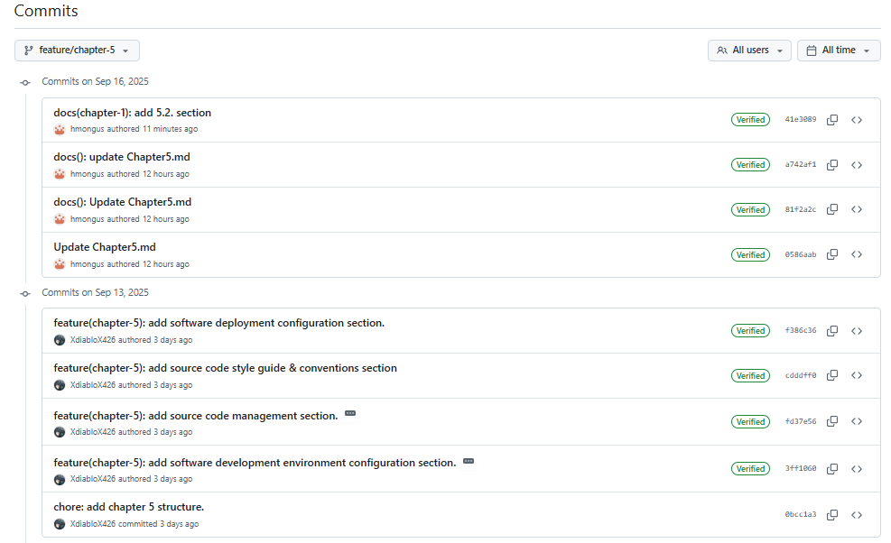

### 5.2.2. Sprint 2 ###

A continuación, se presenta el Sprint Planning 2, donde se incluyen las evidencias de planificación e implementación del Frontend También se registran los avances del proyecto e insights de colaboración del equipo a través de GitHub.

#### 5.2.2.1. Sprint Planning 2

| **Campo**                              | **Descripción**                                                                                                                                                                                                                                                                                                    |
| -------------------------------------- | ------------------------------------------------------------------------------------------------------------------------------------------------------------------------------------------------------------------------------------------------------------------------------------------------------------------ |
| **Sprint #**                           | Sprint 2                                                                                                                                                                                                                                                                                                           |
| **Sprint Planning Background**         |                                                                                                                                                                                                                                                                                                                    |
| **Date**                               | 2025-10-06                                                                                                                                                                                                                                                                                                         |
| **Time**                               | 05:00 PM (GMT -5)                                                                                                                                                                                                                                                                                                  |
| **Location**                           | Modalidad remota por Google Meet                                                                                                                                                                                                                                                                                   |
| **Prepared By**                        | Testigos de Harmonix                                                                                                                                                                                                                                                                                              |
| **Attendees (to planning meeting)**    | Equipo Harmonix                                                                                                                                                                                                                                                            |
| **Sprint 1 Review Summary**        | En este primer sprint se desarrolló la Landing Page utilizando el framework de estilos Tailwind CSS. Se revisó y adaptó el contenido textual del landing con base en las propuestas previas realizadas en Figma. Al finalizar el sprint, la Landing Page fue desplegada exitosamente en Github pages y quedó accesible públicamente mediante un enlace funcional.                                                                                                                                                                                                                                    |
| **Sprint 1 Retrospective Summary** | En este sprint se planea avanzar con el desarrollo del front-end de la aplicación web, incluyendo las vistas para la autenticación de usuario y los dashboards para cada rol de usuario. También se tiene previsto implementar la configuración de idioma utilizando la librería i18n con Vue. Además, se contempla desarrollar la sección de Términos de Servicio, el video sobre el producto y el video del equipo. Las tareas han sido organizadas y gestionadas a través de la plataforma Trello. Al finalizar el sprint, se espera contar con una versión actualizada del landing page y una demo funcional del front-end de la aplicación desplegada en Netlify. |
| **Sprint Goal & User Stories**         |                                                                                                                                                                                                                                                                                                                    |
| **Sprint 2 Goal**                      | Desplegar un Front End funcional con diseño responsive y estructura definida, accesible públicamente desde Vercel                                                                                                                                                                                          |
| **Sprint 2 Velocity**                  | 40                                                                                                                                                                                                                                                                                                                  |
| **Sum of Story Points**                | 30                                                                                                                                                                                                                                                                                                                  |


#### 5.2.2.2. Aspect Leaders and Collaborators

 |Team Member | GitHub Username |  Delegating Responsibilities <br> Leader (L) / Collaborator (C) | Merging Branches <br>Leader (L) /Collaborator (C)| Correcting Mistakes <br> Leader (L) /Collaborator (C)|
|-------------|--------------|------------|----------|----------|
| Jose Luis Martinez Validivia | hmongus  |    C   |    L     | C  |
| Camila Leonor Espinoza Vivas		 | C7leo  |    L   |     C    | C  |
| Kevin Patrick Panto Chuquipiondo		 | Kevinyin11  |  C     |   C      |  C  |
| Sebastián Córdova	 | Sevas04  |    C   |    C     |   C   |
| Martin Gonzales | XdiabloX426  |   C    |    C     |   L   |

#### 5.2.2.3. Sprint Backlog 2

El Sprint Backlog 2 corresponde a la planificación inicial del desarrollo de la plataforma Harmonix, donde se definieron y priorizaron las primeras funcionalidades clave para el FrontEnd y la configuración básica de despliegue. En este sprint, el equipo trabajó en la implementación de secciones informativas que presentan los objetivos, beneficios y funcionalidades de la aplicación, así como en la incorporación de ejemplos visuales y accesos directos para el registro e inicio de sesión de usuarios.

El trabajo colaborativo del equipo se gestionó en la herramienta Trello, lo que permitió organizar, priorizar y dar seguimiento a cada tarea de manera eficiente.

Link al tablero de Trello: https://trello.com/invite/b/68e673a454041fb9f6aa1f29/ATTIb113180968d810d2941119d7342ca45b1214775F/sprint-backlog-2


| **User Story Id** | **Title** | **Task Id** | **Task Title** | **Description** | **Estimation (Hours)** | **Assigned To** | **Status** |
| ----------------- | ---------- | ------------ | --------------- | ---------------- | ---------------------- | --------------- | ----------- |
| **US01** | Registro de usuario | T1 | Crear formulario de registro | Implementar formulario para registrar nuevos usuarios con validaciones. | 4 | Camilla Espinoza | Done |
| **US02** | Inicio de sesión seguro | T1 | Implementar autenticación | Añadir login con validación de credenciales y seguridad mediante tokens. | 3 | Camilla Espinoza | Done |
| **US03** | Edición de información personal | T1 | Actualizar datos del usuario | Permitir que el usuario edite su nombre, correo y contraseña. | 3 | Sebastian Cordova | Done |
| **US04** | Cierre de sesión desde todos los dispositivos | T1 | Implementar cierre de sesión global | Añadir funcionalidad para cerrar sesión en todos los dispositivos activos. | 2 | Sebastian Cordova | Done |
| **US05** | Configuración de notificaciones personales | T1 | Diseñar menú de notificaciones | Permitir activar o desactivar tipos de notificaciones del usuario. | 3 | Sebastian Cordova | Done |
| **US06** | Crear hogar | T1 | Crear formulario de creación de hogar | Desarrollar vista y lógica para registrar un nuevo hogar. | 4 | Camilla Espinoza | Done |
| **US07** | Aprobar gastos | T1 | Agregar validación y botón de aprobación | Permitir que el dueño del hogar apruebe o rechace gastos. | 3 | Martin Gonzales | Done |
| **US08** | Ajustar porcentajes de aportes | T1 | Implementar ajuste de porcentajes | Configurar los aportes de los miembros según sus ingresos. | 3 | Jose Martinez | Done |
| **US09** | Visualizar reportes mensuales | T1 | Mostrar resumen mensual | Crear vista con reportes de ingresos y gastos del mes. | 4 | Kevin Pardo | Done |
| **US10** | Configurar métodos de pago aceptados | T1 | Agregar opciones de pago | Permitir seleccionar y guardar métodos de pago disponibles. | 3 | Jose Martinez | Done |
| **US11** | Ingresar ingresos personales | T1 | Crear formulario de ingresos | Habilitar a los miembros para registrar su ingreso mensual. | 3 | Kevin Pardo | Done |
| **US12** | Ver monto a pagar | T1 | Mostrar detalle del monto | Calcular y mostrar cuánto debe pagar cada miembro. | 3 | Martin Gonzales | Done |
| **US13** | Registrar pagos realizados | T1 | Crear formulario de pagos | Registrar pagos con validación de montos y fechas. | 4 | Martin Gonzales | Done |
| **US14** | Ver historial de pagos | T1 | Mostrar historial | Generar listado con todos los pagos realizados por el usuario. | 3 | Martin Gonzales | Done |
| **US15** | Ver distribución de gastos del hogar | T1 | Crear tabla de distribución | Mostrar en qué se gasta el dinero del hogar, segmentado por categorías. | 3 | Jose Martinez | Done |
| **US16** | Registrar nuevo gasto | T1 | Crear formulario de gasto | Registrar gastos realizados por los miembros o el dueño. | 4 | Martin Gonzales | Done |
| **US17** | Adjuntar comprobantes de gasto | T1 | Subir archivo de comprobante | Permitir al usuario subir comprobantes asociados a un gasto. | 2 | Martin Gonzales | Done |
| **US18** | Clasificar gastos por categoría | T1 | Implementar categorías de gasto | Permitir organizar los gastos según tipo (servicio, alimento, etc.). | 3 | Jose Martinez | Done |
| **US19** | Comentar o justificar un gasto | T1 | Agregar sección de comentarios | Habilitar justificación o comentario al registrar un gasto. | 2 | Jose Martinez | Done |
| **US20** | Visualizar gráficos de gastos | T1 | Crear dashboard visual | Mostrar gráficos que representen el comportamiento de gastos. | 4 | Jose Martinez | Done |
| **US37** | Implementar manejo de estados de carga y éxito en el panel del miembro | T1 | Añadir estados visuales de carga | Mostrar animaciones o mensajes durante carga y éxito en operaciones. | 2 | Sebastian Cordova | Done |

#### 5.2.2.4. Development Evidence for Sprint Review

En esta sección se registran las evidencias del desarrollo y despliegue del **FrontEnd de Harmonix** durante el **Sprint 2**, correspondientes a los commits realizados en GitHub por el equipo.

---

#### Commits de desarrollo (funcionalidad)

| Autor | Fecha | Commit Message | Commit ID |
|---|---|---|---|
| **José Martínez Valdivia (hmongus)** | 07/10/2025 | Merge pull request #1 from develop | bf4afd2 |
| **José Martínez Valdivia (hmongus)** | 07/10/2025 | add models and services | dae12a5 |
| **José Martínez Valdivia (hmongus)** | 07/10/2025 | add data to json | 1f066cb |
| **José Martínez Valdivia (hmongus)** | 07/10/2025 | fix server issue | 4b73ea1 |
| **José Martínez Valdivia (hmongus)** | 07/10/2025 | add server | 6750dc5 |
| **Camila Leonor Espinoza Vivas (C7leo)** | 07/10/2025 | feat(main): add mock database file for local development | 67a0fb2 |
| **Camila Leonor Espinoza Vivas (C7leo)** | 07/10/2025 | feat(main): update route configuration and navigation paths | 95d9aed |
| **Camila Leonor Espinoza Vivas (C7leo)** | 07/10/2025 | refactor(main): move authentication components to IAM folder | ccbd905 |
| **Camila Leonor Espinoza Vivas (C7leo)** | 07/10/2025 | chore(main): update English and Spanish translation files | f7c3fc8 |
| **Camila Leonor Espinoza Vivas (C7leo)** | 07/10/2025 | feat(main): update authentication components and role handling | 9789e93 |
| **Camila Leonor Espinoza Vivas (C7leo)** | 07/10/2025 | feat(main): add home-representative page component | 6f8e924 |
| **Camila Leonor Espinoza Vivas (C7leo)** | 07/10/2025 | feat(main): add home-member page component | 20b5a5b |
| **Camila Leonor Espinoza Vivas (C7leo)** | 07/10/2025 | feat(main): add household representative components | 4657bf4 |
| **Camila Leonor Espinoza Vivas (C7leo)** | 07/10/2025 | feat(main): add household member components | bab6cdb |
| **Camila Leonor Espinoza Vivas (C7leo)** | 07/10/2025 | chore(css): remove deprecated main.css file | 7536740 |
| **Camila Leonor Espinoza Vivas (C7leo)** | 07/10/2025 | chore(env): update environment configuration for development | ec1f55c |
| **José Martínez Valdivia (hmongus)** | 06/10/2025 | add locales | 16b5e77 |
| **José Martínez Valdivia (hmongus)** | 06/10/2025 | add language switcher | 8e3e5b0 |
| **José Martínez Valdivia (hmongus)** | 06/10/2025 | add router links | 66561ba |
| **José Martínez Valdivia (hmongus)** | 06/10/2025 | initial setup | 966f6d6 |

**Fuente:** historial de commits en la rama `master` del repositorio [FrontEnd – Harmonix](https://github.com/1ASI0730-2520-7432-G1-Harmonix/FrontEnd).

---

#### Commits de documentación y diseño

Las actualizaciones relacionadas con documentación, diagramas y reportes se encuentran registradas en el repositorio **Report – Harmonix**.

| Autor | Fecha | Commit Message | Commit ID |
|---|---|---|---|
| **Kevinyin11** | 06/10/2025 | Update chapter-1.md | 36f3264 |
| **Kevinyin11** | 06/10/2025 | Add files via upload | 75c45be |
| **Kevinyin11** | 06/10/2025 | Update chapter-1.md | 0be49d3 |
| **Kevinyin11** | 06/10/2025 | Update chapter-1.md | 52a9317 |
| **C7leo** | 19/09/2025 | doc(chapter-4): update | 5bada39 |
| **C7leo** | 19/09/2025 | docs(chapter-5): Add Sprint Backlog 1 details | 969f221 |
| **XdiabloX426** | 18/09/2025 | fix: fix error in documentation | 45b7770 |

**Fuente:** historial de commits en la rama `master` del repositorio [Report – Harmonix](https://github.com/1ASI0730-2520-7432-G1-Harmonix/Report/commits/master/).

---

##### Observaciones

- Los commits corresponden al periodo de desarrollo y documentación del **Sprint 2 (06–07 de octubre de 2025)**.  
- Cada commit evidencia un avance técnico o de documentación del proyecto.  
- La rama `master` concentra los cambios desplegados y validados para revisión en el Sprint Review.

#### 5.2.2.5. Execution Evidence for Sprint Review
A continaucion se presenta captura de las pantallas realizadas del FronteEnd en el desarrollo del Sprint: 

- Link: https://url-shortener.me/6PAX
  
- Representative-Dashboard:

<p align="center">
  
</p>

- Representative-Households:

  <p align="center">
  
</p>

- Representative-Members:

<p align="center">
  
</p>
  
- Representative-Expenses:

<p align="center">
  
</p>
  
- Representative-Contributions:

<p align="center">
  
</p>

- Representative-Configuration:
- 
<p align="center">
  
</p>
  
- Member-HomeState:

<p align="center">
  
</p>

- Member-FindHome:

  <p align="center">
  
</p>


#### 5.2.2.6.Services Documentation Evidence for Sprint Review.

Durante el desarrollo del **Sprint 2**, el equipo de Harmonix implementó y documentó los **servicios simulados (mock API)** utilizados por el FrontEnd para la gestión de usuarios, hogares y contribuciones.  
Estos servicios se definieron en el archivo `db.json`, empleando **JSON Server** como entorno de desarrollo local.  
El objetivo fue garantizar la conexión funcional entre las vistas del sistema y las operaciones de lectura, creación y actualización de datos.  

A continuación, se presenta la documentación de los endpoints registrados y utilizados durante este sprint:

---

| **Endpoint** | **Acción implementada** | **Método HTTP** | **Parámetros** | **Ejemplo de Request** | **Ejemplo de Response** | **Documentación (local)** |
|---------------|--------------------------|------------------|----------------|------------------------|-------------------------|---------------------------|
| `/api/users` | Listar usuarios registrados | **GET** | — | — | ```json [ { "id": 1759796571919, "name": "Jose", "email": "admin@gmail.com", "role": "representative", "plan": "FREE", "status": "active", "isNewUser": false } ]``` | `http://localhost:3000/users` |
| `/api/users` | Registrar usuario | **POST** | name, email, password, role, plan | ```json { "name": "Eduardo", "email": "eduardo@example.com", "password": "Ednoru123", "role": "member", "plan": "PREMIUM", "isNewUser": false }``` | ```json { "id": 1759954533800, "name": "Eduardo", "email": "eduardo@example.com", "role": "member", "plan": "PREMIUM", "isNewUser": false }``` | `http://localhost:3000/users` |
| `/api/settings` | Obtener configuración por usuario | **GET** | userId | `/api/settings?userId=1759796571919` | ```json [ { "id": "STT-124490", "userId": 1759796571919, "language": "ES", "darkMode": true, "notificationEnabled": false } ]``` | `http://localhost:3000/settings` |
| `/api/settings` | Actualizar configuración | **PATCH/PUT** | id, darkMode, notificationEnabled | ```json { "darkMode": false, "notificationEnabled": true }``` | ```json { "id": "STT-124490", "userId": 1759796571919, "language": "ES", "darkMode": false, "notificationEnabled": true }``` | `http://localhost:3000/settings/STT-124490` |
| `/api/households` | Crear hogar | **POST** | representativeId, currency, name, description | ```json { "representativeId": 1759954210938, "name": "Gaming House", "description": "Departamento compartido con amigos", "currency": "PEN" }``` | ```json { "id": "HOG-1759954210938", "name": "Gaming House", "description": "Departamento compartido con amigos", "currency": "PEN", "representativeId": 1759954210938 }``` | `http://localhost:3000/households` |
| `/api/households` | Listar hogares registrados | **GET** | — | — | ```json [ { "id": "HOG-1759796571919", "representativeId": 1759796571919, "currency": 1 }, { "id": "HOG-1759954210938", "name": "Gaming House", "currency": "PEN" } ]``` | `http://localhost:3000/households` |
| `/api/householdMember` | Listar miembros por hogar | **GET** | householdId | `/api/householdMember?householdId=HOG-1759796571919` | ```json [ { "id": "HM-123393", "userId": "1759798502697", "householdId": "HOG-1759796571919" } ]``` | `http://localhost:3000/householdMember` |
| `/api/householdMember` | Registrar miembro en hogar | **POST** | userId, householdId | ```json { "userId": "1759801172915", "householdId": "HOG-1759796571919" }``` | ```json { "id": "HM-NEW", "userId": "1759801172915", "householdId": "HOG-1759796571919" }``` | `http://localhost:3000/householdMember` |
| `/api/bills` | Registrar gasto o factura | **POST** | householdId, description, amount, createdBy, paymentDay | ```json { "householdId": "HOG-1759796571919", "description": "Internet", "amount": "100.00", "createdBy": 1759796571919, "paymentDay": "2026-10-10T00:00:00.000Z" }``` | ```json { "id": "BG-12212222", "description": "Internet", "amount": "100.00", "paymentDay": "2026-10-10T00:00:00.000Z" }``` | `http://localhost:3000/bills` |
| `/api/contributions` | Crear contribución | **POST** | billId, householdId, description, deadlineForMembers, strategy | ```json { "billId": "BG-12212222", "householdId": "HOG-1759796571919", "description": "Aporte mensual", "deadlineForMembers": "2026-09-09T00:00:00.000Z", "strategy": 1 }``` | ```json { "id": "CN-272818", "billId": "BG-12212222", "householdId": "HOG-1759796571919" }``` | `http://localhost:3000/contributions` |
| `/api/memberContributions` | Registrar aporte de miembro | **POST** | contributionId, memberId, amount, status | ```json { "contributionId": "CN-272818", "memberId": "HM-123393", "amount": "20.0", "status": 1 }``` | ```json { "id": "MC-152672", "contributionId": "CN-272818", "memberId": "HM-123393", "amount": "20.0", "status": 1 }``` | `http://localhost:3000/memberContributions` |
| `/api/memberContributions` | Listar aportes por contribución | **GET** | contributionId/memberId | `/api/memberContributions?contributionId=CN-272818` | ```json [ { "id": "MC-152672", "contributionId": "CN-272818", "memberId": "HM-123393", "amount": "20.0", "status": 1 } ]``` | `http://localhost:3000/memberContributions` |

---

#### Evidencias gráficas

Se incluyen capturas del archivo `db.json` que muestran el estado actual de los servicios documentados y sus datos de prueba:

1. **Colección `users`** – evidencia de roles, planes y nuevo campo `isNewUser`.

<p align="center">
  
</p>
   
2. **Colección `households`** – evidencia de creación del hogar *Gaming House* con campos extendidos.  

<p align="center">
  
</p>

**Fuente:** archivo `db.json` del repositorio [FrontEnd – Harmonix](https://github.com/1ASI0730-2520-7432-G1-Harmonix/FrontEnd).  


#### 5.2.2.7.Software Deployment Evidence for Sprint Review.

Durante el desarrollo se relaizo el deploy del FrontEnd desarrollado en VueJS, asimismo se realizo el deploy del FakeApi usando JsonServer

  - FrontEnd (Netlify): https://storied-concha-593faf.netlify.app/

     <p align="center">
  
</p>

  - FakeApi(Render): https://fake-json-api.onrender.com/users
<p align="center">
  
</p> 

#### 5.2.2.8.Team Collaboration Insights during Sprint

En esta sección se detalla cómo se llevaron a cabo las actividades de implementación durante el sprint, así como la participación de cada miembro del equipo. Para este sprint, el equipo se organizó en torno a los dos principales productos: Landing Page y Web Application (Frontend). Cada integrante asumió responsabilidades específicas en uno o más de estos componentes, trabajando mediante ramas individuales y siguiendo una estrategia de integración continua.

El proyecto se realizo mediante repositorio en GitHub. Integrantes participantes:

<p align="center">
  
</p>

A continuacion de detallara el trabajo que realizo cada integrante del equipo:
- El integrante Martín Gonzales fue responsable de implementar la sección de Members en el Frontend de homeowner, asegurando su correcto funcionamiento e integración con el resto de la aplicación.
- La integrante Camilla Espinoza implementó Home y CreateHome en el Frontend de homeowner, registrando su correcto funcionamiento
- El integrante Jose Martinez fue responsable de implementar la seccion de HomeState y Settings en el Frontend de homeowner, se aseguro el correcto funcionamiento.
- El integrante Sebastias Cordova implementó la seccion de Contributions y Settings en el Frontend de HouseholdMember, dentro de esta seccion agrego las guias de conservacion.
- El integrante Kevin Prado implementó la seccion de Home y MyContributions en el Frontend de HouseholdMember, asegurandose su correcto funcionamiento.

Commits de los integrantes en el Landing Page:
<p align="center">
  
</p>

Grafico de los push y merge realizados por el equipo en el landing page:
<p align="center">
  
</p>

Commits de los integrantes en el Frontend:
<p align="center">
  
</p>

Grafico de los push y merge realizados por el equipo en el Frontend: 

<p align="center">
  
</p>


# Conclusión

- Harmonix se consolida como una solución práctica para los hogares modernos, ofreciendo simplicidad y eficiencia en la gestión de gastos compartidos, lo que permite a los usuarios enfocarse en lo que realmente importa: disfrutar de la convivencia sin fricciones financieras.

- La plataforma destaca por integrar un enfoque innovador en el manejo de finanzas domésticas, fusionando seguridad, usabilidad y escalabilidad en una misma herramienta, lo que la convierte en un referente dentro del ámbito de las soluciones digitales para el hogar.

- Más allá de lo técnico, Harmonix contribuye al fortalecimiento de las relaciones dentro del hogar, ya que fomenta la confianza, la transparencia y la colaboración, ayudando a reducir tensiones habituales en torno a los gastos compartidos.

- Con una arquitectura pensada para escalar, Harmonix no solo resuelve los desafíos actuales de la organización financiera doméstica, sino que se prepara para incorporar nuevas funcionalidades que ampliarán su alcance y utilidad en el futuro.

- Al combinar un diseño centrado en el usuario con funcionalidades avanzadas y seguras, Harmonix logra diferenciarse de otras soluciones, posicionándose como una herramienta integral que responde de manera eficaz a las necesidades reales de los hogares.

- Durante el desarrollo del proyecto Harmonix aprendimos a trabajar con una estructura profesional aplicando el enfoque Domain-Driven Design (DDD), lo cual nos ayudó a mantener el orden del proyecto, dividir mejor las responsabilidades y entender cómo se conectan las distintas partes del sistema. Cada integrante cumplió un rol importante dentro del frontend, desarrollando las vistas según el tipo de usuario, ya sea Homeowner o Household Member, y asegurando que la interfaz mantenga coherencia visual y funcional.

- También logramos integrar correctamente los servicios con la lógica de la aplicación, lo que nos permitió manejar datos dinámicos y comprender cómo se comunican las capas en una aplicación web moderna. Durante todo el proceso, el trabajo en equipo fue clave: usamos herramientas como Trello, GitHub y Google Meet para organizarnos, distribuir tareas y apoyarnos mutuamente cuando surgían dificultades técnicas.

- La metodología ágil nos permitió planificar y cumplir los objetivos del Sprint Planning 2, entendiendo la importancia de la coordinación, la responsabilidad y la comunicación dentro del grupo. Finalmente, logramos desplegar la aplicación en Vercel, comprobando su funcionamiento real y el correcto desempeño de las vistas y servicios. Esta experiencia nos permitió fortalecer tanto nuestras habilidades técnicas en Vue 3, PrimeVue y DDD, como nuestras capacidades de trabajo colaborativo, dejándonos satisfechos con los resultados obtenidos y motivados para seguir mejorando en próximos proyectos.

## Recomendaciones:

- Recomendamos optimizar la experiencia en distintos navegadores y tamaños de pantalla para que la aplicación sea totalmente accesible, especialmente en laptops y tablets, que son los dispositivos más usados en entornos domésticos.

- Sugerimos ampliar las opciones de permisos dentro de los hogares, permitiendo que se creen roles personalizados según las dinámicas de cada familia, lo que aumentaría la adaptabilidad de la plataforma.

- Proponemos que los reportes financieros y gráficos puedan descargarse en formatos como PDF o Excel, para que los usuarios tengan la posibilidad de almacenar y compartir fácilmente la información fuera de la plataforma.

- Creemos que sería útil incluir simulaciones más completas de ahorro y proyecciones de gastos, con el fin de que los hogares puedan planificar no solo sus finanzas actuales, sino también sus metas a futuro.

- Consideramos importante seguir aplicando pruebas con usuarios de diferentes perfiles (visitantes, registrados, miembros y representantes), con el objetivo de identificar mejoras en la navegación, accesibilidad y rendimiento de la aplicación web.

## Video About-the-Team:

**TB1** (Sprint 1): bit.ly/4nEQiRO

**TP** (Sprint 2): bit.ly/4ohpyaB

# Bibliografía

Goodbudget. (s. f.). Best Home Budget App for Android, iPhone, & Web. https://goodbudget.com/

Sesterce. (s. f.). Track your expenses with your friends. https://sesterce.io/

Honeydue. (s. f.). Outsmart Money, Together. https://www.honeydue.com/

Atlassian. (2025). Trello. https://trello.com/

Figma, Inc. (2025). Figma: The collaborative interface design tool. https://www.figma.com/

GitHub, Inc. (2025). GitHub: Where the world builds software. https://github.com/

Evans, E. (2004). Domain-Driven Design: Tackling Complexity in the Heart of Software. Addison-Wesley.

Vernon, V. (2013). Implementing Domain-Driven Design. Addison-Wesley. 

Schwaber, K., & Sutherland, J. (2020). The Scrum Guide: The Definitive Guide to Scrum. Scrum.org. https://scrumguides.org

Project Management Institute. (2021). A guide to the project management body of knowledge (PMBOK® Guide) (7th ed.). Project Management Institute.

Nielsen, J., & Budiu, R. (2012). Mobile usability. New Riders.

Norman, D. A. (2013). The design of everyday things (Revised and expanded edition). Basic Books.

Palko, A., Molnár, V., & Bánhidi, A. (2015). The use of the 5W2H method for process improvement. International Journal of Engineering and Management Sciences, 3(1), 61–69.

Ohno, T. (1988). Toyota production system: Beyond large-scale production. Productivity Press.

Gothelf, J., & Seiden, J. (2013). Lean UX: Applying lean principles to improve user experience. O’Reilly Media.

Nielsen, J. (1994). Usability engineering. Morgan Kaufmann.

Lusardi, A., & Mitchell, O. S. (2014). The economic importance of financial literacy: Theory and evidence. Journal of Economic Literature, 52(1), 5–44.

Thaler, R. H., & Sunstein, C. R. (2009). Nudge: Improving decisions about health, wealth, and happiness. Penguin Books.

# Anexos

Anexo 1. Figma – Wireframes y mockups del proyecto Harmonix
Disponible en: https://www.figma.com/design/toqBUIAgoZAPRnVn9sTZuE/App-web?node-id=33-9&t=KTm2CTUABdJ4Uq9e-1

Anexo 2. Organización del proyecto en GitHub
Repositorio general: https://github.com/1ASI0730-2520-7432-G1-Harmonix

Anexo 3. Repositorio del informe
Disponible en: https://github.com/1ASI0730-2520-7432-G1-Harmonix/Report.git

Anexo 4. Repositorio de la Landing Page
Disponible en: https://github.com/1ASI0730-2520-7432-G1-Harmonix/LandingPage.git

Anexo 5. Landing Page desplegada
Disponible en: https://1asi0730-2520-7432-g1-harmonix.github.io/LandingPage/

Anexo 6. Tablero en Trello – Product Backlog 1
Disponible en: https://trello.com/invite/b/647377f527633648e32f8b34/ATTI1d069726cbda63319a0b3f8320f648a2CEFB28D7/product-backlog

Anexo 7. Video about the product
Disponible en: bit.ly/4nxTsa6

Anexo 8. Video de exposición TB1
Disponible en: https://acortar.link/e2zQ2S

Anexo 9. Repositorio del Frontend
Disponible en: https://github.com/1ASI0730-2520-7432-G1-Harmonix/FrontEnd

Anexo 10. Repositorio del FakeAPI
Disponible en: https://github.com/1ASI0730-2520-7432-G1-Harmonix/FakeApi

Anexo 11. Repositorio del Backend
Disponible en: https://github.com/1ASI0730-2520-7432-G1-Harmonix/BackEnd

Anexo 12. Frontend desplegado
Disponible en: https://storied-concha-593faf.netlify.app/

Anexo 13. FakeApi desplegado
Disponible en: https://fake-json-api.onrender.com/users

Anexo 14. Tablero en Trello - Sprint Backlog 2
Disponible en: https://trello.com/invite/b/68e673a454041fb9f6aa1f29/ATTIb113180968d810d2941119d7342ca45b1214775F/sprint-backlog-2

Anexo 15. Video About the Product
Disponible en: https://url-shortener.me/6PAX

Anexo 16. Video de exposición TP1
Disponible en: bit.ly/3IVEcoO